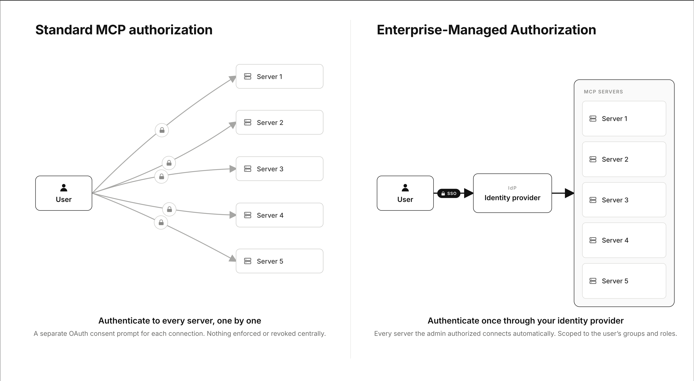

_企业管理授权扩展现已稳定。组织可以集中
管理 MCP 服务器的授权，终端用户只需一次登录即可访问所有已连接的 MCP 服务器。
该扩展正被 Anthropic、Microsoft、Okta 以及
越来越多的 MCP 服务器采用。_

[企业管理授权（EMA）扩展](https://modelcontextprotocol.io/extensions/auth/enterprise-managed-authorization)
现已稳定。我们从社区中了解到，对于企业环境中的连接管理来说，
来自已连接 MCP 服务器的授权和重复同意提示是最大的痛点之一。这项扩展有助于解决这一问题。

EMA 允许组织通过其受信任的
身份提供商集中控制 MCP 服务器访问权限。对于终端用户而言，这意味着零接触设置：
他们需要的 MCP 服务器会在首次登录时自动连接，无需逐个应用 OAuth，也无需
进行一次性的额外配置。

## 按用户授权摩擦很大

标准的 MCP 授权模型是为用户范围内的授权而设计的，并绑定到
传统的交互式认证约定。虽然这在更通用的消费场景中可能效果不错，
即个人决定哪些内容可以接触到他们的数据，但这在企业部署中并不太能
扩展：

- **每位员工都必须单独授权每台服务器**：入职意味着要手动连接一个又一个服务。
- **安全团队无法执行一致的策略**：访问权限完全取决于每个用户各自授权了什么，
  缺乏集中控制或审计跟踪。
- **工作和个人账户界限模糊**：没有办法要求使用公司身份，因此用户可能将个人账户连接到工作工具。

这些因素共同拖慢了 MCP 的采用，并把人们推向脆弱的
变通方案。在没有用于保留共享认证状态的通用标准时，每个人都要发明自己
专门定制的解决方案。数据和工具都已具备，但按用户授权所付出的代价让大多数人仍然把它们关闭着。

## 授权一次，到处继承

[企业管理授权](https://modelcontextprotocol.io/extensions/auth/enterprise-managed-authorization)
让组织的 IdP 成为 MCP 服务器访问的权威决策者。
管理员只需定义一次策略，用户就可以用自己现有的身份在 MCP 主机中进行认证。
IdP 可以基于组成员身份、角色以及条件访问规则来授予或拒绝访问。

在底层，客户端在单点登录期间从 IdP 获取
[Identity Assertion JWT Authorization Grant（ID-JAG）](https://datatracker.ietf.org/doc/draft-ietf-oauth-identity-assertion-authz-grant/)
，并将其与 MCP
服务器授权服务器交换为访问令牌。用户不会再被重定向经过每台服务器各自的同意
屏幕。这个流程带来了三个特性：

- **授权一次，到处继承：** 管理员为组织启用一台服务器。用户会自动获得它，
  并按其现有的组和角色进行范围限定。
- **集中化策略与审计：** 访问决策保留在 IdP 管理控制台中，
  每个连接器都有一条可审计的统一轨迹。
- **消除个人/企业混用：** 通过移除交互式账户选择步骤，
  可以更容易防止因误操作或被攻破而导致的数据在个人和企业账户之间流动。

我们认为，这为企业中的 MCP 树立了全新的基线。当用户登录时，
他们的客户端应当已经连接到其被授权使用的工具和数据，中间不应再有额外步骤。

## 早期采用者

此次发布汇聚了三组密切合作、共同将实现变为现实的参与者：

- **身份提供商：** Okta 是首个受支持的身份提供商。使用 Okta 的组织可以通过任何受支持的客户端，
  利用
  [Okta 的 Cross App Access（XAA）](https://www.okta.com/identity-101/cross-app-access-securing-ai-agent-and-app-to-app-connections/)
  为受支持的服务器预配 MCP 访问权限。
- **客户端：**
  [Anthropic 已在其 Claude 的共享 MCP 层中实现了该扩展](https://claude.com/blog/enterprise-managed-auth)。
  管理员可以跨 Claude、Claude Code 和 Cowork 为用户授权 MCP 服务器。此外，
  [Visual Studio Code 也已在 IDE 中直接加入支持](https://code.visualstudio.com/updates/v1_123#_enterprise-managed-mcp-authentication-preview)
  ，支持 EMA。
- **服务器：** Asana、Atlassian、Canva、Figma、Granola、Linear 和 Supabase 现已支持
  EMA，Slack 以及更多服务也在积极添加支持。

我们很高兴看到更多身份提供商、客户端和服务器采纳
企业管理授权，以帮助减少与授权相关的疲劳，并显著提升其实现者的
安全性与可观测性态势。

> “围绕 MCP 的势头令人难以置信，但随着我们迈向一个互联的 AI
> 劳动力，安全绝不能是事后才考虑的事情。通过将 Cross App Access 协议
> 作为企业管理授权扩展嵌入 MCP，我们把身份转变为一个
> 集中的治理平面，为安全团队提供严格的合规控制，并为用户带来
> 无缝且安全的体验。”
>
> — **Aaron Parecki，Okta 身份标准总监**

> “Figma MCP 将代码与画布的力量结合在一起，让团队能够更快
> 行动、探索更多并交付更出众的产品。随着 MCP 采用率的增长，XAA 让
> 企业能够更轻松地安全扩展其 MCP 部署，而不会拖慢团队。”
>
> — **Devdatta Akhawe，Figma 工程副总裁**

> “只需登录一次，就能自动完成所有 MCP 连接器的自动设置，
> 这种体验相当神奇。”
>
> — **Tom Moor，Linear 工程负责人**

## 参与进来

与所有其他 MCP 扩展、功能和增强一样，我们欢迎你的反馈。
我们鼓励客户端、服务器和身份平台审阅该扩展
规范，并将对这一新标准的支持加入其产品中：

- **阅读要求：** 该
  [企业托管授权页面](https://modelcontextprotocol.io/extensions/auth/enterprise-managed-authorization)
  记录了客户端、服务器和授权服务器的流程。
- **源码与规范：** 请参阅
  [ext-auth 仓库](https://github.com/modelcontextprotocol/ext-auth) 和
  [规范](https://github.com/modelcontextprotocol/ext-auth/blob/main/specification/stable/enterprise-managed-authorization.mdx)
  了解 EMA 的最新演进，以及任何有助于你
  快速上手的支持材料。

如果你有兴趣讨论该扩展、分享兼容性报告，或者
围绕该扩展进行迭代，请加入
[EMA 兴趣小组](https://modelcontextprotocol.io/community/interest-groups/enterprise-managed-authorization)。

## 致谢

企业管理授权是 MCP 社区共同努力的成果：SEP-990 的作者、
[ext-auth 仓库](https://github.com/modelcontextprotocol/ext-auth) 的维护者，以及最早
测试实现并推动规范前进的身份与 MCP 提供商。
感谢每一位做出贡献的人。
