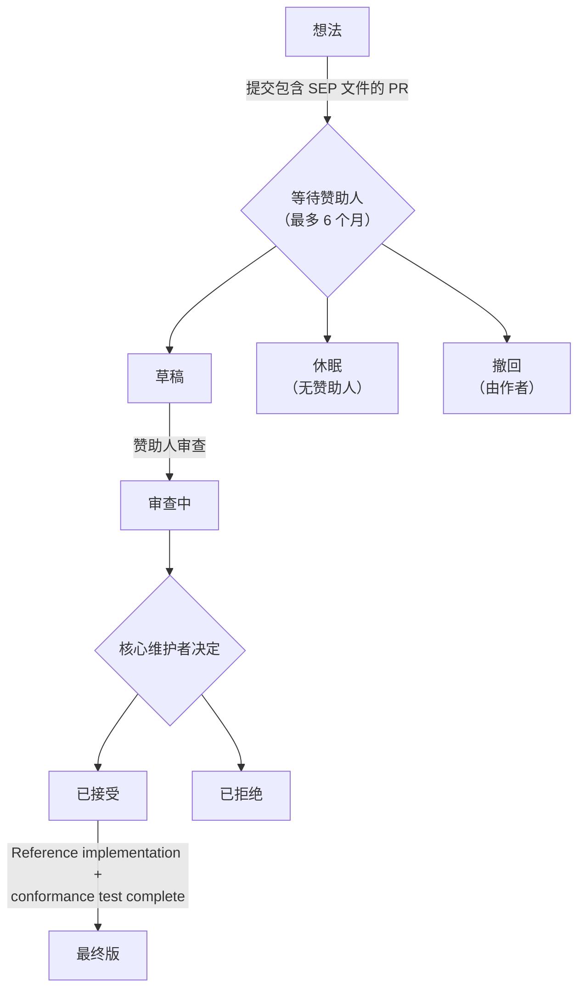

## 什么是 SEP？

SEP 代表规范增强提案 (Specification Enhancement Proposal)。SEP 是一份设计文档，用于向 MCP 社区提供信息，或描述模型上下文协议 (Model Context Protocol) 及其流程的新功能。SEP 应提供该功能的简明技术规范以及该功能的理由。

SEP 是提议主要新功能、收集社区对某个问题的意见以及记录 MCP 设计决策的主要机制。SEP 作者负责在社区内建立共识并记录反对意见。

在起草 SEP 时，作者应查阅 [MCP 设计原则](/community/design-principles)，其中概述了指导协议演进的核心价值观和权衡。

SEP 作为 markdown 文件维护在规范仓库的 [`seps/` 目录](https://github.com/modelcontextprotocol/modelcontextprotocol/tree/main/seps) 中。它们的修订历史作为功能提案的历史记录。

## 何时编写 SEP

SEP 流程保留给那些需要广泛社区讨论、正式设计文档和历史记录的重大更改。对于较小的更改，常规的 GitHub 拉取请求通常更合适。

**如果您的更改涉及以下内容，请编写 SEP：**

- **新功能或协议更改** - 在协议中添加、修改或删除功能（新的 API 方法、消息格式更改、互操作性标准）
- **破坏性更改** - 任何不向后兼容的更改
- **治理或流程更改** - 更改决策或贡献指南
- **复杂或有争议的主题** - 可能有多种有效解决方案或引发重大辩论的更改

**以下情况可跳过 SEP 流程：**

- Bug 修复和拼写纠正
- 文档澄清
- 为现有功能添加示例
- 不改变行为的次要模式修复

不确定？在开始重要工作之前，请在 [Discord](/community/communication#discord) 中询问。

## SEP 类型

SEP 有四种类型：

1. **标准轨道** - 描述 Model Context Protocol 的新功能或实现，或核心规范之外支持的互操作性标准。
2. **信息性** - 描述设计问题，或在不提议新功能的情况下向社区提供指南/信息。
3. **流程** - 描述围绕 MCP 的某个流程，或提议对某个流程的更改（如本文档）。
4. **扩展轨道** - 描述协议扩展。遵循与标准轨道 SEP 相同的审查和接受流程，但表明该提案针对的是扩展而不是协议新增。有关扩展生命周期，请参阅 [创建扩展](/extensions/overview#creating-extensions)。

## SEP 工作流程

### 逐步流程

<Note>
  为了提高 SEP 被接受的机会：

- **首先在 [Discord](/community/communication#discord) 中与相关的 [工作组或兴趣组](/community/working-interest-groups) 讨论您的想法。** 这是完善提案并建立早期支持的最佳方式。
- **如果不存在相关组，请在 [GitHub Discussions](https://github.com/modelcontextprotocol/modelcontextprotocol/discussions) 或 [Discord](/community/communication#discord) 的 `#general` 频道中发起对话。** 如果有足够的兴趣，可能值得 [创建新的 IG 或 WG](/community/working-interest-groups#creating-an-interest-group) —— 寻找赞助人和协调人所涉及的努力是想法是否有足够吸引力的良好信号，并且仍然优于冷提交。
- **检查与 [核心维护者](/community/governance#roles) 优先级和 [设计原则](/community/design-principles) 的一致性。** 优先级通常反映在 [项目路线图](/development/roadmap) 中。当前优先级之外或与设计原则冲突的提案更可能在审查过程中面临延误或额外的摩擦。

</Note>

1. **起草您的 SEP** 为一个名为 `0000-your-feature-title.md` 的 markdown 文件，使用 `0000` 作为占位符。遵循下面的 [SEP 格式](#sep-format)。

2. **创建拉取请求**，将您的 SEP 文件添加到 [规范仓库](https://github.com/modelcontextprotocol/modelcontextprotocol) 的 `seps/` 目录中。

3. **更新 SEP 编号**：一旦创建了您的 PR，使用 PR 编号重命名文件（例如，PR #1850 变为 `1850-your-feature-title.md`）并更新 SEP  header。

4. **寻找赞助人**：标记 [维护者列表](https://github.com/modelcontextprotocol/modelcontextprotocol/blob/main/MAINTAINERS.md) 中的核心维护者或维护者。选择与您提案领域相关的人。提示：
   - 标记 1-2 位相关的维护者，而不是所有人
   - 在相关的 Discord 频道中分享您的 PR
   - 如果 2 周后没有回应，请在 `#general` 中询问

5. **赞助人指派自己**：当赞助人同意后，他们将自己指派给 PR 并将 SEP 状态更新为 `draft`。

6. **非正式审查**：赞助人审查提案并可能请求更改。讨论发生在 PR 评论中。

7. **正式审查**：准备就绪后，赞助人将状态更新为 `in-review`。SEP 进入核心维护者的正式审查（每两周举行会议）。

8. **决议**：SEP 可能被 `accepted`、`rejected` 或返回修订。赞助人更新状态。

9. **定稿**：一旦接受，参考实现必须完成。对于具有可观察协议行为的标准轨道 SEP，还必须合并 [一致性测试](#conformance-test-requirement)。完成并纳入规范后，赞助人将状态更新为 `final`。

### SEP 状态

| 状态         | 含义                                          |
| ------------ | ------------------------------------------------ |
| `draft`      | 有赞助人，正在进行非正式审查                   |
| `in-review`  | 已准备好接受核心维护者的正式审查               |
| `accepted`   | 已批准，等待实现 + 一致性验证                  |
| `rejected`   | 被核心维护者拒绝                               |
| `withdrawn`  | 作者撤回了提案                                 |
| `final`      | 已完成实现和一致性验证                         |
| `superseded` | 已被更新的 SEP 取代                            |
| `dormant`    | 6 个月内未找到赞助人；可重新激活               |

**重要区别**：`dormant` 与 `rejected` 不同。休眠的 SEP 只是没有找到赞助人——想法可能仍然有效。如果情况发生变化（新的社区兴趣、新的用例），可以通过寻找赞助人并重新打开 PR 来恢复休眠的 SEP。

## SEP 格式

每个 SEP 应包含以下部分：

### 1. 前言

简短的描述性标题、作者姓名/联系信息、当前状态、SEP 类型和 PR 编号。

### 2. 摘要

对所解决的技术问题的简短（约 200 字）描述。

### 3. 动机

为什么现有的协议规范不足。这至关重要——没有充分动机的 SEP 可能会被直接拒绝。

### 4. 规范

描述新功能语法和语义的技术规范。必须足够详细，以便进行竞争性的互操作实现。

### 5. 理由

为何做出特定的设计决策、考虑的替代设计以及相关的工作。应提供社区共识的证据并解决讨论期间提出的反对意见。

### 6. 向后兼容性

所有引入向后不兼容性的 SEP 必须描述这些不兼容性、其严重程度以及如何处理它们。

### 7. 参考实现

必须在 SEP 达到 "Final" 状态之前完成，但在接受之前不必完成。

### 8. 安全影响

任何与 SEP 相关的安全问题都应明确记录。

有关完整的文件结构，请参阅 [SEP 模板](https://github.com/modelcontextprotocol/modelcontextprotocol/blob/main/seps/README.md#sep-file-structure)。

## 原型要求

在 SEP 被接受之前，您需要“一个演示提案的原型实现”。以下是符合条件的内容：

**可接受的原型：**

- 官方 SDK 之一中的工作实现（作为分支/分叉）
- 演示关键机制的独立概念验证
- 显示提议行为的集成测试
- 实现该功能的参考服务器或客户端

**原型应该：**

- 演示核心功能按描述工作
- 显示 API 设计是实用且符合人体工程学的
- 揭示任何边缘情况或实现挑战
- 可供审查者运行（包括设置说明）

**不足够：**

- 仅伪代码
- 没有代码的设计文档
- “相信我，它有效”——审查者需要看到它

原型不需要达到生产就绪状态。它的存在是为了证明可行性并尽早发现问题。

## 赞助人角色

赞助人是核心维护者或维护者，他们在审查过程中支持 SEP。赞助人的职责包括：

- 审查提案并提供建设性反馈
- 根据社区意见请求更改
- **更新 SEP 状态** 随着提案的进展
- 当 SEP 准备就绪时启动正式审查
- 在核心维护者会议上展示和讨论提案
- 确保提案符合质量标准

作者应通过其赞助人请求状态更改，而不是自己修改状态字段。

## 状态管理

**发起人负责更新 SEP 状态。** 这确保状态转换由具有相应权限和上下文的人适当地进行。

发起人：

1. 直接在 SEP markdown 文件中更新 `Status` 字段（或者，如果他们无法访问源仓库，则与作者合作设置正确的状态）
2. 将匹配的标签应用于拉取请求（例如，`draft`、`in-review`、`accepted`）

markdown 状态字段和 PR 标签都应保持同步。markdown 文件是规范记录（与提案一起版本化），而 PR 标签使其易于过滤和搜索。

## SEP 审查与决议

SEP 由 MCP 核心维护者团队每两周审查一次。

SEP 要被接受，必须满足以下标准：

- 一个展示该提案的原型实现
- 对 MCP 生态系统有明确的好处
- 社区支持和共识

一旦 SEP 被接受，必须完成参考实现。完成后并入主仓库，状态变为 "Final"。

## 一致性测试要求

对于引入或修改可观察协议行为的**标准轨道 SEP**，在 SEP 能够达到 `Final` 状态之前，必须将一致性场景合并到 [一致性仓库](https://github.com/modelcontextprotocol/conformance) 中。

**所需内容：**

- 一个标记有 SEP 编号的一致性场景，目标为一致性仓库的 draft 规范版本标签
- 一个结构化的可追踪性文件（`sep-NNNN.yaml`），将 SEP 的规范部分中的每个 MUST/MUST NOT 和 SHOULD/SHOULD NOT 映射到检查 ID 或已记录的排除项（如果是框架缺口，则附带跟踪 issue）
- 该场景在 SEP 的参考实现上通过测试

**豁免内容：**

- 流程类和信息类 SEP
- 没有可观察协议行为的标准轨道 SEP（文档澄清、非验证性 schema 注释、实现加固建议）

**各方职责：**

- **赞助人** 确保编写一致性场景，并验证可追踪性文件覆盖 SEP 中每一项 MUST/MUST NOT 和 SHOULD/SHOULD NOT
- **一致性仓库维护者** 审查场景 PR 的技术正确性
- 测试**作者**可以是任何人：SEP 作者、SDK 维护者、社区贡献者

鼓励在 SEP 起草期间（在核心维护者审查之前）编写一致性场景，但这不是强制要求，因为它通常会提前暴露规范性语言中的歧义，而这些歧义越早修复成本越低。

有关完整规范（包括可追踪性文件格式和争议流程），请参阅 [SEP-2484](/seps/2484-conformance-tests-required-for-final-seps)。

## 拒绝后

拒绝不是永久性的。你可以：

1. **解决反馈** - 如果提出了具体顾虑，解决它们并重新提交
2. **讨论拒绝原因** - 在 Discord 中询问以了解理由
3. **提交竞争性 SEP** - 有时不同的方法效果更好
4. **等待合适的时机** - 社区需求会演变；今天被拒绝的内容以后可能会受到欢迎

## 报告 SEP 错误或更新

对于尚未达到 `final` 状态的 SEP，直接在 SEP 的拉取请求上评论。一旦 SEP 定稿并合并，通过创建修改 SEP 文件的新拉取请求来提交更新。

## 转移 SEP 所有权

偶尔有必要将 SEP 的所有权转移给新作者。一般来说，我们希望保留原作者作为共同作者，但这取决于原作者。

转移所有权的好理由：

- 原作者不再有时间和兴趣
- 原作者无法联系

不好的理由：

- 你不同意方向（改为提交竞争性 SEP）

## 版权

本文档置于公共领域或根据 CC0-1.0-Universal 许可发布，以较宽松者为准。
