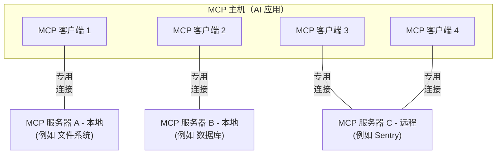

Model Context Protocol（MCP）的这一概览将讨论其[范围](#scope)和[核心概念](#concepts-of-mcp)，并提供一个[示例](#example)来展示每个核心概念。

由于 MCP SDK 抽象了许多复杂性，大多数开发者可能会发现[data layer protocol](#data-layer-protocol)部分最有用。它讨论了 MCP 服务器如何为 AI 应用程序提供上下文。

有关具体实现细节，请参阅你所使用的[特定语言 SDK](/docs/2024-11-05/sdk)文档。

## 范围

Model Context Protocol 包括以下项目：

- [MCP 规范](https://modelcontextprotocol.io/specification/latest)：MCP 的一份规范，概述了客户端和服务器的实现要求。
- [MCP SDK](/docs/2024-11-05/sdk)：用于不同编程语言、实现 MCP 的 SDK。
- **MCP 开发工具**：用于开发 MCP 服务器和客户端的工具，包括 [MCP Inspector](https://github.com/modelcontextprotocol/inspector)
- [MCP 参考服务器实现](https://github.com/modelcontextprotocol/servers)：MCP 服务器的参考实现。

<Note>
  MCP 仅专注于上下文交换协议——它不规定
  AI 应用如何使用 LLM 或管理所提供的上下文。
</Note>

## MCP 概念

### 参与者

MCP 遵循客户端-服务器架构，其中一个 MCP 主机——例如 [Claude Code](https://www.anthropic.com/claude-code) 或 [Claude Desktop](https://www.claude.ai/download) 这样的 AI 应用——会与一个或多个 MCP 服务器建立连接。MCP 主机会为每个 MCP 服务器创建一个 MCP 客户端来完成这一点。每个 MCP 客户端都与其对应的 MCP 服务器保持专用连接。

使用 STDIO 传输的本地 MCP 服务器通常只服务于单个 MCP 客户端，而使用带 SSE 的 HTTP 传输的远程 MCP 服务器通常会服务于多个 MCP 客户端。

MCP 架构中的关键参与者包括：

- **MCP 主机**：协调并管理一个或多个 MCP 客户端的 AI 应用
- **MCP 客户端**：与 MCP 服务器保持连接并从 MCP 服务器获取上下文供 MCP 主机使用的组件
- **MCP 服务器**：向 MCP 客户端提供上下文的程序

**例如**：Visual Studio Code 充当一个 MCP 主机。当 Visual Studio Code 与某个 MCP 服务器建立连接时，例如 [Sentry MCP 服务器](https://docs.sentry.io/product/sentry-mcp/)，Visual Studio Code 运行时会实例化一个 MCP 客户端对象来维护与 Sentry MCP 服务器的连接。
当 Visual Studio Code 随后连接到另一个 MCP 服务器，例如 [本地文件系统服务器](https://github.com/modelcontextprotocol/servers/tree/main/src/filesystem) 时，Visual Studio Code 运行时会再实例化一个额外的 MCP 客户端对象来维护这条连接。



请注意，**MCP 服务器**指的是提供上下文数据的程序，而不论其运行在何处。MCP 服务器可以在本地或远程执行。例如，当 Claude Desktop 启动 [文件系统服务器](https://github.com/modelcontextprotocol/servers/tree/main/src/filesystem) 时，由于它使用 STDIO 传输，服务器会在同一台机器上本地运行。这通常被称为“本地” MCP 服务器。官方的 [Sentry MCP 服务器](https://docs.sentry.io/product/sentry-mcp/) 运行在 Sentry 平台上，并使用带 SSE 的 HTTP 传输。这通常被称为“远程” MCP 服务器。

### 层

MCP 由两层组成：

- **数据层**：定义基于 JSON-RPC 的客户端-服务器通信协议，包括生命周期管理，以及工具、资源、提示和通知等核心原语。
- **传输层**：定义使客户端和服务器之间能够交换数据的通信机制和通道，包括传输相关的连接建立、消息封装和授权。

从概念上讲，数据层是内层，而传输层是外层。

#### 数据层

数据层实现了一个基于 [JSON-RPC 2.0](https://www.jsonrpc.org/) 的交换协议，定义了消息结构和语义。
这一层包括：

- **生命周期管理**：处理客户端和服务器之间的连接初始化、能力协商和连接终止
- **服务器功能**：使服务器能够提供核心功能，包括用于 AI 操作的工具、用于上下文数据的资源，以及用于从客户端到客户端和从客户端到服务器的交互模板的提示
- **客户端功能**：使服务器能够请求客户端从主机 LLM 采样，并向客户端记录消息
- **实用功能**：支持额外能力，例如用于实时更新的通知，以及用于长时间运行操作的进度跟踪

#### 传输层

传输层管理客户端和服务器之间的通信通道与身份验证。它处理连接建立、消息封装以及 MCP 参与者之间的安全通信。

MCP 支持两种传输机制：

- **Stdio 传输**：使用标准输入/输出流在同一台机器上的本地进程之间进行直接进程通信，提供无网络开销的最佳性能。
- **带 SSE 的 HTTP 传输**：使用服务器推送事件（Server-Sent Events）用于服务器到客户端的消息传递，并使用 HTTP POST 用于客户端到服务器的消息传递。该传输支持远程服务器通信，并支持标准 HTTP 身份验证方法，包括 bearer token、API key 和自定义请求头。

传输层将通信细节从协议层中抽象出来，使所有传输机制都能使用相同的 JSON-RPC 2.0 消息格式。

### 数据层协议

MCP 的核心部分是定义 MCP 客户端和 MCP 服务器之间的模式与语义。开发者可能会发现数据层——尤其是 [原语](#primitives) 集合——是 MCP 中最有趣的部分。它定义了开发者如何将上下文从 MCP 服务器共享给 MCP 客户端。

MCP 使用 [JSON-RPC 2.0](https://www.jsonrpc.org/) 作为底层 RPC 协议。客户端和服务器会相互发送请求并作出相应响应。在不需要响应时可以使用通知。

#### 生命周期管理

MCP 是一种有状态协议，因此需要生命周期管理。生命周期管理的目的是协商客户端和服务器都支持的<Tooltip tip="客户端或服务器支持的功能和操作，例如工具、资源或提示">能力</Tooltip>。详细信息可以查看[规范](/specification/2024-11-05/basic/lifecycle)，而[示例](#example)展示了初始化序列。

#### 原语

MCP 原语是 MCP 中最重要的概念。它们定义了客户端和服务器可以向彼此提供什么。这些原语指定了可以与 AI 应用共享的上下文信息类型，以及可以执行的操作范围。

MCP 定义了三种核心原语，_服务器_ 可以暴露这些原语：

- **工具**：AI 应用可以调用的可执行函数，用于执行操作（例如文件操作、API 调用、数据库查询）
- **资源**：向 AI 应用提供上下文信息的数据源（例如文件内容、数据库记录、API 响应）
- **提示**：可复用的模板，帮助构建与语言模型的交互（例如系统提示、few-shot 示例）

每种原语类型都关联有用于发现（`*/list`）、检索（`*/get`），以及在某些情况下执行（`tools/call`）的方法。
MCP 客户端会使用 `*/list` 方法来发现可用原语。例如，客户端可以先列出所有可用工具（`tools/list`），然后再执行它们。这种设计使列表能够动态变化。

举个具体例子，考虑一个提供数据库相关上下文的 MCP 服务器。它可以暴露用于查询数据库的工具、包含数据库 schema 的资源，以及包含用于与这些工具交互的 few-shot 示例的提示。

有关服务器原语的更多细节，请参见[服务器概念](./server-concepts)。

MCP 也定义了 _客户端_ 可以暴露的原语。这些原语使 MCP 服务器作者能够构建更丰富的交互。

- **采样**：允许服务器向客户端的 AI 应用请求语言模型补全。当服务器作者希望访问语言模型，但又希望保持模型无关性并且不在其 MCP 服务器中包含语言模型 SDK 时，这会很有用。他们可以使用 `sampling/createMessage` 方法来请求客户端的 AI 应用进行语言模型补全。
- **日志记录**：使服务器能够向客户端发送日志消息，用于调试和监控。

有关客户端原语的更多细节，请参见[客户端概念](./client-concepts)。

除了服务器和客户端原语之外，该协议还提供了横切性的实用原语，用于增强请求的执行方式：

- **任务（实验性）**：持久化执行封装器，支持 MCP 请求的延迟结果检索和状态跟踪（例如，昂贵计算、工作流自动化、批处理、多步骤操作）

#### 通知

该协议支持实时通知，以便实现服务器和客户端之间的动态更新。例如，当服务器可用工具发生变化——例如新增功能可用或现有工具被修改——时，服务器可以发送工具更新通知，告知已连接的客户端这些变化。通知作为 JSON-RPC 2.0 通知消息发送（不期望响应），使 MCP 服务器能够向已连接的客户端提供实时更新。

## 示例

### 数据层

本节通过一步一步的演示，讲解 MCP 客户端-服务器交互流程，重点关注数据层协议。我们将使用 JSON-RPC 2.0 消息展示生命周期序列、工具操作和通知。

<Steps>
<Step title="初始化（生命周期管理）">

MCP 通过能力协商握手开始生命周期管理。如 [生命周期管理](#lifecycle-management) 一节所述，客户端发送 `initialize` 请求以建立连接并协商支持的功能。

<CodeGroup>
  ```json Initialize Request
  {
    "jsonrpc": "2.0",
    "id": 1,
    "method": "initialize",
    "params": {
      "protocolVersion": "2024-11-05",
      "capabilities": {
        "sampling": {}
      },
      "clientInfo": {
        "name": "example-client",
        "version": "1.0.0"
      }
    }
  }
  ```
  ```json Initialize Response
  {
    "jsonrpc": "2.0",
    "id": 1,
    "result": {
      "protocolVersion": "2024-11-05",
      "capabilities": {
        "tools": {
          "listChanged": true
        },
        "resources": {}
      },
      "serverInfo": {
        "name": "example-server",
        "version": "1.0.0"
      }
    }
  }
  ```
</CodeGroup>

#### 理解初始化交互

初始化过程是 MCP 生命周期管理的关键部分，具有几个重要作用：

1. **协议版本协商**：`protocolVersion` 字段（例如 "2024-11-05"）确保客户端和服务器都使用兼容的协议版本。这可以防止不同版本交互时可能出现的通信错误。如果未协商出双方都兼容的版本，应终止连接。

2. **能力发现**：`capabilities` 对象允许双方声明自己支持的功能，包括它们可以处理哪些 [原语](#primitives)（工具、资源、提示），以及是否支持诸如 [通知](#notifications) 之类的功能。这通过避免不支持的操作，实现更高效的通信。

3. **身份交换**：`clientInfo` 和 `serverInfo` 对象提供用于调试和兼容性目的的身份与版本信息。

在此示例中，能力协商展示了 MCP 原语是如何声明的：

**客户端能力**：

- `"sampling": {}` - 客户端声明它可以处理服务器采样请求（可以接收 `sampling/createMessage` 方法调用）

**服务器能力**：

- `"tools": {"listChanged": true}` - 服务器支持工具原语，并且在其工具列表发生变化时可以发送 `tools/list_changed` 通知
- `"resources": {}` - 服务器也支持资源原语（可以处理 `resources/list` 和 `resources/read` 方法）

初始化成功后，客户端会发送一个通知，表明自己已准备就绪：

```json Notification
{
  "jsonrpc": "2.0",
  "method": "notifications/initialized"
}
```

#### 这在 AI 应用中如何工作

在初始化期间，AI 应用的 MCP 客户端管理器会与配置好的服务器建立连接，并保存它们的能力以供后续使用。应用会利用这些信息来决定哪些服务器可以提供特定类型的功能（工具、资源、提示），以及它们是否支持实时更新。

```python Pseudo-code for AI application initialization
# 伪代码
async with stdio_client(server_config) as (read, write):
    async with ClientSession(read, write) as session:
        init_response = await session.initialize()
        if init_response.capabilities.tools:
            app.register_mcp_server(session, supports_tools=True)
        app.set_server_ready(session)
```

</Step>

<Step title="工具发现（原语）">
现在连接已经建立，客户端可以通过发送 `tools/list` 请求来发现可用工具。该请求是 MCP 工具发现机制的基础——它允许客户端在尝试使用工具之前了解服务器上有哪些工具可用。

<CodeGroup>
  ```json Tools List Request
  {
    "jsonrpc": "2.0",
    "id": 2,
    "method": "tools/list"
  }
  ```
  ```json Tools List Response
  {
    "jsonrpc": "2.0",
    "id": 2,
    "result": {
      "tools": [
        {
          "name": "calculator_arithmetic",
          "title": "Calculator",
          "description": "Perform mathematical calculations including basic arithmetic, trigonometric functions, and algebraic operations",
          "inputSchema": {
            "type": "object",
            "properties": {
              "expression": {
                "type": "string",
                "description": "Mathematical expression to evaluate (e.g., '2 + 3 * 4', 'sin(30)', 'sqrt(16)')"
              }
            },
            "required": ["expression"]
          }
        },
        {
          "name": "weather_current",
          "title": "Weather Information",
          "description": "Get current weather information for any location worldwide",
          "inputSchema": {
            "type": "object",
            "properties": {
              "location": {
                "type": "string",
                "description": "City name, address, or coordinates (latitude,longitude)"
              },
              "units": {
                "type": "string",
                "enum": ["metric", "imperial", "kelvin"],
                "description": "Temperature units to use in response",
                "default": "metric"
              }
            },
            "required": ["location"]
          }
        }
      ]
    }
  }
  ```
</CodeGroup>

#### 理解工具发现请求

`tools/list` 请求很简单，不包含任何参数。

#### 理解工具发现响应

响应包含一个 `tools` 数组，提供了每个可用工具的完整元数据。基于数组的结构使服务器能够同时暴露多个工具，同时保持不同功能之间的清晰边界。

响应中的每个工具对象都包含几个关键字段：

- **`name`**：服务器命名空间内该工具的唯一标识符。它是工具执行的主键，应遵循清晰的命名模式（例如，使用 `calculator_arithmetic` 而不是简单的 `calculate`）
- **`title`**：工具的可读显示名称，客户端可向用户展示
- **`description`**：对工具功能以及何时使用它的详细说明
- **`inputSchema`**：定义预期输入参数的 JSON Schema，可用于类型校验，并清楚地记录必需参数和可选参数

#### 这在 AI 应用中如何工作

AI 应用会从所有已连接的 MCP 服务器获取可用工具，并将它们合并到一个统一的工具注册表中，供语言模型访问。这使 LLM 能够理解它可以执行哪些操作，并在对话过程中自动生成合适的工具调用。

```python Pseudo-code for AI application tool discovery
# 使用 MCP Python SDK 模式的伪代码
available_tools = []
for session in app.mcp_server_sessions():
    tools_response = await session.list_tools()
    available_tools.extend(tools_response.tools)
conversation.register_available_tools(available_tools)
```

</Step>

<Step title="工具执行（原语）">
客户端现在可以使用 `tools/call` 方法执行工具。这展示了 MCP 原语在实践中的使用方式：在发现可用工具之后，客户端可以使用适当的参数调用它们。

#### 理解工具执行请求

`tools/call` 请求遵循结构化格式，以确保客户端和服务器之间的类型安全和清晰通信。请注意，我们使用的是发现响应中的正确工具名称（`weather_current`），而不是简化后的名称：

<CodeGroup>
  ```json Tool Call Request
  {
    "jsonrpc": "2.0",
    "id": 3,
    "method": "tools/call",
    "params": {
      "name": "weather_current",
      "arguments": {
        "location": "San Francisco",
        "units": "imperial"
      }
    }
  }
  ```
  ```json Tool Call Response
  {
    "jsonrpc": "2.0",
    "id": 3,
    "result": {
      "content": [
        {
          "type": "text",
          "text": "当前旧金山天气：68°F，多云间晴，西风 8 英里/小时，湿度：65%"
        }
      ]
    }
  }
  ```
</CodeGroup>

#### 工具执行的关键元素

请求结构包含几个重要组成部分：

1. **`name`**：必须与发现响应中的工具名称（`weather_current`）完全一致。这确保服务器能够正确识别要执行哪个工具。

2. **`arguments`**：包含工具 `inputSchema` 中定义的输入参数。在此示例中：
   - `location`: "San Francisco"（必需参数）
   - `units`: "imperial"（可选参数，若未指定则默认值为 "metric"）

3. **JSON-RPC 结构**：使用标准 JSON-RPC 2.0 格式，并通过唯一的 `id` 进行请求-响应关联。

#### 理解工具执行响应

响应展示了 MCP 灵活的内容系统：

1. **`content` 数组**：工具响应返回一个内容对象数组，支持丰富的多格式响应（文本、图像、资源等）

2. **内容类型**：每个内容对象都有一个 `type` 字段。在本例中，`"type": "text"` 表示纯文本内容，但 MCP 支持多种内容类型以适配不同场景。

3. **结构化输出**：响应提供了可执行的信息，AI 应用可将其作为与语言模型交互的上下文。

这种执行模式使 AI 应用能够动态调用服务器功能并接收结构化响应，这些响应可以整合进与语言模型的对话中。

#### 这在 AI 应用中如何工作

当语言模型在对话中决定使用某个工具时，AI 应用会拦截该工具调用，将其路由到相应的 MCP 服务器，执行后再将结果作为对话流程的一部分返回给 LLM。这使 LLM 能够访问实时数据并在外部世界中执行操作。

```python
# AI 应用工具执行伪代码
async def handle_tool_call(conversation, tool_name, arguments):
    session = app.find_mcp_session_for_tool(tool_name)
    result = await session.call_tool(tool_name, arguments)
    conversation.add_tool_result(result.content)
```

</Step>

<Step title="实时更新（通知）">
MCP 支持实时通知，使服务器能够在未被显式请求的情况下向客户端告知变更。这展示了通知系统——这是保持 MCP 连接同步和响应迅速的关键特性。

#### 理解工具列表变更通知

当服务器可用工具发生变化时——例如新增功能、现有工具被修改，或工具暂时不可用——服务器可以主动通知已连接的客户端：

```json Request
{
  "jsonrpc": "2.0",
  "method": "notifications/tools/list_changed"
}
```

#### MCP 通知的关键特性

1. **无需响应**：注意通知中没有 `id` 字段。这符合 JSON-RPC 2.0 的通知语义，即不期望也不发送响应。

2. **基于能力**：只有在初始化期间在工具能力中声明了 `"listChanged": true` 的服务器才会发送此通知（如第 1 步所示）。

3. **事件驱动**：服务器根据内部状态变化决定何时发送通知，使 MCP 连接具有动态性和响应性。

#### 客户端对通知的响应

收到此通知后，客户端通常会请求更新后的工具列表。这形成了一个刷新循环，使客户端对可用工具的理解保持最新：

```json Request
{
  "jsonrpc": "2.0",
  "id": 4,
  "method": "tools/list"
}
```

#### 为什么通知很重要

该通知系统至关重要，原因如下：

1. **动态环境**：工具可能会根据服务器状态、外部依赖或用户权限而出现或消失
2. **效率**：客户端无需轮询变化；当更新发生时会被通知
3. **一致性**：确保客户端始终掌握准确的服务器可用能力信息
4. **实时协作**：支持能够适应变化上下文的响应式 AI 应用

这种通知模式不仅适用于工具，也适用于其他 MCP 原语，从而实现客户端与服务器之间全面的实时同步。

#### 这在 AI 应用中如何工作

当 AI 应用收到工具变更通知时，它会立即刷新工具注册表并更新 LLM 的可用能力。这确保正在进行的对话始终能够访问最新的工具集合，并且 LLM 可以在新功能可用时动态适应。

```python
# AI 应用通知处理伪代码
async def handle_tools_changed_notification(session):
    tools_response = await session.list_tools()
    app.update_available_tools(session, tools_response.tools)
    if app.conversation.is_active():
        app.conversation.notify_llm_of_new_capabilities()
```

</Step>
</Steps>
