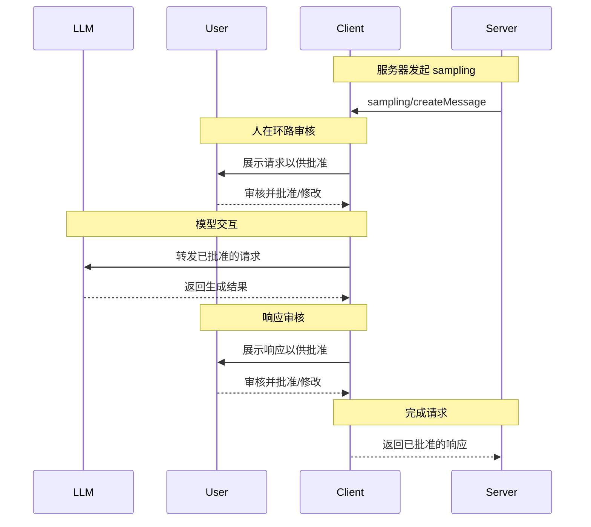

MCP 客户端由宿主应用实例化，用于与特定的 MCP 服务器通信。宿主应用，例如 Claude.ai 或 IDE，负责管理整体用户体验并协调多个客户端。每个客户端处理与一个服务器的一次直接通信。

理解这种区别很重要：_宿主_ 是用户交互的应用，而 _客户端_ 是协议级组件，用于实现与服务器的连接。

## 核心客户端功能

除了使用服务器提供的上下文之外，客户端还可以向服务器提供若干功能。这些客户端功能使服务器作者能够构建更丰富的交互。

| 功能         | 说明                                                                                                                                                                                           | 示例                                                                                                                       |
| ------------ | ------------------------------------------------------------------------------------------------------------------------------------------------------------------------------------------------ | -------------------------------------------------------------------------------------------------------------------------- |
| **Roots**    | Roots 允许客户端指定服务器应重点关注哪些目录，并通过协调机制传达预期范围。                                                                                                                         | 一个用于预订旅行的服务器可能会获得对某个特定目录的访问权限，从中读取用户的日历。                                            |
| **Sampling** | Sampling 允许服务器通过客户端请求 LLM 补全，从而实现 agentic 工作流。这种方法使客户端完全掌控用户权限和安全措施。                                                                                 | 一个用于预订旅行的服务器可能会将航班列表发送给 LLM，并请求 LLM 为用户挑选最佳航班。                                         |

### Roots

Roots 定义了服务器操作的文件系统边界，使客户端能够指定服务器应重点关注哪些目录。

#### 概述

Roots 是一种让客户端向服务器传达文件系统访问边界的机制。它们由文件 URI 组成，指示服务器可以操作的目录，帮助服务器理解可用文件和文件夹的范围。虽然 roots 传达的是预期边界，但它们并不强制安全限制。实际安全性必须在操作系统层面通过文件权限和/或沙箱来强制执行。

**Root 结构：**

```json
{
  "uri": "file:///Users/agent/travel-planning",
  "name": "Travel Planning Workspace"
}
```

Roots 仅用于文件系统路径，并且始终使用 `file://` URI 方案。它们帮助服务器理解项目边界、工作区组织方式以及可访问的目录。随着用户处理不同项目或文件夹，roots 列表可以动态更新；当边界发生变化时，服务器会通过 `roots/list_changed` 接收通知。

#### 示例：旅行规划工作区

一个与多个客户行程协作的旅行代理会从 roots 中受益，以便组织文件系统访问。考虑一个包含不同旅行规划方面的多个目录的工作区。

客户端向旅行规划服务器提供文件系统 roots：

- `file:///Users/agent/travel-planning` - 包含所有旅行文件的主工作区
- `file:///Users/agent/travel-templates` - 可复用的行程模板和资源
- `file:///Users/agent/client-documents` - 客户护照和旅行证件

当代理创建巴塞罗那行程时，行为良好的服务器会尊重这些边界——访问模板、保存新行程，并在指定的 roots 范围内引用客户文档。服务器通常通过从根目录使用相对路径，或利用遵守 root 边界的文件搜索工具来访问 roots 内的文件。

如果代理打开一个归档文件夹，例如 `file:///Users/agent/archive/2023-trips`，客户端会通过 `roots/list_changed` 更新 roots 列表。

要查看尊重 roots 的服务器完整实现，请参阅官方服务器仓库中的 [filesystem server](https://github.com/modelcontextprotocol/servers/tree/main/src/filesystem)。

#### 设计理念

Roots 作为客户端和服务器之间的协调机制，而不是安全边界。规范要求服务器“SHOULD respect root boundaries”，而不是“MUST enforce”它们，因为服务器运行的是客户端无法控制的代码。

当服务器是可信或经过审查的、用户理解其建议性质，并且目标是防止意外而不是阻止恶意行为时，roots 的效果最好。它们在上下文范围控制（告诉服务器应关注哪里）、防止意外（帮助行为良好的服务器保持在边界内）以及工作流组织（例如自动管理项目边界）方面表现出色。

#### 用户交互模型

Roots 通常由宿主应用根据用户操作自动管理，不过某些应用也可能提供手动 root 管理：

**自动 root 检测**：当用户打开文件夹时，客户端会自动将其暴露为 roots。打开旅行工作区后，客户端可以将该目录暴露为 root，帮助服务器理解当前工作范围内有哪些行程和文档。

**手动 root 配置**：高级用户可以通过配置指定 roots。例如，添加 `/travel-templates` 作为可复用资源，同时排除包含财务记录的目录。

### Sampling

Sampling 允许服务器通过客户端请求语言模型补全，从而在保持安全和用户控制的同时实现 agentic 行为。

#### 概述

Sampling 使服务器能够执行依赖 AI 的任务，而无需直接集成或为 AI 模型付费。相反，服务器可以请求客户端——客户端本身已经拥有 AI 模型访问权限——代为处理这些任务。这种方法使客户端完全掌控用户权限和安全措施。由于 sampling 请求发生在其他操作的上下文中——例如一个工具在分析数据——并且它们作为独立的模型调用进行处理，因此可以在不同上下文之间保持清晰边界，从而更高效地使用上下文窗口。

**Sampling 流程：**



该流程通过多个“人在环路”检查点确保安全。用户会在初始请求和生成响应返回服务器之前对两者进行审核，并可以对其进行修改。

**请求参数示例：**

```typescript
{
  messages: [
    {
      role: "user",
      content: "分析这些航班选项并推荐最佳选择：\n" +
               "[47 个航班，包含价格、时间、航空公司和中转信息]\n" +
               "用户偏好：上午出发，最多 1 次中转"
    }
  ],
  modelPreferences: {
    hints: [{
      name: "claude-sonnet-4-20250514"  // 建议的模型
    }],
    costPriority: 0.3,      // 对 API 成本不太敏感
    speedPriority: 0.2,     // 可以等待更深入的分析
    intelligencePriority: 0.9  // 需要复杂的权衡评估
  },
  systemPrompt: "你是一位旅行专家，帮助用户根据偏好找到最佳航班",
  maxTokens: 1500
}
```

#### 示例：航班分析工具

考虑一个旅行预订服务器，其中有一个名为 `findBestFlight` 的工具，它使用 sampling 来分析可用航班并推荐最优选择。当用户询问“帮我预订下个月去巴塞罗那的最佳航班”时，该工具需要 AI 辅助来评估复杂的权衡。

该工具会查询航空公司 API 并收集 47 个航班选项。随后它请求 AI 协助分析这些选项：“分析这些航班选项并推荐最佳选择：[47 个航班，包含价格、时间、航空公司和中转信息] 用户偏好：上午出发，最多 1 次中转。”

客户端发起 sampling 请求，使 AI 能够评估各种权衡——例如更便宜的红眼航班与更方便的上午出发之间的取舍。该工具会利用这项分析来展示前三个推荐结果。

#### 用户交互模型

虽然这不是强制要求，但 sampling 的设计目标是允许人在环路控制。用户可以通过多种机制保持监督：

**批准控制**：sampling 请求可能需要用户明确同意。客户端可以展示服务器想要分析的内容及其原因。用户可以批准、拒绝或修改请求。

**透明性功能**：客户端可以显示准确的 prompt、模型选择和 token 限制，使用户能够在 AI 响应返回服务器之前进行审查。

**配置选项**：用户可以设置模型偏好、为受信任的操作配置自动批准，或要求所有操作都需要批准。客户端可以提供选项来对敏感信息进行脱敏。

**安全注意事项**：在 sampling 期间，客户端和服务器都必须妥善处理敏感数据。客户端应实施速率限制并验证所有消息内容。人在环路设计确保服务器发起的 AI 交互不会在未经用户明确同意的情况下危及安全或访问敏感数据。
