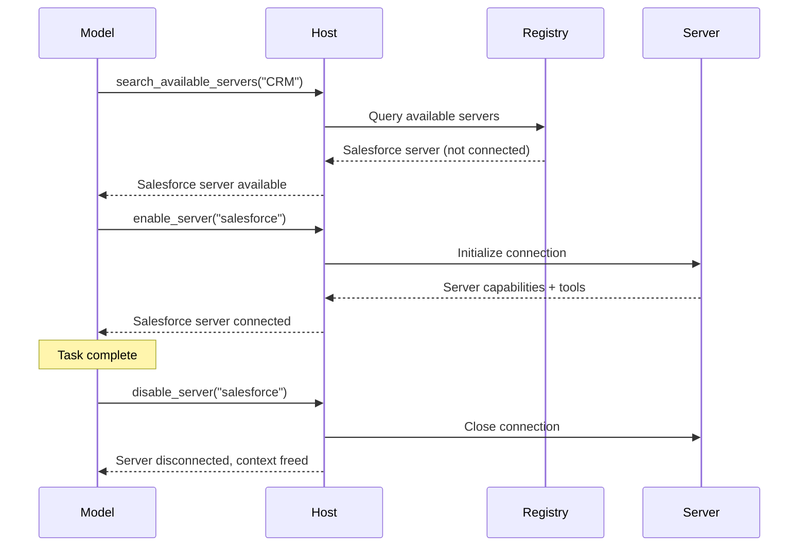
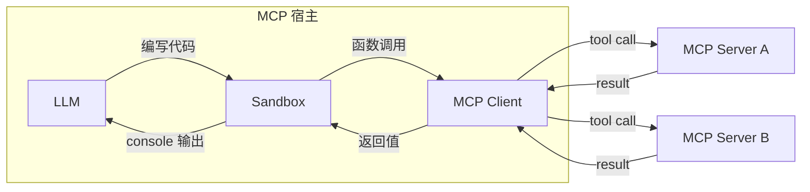

随着 MCP 主机应用程序（例如代理）连接到更多 MCP 服务器并积累对数百或数千个工具的访问权限，天真的工具管理方法会失效。将每个工具定义一次性加载到模型的上下文窗口中会浪费 token、增加延迟并降低模型性能。在连续的工具调用之间通过模型传递大型中间结果会使问题进一步加剧。

有两种模式可以应对这些挑战：**渐进式发现**，用于控制 _何时_ 将工具定义纳入上下文；以及**程序化工具调用**，用于控制 _如何_ 调用工具。

## 渐进式工具发现

朴素的 MCP 主机实现会在每次对话开始时，直接将每个已连接服务器的工具定义传递给模型。对于少量工具来说，这完全合理。但当主机能够访问数十个服务器、暴露数百个工具时，这些定义本身就可能在模型甚至还没读到用户消息之前，占用大部分上下文窗口。


渐进式发现可以避免这一点：

- 主机像往常一样通过 `tools/list` 获取工具定义，但推迟将它们注入到模型的上下文中。
- 主机向模型提供一个轻量级的 `search_tools` 元工具。
- 主机仅在需要时才将完整定义加载到上下文中。

### 何时使用渐进式发现

当工具定义占据了上下文窗口的大部分时，渐进式发现是最佳选择。对于一小组工具，并且工具定义只占据上下文窗口很小一部分的情况，全部加载是可以的。一旦工具定义占用了可用上下文窗口的相当大一部分，客户端就应切换到渐进式发现。我们建议客户端实现阈值来决定何时切换：

- 以上下文窗口百分比的形式实现阈值。例如，1%-5%。
- 加载工具定义。一旦达到阈值，就切换到渐进式发现。

### 选择发现策略

一旦模型调用 `search_tools` 工具，我们就需要选择一种搜索策略：

- **基于关键词**：关键词匹配（BM25、正则表达式）。简单且有效，尤其适用于描述性强的工具名称和描述。
- **基于嵌入**：对工具描述进行向量相似度检索。对同义词和语义匹配的处理更好。
- **基于子代理**：使用一个次级模型，通常是像 Claude Haiku 或 Gemini Flash 这样小而快的模型，为任务选择工具。这通常效果很好，但成本可能高于基于嵌入或基于关键词的方案。
- **混合**：组合多种方法。例如，在关键词和嵌入排名上进行打分，或者根据使用场景或查询选择不同策略。

一些模型提供商已经内置了工具搜索。例如，[OpenAI](https://developers.openai.com/api/docs/guides/tools-tool-search) 和 [Anthropic](https://platform.claude.com/docs/en/agents-and-tools/tool-use/tool-search-tool) 原生支持此功能；请查看你的提供商文档，了解是否有等价实现。若可用，你可能会更倾向于使用平台的工具搜索，而不是自定义实现。当提供商不提供此功能，或者你需要专门的检索逻辑（例如领域特定排序或访问控制过滤）时，可以自行构建。

下面的三层模式详细说明了一种自定义的基于搜索的方法，但无论采用何种检索机制，这种分层原则（目录、检查、执行）都适用。

### 使用渐进式发现

一种常见的渐进式发现实现方式是采用基于搜索的三层方法：

**第一层：目录。** 主机暴露一小组用于搜索可用能力的元工具。`search_tools` 工具接受自然语言查询，并返回匹配的工具名称及简要描述。

```typescript
// 模型调用轻量级搜索工具
search_tools({ query: "update salesforce record" })

// 返回简洁匹配结果：仅包含名称和一行描述
→ [
    { name: "salesforce_updateRecord", description: "Update fields on a Salesforce object" },
    { name: "salesforce_upsertRecord", description: "Insert or update based on external ID" }
  ]
```

**第二层：检查。** 一旦模型识别出候选项，它就只获取该工具的完整定义（输入 schema、输出 schema、文档说明）。

```typescript
// 模型仅检查其需要的工具
get_tool_details({ name: "salesforce_updateRecord" });
```

这会返回单个工具的完整 schema：

```json
{
  "name": "salesforce_updateRecord",
  "description": "在 Salesforce 中更新记录",
  "inputSchema": {
    "type": "object",
    "properties": {
      "objectType": {
        "type": "string",
        "description": "Salesforce 对象类型"
      },
      "recordId": { "type": "string", "description": "要更新的记录 ID" },
      "data": { "type": "object", "description": "要更新的字段" }
    },
    "required": ["objectType", "recordId", "data"]
  }
}
```

**第三层：执行。** 模型在完全了解其接口后调用该工具，只加载了它所需要的定义。

这种模式可以显著减少 token 用量，并且还能提高工具选择的准确性：模型只关注少数相关工具，而不是扫描数百个无关工具。其他发现策略（嵌入、子代理等）遵循相同的分层原则，但在目录层替换为不同的检索机制。

### 动态服务器管理

渐进式发现不仅适用于单个工具，还可以扩展到整个服务器。主机不必在启动时连接每个已配置服务器，而可以：

1. 维护一个可用服务器及其高层描述的注册表。
2. 仅当模型判断需要某个服务器的能力时才连接该服务器。
3. 断开当前任务不再相关的服务器连接，从而释放上下文。



这对通用代理尤其有效，因为用户意图在一开始并不明确。代理从一组始终在线的最小服务器集合开始，并按需连接其他服务器。结合 [agent skills](/docs/2025-11-25/develop/build-with-agent-skills)，技能文件可以声明它需要哪些 MCP 服务器，而主机只会在该技能被调用时连接它们。

### 实现指南

实现渐进式发现时：

| 指南                           | 原因                                                                                                                                                                                                |
| ------------------------------ | --------------------------------------------------------------------------------------------------------------------------------------------------------------------------------------------------- |
| **提供多种细节层级**           | 让模型可以在仅名称、名称加描述、或完整 schema 响应之间进行选择。                                                                                                                                   |
| **缓存工具定义**               | 一旦从服务器获取到定义，就在主机侧进行记忆化缓存，这样后续重新注入时就不需要再进行一次 `tools/list` 往返。这与当前是否在模型上下文中是分开的。 |
| **在 `list_changed` 时刷新**    | 当服务器发送 `notifications/tools/list_changed` 时，重新索引搜索目录。                                                                                                                             |
| **按服务器分组工具**           | 将工具按来源服务器组织展示，以便模型能够推理相关能力。                                                                                                                                             |

### 与提示缓存的交互

大多数提供商会缓存提示前缀，包括 `tools` 数组。对话过程中添加或移除工具定义会使该缓存失效，而由此产生的未命中代价可能比你移除的定义本身还要高。为了保留缓存：

- 将新发现的定义追加到缓存断点之后，而不是重新排序 `tools` 数组，或者将每次调用都路由通过一个稳定的 `call_tool({name, args})` 元工具，这样数组就不会变化。
- 将服务器断开连接视为对话边界级别的操作，而不是按轮次操作。
- 在阅读上面的工具搜索链接的同时，也参考你提供商的缓存文档。

## 程序化工具调用 / 代码模式

使用直接工具调用时，每次工具调用都是一次往返：模型生成一个工具调用，客户端执行它，然后完整结果再回流到模型的上下文中。当任务需要串联多个工具（读取文档、转换文档、再写到别处）时，每个中间结果都要经过模型，既消耗 token，又增加延迟，即使这些结果与模型本身无关也是如此。

程序化工具调用（有时称为“代码模式”）为客户端提供了一种有效**组合工具调用**的方法。模型不再直接调用工具，而是编写调用工具的代码。代码在沙箱环境中执行，只有最终结果才返回给模型。

程序化工具调用功能强大，能够更高效地使用 MCP 工具和资源，但这要求
客户端实现一个沙箱环境。


### 工作原理

宿主会将 MCP 工具 schema 转换为沙箱内可用的类型化 API。当模型需要工具时，它会编写脚本并执行。

**第 1 步：从 MCP schema 生成程序化 API。** 宿主读取每个服务器的工具定义，并基于每个工具的参数和 `outputSchema` 生成类型化函数：

```typescript
// 根据 Logging MCP 服务器的工具 schema 自动生成
interface LogEntry {
  timestamp: string;
  message: string;
  level: string;
}

function logging_getLogs(input: {
  level: "error" | "warn" | "info";
  since: number;
}): Promise<{ entries: LogEntry[] }> {
  return mcp.callTool<{ entries: LogEntry[] }>("logging_getLogs", input);
}

// 根据 Ticketing MCP 服务器的工具 schema 自动生成
function ticketing_createIssue(input: {
  title: string;
  body?: string;
  priority: "low" | "medium" | "high";
}): Promise<{ issueId: string }> {
  return mcp.callTool<{ issueId: string }>("ticketing_createIssue", input);
}
```

MCP 服务器可以为每个工具提供一个可选的 [`outputSchema`](/specification/2025-11-25/server/tools#output-schema)。当存在输出 schema 时，宿主可以生成精确的返回类型（如上面的 `LogEntry`）。

当没有输出 schema 时，优先采用简单方案：

- **使用通用类型并继续。** 接受 `any` 或 `string`，并在下游处理非结构化输出。真正的修复方案是让服务器作者提供 `outputSchema`。
- **使用快速模型提取类型化结果**，适用于循环外的单次调用。通过与 MCP 工具调用相同的 stub 拦截路径，暴露一个由宿主代理的 `extract(value, ExpectedType)` 辅助函数，使沙箱本身永远不会打开网络连接。该辅助函数会路由到一个小型模型（例如 Claude Haiku 或 Gemini Flash），将值强制转换为 `ExpectedType`。这会增加每次调用的延迟，并且可能产生幻觉或丢失字段，因此在使用前应根据 `ExpectedType` 验证结果。

**第 2 步：模型基于这些 API 编写代码。** 与其在多次独立工具调用之间让完整结果流经上下文，不如让模型编写一个脚本。以“找出过去一小时内所有错误日志，并为每个唯一错误创建一个工单”为例。使用直接工具调用时，成千上万条日志条目会流经模型上下文；使用代码时，模型在沙箱内进行过滤：

```typescript
// 模型生成的代码，在沙箱中执行
const logs = await logging_getLogs({
  level: "error",
  since: Date.now() - 3600000,
});

// 在沙箱内进行过滤和去重，而不是在模型上下文中
const uniqueErrors = new Map<string, LogEntry>();
for (const log of logs.entries) {
  if (!uniqueErrors.has(log.message)) {
    uniqueErrors.set(log.message, log);
  }
}

for (const [message, log] of uniqueErrors) {
  await ticketing_createIssue({
    title: `Error: ${message}`,
    body: `First seen: ${log.timestamp}\nOccurrences: ${
      logs.entries.filter((l) => l.message === message).length
    }`,
    priority: "high",
  });
}

console.log(
  `Filed ${uniqueErrors.size} tickets from ${logs.entries.length} error logs`,
);
```

**第 3 步：沙箱执行代码。** 沙箱内部的函数调用会被拦截，并通过宿主代理路由回相应的 MCP 服务器。日志数据和工单创建会直接在服务器之间流动，完全不会进入模型上下文。只有 `console.log` 输出这一条摘要行会返回给模型。

### 选择沙箱

合适的沙箱取决于你希望模型编写的语言、宿主应用的语言，以及你需要多少隔离强度。下表列出的是示例运行时，而非推荐；请针对你的使用场景评估其成熟度：

| 沙箱语言 | 运行时 / 库                                               | 宿主语言         | 方法                                                                                          |
| -------- | ---------------------------------------------------------- | ---------------- | --------------------------------------------------------------------------------------------- |
| **JavaScript** | [Deno](https://github.com/denoland/deno), `isolated-vm`       | Rust / Node / CLI | 基于 V8 的运行时，具备细粒度权限控制。可禁用所有权限以实现完全锁定。                             |
| **Python**     | [Monty](https://github.com/pydantic/monty) _(实验性)_   | Rust              | 为 AI 用例构建的最小 Python 解释器。默认无 I/O。                                               |
| **TypeScript**  | [pctx](https://github.com/portofcontext/pctx) _(早期阶段)_ | Python / Rust     | 将代码模式概念作为一个库来实现，并带有底层 Rust 支持。                                           |
| **任意（通过 Wasm）** | [Wasmtime](https://github.com/bytecodealliance/wasmtime)      | Rust / C / Go     | 将任意语言编译为 Wasm，并使用基于能力的安全模型运行。                                           |

无论使用哪种沙箱，集成模式都是相同的：宿主注入函数 stub，通过进程内或 stdio 通道拦截调用（因此可以保持网络权限完全拒绝），并将其作为 `tools/call` 请求分发给 MCP 服务器。

### 执行架构

实现包含三个组件：



**沙箱** 在一个隔离环境中运行模型生成的代码，没有直接网络访问权限。它通向外部世界的唯一接口是生成的函数 stub，这些 stub 会将调用路由回宿主。

**宿主** 充当代理。它接收来自沙箱的函数调用，将其映射到正确的 MCP 服务器，执行工具调用，并将结果返回给沙箱。授权令牌和凭据由宿主管理，绝不会暴露给生成的代码。

**模型** 只能看到沙箱返回的内容，通常是 `console.log` 语句的输出或最终返回值。这使模型（以及客户端开发者）能够精确控制进入上下文窗口的内容。

### 安全注意事项

程序化工具调用引入了一个代码执行面，因此需要谨慎的沙箱隔离：

- **每次调用的授权**：就规范而言，代理仍然是 MCP 宿主。对于来自沙箱的调用，应应用与直接调用相同的人工确认策略（参见 [Tools: Security](/specification/2025-11-25/server/tools#security-considerations)）。批准脚本并不意味着对它在运行时发出的每一次工具调用都给予全局批准；宿主可以授予类别性批准（例如，“允许该脚本运行期间使用 `ticketing_createIssue`”），而不是每次迭代都提示，但代理仍必须根据该授权评估每一次调用。
- **跨服务器数据流**：来自一个服务器的工具结果，对另一个服务器而言都是不可信输入。代理应对中介调用应用与直接调用相同的输入审查策略；仅靠输出截断并不能阻止数据外泄。
- **网络隔离**：沙箱不应具有直接网络访问权限。所有外部通信都应通过宿主代理进行，由宿主执行授权和访问控制。
- **不暴露凭据**：API key 和 token 由宿主管理。生成的代码调用的是类型化函数；宿主在转发到服务器时补充认证信息。
- **资源限制**：为沙箱执行设置超时和内存限制，防止脚本失控。
- **输出过滤**：在将沙箱的控制台输出反馈给模型之前，对其进行验证和截断。

### 错误处理

MCP 工具错误会以成功响应的形式返回，并带有
[`isError: true`](/specification/2025-11-25/server/tools#error-handling)，而不是传输
失败。生成的包装器应将其转换为抛出的异常，以便模型编写的代码
可以使用 `try`/`catch`。如果未捕获的错误终止了脚本，应将其作为脚本的
结果暴露出来，以便模型能够自我纠正；对于已经提交的任何部分副作用，
模型负责进行报告。

## 结合两种模式

渐进式发现和程序化工具调用可以很好地协同工作。模型使用发现工具来识别它需要哪些工具，加载它们的模式，然后编写一个在一次执行过程中调用多个工具的单一脚本。这种组合同时最小化了工具定义的 token 成本和工具结果的 token 成本，使模型的上下文保持聚焦于推理，而不是通过它传递数据。
