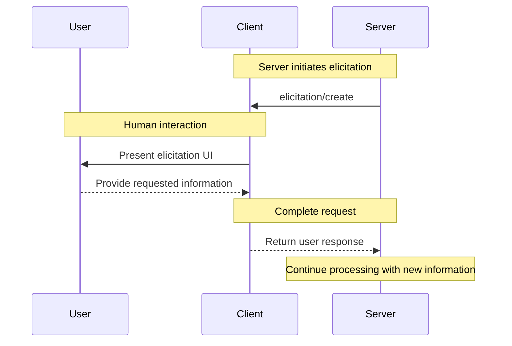
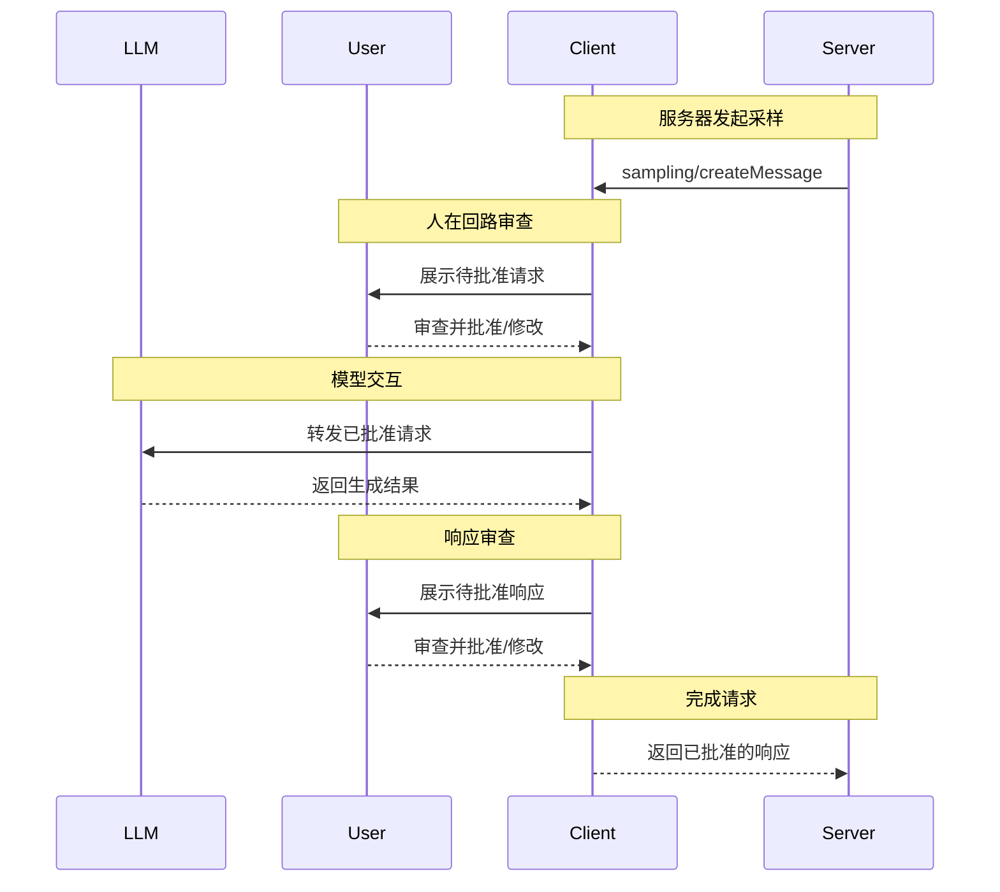

MCP 客户端由宿主应用实例化，用于与特定的 MCP 服务器通信。宿主应用，如 Claude.ai 或 IDE，负责管理整体用户体验并协调多个客户端。每个客户端处理一次与一个服务器的直接通信。

理解这种区别很重要：_宿主_ 是用户与之交互的应用，而 _客户端_ 是在协议层面上实现服务器连接的组件。

## 核心客户端功能

除了使用服务器提供的上下文之外，客户端还可以向服务器提供若干功能。这些客户端功能使服务器作者能够构建更丰富的交互。

| 功能            | 说明                                                                                                                                                                                              | 示例                                                                                                                                       |
| --------------- | ------------------------------------------------------------------------------------------------------------------------------------------------------------------------------------------------- | ------------------------------------------------------------------------------------------------------------------------------------------ |
| **询问**        | 询问使服务器能够在交互过程中向用户请求特定信息，为服务器按需收集信息提供了一种结构化方式。                                                                                                              | 一个用于预订旅行的服务器可能会询问用户对飞机座位、房间类型或联系电话的偏好，以完成预订。                                                    |
| **根目录**      | 根目录允许客户端指定服务器应重点关注哪些目录，并通过协调机制传达预期的作用范围。                                                                                                                        | 一个用于预订旅行的服务器可能被授予访问某个特定目录的权限，从中读取用户的日历。                                                              |
| **采样**        | 采样允许服务器通过客户端请求 LLM 补全，从而支持智能体式工作流。这种方式将用户权限和安全措施的完全控制权交给客户端。                                                                                       | 一个用于预订旅行的服务器可能向 LLM 发送一组航班列表，并请求 LLM 为用户选择最佳航班。                                                       |

### 引导获取

引导获取使服务器能够在交互过程中向用户请求特定信息，从而创建更动态、更具响应性的工作流。

#### 概述

引导获取为服务器按需收集必要信息提供了一种结构化方式。与其要求一次性提供所有信息，或在数据缺失时直接失败，不如让服务器暂停操作，向用户请求特定输入。这样可以实现更灵活的交互，使服务器能够适应用户需求，而不是遵循僵化的模式。

**引导获取流程：**



该流程支持动态信息收集。服务器可以在需要时请求特定数据，用户通过合适的 UI 提供信息，服务器则使用新获取的上下文继续处理。

**引导获取组件示例：**

```typescript
{
  method: "elicitation/create",
  params: {
    message: "请确认您的巴塞罗那度假预订详情：",
    requestedSchema: {
      type: "object",
      properties: {
        confirmBooking: {
          type: "boolean",
          description: "确认预订（机票 + 酒店 = 3000 美元）"
        },
        seatPreference: {
          type: "string",
          enum: ["window", "aisle", "no preference"],
          description: "航班首选座位类型"
        },
        roomType: {
          type: "string",
          enum: ["sea view", "city view", "garden view"],
          description: "酒店首选房型"
        },
        travelInsurance: {
          type: "boolean",
          default: false,
          description: "添加旅行保险（150 美元）"
        }
      },
      required: ["confirmBooking"]
    }
  }
}
```

#### 示例：假日预订审批

一个旅行预订服务器通过最终预订确认流程展示了引导获取的强大能力。当用户选择了理想的巴塞罗那度假套餐后，服务器需要在继续之前收集最终批准以及任何缺失的详细信息。

服务器会发起预订确认引导请求，其中包含行程摘要（巴塞罗那往返航班 6 月 15 日至 22 日、海滨酒店、总价 3000 美元）以及其他偏好字段，例如座位选择、房型或旅行保险选项。

随着预订流程推进，服务器会继续引导获取完成预订所需的联系信息。它可能会要求提供航班预订的旅客信息、酒店特殊需求或紧急联系人信息。

#### 用户交互模型

引导获取交互被设计得清晰、具有关联上下文，并尊重用户自主权：

**请求展示**：客户端会显示引导获取请求，并明确说明是哪个服务器在请求、为什么需要这些信息，以及这些信息将如何使用。请求消息解释目的，而 schema 则提供结构和验证。

**响应选项**：用户可以通过合适的 UI 控件（文本框、下拉菜单、复选框）提供所需信息，可以拒绝提供信息并附带可选说明，或者取消整个操作。客户端会在将响应返回给服务器之前，根据提供的 schema 验证响应。

**隐私考虑**：引导获取绝不会请求密码或 API 密钥。客户端会对可疑请求发出警告，并允许用户在发送前审查数据。

### 根目录

根目录定义了服务器操作的文件系统边界，允许客户端指定服务器应重点关注哪些目录。

#### 概述

根目录是一种机制，用于让客户端向服务器传达文件系统访问边界。它们由文件 URI 组成，指示服务器可以操作的目录，帮助服务器理解可用文件和文件夹的范围。尽管根目录传达的是预期边界，但它们并不强制执行安全限制。实际的安全性必须在操作系统级别通过文件权限和/或沙箱机制来保障。

**根结构：**

```json
{
  "uri": "file:///Users/agent/travel-planning",
  "name": "旅行规划工作区"
}
```

根目录专用于文件系统路径，并且始终使用 `file://` URI 方案。它们有助于服务器理解项目边界、工作区组织方式以及可访问的目录。当用户在不同项目或文件夹之间切换时，根目录列表可以动态更新；当边界发生变化时，服务器会通过 `roots/list_changed` 接收通知。

#### 示例：旅行规划工作区

一位与多个客户行程打交道的旅行代理会从根目录中受益，用于组织文件系统访问。设想一个工作区包含不同目录，分别用于旅行规划的各个方面。

客户端向旅行规划服务器提供以下文件系统根目录：

- `file:///Users/agent/travel-planning` - 包含所有旅行文件的主工作区
- `file:///Users/agent/travel-templates` - 可复用的行程模板和资源
- `file:///Users/agent/client-documents` - 客户护照和旅行证件

当代理创建巴塞罗那行程时，行为良好的服务器会尊重这些边界——访问模板、保存新行程，并在指定的根目录内引用客户文档。服务器通常通过使用相对于根目录的相对路径，或利用尊重根边界的文件搜索工具来访问根目录中的文件。

如果代理打开像 `file:///Users/agent/archive/2023-trips` 这样的归档文件夹，客户端会通过 `roots/list_changed` 更新根目录列表。

关于一个尊重根目录的服务器完整实现，请参见官方服务器仓库中的 [filesystem server](https://github.com/modelcontextprotocol/servers/tree/main/src/filesystem)。

#### 设计理念

根目录是客户端与服务器之间的一种协调机制，而不是安全边界。该规范要求服务器“应当尊重根边界”，而不是“必须强制执行”它们，因为服务器运行的是客户端无法控制的代码。

当服务器是可信或经过审查的、用户理解其建议性本质、且目标是防止意外而非阻止恶意行为时，根目录的效果最佳。它们在上下文范围控制（告诉服务器应重点关注哪里）、意外防护（帮助行为良好的服务器保持在边界内）以及工作流组织（例如自动管理项目边界）方面表现出色。

#### 用户交互模型

根目录通常由宿主应用根据用户操作自动管理，不过某些应用也可能提供手动根目录管理：

**自动根目录检测**：当用户打开文件夹时，客户端会自动将其作为根目录暴露出来。打开一个旅行工作区会使客户端将该目录作为根目录暴露，帮助服务器理解当前工作的范围内包含哪些行程和文档。

**手动根目录配置**：高级用户可以通过配置指定根目录。例如，添加 `/travel-templates` 作为可复用资源，同时排除包含财务记录的目录。

### 采样

采样允许服务器通过客户端请求语言模型补全，从而在保持安全性和用户控制的同时启用代理式行为。

#### 概述

采样使服务器能够执行依赖 AI 的任务，而无需直接集成 AI 模型或为其付费。相反，服务器可以请求已经具备 AI 模型访问权限的客户端代为处理这些任务。这种方式让客户端完全掌控用户权限和安全措施。由于采样请求发生在其他操作的上下文中——例如一个工具在分析数据——并且作为独立的模型调用进行处理，因此它们能够在不同上下文之间保持清晰边界，从而更高效地使用上下文窗口。

**采样流程：**



该流程通过多个“人在回路”检查点确保安全性。用户会在结果返回给服务器之前，审查并可以修改初始请求和生成的响应。

**请求参数示例：**

```typescript
{
  messages: [
    {
      role: "user",
      content: "分析这些航班选项并推荐最佳选择：\n" +
               "[47 个航班，包含价格、时间、航空公司和中转信息]\n" +
               "用户偏好：上午出发，最多 1 次中转"
    }
  ],
  modelPreferences: {
    hints: [{
      name: "claude-sonnet-4-20250514"  // 建议的模型
    }],
    costPriority: 0.3,      // 对 API 成本不太在意
    speedPriority: 0.2,     // 可以等待更全面的分析
    intelligencePriority: 0.9  // 需要复杂的权衡评估
  },
  systemPrompt: "你是一名旅行专家，帮助用户根据偏好找到最佳航班",
  maxTokens: 1500
}
```

#### 示例：航班分析工具

设想一个旅行预订服务器，其中有一个名为 `findBestFlight` 的工具，它使用采样来分析可用航班并推荐最优选择。当用户询问“帮我预订下个月去巴塞罗那的最佳航班”时，该工具需要 AI 协助来评估复杂的权衡。

该工具会查询航空公司 API 并收集 47 个航班选项。随后，它请求 AI 协助来分析这些选项：“分析这些航班选项并推荐最佳选择：[47 个航班，包含价格、时间、航空公司和中转信息] 用户偏好：上午出发，最多 1 次中转。”

客户端发起采样请求，使 AI 能够评估各种权衡——例如更便宜但需要通宵飞行的航班，与更便利的上午出发航班之间的取舍。该工具利用这一分析结果向用户展示前三个推荐。

#### 用户交互模型

虽然这不是硬性要求，但采样的设计旨在允许“人在回路”控制。用户可以通过多种机制保持监督：

**批准控制**：采样请求可能需要用户明确同意。客户端可以展示服务器希望分析的内容以及原因。用户可以批准、拒绝或修改请求。

**透明性功能**：客户端可以显示完整的提示词、模型选择和令牌限制，使用户能够在 AI 响应返回给服务器之前对其进行审查。

**配置选项**：用户可以设置模型偏好，为受信任的操作配置自动批准，或对所有请求都要求批准。客户端还可以提供选项来清除敏感信息。

**安全注意事项**：客户端和服务器在采样过程中都必须妥善处理敏感数据。客户端应实施速率限制并验证所有消息内容。人在回路设计可确保服务器发起的 AI 交互不会在未经明确用户同意的情况下危及安全或访问敏感数据。
