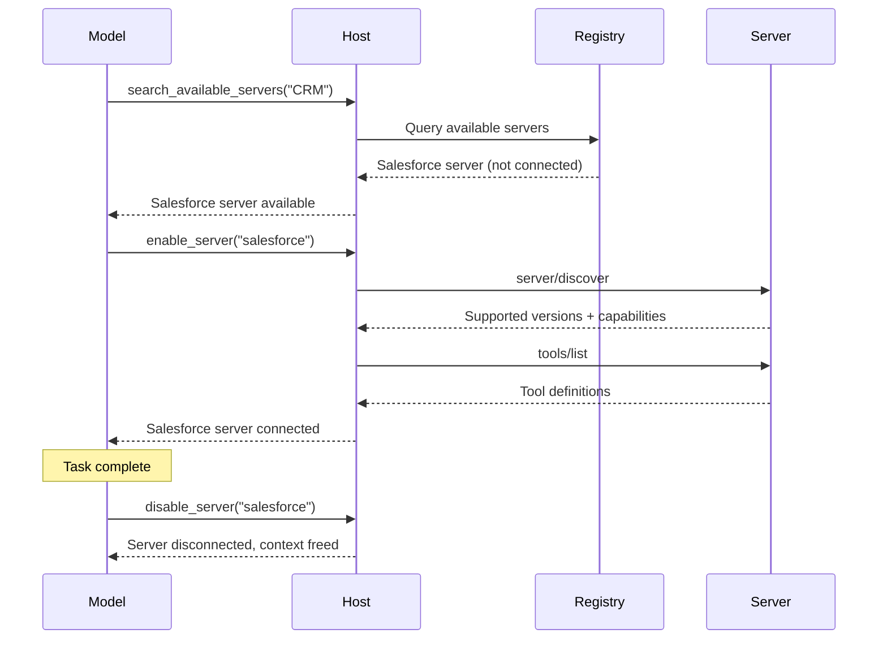
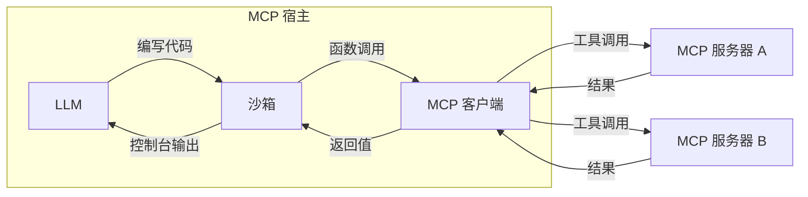

随着 MCP 主机应用（如代理）连接到更多 MCP 服务器并累积对成百上千个工具的访问权限，朴素的工具管理方法会失效。将每个工具定义预先加载到模型的上下文窗口中会浪费 token、增加延迟，并降低模型性能。在连续的工具调用之间，通过模型传递大型中间结果会进一步加剧这一问题。

有两种模式可以解决这些挑战：**渐进式发现**，用于控制 _何时_ 将工具定义引入上下文；以及 **程序化工具调用**，用于控制 _如何_ 调用工具。

## 渐进式工具发现

朴素的 MCP 主机实现会在每次对话开始时，直接把所有已连接服务器的工具定义传给模型。对于少量工具来说，这完全合理。但当主机可以访问数十个服务器、暴露上百个工具时，这些定义本身就可能在模型甚至还没读到用户消息之前，占据上下文窗口的大部分空间。


渐进式发现可以避免这一点：

- 主机像往常一样通过 `tools/list` 获取工具定义，但延迟将其注入模型上下文。
- 主机向模型提供一个轻量级的 `search_tools` 元工具。
- 主机仅在需要时才将完整定义加载进上下文。

### 何时使用渐进式发现

当工具定义占用了上下文窗口的大部分空间时，最适合使用渐进式发现。对于一小组工具，如果工具定义只占据上下文窗口很小的一部分，那么一次性加载所有工具是可以的。
一旦工具定义占用了可用上下文窗口的相当大一部分，客户端就应切换到渐进式发现。我们建议客户端实现阈值来决定何时切换：

- 将阈值实现为上下文窗口的百分比。例如，1%-5%。
- 加载工具定义。一旦达到阈值，就切换到渐进式发现。

### 选择发现策略

当模型调用 `search_tools` 工具后，我们需要选择一种搜索策略：

- **基于关键词**：关键词匹配（BM25、正则表达式）。简单且有效，尤其适用于名称和描述较为明确的工具。
- **基于嵌入**：对工具描述进行向量相似度检索。对同义词和语义匹配的处理更好。
- **基于子代理**：由第二个模型，通常是像 Claude Haiku 或 Gemini Flash 这样更小更快的模型，为任务选择工具。通常效果很好，但成本可能高于基于嵌入或关键词的方案。
- **混合**：结合多种方法。例如，在关键词和嵌入排序上共同打分，或根据用例或查询选择不同策略。

一些模型提供商已经内置了工具搜索功能。例如，[OpenAI](https://developers.openai.com/api/docs/guides/tools-tool-search) 和 [Anthropic](https://platform.claude.com/docs/en/agents-and-tools/tool-use/tool-search-tool) 原生支持这一能力；请查看你的提供商文档是否有对应功能。可用时，你可能更倾向于使用平台的工具搜索，而不是自定义实现。若提供商不支持，或者你需要专门的检索逻辑（例如特定领域的排序或访问控制过滤），则自行构建。

下面的三层模式详细展示了一种基于搜索的自定义方法，但无论采用何种检索机制，其分层原则（目录、检查、执行）都是适用的。

### 使用渐进式发现

一种常见的渐进式发现实现方式是使用基于搜索的三层方法：

**第 1 层：目录。** 主机暴露一小组用于搜索可用能力的元工具。`search_tools` 工具接受自然语言查询，并返回匹配的工具名称及简要描述。

```typescript
// 模型调用一个轻量级搜索工具
search_tools({ query: "update salesforce record" })

// 返回简明匹配结果：仅包含名称和一行描述
→ [
    { name: "salesforce_updateRecord", description: "Update fields on a Salesforce object" },
    { name: "salesforce_upsertRecord", description: "Insert or update based on external ID" }
  ]
```

**第 2 层：检查。** 一旦模型识别出候选工具，它就只获取该工具的完整定义（输入 schema、输出 schema、文档）。

```typescript
// 模型只检查它需要的工具
get_tool_details({ name: "salesforce_updateRecord" });
```

这会返回单个工具的完整 schema：

```json
{
  "name": "salesforce_updateRecord",
  "description": "Updates a record in Salesforce",
  "inputSchema": {
    "type": "object",
    "properties": {
      "objectType": {
        "type": "string",
        "description": "Salesforce 对象类型"
      },
      "recordId": { "type": "string", "description": "要更新的记录 ID" },
      "data": { "type": "object", "description": "要更新的字段" }
    },
    "required": ["objectType", "recordId", "data"]
  }
}
```

**第 3 层：执行。** 模型在完整了解其接口后调用该工具，而只加载了它所需要的定义。

这种模式能大幅减少 token 使用量，并且可以提高工具选择准确性：模型会聚焦于少数相关工具，而不是扫描数百个无关工具。其他发现策略（嵌入、子代理等）遵循相同的分层原则，只是用不同的检索机制替代目录层。

### 动态服务器管理

渐进式发现不仅适用于单个工具，也适用于整个服务器。主机不必在启动时连接每个已配置的服务器，而是可以：

1. 维护一个可用服务器及其高层描述的注册表。
2. 仅当模型判断需要某个服务器的能力时，才连接该服务器。
3. 断开当前任务不再相关的服务器，以释放上下文。



这对通用代理尤其有效，因为用户意图在一开始并不明确。代理从一组最小的始终在线服务器开始，并在需要时连接其他服务器。结合 [agent skills](/docs/2026-07-28/develop/build-with-agent-skills)，技能文件可以声明它需要哪些 MCP 服务器，而主机只会在该技能被调用时连接它们。

### 实现指南

实现渐进式发现时：

| 指南                         | 原因                                                                                                                                                                                              |
| ---------------------------- | ------------------------------------------------------------------------------------------------------------------------------------------------------------------------------------------------- |
| **提供多个详细程度**         | 让模型在仅名称、名称加描述、或完整 schema 响应之间进行选择。                                                                                                                                      |
| **缓存工具定义**             | 一旦从服务器获取到定义，就在主机侧进行记忆化缓存，这样以后重新注入时就不需要再进行一次 `tools/list` 往返。这与当前是否在模型上下文中是分开的。 |
| **在 `list_changed` 时刷新**  | 当服务器发送 `notifications/tools/list_changed` 时，重新索引搜索目录。                                                                                                                           |
| **按服务器分组工具**         | 按来源服务器组织工具，以便模型可以推理相关能力。                                                                                                                                                  |

### 缓存

每个列表结果（例如 `tools/list`），以及每个 `server/discover` 和 `resources/read` 结果，都会带有 `ttlMs` 和 `cacheScope` 提示。请按照规范中的 [caching utility](/specification/2026-07-28/server/utilities/caching) 定义来遵循它们。尤其要注意，一旦收到 `list_changed` 通知，就应将缓存的列表视为过期，即使其 TTL 尚未到期。

### 与提示缓存的交互

大多数提供商都会缓存提示前缀，包括 `tools` 数组。对话中途添加或移除工具定义会使该缓存失效，而由此导致的缓存未命中可能消耗比你删除的定义更多的 token。为了保持缓存：

- 在缓存断点之后追加新发现的定义，而不是重新排序 `tools` 数组；或者让每次调用都通过一个稳定的 `call_tool({name, args})` 元工具，从而使数组始终不变。
- 将服务器断开视为会话边界操作，而不是逐轮操作。
- 除了上面的工具搜索链接外，还应查阅你的提供商关于缓存的文档。

## 程序化工具调用 / 代码模式

使用直接工具调用时，每次工具调用都是一次往返：模型生成一个工具调用，客户端执行它，完整结果再回流到模型的上下文中。当某个任务需要串联多个工具（读取文档、转换文档、再写到别处）时，每个中间结果都要经过模型，即使这些结果与模型本身无关，也会消耗 token 并增加延迟。

程序化工具调用（有时称为“代码模式”）为客户端提供了一种有效**组合工具调用**的方法。模型不再直接调用工具，而是编写调用工具的代码。代码在沙箱环境中执行，只有最终结果返回给模型。

程序化工具调用功能强大，能够更高效地使用 MCP 工具和资源，但这要求
客户端实现一个沙箱环境。


### 工作原理

宿主将 MCP 工具模式转换为沙箱内可用的类型化 API。当模型需要工具时，它会编写脚本并执行。

**第 1 步：从 MCP 模式生成程序化 API。** 宿主读取每个服务器的工具定义，并基于每个工具的参数和 `outputSchema` 生成类型化函数：

```typescript
// 根据 Logging MCP 服务器的工具模式自动生成
interface LogEntry {
  timestamp: string;
  message: string;
  level: string;
}

function logging_getLogs(input: {
  level: "error" | "warn" | "info";
  since: number;
}): Promise<{ entries: LogEntry[] }> {
  return mcp.callTool<{ entries: LogEntry[] }>("logging_getLogs", input);
}

// 根据 Ticketing MCP 服务器的工具模式自动生成
function ticketing_createIssue(input: {
  title: string;
  body?: string;
  priority: "low" | "medium" | "high";
}): Promise<{ issueId: string }> {
  return mcp.callTool<{ issueId: string }>("ticketing_createIssue", input);
}
```

MCP 服务器可以为每个工具提供一个可选的 [`outputSchema`](/specification/2026-07-28/server/tools#output-schema)。当存在输出模式时，宿主可以生成精确的返回类型（如上面的 `LogEntry`）。

当输出模式缺失时，优先采用简单路径：

- **使用通用类型然后继续。** 接受 `any` 或 `string`，并在下游处理非结构化输出。真正的解决办法是由服务器作者提供 `outputSchema`。
- **使用快速模型提取类型化结果**，适用于循环外的单次调用。通过与 MCP 工具调用相同的 stub 拦截路径，暴露一个由宿主代理的 `extract(value, ExpectedType)` 辅助函数，这样沙箱本身就永远不会打开网络连接。该辅助函数会路由到一个小型模型（例如 Claude Haiku 或 Gemini Flash），将该值强制转换为 `ExpectedType`。这会增加每次调用的延迟，并且可能产生幻觉或丢失字段，因此在使用前应根据 `ExpectedType` 验证结果。

**第 2 步：模型基于这些 API 编写代码。** 模型不再分别发起多个工具调用并让完整结果在它们之间经过上下文传递，而是编写一段脚本。假设任务是“找出过去一小时内所有错误日志，并为每个唯一错误创建一张工单”。使用直接工具调用时，成千上万条日志会流经模型上下文。使用代码模式时，模型会在沙箱中进行过滤：

```typescript
// 模型生成的代码，在沙箱中执行
const logs = await logging_getLogs({
  level: "error",
  since: Date.now() - 3600000,
});

// 在沙箱内过滤并去重，而不是在模型上下文中处理
const uniqueErrors = new Map<string, LogEntry>();
for (const log of logs.entries) {
  if (!uniqueErrors.has(log.message)) {
    uniqueErrors.set(log.message, log);
  }
}

for (const [message, log] of uniqueErrors) {
  await ticketing_createIssue({
    title: `错误：${message}`,
    body: `首次出现：${log.timestamp}\n出现次数：${
      logs.entries.filter((l) => l.message === message).length
    }`,
    priority: "high",
  });
}

console.log(
  `根据 ${logs.entries.length} 条错误日志创建了 ${uniqueErrors.size} 张工单`,
);
```

**第 3 步：沙箱执行代码。** 沙箱内的函数调用会被拦截，并通过宿主代理路由回相应的 MCP 服务器。日志数据和工单创建过程会直接在服务器之间流转，而不会进入模型的上下文。只有 `console.log` 输出的一行摘要会返回给模型。

### 选择沙箱

合适的沙箱取决于你希望模型编写的语言、宿主应用的语言，以及你需要多少隔离级别。下表列出的是示例运行时，而非推荐；请结合你的使用场景评估其成熟度：

| 沙箱语言 | 运行时 / 库                                               | 宿主语言         | 方法                                                                                           |
| -------- | ---------------------------------------------------------- | ---------------- | ---------------------------------------------------------------------------------------------- |
| **JavaScript** | [Deno](https://github.com/denoland/deno), `isolated-vm`       | Rust / Node / CLI | 基于 V8 的运行时，具备细粒度权限。可禁用所有权限以实现完全锁定。 |
| **Python**     | [Monty](https://github.com/pydantic/monty) _(experimental)_   | Rust              | 为 AI 使用场景构建的最小 Python 解释器。默认无 I/O。                           |
| **TypeScript** | [pctx](https://github.com/portofcontext/pctx) _(early-stage)_ | Python / Rust     | 作为库纳入代码模式概念，并提供底层 Rust 支持。                      |
| **Any (via Wasm)** | [Wasmtime](https://github.com/bytecodealliance/wasmtime)      | Rust / C / Go     | 将任何语言编译为 Wasm，并以基于能力的安全模型运行。                         |

无论使用哪种沙箱，集成模式都是相同的：宿主注入函数 stub，通过进程内或 stdio 通道拦截调用（因此可以始终拒绝网络权限），并将它们作为 `tools/call` 请求分发给 MCP 服务器。

### 执行架构

实现包含三个组件：



**沙箱** 在一个隔离环境中运行模型生成的代码，没有直接网络访问权限。它与外界唯一的接口是生成的函数 stub，这些 stub 会将调用路由回宿主。

**宿主** 充当代理。它接收来自沙箱的函数调用，将其映射到正确的 MCP 服务器，执行工具调用，并将结果返回给沙箱。授权令牌和凭据由宿主管理，绝不会暴露给生成的代码。

**模型** 只能看到沙箱返回的内容，通常是 `console.log` 语句的输出或最终返回值。这使模型（以及客户端开发者）能够精确控制哪些内容进入上下文窗口。

### 安全注意事项

程序化工具调用引入了代码执行面，因此需要谨慎的沙箱隔离：

- **按调用授权**：就规范而言，代理仍然是 MCP 宿主。对来自沙箱的调用，应应用与你对直接调用相同的人在回路确认策略（见 [工具：安全性](/specification/2026-07-28/server/tools#security-considerations)）。批准脚本并不意味着自动批准它在运行时发出的每个工具调用；宿主可以授予分类式批准（例如，“允许该脚本运行期间调用 `ticketing_createIssue`”），而不必每次迭代都提示，但代理仍必须根据该授权评估每一次调用。
- **跨服务器数据流**：来自某个服务器的工具结果，对于另一个服务器来说是不可信输入。代理应对中转调用应用与直接调用相同的输入审查策略；仅靠输出截断并不能阻止数据外泄。
- **网络隔离**：沙箱不应具有直接网络访问权限。所有外部通信都应通过宿主代理进行，由其执行授权和访问控制。
- **不暴露凭据**：API 密钥和令牌由宿主管理。生成的代码只调用类型化函数；宿主在转发到服务器时再添加身份验证。
- **资源限制**：为沙箱执行设置超时和内存限制，防止脚本失控。
- **输出过滤**：在将沙箱控制台输出反馈给模型之前，先进行验证和截断。

### 错误处理

MCP 工具错误会以成功响应的形式返回，并带有
[`isError: true`](/specification/2026-07-28/server/tools#error-handling)，而不是传输
失败。生成的封装器应将其转换为抛出的异常，这样模型编写的代码
就可以使用 `try`/`catch`。如果未捕获的错误导致脚本终止，应将其作为脚本的
结果暴露给模型，以便模型自我纠正；对于已提交的任何部分副作用，
模型负责如实报告。

## 结合两种模式

渐进式发现和程序化工具调用可以很好地协同工作。模型使用发现工具来识别它需要哪些工具，加载这些工具的 schema，然后编写一个在一次执行过程中调用多个工具的单个脚本。这种组合同时最小化了工具定义的 token 成本和工具结果的 token 成本，使模型的上下文保持专注于推理，而不是通过它传递数据。
