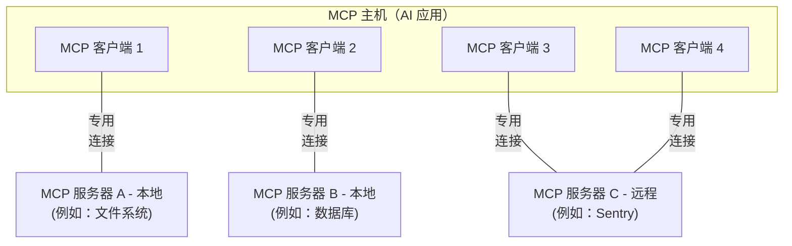

本 Model Context Protocol（MCP）概览介绍了其[范围](#scope)和[核心概念](#concepts-of-mcp)，并提供了一个[示例](#example)来演示每个核心概念。

由于 MCP SDK 对许多问题进行了抽象，大多数开发者可能会发现[数据层协议](#data-layer-protocol)部分最有用。它讨论了 MCP 服务器如何为 AI 应用提供上下文。

有关具体实现细节，请参阅您的[特定语言 SDK](/docs/2026-07-28/sdk)文档。

## 范围

Model Context Protocol 包括以下项目：

- [MCP 规范](https://modelcontextprotocol.io/specification/latest)：MCP 的一份规范，概述了客户端和服务器的实现要求。
- [MCP SDK](/docs/2026-07-28/sdk)：用于不同编程语言、实现 MCP 的 SDK。
- **MCP 开发工具**：用于开发 MCP 服务器和客户端的工具，包括 [MCP Inspector](https://github.com/modelcontextprotocol/inspector)
- [MCP 参考服务器实现](https://github.com/modelcontextprotocol/servers)：MCP 服务器的参考实现。

<Note>
  MCP 仅专注于上下文交换协议——它不规定
  AI 应用如何使用 LLM 或管理所提供的上下文。
</Note>

## MCP 的概念

### 参与者

MCP 采用客户端-服务器架构，其中一个 MCP 主机——如 [Claude Code](https://www.anthropic.com/claude-code) 或 [Claude Desktop](https://www.claude.ai/download) 这样的 AI 应用——会与一个或多个 MCP 服务器建立连接。MCP 主机通过为每个 MCP 服务器创建一个 MCP 客户端来实现这一点。每个 MCP 客户端都与其对应的 MCP 服务器保持专用连接。

使用 STDIO 传输的本地 MCP 服务器通常只服务于单个 MCP 客户端，而使用 Streamable HTTP 传输的远程 MCP 服务器通常会服务于多个 MCP 客户端。

MCP 架构中的关键参与者包括：

- **MCP 主机**：协调并管理一个或多个 MCP 客户端的 AI 应用
- **MCP 客户端**：维护与 MCP 服务器连接的组件，并从 MCP 服务器获取上下文供 MCP 主机使用
- **MCP 服务器**：向 MCP 客户端提供上下文的程序

**例如**：Visual Studio Code 充当 MCP 主机。当 Visual Studio Code 与某个 MCP 服务器建立连接时，例如 [Sentry MCP server](https://docs.sentry.io/product/sentry-mcp/)，Visual Studio Code 运行时会实例化一个 MCP 客户端对象来维护与 Sentry MCP 服务器的连接。
当 Visual Studio Code 随后连接到另一个 MCP 服务器时，例如 [本地文件系统服务器](https://github.com/modelcontextprotocol/servers/tree/main/src/filesystem)，Visual Studio Code 运行时会实例化另一个 MCP 客户端对象来维护这条连接。



请注意，**MCP 服务器**指的是提供上下文数据的程序，不论它运行在哪里。MCP 服务器可以在本地或远程执行。例如，当 Claude Desktop 启动 [filesystem
server](https://github.com/modelcontextprotocol/servers/tree/main/src/filesystem) 时，服务器会通过 STDIO 传输在同一台机器上本地运行。这通常被称为“本地” MCP 服务器。官方的 [Sentry MCP server](https://docs.sentry.io/product/sentry-mcp/) 运行在 Sentry 平台上，并使用 Streamable HTTP 传输。这通常被称为“远程” MCP 服务器。

### 层

MCP 由两层组成：

- **数据层**：定义基于 JSON-RPC 的客户端-服务器通信协议，包括能力和版本发现，以及工具、资源、提示和通知等核心原语。
- **传输层**：定义使客户端和服务器之间能够进行数据交换的通信机制和通道，包括特定于传输的连接建立、消息分帧和授权。

从概念上讲，数据层是内层，而传输层是外层。

#### 数据层

数据层实现了一个基于 [JSON-RPC 2.0](https://www.jsonrpc.org/) 的交换协议，用于定义消息结构和语义。
该层包括：

- **发现**：允许客户端通过 `server/discover` 请求查询服务器支持的协议版本、能力和身份
- **服务器功能**：使服务器能够提供核心功能，包括用于 AI 动作的工具、用于上下文数据的资源，以及用于从客户端和向客户端进行交互模板的提示
- **客户端功能**：使服务器能够从用户那里引出输入。自协议版本 `2026-07-28` 起，采样已[弃用](/specification/2026-07-28/deprecated)。
- **实用功能**：支持额外能力，例如用于实时更新的通知以及用于长时间运行操作的进度跟踪

#### 传输层

传输层管理客户端和服务器之间的通信通道和身份验证。它处理连接建立、消息分帧以及 MCP 参与者之间的安全通信。

MCP 支持两种传输机制：

- **Stdio 传输**：使用标准输入/输出流在同一台机器上的本地进程之间进行直接进程通信，提供无网络开销的最佳性能。
- **Streamable HTTP 传输**：使用 HTTP POST 发送客户端到服务器的消息，并可选使用 Server-Sent Events 以支持流式能力。此传输支持远程服务器通信，并支持标准 HTTP 身份验证方法，包括 bearer 令牌、API 密钥和自定义请求头。MCP 建议使用 OAuth 来获取身份验证令牌。

传输层将通信细节从协议层中抽象出来，使所有传输机制都能使用相同的 JSON-RPC 2.0 消息格式。

### 数据层协议

MCP 的核心部分之一是定义 MCP 客户端和 MCP 服务器之间的模式与语义。开发者很可能会发现数据层——尤其是 [原语](#primitives) 集合——是 MCP 最有趣的部分。它是 MCP 中定义开发者如何将上下文从 MCP 服务器共享给 MCP 客户端的部分。

MCP 使用 [JSON-RPC 2.0](https://www.jsonrpc.org/) 作为其底层 RPC 协议。客户端和服务器彼此发送请求并相应地作出响应。当不需要响应时，可以使用通知。

#### 无状态性与发现

MCP 是一种 <Tooltip tip="每个请求都包含处理它所需的全部信息，因此服务器不会从之前的请求中推断任何内容">无状态协议</Tooltip>。每个请求都会在其 `_meta` 字段中携带协议版本以及与该请求相关的 <Tooltip tip="客户端或服务器支持的功能和操作，例如工具、资源或提示">能力</Tooltip>，因此服务器可以独立处理每个请求。除非另有配置，客户端也应在同一字段中标识自身。服务器通过强制性的 [`server/discover`](/specification/2026-07-28/server/discover) 请求来声明其支持的版本和能力，客户端可以在任何其他请求之前发送该请求。详细信息可在[规范](/specification/2026-07-28/basic/index#statelessness)中找到，而[示例](#example)展示了每次请求的元数据以及发现流程。

#### 原语

MCP 原语是 MCP 中最重要的概念。它们定义了客户端和服务器可以彼此提供什么。这些原语指定了可以与 AI 应用共享的上下文信息类型，以及可以执行的操作范围。

MCP 定义了三种核心原语，_服务器_ 可以公开它们：

- **工具**：可执行函数，AI 应用可以调用它们来执行操作（例如：文件操作、API 调用、数据库查询）
- **资源**：提供上下文信息的数据源，供 AI 应用使用（例如：文件内容、数据库记录、API 响应）
- **提示**：可复用模板，用于帮助组织与语言模型的交互（例如：系统提示、少样本示例）

每种原语类型都关联有用于发现（`*/list`）、检索（`*/get`），以及在某些情况下执行（`tools/call`）的方法。
MCP 客户端将使用 `*/list` 方法来发现可用原语。例如，客户端可以先列出所有可用工具（`tools/list`），然后再执行它们。这种设计使列表可以是动态的。

作为一个具体示例，考虑一个提供数据库上下文的 MCP 服务器。它可以公开用于查询数据库的工具、包含数据库模式的资源，以及包含用于与这些工具交互的少样本示例的提示。

有关服务器原语的更多细节，请参见[服务器概念](./server-concepts)。

MCP 也定义了 _客户端_ 可以公开的原语。这些原语使 MCP 服务器作者能够构建更丰富的交互。

- **询问**：允许服务器向用户请求额外信息。当服务器作者希望从用户那里获取更多信息，或请求对某个操作进行确认时，这很有用。服务器使用 `elicitation/create` 方法请求用户输入。

询问请求通过[多轮往返请求](/specification/2026-07-28/basic/patterns/mrtr)模式传递，相关说明见[询问概览](/docs/2026-07-28/learn/client-concepts#elicitation)。

**已弃用**：以下客户端原语自协议版本 `2026-07-28` 起已弃用。

- **采样**：允许服务器从客户端的 AI 应用请求语言模型补全。当服务器作者需要访问语言模型，但又希望保持模型无关性，并且不在其 MCP 服务器中包含语言模型 SDK 时，这很有用。服务器使用 `sampling/createMessage` 方法请求补全，同样通过多轮往返请求模式传递。新的实现应直接集成 LLM 提供商的 API。
- **日志**：允许服务器向客户端发送日志消息，用于调试和监控。新的实现应输出到 `stderr`（stdio 传输）或使用 OpenTelemetry。

有关客户端原语的更多细节，请参见[客户端概念](./client-concepts)。

除了服务器和客户端原语之外，该协议还支持建立在核心协议之上的可选[扩展](/extensions/overview)。例如，[Tasks 扩展](/extensions/tasks/overview)允许服务器为长时间运行的请求返回一个持久句柄，以便客户端稍后轮询状态并获取结果。

#### 通知

该协议支持实时通知，以便在服务器和客户端之间进行动态更新。例如，当服务器可用工具发生变化时（例如新增功能可用或现有工具被修改），服务器可以发送工具更新通知，告知已连接的客户端这些变化。通知以 JSON-RPC 2.0 通知消息的形式发送（不期望得到响应）。变更通知采用按需启用：客户端打开一个长期存在的 [`subscriptions/listen`](/specification/2026-07-28/basic/patterns/subscriptions) 流，并指定其希望接收的通知类型，服务器则在该流上发送匹配的通知。

## 示例

### 数据层

本节通过一步一步的方式演示一个 MCP 客户端-服务器交互，重点介绍数据层协议。我们将使用 JSON-RPC 2.0 消息展示发现、工具操作和通知。

<Steps>
<Step title="发现">

如 [无状态性与发现](#statelessness-and-discovery) 一节所述，每个 MCP 请求都会在其 `_meta` 字段中携带协议版本和客户端能力，客户端也应在其中包含自身身份。想要在发出其他请求之前了解服务器支持内容的客户端，会发送一个 `server/discover` 请求，而每个服务器都必须实现该请求。发现响应通常是可缓存的，这意味着它可以被重复使用，因此不必为每个请求都执行一遍发现流程。

<CodeGroup>
  ```json Discover Request
  {
    "jsonrpc": "2.0",
    "id": 1,
    "method": "server/discover",
    "params": {
      "_meta": {
        "io.modelcontextprotocol/protocolVersion": "2026-07-28",
        "io.modelcontextprotocol/clientInfo": {
          "name": "example-client",
          "version": "1.0.0"
        },
        "io.modelcontextprotocol/clientCapabilities": {
          "elicitation": {}
        }
      }
    }
  }
  ```
  ```json Discover Response
  {
    "jsonrpc": "2.0",
    "id": 1,
    "result": {
      "resultType": "complete",
      "supportedVersions": ["2026-07-28"],
      "capabilities": {
        "tools": {
          "listChanged": true
        },
        "resources": {}
      },
      "_meta": {
        "io.modelcontextprotocol/serverInfo": {
          "name": "example-server",
          "version": "1.0.0"
        }
      },
      "ttlMs": 3600000,
      "cacheScope": "public"
    }
  }
  ```
</CodeGroup>

#### 理解发现交换

`_meta` 字段和发现响应一起承担了多个用途：

1. **协议版本选择**：`io.modelcontextprotocol/protocolVersion` 字段声明客户端在本次请求中使用的协议版本，而响应中的 `supportedVersions` 列出服务器接受的版本。如果服务器不支持请求的版本，它会返回一个 `UnsupportedProtocolVersionError`，并列出它支持的版本，客户端随后会用双方都支持的版本重试。

2. **能力发现**：客户端在每个请求中通过 `io.modelcontextprotocol/clientCapabilities` 声明自身能力，服务器则通过 `server/discover` 返回自己的 `capabilities` 对象。这会告诉双方对方可以处理哪些 [原语](#primitives)（工具、资源、提示），以及是否可用变更 [通知](#notifications)，从而避免尝试不受支持的操作。

3. **身份交换**：请求中的 `_meta` 里的 `io.modelcontextprotocol/clientInfo` 字段，以及结果中的 `_meta` 里的 `io.modelcontextprotocol/serverInfo` 字段，会提供用于调试和兼容性目的的身份与版本信息。

在这个示例中，这次交换演示了 MCP 能力是如何声明的：

**客户端能力**：

- `"elicitation": {}` - 客户端声明它能够在服务器请求时从用户那里收集额外输入

**服务器能力**：

- `"tools": {"listChanged": true}` - 服务器支持工具原语，并且可以响应 [`subscriptions/listen`](/specification/2026-07-28/basic/patterns/subscriptions) 中的 `toolsListChanged` 过滤器。请求该过滤器的客户端会在工具列表发生变化时收到 `notifications/tools/list_changed`。
- `"resources": {}` - 服务器也支持资源原语（可以处理 `resources/list` 和 `resources/read` 方法）

调用 `server/discover` 是可选的。由于每个请求都携带相同的 `_meta` 字段，客户端完全可以直接发送任意请求，并在收到版本错误时再处理。发现是一种方便的方式，可以在单个请求中获取服务器的身份、能力和支持的版本。

#### 这在 AI 应用中如何工作

AI 应用的 MCP 客户端管理器会连接到已配置的服务器，并保存其发现到的能力，以供后续使用。应用会利用这些信息来决定哪些服务器可以提供特定类型的功能（工具、资源、提示），以及它们是否支持实时更新。在 Python SDK 中，发现会在客户端连接时发生。之后，这些结果可以在客户端对象上访问。

```python Pseudo-code for AI application discovery
# 伪代码
async with Client(stdio_client(server_config)) as client:
    if client.server_capabilities.tools:
        app.register_mcp_server(client, supports_tools=True)
    app.set_server_ready(client)
```

</Step>

<Step title="工具发现（原语）">
客户端可以通过发送 `tools/list` 请求来发现可用工具。这个请求是 MCP 工具发现机制的基础：它允许客户端在尝试使用工具之前了解服务器上有哪些工具可用。

<CodeGroup>
  ```json Tools List Request
  {
    "jsonrpc": "2.0",
    "id": 2,
    "method": "tools/list",
    "params": {
      "_meta": {
        "io.modelcontextprotocol/protocolVersion": "2026-07-28",
        "io.modelcontextprotocol/clientInfo": {
          "name": "example-client",
          "version": "1.0.0"
        },
        "io.modelcontextprotocol/clientCapabilities": {
          "elicitation": {}
        }
      }
    }
  }
  ```
  ```json Tools List Response
  {
    "jsonrpc": "2.0",
    "id": 2,
    "result": {
      "resultType": "complete",
      "tools": [
        {
          "name": "calculator_arithmetic",
          "title": "计算器",
          "description": "执行数学计算，包括基础算术、三角函数和代数运算",
          "inputSchema": {
            "type": "object",
            "properties": {
              "expression": {
                "type": "string",
                "description": "要计算的数学表达式（例如：'2 + 3 * 4'、'sin(30)'、'sqrt(16)'）"
              }
            },
            "required": ["expression"]
          }
        },
        {
          "name": "weather_current",
          "title": "天气信息",
          "description": "获取全球任意地点的当前天气信息",
          "inputSchema": {
            "type": "object",
            "properties": {
              "location": {
                "type": "string",
                "description": "城市名称、地址或坐标（纬度，经度）"
              },
              "units": {
                "type": "string",
                "enum": ["metric", "imperial", "kelvin"],
                "description": "响应中使用的温度单位",
                "default": "metric"
              }
            },
            "required": ["location"]
          }
        }
      ],
      "ttlMs": 300000,
      "cacheScope": "public"
    }
  }
  ```
</CodeGroup>

#### 理解工具发现请求

`tools/list` 请求除了伴随每个 MCP 请求的标准 `_meta` 字段之外，不需要任何其他参数。它还接受一个可选的 `cursor` 参数用于 [分页](/specification/2026-07-28/server/utilities/pagination)，上面的示例省略了这一点。

#### 理解工具发现响应

响应包含一个 `tools` 数组，提供每个可用工具的完整元数据。基于数组的结构使服务器能够同时暴露多个工具，同时保持不同功能之间的清晰边界。

响应中的每个工具对象都包含几个关键字段：

- **`name`**：工具在服务器命名空间中的唯一标识符。它是工具执行的主键，应该遵循清晰的命名模式（例如 `calculator_arithmetic`，而不是仅仅 `calculate`）
- **`title`**：工具的人类可读显示名称，客户端可以将其展示给用户
- **`description`**：对工具功能以及适用场景的详细说明
- **`inputSchema`**：定义预期输入参数的 JSON Schema，可用于类型校验，并清楚地说明必填和可选参数

结果被标记为 `"resultType": "complete"`，并带有两个缓存字段。`ttlMs` 是以毫秒为单位的新鲜度提示，因此这份工具列表可以缓存五分钟。`cacheScope` 指示谁可以重用该响应。规范中的 [缓存工具](/specification/2026-07-28/server/utilities/caching) 定义了完整规则。

#### 这在 AI 应用中如何工作

AI 应用会从所有已连接的 MCP 服务器获取可用工具，并将它们合并为一个统一的工具注册表，供语言模型访问。这样，LLM 就能理解自己可以执行哪些操作，并在对话过程中自动生成适当的工具调用。

```python Pseudo-code for AI application tool discovery
# 使用 MCP Python SDK 模式的伪代码
available_tools = []
for client in app.mcp_clients():
    tools_response = await client.list_tools()
    available_tools.extend(tools_response.tools)
conversation.register_available_tools(available_tools)
```

联邦接入多个服务器的客户端可以使用 [渐进式工具发现](/docs/2026-07-28/develop/clients/client-best-practices#progressive-tool-discovery)，而不是一次性加载所有工具。

</Step>

<Step title="工具执行（原语）">
客户端现在可以使用 `tools/call` 方法执行一个工具。这演示了 MCP 原语在实践中的用法：在发现可用工具之后，客户端可以用适当的参数调用它们。

#### 理解工具执行请求

`tools/call` 请求遵循一种结构化格式，以确保类型安全并实现客户端与服务器之间清晰的通信。注意，这里使用的是发现响应中的正确工具名（`weather_current`），而不是简化后的名称：

<CodeGroup>
  ```json Tool Call Request
  {
    "jsonrpc": "2.0",
    "id": 3,
    "method": "tools/call",
    "params": {
      "name": "weather_current",
      "arguments": {
        "location": "San Francisco",
        "units": "imperial"
      },
      "_meta": {
        "io.modelcontextprotocol/protocolVersion": "2026-07-28",
        "io.modelcontextprotocol/clientInfo": {
          "name": "example-client",
          "version": "1.0.0"
        },
        "io.modelcontextprotocol/clientCapabilities": {
          "elicitation": {}
        }
      }
    }
  }
  ```
  ```json Tool Call Response
  {
    "jsonrpc": "2.0",
    "id": 3,
    "result": {
      "resultType": "complete",
      "content": [
        {
          "type": "text",
          "text": "San Francisco 当前天气：68°F，局部多云，西风 8 英里/小时，微风。湿度：65%"
        }
      ]
    }
  }
  ```
</CodeGroup>

#### 工具执行的关键要素

请求结构包含几个重要组件：

1. **`name`**：必须与发现响应中的工具名（`weather_current`）完全一致。这样可以确保服务器正确识别要执行的是哪个工具。

2. **`arguments`**：包含工具 `inputSchema` 所定义的输入参数。在这个示例中：
   - `location`: "San Francisco"（必填参数）
   - `units`: "imperial"（可选参数，如未指定则默认为 "metric"）

3. **`_meta`**：携带每个请求都必须包含的标准字段：协议版本和客户端能力；此外还包括客户端身份，除非配置为不包含，否则客户端通常都应提供。

4. **JSON-RPC 结构**：使用标准 JSON-RPC 2.0 格式，并通过唯一的 `id` 进行请求-响应关联。

#### 理解工具执行响应

响应展示了 MCP 灵活的内容系统：

1. **`content` 数组**：工具响应返回一个内容对象数组，支持丰富的多格式响应（文本、图像、资源等）

2. **内容类型**：每个内容对象都有一个 `type` 字段。在这个示例中，`"type": "text"` 表示纯文本内容，但 MCP 支持针对不同场景的多种内容类型。

3. **结构化输出**：响应提供了可供 AI 应用作为上下文使用的可操作信息，用于与语言模型交互。

这种执行模式使 AI 应用能够动态调用服务器功能，并接收可结构化的响应，从而将其整合到与语言模型的对话中。

#### 这在 AI 应用中如何工作

当语言模型在对话中决定使用某个工具时，AI 应用会拦截该工具调用，将其路由到相应的 MCP 服务器，执行后再把结果作为对话流程的一部分返回给 LLM。这使 LLM 能够访问实时数据，并在外部世界中执行动作。

```python
# AI 应用工具执行的伪代码
async def handle_tool_call(conversation, tool_name, arguments):
    client = app.find_mcp_client_for_tool(tool_name)
    result = await client.call_tool(tool_name, arguments)
    conversation.add_tool_result(result.content)
```

</Step>

<Step title="实时更新（通知）">
MCP 支持实时通知，使服务器能够在发生变化时主动告知客户端，而无需客户端轮询。这演示了通知系统——它是让客户端保持同步和响应迅速的关键特性。

#### 订阅变更

变更通知是按需启用的。要接收这些通知，客户端会通过发送一个 [`subscriptions/listen`](/specification/2026-07-28/basic/patterns/subscriptions) 请求来打开一个长连接通知流，并使用 `notifications` 过滤器指定它想要的事件类型。这里客户端请求的是工具列表变化：

```json Listen Request
{
  "jsonrpc": "2.0",
  "id": 4,
  "method": "subscriptions/listen",
  "params": {
    "_meta": {
      "io.modelcontextprotocol/protocolVersion": "2026-07-28",
      "io.modelcontextprotocol/clientInfo": {
        "name": "example-client",
        "version": "1.0.0"
      },
      "io.modelcontextprotocol/clientCapabilities": {
        "elicitation": {}
      }
    },
    "notifications": {
      "toolsListChanged": true
    }
  }
}
```

每个客户端请求都会在 `_meta` 中携带 `io.modelcontextprotocol/protocolVersion` 和 `io.modelcontextprotocol/clientCapabilities` 字段，并且通常也会携带 `io.modelcontextprotocol/clientInfo`，这样服务器就可以在不依赖连接状态的情况下识别客户端。

服务器会通过 `notifications/subscriptions/acknowledged` 确认该订阅，这是第一条在 `_meta` 中携带该订阅 ID 的消息（服务器在此之前不会为该订阅发送任何其他通知）。其 `notifications` 字段反映了服务器同意支持的请求过滤器子集，未支持的通知类型会被省略：

```json Acknowledgment
{
  "jsonrpc": "2.0",
  "method": "notifications/subscriptions/acknowledged",
  "params": {
    "_meta": {
      "io.modelcontextprotocol/subscriptionId": 4
    },
    "notifications": {
      "toolsListChanged": true
    }
  }
}
```

#### 理解工具列表变更通知

在确认之后，当服务器可用工具发生变化时（例如新增功能可用、现有工具被修改，或工具暂时不可用），服务器会在该流上发送通知：

```json Notification
{
  "jsonrpc": "2.0",
  "method": "notifications/tools/list_changed",
  "params": {
    "_meta": {
      "io.modelcontextprotocol/subscriptionId": 4
    }
  }
}
```

#### MCP 通知的关键特性

1. **无需响应**：注意通知中没有 `id` 字段。这符合 JSON-RPC 2.0 的通知语义，即不期望也不发送响应。

2. **按需启用**：此通知仅发送给在其 `subscriptions/listen` 过滤器中请求了 `"toolsListChanged": true` 的客户端，并且只有在服务器在其工具能力中声明了 `"listChanged": true` 时才可用（如第 1 步所示）。

3. **订阅 ID 标记**：流上的每条通知都会在 `_meta` 中携带 `io.modelcontextprotocol/subscriptionId`。其值是开启该流的 `subscriptions/listen` 请求的 JSON-RPC ID（本例中为 `4`），因此客户端可以将每条通知与产生它的订阅关联起来。

4. **事件驱动**：服务器根据内部状态变化决定何时发送通知，使 MCP 连接具有动态性和响应性。

5. **尽力而为**：无法保证每条通知都会被发送或接收，尤其是在传输重连过程中。客户端也应依赖轮询来保持结果的新鲜度。

#### 客户端对通知的响应

收到此通知后，客户端通常会通过请求更新后的工具列表来作出反应。这样会形成一个刷新循环，使客户端对可用工具的理解保持最新：

```json Request
{
  "jsonrpc": "2.0",
  "id": 5,
  "method": "tools/list",
  "params": {
    "_meta": {
      "io.modelcontextprotocol/protocolVersion": "2026-07-28",
      "io.modelcontextprotocol/clientInfo": {
        "name": "example-client",
        "version": "1.0.0"
      },
      "io.modelcontextprotocol/clientCapabilities": {
        "elicitation": {}
      }
    }
  }
}
```

#### 为什么通知很重要

这个通知系统出于多个原因至关重要：

1. **动态环境**：工具可能会根据服务器状态、外部依赖或用户权限而出现或消失
2. **效率**：客户端无需轮询变化；更新发生时会收到通知
3. **一致性**：确保客户端始终拥有关于可用服务器能力的准确信息
4. **实时协作**：使响应迅速的 AI 应用能够适应不断变化的上下文

这种通知模式不仅适用于工具，也扩展到其他 MCP 原语，从而实现客户端和服务器之间全面的实时同步。

#### 这在 AI 应用中如何工作

AI 应用会为自己关心的变化保持一个打开的通知流。当有通知到来时，它会立即刷新工具注册表，并更新 LLM 可用的能力。这确保正在进行的对话始终可以使用最新的一组工具，并且 LLM 能够随着新功能的出现动态适应。

```python
# AI 应用通知处理的伪代码
async def follow_tool_changes(client):
    async with client.listen(tools_list_changed=True) as sub:
        async for _event in sub:
            tools_response = await client.list_tools()
            app.update_available_tools(client, tools_response.tools)
            if app.conversation.is_active():
                app.conversation.notify_llm_of_new_capabilities()
```

</Step>
</Steps>
