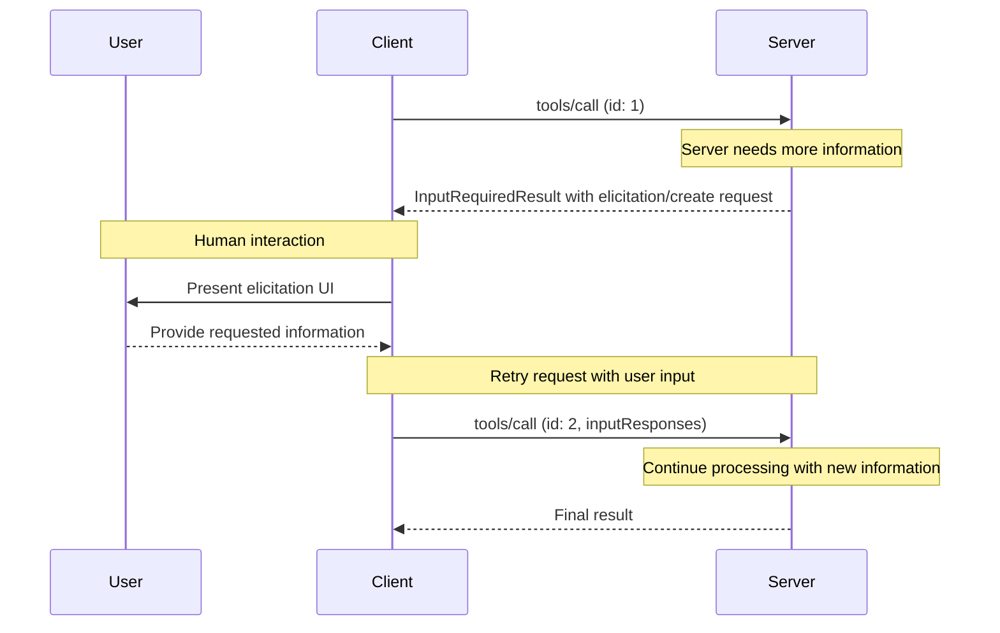
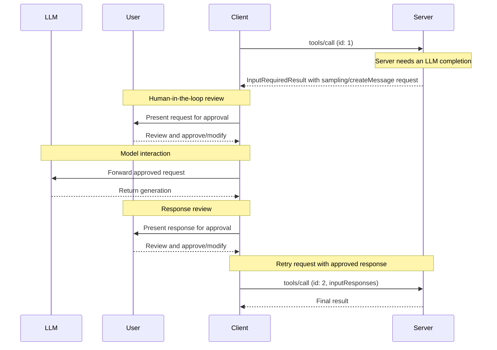

MCP 客户端由宿主应用程序实例化，用于与特定的 MCP 服务器通信。宿主应用程序，例如 Claude.ai 或某个 IDE，负责管理整体用户体验并协调多个客户端。每个客户端处理与一个服务器的一次直接通信。

理解这种区别很重要：_宿主_ 是用户交互的应用程序，而 _客户端_ 是在协议层面上支持服务器连接的组件。

## 核心客户端功能

除了使用服务器提供的上下文之外，客户端还可以向服务器提供若干功能。这些客户端功能使服务器作者能够构建更丰富的交互。

| 功能            | 说明                                                                                                                                                                                                                                                   | 示例                                                                                                                                |
| --------------- | ------------------------------------------------------------------------------------------------------------------------------------------------------------------------------------------------------------------------------------------------------------- | -------------------------------------------------------------------------------------------------------------------------------------- |
| **引导获取**     | 引导获取使服务器能够在交互过程中向用户请求特定信息，为服务器按需收集信息提供了一种结构化方式。                                                                                           | 一个预订旅行的服务器可能会询问用户对飞机座位、房间类型或联系电话的偏好，以完成预订。 |
| **根目录**       | 根目录允许客户端指定服务器应重点关注哪些目录，并通过协调机制传达预期范围。自协议版本 `2026-07-28` 起，根目录已[弃用](/specification/2026-07-28/deprecated)。                    | 一个用于预订旅行的服务器可能会被授予访问某个特定目录的权限，从中读取用户的日历。                     |
| **采样**         | 采样允许服务器通过客户端请求 LLM 补全，从而支持代理式工作流。此方法将用户权限和安全措施的完全控制权交给客户端。自协议版本 `2026-07-28` 起，采样已弃用。 | 一个用于预订旅行的服务器可能会将航班列表发送给 LLM，并请求该 LLM 为用户选择最佳航班。           |

### 询问

询问使服务器能够在交互过程中向用户请求特定信息，从而创建更动态、更具响应性的工作流程。

#### 概述

询问为服务器按需收集必要信息提供了一种结构化方式。与其一开始就要求提供所有信息，或者在数据缺失时失败，服务器可以暂停其操作并请求用户提供特定输入。这种方式带来了更灵活的交互，使服务器能够适应用户需求，而不是遵循僵化的模式。

询问支持两种模式：

- **表单模式**：服务器请求客户端从用户那里收集结构化数据。请求包含一个模式，客户端使用该模式来构建输入表单并验证响应。
- **URL 模式**：服务器提供一个供用户打开的 URL。交互在带外进行，其数据永远不会经过客户端，因此该模式适用于敏感流程，例如凭证输入或第三方 OAuth 授权。

询问遵循 [多轮往返请求](/specification/2026-07-28/basic/patterns/mrtr)（MRTR）模式。当服务器在处理诸如 `tools/call` 之类的请求时需要用户输入，它会返回一个 `InputRequiredResult`，其 `inputRequests` 字段包含一个或多个 `elicitation/create` 请求。客户端收集输入并重试原始请求，同时附带收集到的 `inputResponses`，并回传服务器包含的任何 `requestState`。

**询问流程：**



该流程支持动态信息收集。服务器可以在需要时请求特定数据，用户通过合适的界面提供信息，而服务器则利用新获得的上下文完成重试后的请求。

**询问请求示例（通过 `InputRequiredResult.inputRequests` 传递）：**

```typescript
{
  method: "elicitation/create",
  params: {
    mode: "form",
    message: "Please confirm your Barcelona vacation booking details:",
    requestedSchema: {
      type: "object",
      properties: {
        confirmBooking: {
          type: "boolean",
          description: "确认预订（机票 + 酒店 = $3,000）"
        },
        seatPreference: {
          type: "string",
          enum: ["window", "aisle", "no preference"],
          description: "机票偏好的座位类型"
        },
        roomType: {
          type: "string",
          enum: ["sea view", "city view", "garden view"],
          description: "酒店偏好的房型"
        },
        travelInsurance: {
          type: "boolean",
          default: false,
          description: "添加旅行保险（$150）"
        }
      },
      required: ["confirmBooking"]
    }
  }
}
```

#### 示例：假日预订审批

一家旅行预订服务器通过最终预订确认流程展示了询问的强大能力。当用户已选择好理想的巴塞罗那度假套餐后，服务器需要在继续之前收集最终批准以及任何缺失的细节。

服务器会发起结构化请求来询问预订确认，其中包含行程摘要（巴塞罗那往返航班 6 月 15 日至 22 日、海滨酒店、总计 $3,000）以及其他偏好的字段——例如座位选择、房型或旅行保险选项。

随着预订的推进，服务器会询问完成预订所需的联系信息。它可能会要求提供航班预订所需的旅客信息、酒店的特殊需求或紧急联系人信息。

#### 用户交互模型

询问交互的设计目标是清晰、具上下文且尊重用户自主性：

**请求呈现**：客户端展示询问请求时，会清楚说明是哪个服务器在请求、为何需要这些信息，以及这些信息将如何使用。请求消息解释目的，而模式则提供结构和验证。

**响应选项**：用户可以通过合适的界面控件（文本框、下拉菜单、复选框）提供所需信息，也可以拒绝提供信息并附上可选说明，或者取消整个操作。客户端在将响应返回给服务器之前，会先根据提供的模式进行验证。

**URL 处理**：对于 URL 模式，客户端会显示完整 URL，并在打开前获取用户的明确同意，且绝不会自动抓取该 URL。客户端只会知道用户是否同意。交互本身始终发生在用户与目标网站之间。

**隐私考量**：服务器不得使用表单模式请求敏感信息，例如密码、API 密钥、访问令牌或支付凭证。这类交互应使用 URL 模式，以便让数据保持带外传输，从而永远不会经过客户端或 LLM 上下文。客户端会对可疑请求发出警告，并允许用户在发送表单数据前进行查看。

### 根

<Warning>
  自协议版本 `2026-07-28` 起，根目录 [已弃用](/specification/2026-07-28/deprecated)，并计划移除。新的实现应改为通过工具参数、资源 URI 或服务器配置来传递目录或文件。
</Warning>

根目录为服务器操作定义文件系统边界，使客户端能够指定服务器应关注哪些目录。

#### 概述

根目录是一种机制，用于让客户端向服务器传达文件系统访问边界。它们由文件 URI 组成，表示服务器可以操作的目录，帮助服务器理解可用文件和文件夹的范围。尽管根目录传达了预期边界，但它们并不强制执行安全限制。实际的安全性必须在操作系统层面通过文件权限和/或沙箱来强制执行。

**根结构：**

```json
{
  "uri": "file:///Users/agent/travel-planning",
  "name": "旅行规划工作区"
}
```

根目录专门用于文件系统路径，并且始终使用 `file://` URI 方案。它们帮助服务器理解项目边界、工作区组织方式以及可访问的目录。随着用户在不同项目或文件夹间工作，根目录列表可能会变化。服务器会在下一次请求根目录列表时获取更新后的边界。

#### 示例：旅行规划工作区

一位与多个客户行程合作的旅行代理会受益于根目录来组织文件系统访问。考虑一个包含不同目录的工作区，用于旅行规划的各个方面。

客户端向旅行规划服务器提供文件系统根目录：

- `file:///Users/agent/travel-planning` - 包含所有旅行文件的主工作区
- `file:///Users/agent/travel-templates` - 可重复使用的行程模板和资源
- `file:///Users/agent/client-documents` - 客户护照和旅行文件

当代理创建巴塞罗那行程时，行为良好的服务器会尊重这些边界——访问模板、保存新行程，并在指定的根目录内引用客户文件。服务器通常通过使用相对于根目录的相对路径，或利用遵守根边界的文件搜索工具来访问根目录中的文件。

如果代理打开一个类似 `file:///Users/agent/archive/2023-trips` 的归档文件夹，客户端会将其添加到根目录列表中，而服务器会在下一次 `roots/list` 请求时看到新的边界。

有关尊重根目录的服务器完整实现，请参见官方服务器仓库中的 [文件系统服务器](https://github.com/modelcontextprotocol/servers/tree/main/src/filesystem)。

#### 设计理念

根目录是客户端与服务器之间的协调机制，而不是安全边界。规范要求服务器“SHOULD respect root boundaries（应尊重根边界）”，而不是“MUST enforce（必须强制执行）”，因为服务器运行的是客户端无法控制的代码。

当服务器是可信或经过审查的、用户理解其建议性质，并且目标是防止意外而不是阻止恶意行为时，根目录的效果最好。它们在上下文范围限定（告诉服务器应关注哪里）、意外防护（帮助行为良好的服务器保持在边界内）以及工作流组织（例如自动管理项目边界）方面表现出色。

#### 用户交互模型

根目录通常由宿主应用根据用户操作自动管理，不过某些应用也可能提供手动根目录管理：

**自动根目录检测**：当用户打开文件夹时，客户端会自动将其暴露为根目录。打开一个旅行工作区会让客户端将该目录作为根目录暴露，帮助服务器理解当前工作范围内包含哪些行程和文档。

**手动根配置**：高级用户可以通过配置指定根目录。例如，添加 `/travel-templates` 作为可复用资源，同时排除包含财务记录的目录。

### 采样

<Warning>
  自协议版本 `2026-07-28` 起，采样已[弃用](/specification/2026-07-28/deprecated)，并计划移除。新的实现应直接与 LLM 提供商 API 集成。
</Warning>

采样允许服务器通过客户端请求语言模型补全，从而在保持安全性和用户控制的同时实现代理式行为。

#### 概述

采样使服务器能够执行依赖 AI 的任务，而无需直接集成 AI 模型或为其付费。相反，服务器可以请求客户端——该客户端已经具备 AI 模型访问能力——代表它们处理这些任务。此方法使客户端完全掌控用户权限和安全措施。由于采样请求发生在其他操作的上下文中——例如某个工具正在分析数据——并作为单独的模型调用进行处理，因此它们能在不同上下文之间保持清晰边界，从而更高效地利用上下文窗口。

采样遵循 [elicitation](#elicitation) 中所述的相同 [多轮往返请求](/specification/2026-07-28/basic/patterns/mrtr) 流程，其中 `InputRequiredResult` 携带一个 `sampling/createMessage` 请求。

服务器还可以在采样期间通过在请求中包含 `tools` 数组以及可选的 `toolChoice` 字段来请求使用工具。工具定义仅作用于该采样请求，不需要与服务器公开的工具相对应。客户端通过 `sampling.tools` 能力声明支持，且服务器不得向未声明该能力的客户端发送启用工具的采样请求。有关详情，请参见规范中的 [sampling](/specification/2026-07-28/client/sampling#tools-in-sampling)。

**采样流程：**



该流程通过多个有人在回路中的检查点确保安全性。用户会在客户端使用原始请求重试之前，审查并可以修改初始请求和生成的响应。

**请求参数示例：**

```typescript
{
  messages: [
    {
      role: "user",
      content: {
        type: "text",
        text: "分析这些航班选项并推荐最佳选择：\n" +
              "[47 个航班及其价格、时间、航空公司和中转信息]\n" +
              "用户偏好：上午出发，最多 1 次中转"
      }
    }
  ],
  modelPreferences: {
    hints: [{
      name: "claude-sonnet-4-20250514"  // 建议的模型
    }],
    costPriority: 0.3,      // 对 API 成本不太敏感
    speedPriority: 0.2,     // 可以等待更充分的分析
    intelligencePriority: 0.9  // 需要复杂的权衡评估
  },
  systemPrompt: "You are a travel expert helping users find the best flights based on their preferences",
  maxTokens: 1500
}
```

#### 示例：航班分析工具

设想一个旅行预订服务器，其中有一个名为 `findBestFlight` 的工具，使用采样来分析可用航班并推荐最优选择。当用户询问“帮我预订下个月去巴塞罗那的最佳航班”时，该工具需要 AI 协助来评估复杂的权衡。

该工具查询航空公司 API 并收集 47 个航班选项。然后它请求 AI 协助来分析这些选项：“分析这些航班选项并推荐最佳选择：[47 个航班及其价格、时间、航空公司和中转信息] 用户偏好：上午出发，最多 1 次中转。”

客户端发起采样请求，使 AI 能够评估各种权衡——例如更便宜的红眼航班与更便捷的上午出发之间的取舍。该工具利用此分析向用户展示前三个推荐结果。

#### 用户交互模型

虽然并非强制要求，但采样的设计旨在支持有人在回路中的控制。用户可以通过多种机制保持监督：

**审批控制**：采样请求可能需要用户明确同意。客户端可以展示服务器希望分析的内容以及原因。用户可以批准、拒绝或修改请求。

**透明性功能**：客户端可以显示精确的提示词、模型选择和 token 限制，使用户能够在 AI 响应返回给服务器之前进行审查。

**配置选项**：用户可以设置模型偏好、为受信任的操作配置自动批准，或要求所有操作都需审批。客户端可以提供选项来对敏感信息进行脱敏。

**安全注意事项**：在采样过程中，客户端和服务器都必须适当处理敏感数据。客户端应实施速率限制并验证所有消息内容。有人在回路的设计可确保服务器请求的 AI 交互不会在未经用户明确同意的情况下危及安全性或访问敏感数据。
