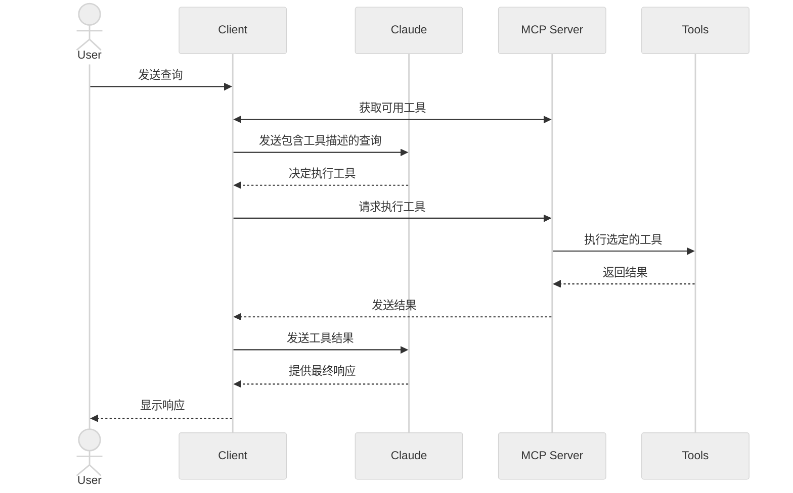

在本教程中，你将学习如何构建一个由 LLM 驱动的聊天机器人客户端，用于连接 MCP 服务器。

在你开始之前，建议先完成我们的 [构建一个 MCP 服务器](/docs/develop/build-server) 教程，这样你就能理解客户端和服务器是如何通信的。

<Tabs>
<Tab title="Python">

[你可以在这里找到本教程的完整代码。](https://github.com/modelcontextprotocol/quickstart-resources/tree/main/mcp-client-python)

## 系统要求

开始之前，请确保你的系统满足以下要求：

- Mac 或 Windows 电脑
- 已安装最新版本的 Python
- 已安装最新版本的 `uv`

## 配置你的环境

首先，使用 `uv` 创建一个新的 Python 项目：

<CodeGroup>

```bash macOS/Linux
# 创建项目目录
uv init mcp-client
cd mcp-client

# 创建虚拟环境
uv venv

# 激活虚拟环境
source .venv/bin/activate

# 安装所需包
uv add mcp anthropic python-dotenv

# 删除样板文件
rm main.py

# 创建我们的主文件
touch client.py
```

```powershell Windows
# 创建项目目录
uv init mcp-client
cd mcp-client

# 创建虚拟环境
uv venv

# 激活虚拟环境
.venv\Scripts\activate

# 安装所需包
uv add mcp anthropic python-dotenv

# 删除样板文件
del main.py

# 创建我们的主文件
new-item client.py
```

</CodeGroup>

## 配置你的 API 密钥

你需要从 [Anthropic 控制台](https://console.anthropic.com/settings/keys) 获取一个 Anthropic API 密钥。

创建一个 `.env` 文件来保存它：

```bash
echo "ANTHROPIC_API_KEY=your-api-key-goes-here" > .env
```

把 `.env` 添加到你的 `.gitignore`：

```bash
echo ".env" >> .gitignore
```

<Warning>

请确保妥善保管你的 `ANTHROPIC_API_KEY`！

</Warning>

## 创建客户端

### 基本客户端结构

首先，来设置我们的导入并创建基本的客户端类：

```python
import asyncio
from typing import Optional
from contextlib import AsyncExitStack

from mcp import ClientSession, StdioServerParameters
from mcp.client.stdio import stdio_client

from anthropic import Anthropic
from dotenv import load_dotenv

load_dotenv()  # 从 .env 加载环境变量

class MCPClient:
    def __init__(self):
        # 初始化会话和客户端对象
        self.session: Optional[ClientSession] = None
        self.exit_stack = AsyncExitStack()
        self.anthropic = Anthropic()
    # 方法将在这里添加
```

### 服务器连接管理

接下来，我们实现连接到 MCP 服务器的方法：

```python
async def connect_to_server(self, server_script_path: str):
    """连接到一个 MCP 服务器

    参数:
        server_script_path: 服务器脚本的路径（.py 或 .js）
    """
    is_python = server_script_path.endswith('.py')
    is_js = server_script_path.endswith('.js')
    if not (is_python or is_js):
        raise ValueError("服务器脚本必须是 .py 或 .js 文件")

    command = "python" if is_python else "node"
    server_params = StdioServerParameters(
        command=command,
        args=[server_script_path],
        env=None
    )

    stdio_transport = await self.exit_stack.enter_async_context(stdio_client(server_params))
    self.stdio, self.write = stdio_transport
    self.session = await self.exit_stack.enter_async_context(ClientSession(self.stdio, self.write))

    await self.session.initialize()

    # 列出可用工具
    response = await self.session.list_tools()
    tools = response.tools
    print("\nConnected to server with tools:", [tool.name for tool in tools])
```

### 查询处理逻辑

现在我们为处理查询并处理工具调用添加核心功能：

```python
async def process_query(self, query: str) -> str:
    """使用 Claude 和可用工具处理查询"""
    messages = [
        {
            "role": "user",
            "content": query
        }
    ]

    response = await self.session.list_tools()
    available_tools = [{
        "name": tool.name,
        "description": tool.description,
        "input_schema": tool.inputSchema
    } for tool in response.tools]

    # 初始 Claude API 调用
    response = self.anthropic.messages.create(
        model="claude-sonnet-4-20250514",
        max_tokens=1000,
        messages=messages,
        tools=available_tools
    )

    # 处理响应并处理工具调用
    final_text = []

    assistant_message_content = []
    for content in response.content:
        if content.type == 'text':
            final_text.append(content.text)
            assistant_message_content.append(content)
        elif content.type == 'tool_use':
            tool_name = content.name
            tool_args = content.input

            # 执行工具调用
            result = await self.session.call_tool(tool_name, tool_args)
            final_text.append(f"[使用工具 {tool_name}，参数为 {tool_args}]")

            assistant_message_content.append(content)
            messages.append({
                "role": "assistant",
                "content": assistant_message_content
            })
            messages.append({
                "role": "user",
                "content": [
                    {
                        "type": "tool_result",
                        "tool_use_id": content.id,
                        "content": result.content
                    }
                ]
            })

            # 从 Claude 获取下一条响应
            response = self.anthropic.messages.create(
                model="claude-sonnet-4-20250514",
                max_tokens=1000,
                messages=messages,
                tools=available_tools
            )

            final_text.append(response.content[0].text)

    return "\n".join(final_text)
```

### 交互式聊天界面

现在我们添加聊天循环和清理功能：

```python
async def chat_loop(self):
    """运行一个交互式聊天循环"""
    print("\nMCP Client Started!")
    print("Type your queries or 'quit' to exit.")

    while True:
        try:
            query = input("\nQuery: ").strip()

            if query.lower() == 'quit':
                break

            response = await self.process_query(query)
            print("\n" + response)

        except Exception as e:
            print(f"\nError: {str(e)}")

async def cleanup(self):
    """清理资源"""
    await self.exit_stack.aclose()
```

### 主入口

最后，我们添加主执行逻辑：

```python
async def main():
    if len(sys.argv) < 2:
        print("Usage: python client.py <path_to_server_script>")
        sys.exit(1)

    client = MCPClient()
    try:
        await client.connect_to_server(sys.argv[1])
        await client.chat_loop()
    finally:
        await client.cleanup()

if __name__ == "__main__":
    import sys
    asyncio.run(main())
```

你可以在这里找到完整的 `client.py` 文件：[这里](https://github.com/modelcontextprotocol/quickstart-resources/blob/main/mcp-client-python/client.py)。

## 关键组件解释

### 1. 客户端初始化

- `MCPClient` 类使用会话管理和 API 客户端进行初始化
- 使用 `AsyncExitStack` 以正确管理资源
- 配置 Anthropic 客户端以与 Claude 进行交互

### 2. 服务器连接

- 支持 Python 和 Node.js 服务器
- 验证服务器脚本类型
- 设置正确的通信通道
- 初始化会话并列出可用工具

### 3. 查询处理

- 保持对话上下文
- 处理 Claude 的响应和工具调用
- 管理 Claude 与工具之间的消息流
- 将结果组合成连贯的响应

### 4. 交互界面

- 提供简单的命令行界面
- 处理用户输入并展示响应
- 包含基本的错误处理
- 支持正常退出

### 5. 资源管理

- 正确清理资源
- 错误处理连接问题
- 优雅的关停流程

## 常见的自定义点

1. **工具处理**
   - 修改 `process_query()` 以处理特定工具类型
   - 添加针对工具调用的自定义错误处理
   - 实现工具特定的响应格式化

2. **响应处理**
   - 自定义工具结果的格式
   - 添加响应过滤或转换
   - 实现自定义日志记录

3. **用户界面**
   - 添加 GUI 或 Web 界面
   - 实现更丰富的控制台输出
   - 添加命令历史或自动补全

## 运行客户端

要使用任意 MCP 服务器运行你的客户端：

```bash
uv run client.py path/to/server.py # python server
uv run client.py path/to/build/index.js # node server
```

<Note>

如果你正在从 [服务器 quickstart 的天气教程](https://github.com/modelcontextprotocol/quickstart-resources/tree/main/weather-server-python)继续，那么你的命令可能类似这样：`python client.py .../quickstart-resources/weather-server-python/weather.py`

</Note>

客户端将会：

1. 连接到指定服务器
2. 列出可用工具
3. 启动一个交互式聊天会话，你可以：
   - 输入查询
   - 查看工具执行过程
   - 从 Claude 获取响应

下面是一个连接到服务器 quickstart 中天气服务器时的示例效果：

<Frame>
  
</Frame>

## 工作原理

当你提交一个查询时：

1. 客户端从服务器获取可用工具列表
2. 你的查询会与工具描述一起发送给 Claude
3. Claude 决定是否（以及使用哪些）工具
4. 客户端通过服务器执行任何被请求的工具调用
5. 将结果发送回 Claude
6. Claude 生成自然语言响应
7. 响应会显示给你

## 最佳实践

1. **错误处理**
   - 始终将工具调用放入 try-catch 块中
   - 提供有意义的错误信息
   - 优雅地处理连接问题

2. **资源管理**
   - 使用 `AsyncExitStack` 进行正确清理
   - 在完成后关闭连接
   - 处理服务器断开连接

3. **安全**
   - 将 API 密钥安全地存储在 `.env` 中
   - 验证服务器响应
   - 谨慎对待工具权限

4. **工具名称**
   - 工具名称可以根据此处指定的格式进行验证：[/specification/draft/server/tools#tool-names](/specification/draft/server/tools#tool-names)
   - 如果工具名称符合指定格式，则不应当被 MCP 客户端验证失败

## 故障排查

### 服务器路径问题

- 再次确认你的服务器脚本路径是否正确
- 如果相对路径不起作用，请使用绝对路径
- 对于 Windows 用户，请确保在路径中使用正斜杠（/）或转义的反斜杠（\\）
- 验证服务器文件的扩展名是否正确（Python 为 .py，Node.js 为 .js）

示例：正确的路径用法：

```bash
# 相对路径
uv run client.py ./server/weather.py

# 绝对路径
uv run client.py /Users/username/projects/mcp-server/weather.py

# Windows 路径（两种格式都可以）
uv run client.py C:/projects/mcp-server/weather.py
uv run client.py C:\\projects\\mcp-server\\weather.py
```

### 响应时间

- 首次响应可能需要最多 30 秒才能返回
- 这很正常，发生在以下过程中：
  - 服务器正在初始化
  - Claude 正在处理查询
  - 工具正在执行
- 后续响应通常更快
- 在这段初始等待期间不要打断流程

### 常见错误信息

如果你看到：

- `FileNotFoundError`：检查你的服务器路径
- `Connection refused`：确保服务器正在运行，并且路径正确
- `Tool execution failed`：验证工具所需的环境变量是否已设置
- `Timeout error`：考虑在客户端配置中增加超时时间

</Tab>

<Tab title="TypeScript">

[你可以在这里找到本教程的完整代码。](https://github.com/modelcontextprotocol/quickstart-resources/tree/main/mcp-client-typescript)

## 系统要求

开始之前，请确保你的系统满足以下要求：

- Mac 或 Windows 电脑
- 已安装 Node.js 17 或更高版本
- 已安装最新版本的 `npm`
- Anthropic API 密钥（Claude）

## 配置你的环境

首先，让我们创建并配置项目：

<CodeGroup>

```bash macOS/Linux
# 创建项目目录
mkdir mcp-client-typescript
cd mcp-client-typescript

# 初始化 npm 项目
npm init -y

# 安装依赖
npm install @anthropic-ai/sdk @modelcontextprotocol/sdk dotenv

# 安装开发依赖
npm install -D @types/node typescript

# 创建源文件
touch index.ts
```

```powershell Windows
# 创建项目目录
md mcp-client-typescript
cd mcp-client-typescript

# 初始化 npm 项目
npm init -y

# 安装依赖
npm install @anthropic-ai/sdk @modelcontextprotocol/sdk dotenv

# 安装开发依赖
npm install -D @types/node typescript

# 创建源文件
new-item index.ts
```

</CodeGroup>

将 `package.json` 更新为设置 `type: "module"` 以及构建脚本：

```json package.json
{
  "type": "module",
  "scripts": {
    "build": "tsc && chmod 755 build/index.js"
  }
}
```

在项目根目录创建一个 `tsconfig.json`：

```json tsconfig.json
{
  "compilerOptions": {
    "target": "ES2022",
    "module": "Node16",
    "moduleResolution": "Node16",
    "outDir": "./build",
    "rootDir": "./",
    "strict": true,
    "esModuleInterop": true,
    "skipLibCheck": true,
    "forceConsistentCasingInFileNames": true
  },
  "include": ["index.ts"],
  "exclude": ["node_modules"]
}
```

## 配置你的 API 密钥

你需要从 [Anthropic 控制台](https://console.anthropic.com/settings/keys) 获取一个 Anthropic API 密钥。

创建一个 `.env` 文件来保存它：

```bash
echo "ANTHROPIC_API_KEY=<your key here>" > .env
```

把 `.env` 添加到你的 `.gitignore`：

```bash
echo ".env" >> .gitignore
```

<Warning>

请确保妥善保管你的 `ANTHROPIC_API_KEY`！

</Warning>

## 创建客户端

### 基本客户端结构

首先，来设置我们的导入，并在 `index.ts` 中创建基本的客户端类：

```typescript
import { Anthropic } from "@anthropic-ai/sdk";
import {
  MessageParam,
  Tool,
} from "@anthropic-ai/sdk/resources/messages/messages.mjs";
import { Client } from "@modelcontextprotocol/sdk/client/index.js";
import { StdioClientTransport } from "@modelcontextprotocol/sdk/client/stdio.js";
import readline from "readline/promises";
import dotenv from "dotenv";

dotenv.config();

const ANTHROPIC_API_KEY = process.env.ANTHROPIC_API_KEY;
if (!ANTHROPIC_API_KEY) {
  throw new Error("ANTHROPIC_API_KEY is not set");
}

class MCPClient {
  private mcp: Client;
  private anthropic: Anthropic;
  private transport: StdioClientTransport | null = null;
  private tools: Tool[] = [];

  constructor() {
    this.anthropic = new Anthropic({
      apiKey: ANTHROPIC_API_KEY,
    });
    this.mcp = new Client({ name: "mcp-client-cli", version: "1.0.0" });
  }
  // methods will go here
}
```

### 服务器连接管理

接下来，我们实现连接到 MCP 服务器的方法：

```typescript
async connectToServer(serverScriptPath: string) {
  try {
    const isJs = serverScriptPath.endsWith(".js");
    const isPy = serverScriptPath.endsWith(".py");
    if (!isJs && !isPy) {
      throw new Error("Server script must be a .js or .py file");
    }
    const command = isPy
      ? process.platform === "win32"
        ? "python"
        : "python3"
      : process.execPath;

    this.transport = new StdioClientTransport({
      command,
      args: [serverScriptPath],
    });
    await this.mcp.connect(this.transport);

    const toolsResult = await this.mcp.listTools();
    this.tools = toolsResult.tools.map((tool) => {
      return {
        name: tool.name,
        description: tool.description,
        input_schema: tool.inputSchema,
      };
    });
    console.log(
      "Connected to server with tools:",
      this.tools.map(({ name }) => name)
    );
  } catch (e) {
    console.log("Failed to connect to MCP server: ", e);
    throw e;
  }
}
```

### 查询处理逻辑

现在我们为处理查询并处理工具调用添加核心功能：

```typescript
async processQuery(query: string) {
  const messages: MessageParam[] = [
    {
      role: "user",
      content: query,
    },
  ];

  const response = await this.anthropic.messages.create({
    model: "claude-sonnet-4-20250514",
    max_tokens: 1000,
    messages,
    tools: this.tools,
  });

  const finalText = [];

  for (const content of response.content) {
    if (content.type === "text") {
      finalText.push(content.text);
    } else if (content.type === "tool_use") {
      const toolName = content.name;
      const toolArgs = content.input as { [x: string]: unknown } | undefined;

      const result = await this.mcp.callTool({
        name: toolName,
        arguments: toolArgs,
      });
      finalText.push(
        `[Calling tool ${toolName} with args ${JSON.stringify(toolArgs)}]`
      );

      messages.push({
        role: "user",
        content: result.content as string,
      });

      const response = await this.anthropic.messages.create({
        model: "claude-sonnet-4-20250514",
        max_tokens: 1000,
        messages,
      });

      finalText.push(
        response.content[0].type === "text" ? response.content[0].text : ""
      );
    }
  }

  return finalText.join("\n");
}
```

### 交互式聊天界面

现在我们添加聊天循环和清理功能：

```typescript
async chatLoop() {
  const rl = readline.createInterface({
    input: process.stdin,
    output: process.stdout,
  });

  try {
    console.log("\nMCP Client Started!");
    console.log("Type your queries or 'quit' to exit.");

    while (true) {
      const message = await rl.question("\nQuery: ");
      if (message.toLowerCase() === "quit") {
        break;
      }
      const response = await this.processQuery(message);
      console.log("\n" + response);
    }
  } finally {
    rl.close();
  }
}

async cleanup() {
  await this.mcp.close();
}
```

### 主入口

最后，我们添加主执行逻辑：

```typescript
async function main() {
  if (process.argv.length < 3) {
    console.log("Usage: node index.ts <path_to_server_script>");
    return;
  }
  const mcpClient = new MCPClient();
  try {
    await mcpClient.connectToServer(process.argv[2]);
    await mcpClient.chatLoop();
  } catch (e) {
    console.error("Error:", e);
    await mcpClient.cleanup();
    process.exit(1);
  } finally {
    await mcpClient.cleanup();
    process.exit(0);
  }
}

main();
```

## 运行客户端

要使用任意 MCP 服务器运行你的客户端：

```bash
# 构建 TypeScript
npm run build

# 运行客户端
node build/index.js path/to/server.py # python server
node build/index.js path/to/build/index.js # node server
```

<Note>

如果你正在从 [服务器 quickstart 的天气教程](https://github.com/modelcontextprotocol/quickstart-resources/tree/main/weather-server-typescript)继续，那么你的命令可能类似这样：`node build/index.js .../quickstart-resources/weather-server-typescript/build/index.js`

</Note>

**客户端将会：**

1. 连接到指定的服务器
2. 列出可用的工具
3. 启动一个交互式聊天会话，你可以：
   - 输入查询
   - 查看工具执行过程
   - 从 Claude 获取响应

## 工作原理

当你提交一个查询：

1. 客户端从服务器获取可用工具列表
2. 你的查询会与工具描述一起发送给 Claude
3. Claude 决定是否（以及使用哪些）工具
4. 客户端通过服务器执行任何被请求的工具调用
5. 将结果发送回 Claude
6. Claude 生成自然语言响应
7. 响应会显示给你

## 最佳实践

1. **错误处理**
   - 使用 TypeScript 的类型系统以更好地进行错误检测
   - 将工具调用放入 try-catch 块中
   - 提供有意义的错误信息
   - 优雅地处理连接问题

2. **安全**
   - 将 API 密钥安全地存储在 `.env` 中
   - 验证服务器响应
   - 谨慎对待工具权限

## 故障排查

### 服务器路径问题

- 再次确认你的服务器脚本路径是否正确
- 如果相对路径不起作用，请使用绝对路径
- 对于 Windows 用户，请确保在路径中使用正斜杠（/）或转义的反斜杠（\\）
- 验证服务器文件扩展名是否正确（Node.js 为 .js 或 Python 为 .py）

示例：正确的路径用法：

```bash
# 相对路径
node build/index.js ./server/build/index.js

# 绝对路径
node build/index.js /Users/username/projects/mcp-server/build/index.js

# Windows 路径（两种格式都可以）
node build/index.js C:/projects/mcp-server/build/index.js
node build/index.js C:\\projects\\mcp-server\\build\\index.js
```

### 响应时间

- 首次响应可能需要最多 30 秒才能返回
- 这很正常，发生在以下过程中：
  - 服务器正在初始化
  - Claude 正在处理查询
  - 工具正在执行
- 后续响应通常更快
- 在这段初始等待期间不要打断流程

### 常见错误信息

如果你看到：

- `Error: Cannot find module`：检查你的构建文件夹，并确保 TypeScript 编译成功
- `Connection refused`：确保服务器正在运行，并且路径正确
- `Tool execution failed`：验证工具所需的环境变量是否已设置
- `ANTHROPIC_API_KEY is not set`：检查你的 `.env` 文件和环境变量
- `TypeError`：确保你为工具参数使用了正确的类型
- `BadRequestError`：确保你有足够的额度来访问 Anthropic API

</Tab>

<Tab title="Java">

<Note>

这是基于 Spring AI 的 MCP 自动配置与 boot starters 的快速入门示例。
要了解如何手动创建同步与异步的 MCP Client，请查阅 [Java SDK Client](https://java.sdk.modelcontextprotocol.io/) 文档

</Note>

该示例演示如何构建一个交互式聊天机器人，将 Spring AI 的模型上下文协议（MCP）与 [Brave Search MCP Server](https://github.com/modelcontextprotocol/servers-archived/tree/main/src/brave-search) 结合起来。该应用创建一个由 Anthropic 的 Claude AI 模型驱动的对话界面，能够通过 Brave Search 执行互联网搜索，从而使用实时的网页数据进行自然语言交互。
[你可以在这里找到本教程的完整代码。](https://github.com/spring-projects/spring-ai-examples/tree/main/model-context-protocol/web-search/brave-chatbot)

## 系统要求

开始之前，请确保你的系统满足以下要求：

- Java 17 或更高版本
- Maven 3.6+
- npx 包管理器
- Anthropic API 密钥（Claude）
- Brave Search API 密钥

## 配置你的环境

1. 安装 npx（Node Package eXecute）：
   首先，确保安装了 [npm](https://docs.npmjs.com/downloading-and-installing-node-js-and-npm)，然后运行：

   ```bash
   npm install -g npx
   ```

2. 克隆仓库：

   ```bash
   git clone https://github.com/spring-projects/spring-ai-examples.git
   cd model-context-protocol/web-search/brave-chatbot
   ```

3. 配置你的 API 密钥：

   ```bash
   export ANTHROPIC_API_KEY='your-anthropic-api-key-here'
   export BRAVE_API_KEY='your-brave-api-key-here'
   ```

4. 构建应用：

   ```bash
   ./mvnw clean install
   ```

5. 使用 Maven 运行应用：
   ```bash
   ./mvnw spring-boot:run
   ```

<Warning>

请确保妥善保管你的 `ANTHROPIC_API_KEY` 和 `BRAVE_API_KEY`！

</Warning>

## 工作原理

该应用通过多个组件将 Spring AI 与 Brave Search MCP 服务器集成起来：

### MCP 客户端配置

1. pom.xml 中需要的依赖：

```xml
<dependency>
    <groupId>org.springframework.ai</groupId>
    <artifactId>spring-ai-starter-mcp-client</artifactId>
</dependency>
<dependency>
    <groupId>org.springframework.ai</groupId>
    <artifactId>spring-ai-starter-model-anthropic</artifactId>
</dependency>
```

2. 应用配置（application.yml）：

```yml
spring:
  ai:
    mcp:
      client:
        enabled: true
        name: brave-search-client
        version: 1.0.0
        type: SYNC
        request-timeout: 20s
        stdio:
          root-change-notification: true
          servers-configuration: classpath:/mcp-servers-config.json
        toolcallback:
          enabled: true
    anthropic:
      api-key: ${ANTHROPIC_API_KEY}
```

这将启用 `spring-ai-starter-mcp-client`，根据提供的服务器配置创建一个或多个 `McpClient`。
`spring.ai.mcp.client.toolcallback.enabled=true` 属性启用了工具回调机制，它会自动把所有 MCP 工具注册为 spring ai 工具。
默认情况下是关闭的。

3. MCP 服务器配置（`mcp-servers-config.json`）：

```json
{
  "mcpServers": {
    "brave-search": {
      "command": "npx",
      "args": ["-y", "@modelcontextprotocol/server-brave-search"],
      "env": {
        "BRAVE_API_KEY": "<PUT YOUR BRAVE API KEY>"
      }
    }
  }
}
```

### 聊天实现

聊天机器人使用带 MCP 工具集成的 Spring AI 的 ChatClient 来实现：

```java
var chatClient = chatClientBuilder
    .defaultSystem("You are useful assistant, expert in AI and Java.")
    .defaultToolCallbacks((Object[]) mcpToolAdapter.toolCallbacks())
    .defaultAdvisors(new MessageChatMemoryAdvisor(new InMemoryChatMemory()))
    .build();
```

主要特性：

- 使用 Claude AI 模型进行自然语言理解
- 通过 MCP 集成 Brave Search，实现实时网页搜索能力
- 使用 InMemoryChatMemory 保持对话记忆
- 作为交互式命令行应用运行

### 构建并运行

```bash
./mvnw clean install
java -jar ./target/ai-mcp-brave-chatbot-0.0.1-SNAPSHOT.jar
```

或

```bash
./mvnw spring-boot:run
```

应用启动后会进入交互式聊天会话，你可以提出问题。需要从互联网查找信息时，聊天机器人会使用 Brave Search 来回答你的查询。

聊天机器人可以：

- 使用其内置知识回答问题
- 需要时使用 Brave Search 执行网页搜索
- 记住对话中先前消息的上下文
- 汇总来自多个来源的信息，提供更全面的答案

### 高级配置

MCP 客户端支持更多额外的配置选项：

- 通过 `McpSyncClientCustomizer` 或 `McpAsyncClientCustomizer` 进行客户端自定义
- 多个客户端与多种传输类型：`STDIO` 和 `SSE`（Server-Sent Events，服务器发送事件）
- 与 Spring AI 的工具执行框架集成
- 自动客户端初始化与生命周期管理

对于 WebFlux 风格的应用，你可以改用 WebFlux starter：

```xml
<dependency>
    <groupId>org.springframework.ai</groupId>
    <artifactId>spring-ai-mcp-client-webflux-spring-boot-starter</artifactId>
</dependency>
```

这提供类似的功能，但使用基于 WebFlux 的 SSE 传输实现，推荐用于生产部署。

</Tab>

<Tab title="Kotlin">

[你可以在这里找到本教程的完整代码。](https://github.com/modelcontextprotocol/kotlin-sdk/tree/main/samples/kotlin-mcp-client)

## 系统要求

开始之前，请确保你的系统满足以下要求：

- JDK 11 或更高版本
- Anthropic API 密钥（Claude）

## 配置你的环境

首先，如果你还没有安装 `java` 和 `gradle`，请先安装它们。
你可以从[官方 Oracle JDK 网站](https://www.oracle.com/java/technologies/downloads/)下载 `java`。
验证你的 `java` 安装：

```bash
java --version
```

现在，让我们创建并设置你的项目：

<CodeGroup>

```bash macOS/Linux
# 为项目创建一个新目录
mkdir kotlin-mcp-client
cd kotlin-mcp-client

# 初始化一个新的 kotlin 项目
gradle init
```

```powershell Windows
# 为项目创建一个新目录
md kotlin-mcp-client
cd kotlin-mcp-client
# 初始化一个新的 kotlin 项目
gradle init
```

</CodeGroup>

运行 `gradle init` 后，选择 **Application** 作为项目类型，选择 **Kotlin** 作为编程语言。

或者，你也可以使用 [IntelliJ IDEA 项目向导](https://kotlinlang.org/docs/jvm-get-started.html)创建 Kotlin 应用。

创建项目后，将你 `build.gradle.kts` 的内容替换为：

```kotlin build.gradle.kts
// 检查最新版本：https://github.com/modelcontextprotocol/kotlin-sdk/releases
val mcpVersion = "0.9.0"
val ktorVersion = "3.2.3"
val anthropicVersion = "2.15.0"
val slf4jVersion = "2.0.17"

plugins {
    kotlin("jvm") version "2.3.20"
    id("com.gradleup.shadow") version "8.3.9"
    application
}

application {
    mainClass.set("MainKt")
}

dependencies {
    implementation("io.modelcontextprotocol:kotlin-sdk:$mcpVersion")
    implementation("io.ktor:ktor-client-cio:$ktorVersion")
    implementation("com.anthropic:anthropic-java:$anthropicVersion")
    implementation("org.slf4j:slf4j-simple:$slf4jVersion")
}
```

验证所有配置是否正确：

```bash
./gradlew build
```

## 配置你的 API 密钥

你需要从 [Anthropic 控制台](https://console.anthropic.com/settings/keys) 获取一个 Anthropic API 密钥。

设置你的 API 密钥：

```bash
export ANTHROPIC_API_KEY='your-anthropic-api-key-here'
```

<Warning>

请确保妥善保管你的 `ANTHROPIC_API_KEY`！

</Warning>

## 创建客户端

### 基本客户端结构

首先，创建基本的客户端类：

```kotlin
class MCPClient(apiKey: String) : AutoCloseable {
    private val anthropic = AnthropicOkHttpClient.builder()
        .apiKey(apiKey)
        .build()

  private val mcp: Client = Client(
        clientInfo = Implementation(name = "mcp-client-cli", version = "1.0.0")
  )
    private var serverProcess: Process? = null
    private lateinit var tools: List<ToolUnion>

    // 方法将在这里添加

    override fun close() {
        runBlocking {
            mcp.close()
        }
        serverProcess?.destroy()
        anthropic.close()
    }
}
```

### 服务器连接管理

接下来，我们实现连接到 MCP 服务器的方法：

```kotlin
suspend fun connectToServer(serverScriptPath: String) {
    val command = buildList {
        when (serverScriptPath.substringAfterLast(".")) {
            "js" -> add("node")
            "py" -> add(if (System.getProperty("os.name").lowercase().contains("win")) "python" else "python3")
            "jar" -> addAll(listOf("java", "-jar"))
            else -> throw IllegalArgumentException("Server script must be a .js, .py or .jar file")
        }
        add(serverScriptPath)
    }

    val process = ProcessBuilder(command).start()
    serverProcess = process

    val transport = StdioClientTransport(
        input = process.inputStream.asSource().buffered(),
        output = process.outputStream.asSink().buffered(),
    )

    mcp.connect(transport)

    val toolsResult = mcp.listTools()
    tools = toolsResult.tools.map { tool ->
        ToolUnion.ofTool(
            Tool.builder()
                .name(tool.name)
                .description(tool.description ?: "")
                .inputSchema(
                    Tool.InputSchema.builder()
                        .type(JsonValue.from(tool.inputSchema.type))
                        .properties(tool.inputSchema.properties?.toJsonValue() ?: EmptyJsonObject.toJsonValue())
                        .putAdditionalProperty("required", JsonValue.from(tool.inputSchema.required))
                        .build(),
                )
                .build(),
        )
    }
    println("Connected to server with tools: ${tools.joinToString(", ") { it.tool().get().name() }}")
}
```

<Accordion title="JsonObject.toJsonValue() helper">

该辅助方法使用 Jackson，将 kotlinx.serialization 的 `JsonObject` 转换为 Anthropic SDK 的 `JsonValue`：

```kotlin
private fun JsonObject.toJsonValue(): JsonValue {
    val mapper = ObjectMapper()
    val node = mapper.readTree(this.toString())
    return JsonValue.fromJsonNode(node)
}
```

</Accordion>

### 查询处理逻辑

现在我们为处理查询并处理工具调用添加核心功能：

```kotlin
suspend fun processQuery(query: String): String {
    val messages = mutableListOf(
        MessageParam.builder()
            .role(MessageParam.Role.USER)
            .content(query)
            .build(),
    )

    val response = anthropic.messages().create(
        MessageCreateParams.builder()
            .model("claude-sonnet-4-20250514")
            .maxTokens(1024)
            .messages(messages)
            .tools(tools)
            .build(),
    )

    val finalText = mutableListOf<String>()
    response.content().forEach { content ->
        when {
            content.isText() -> finalText.add(content.text().get().text())

            content.isToolUse() -> {
                val toolName = content.toolUse().get().name()
                val toolArgs =
                    content.toolUse().get()._input().convert(object : TypeReference<Map<String, JsonValue>>() {})

                val result = mcp.callTool(
                    name = toolName,
                    arguments = toolArgs ?: emptyMap(),
                )
                finalText.add("[使用工具 $toolName，参数为 $toolArgs]")

                messages.add(
                    MessageParam.builder()
                        .role(MessageParam.Role.USER)
                        .content(
                            result.content
                                .filterIsInstance<TextContent>()
                                .joinToString("\n") { it.text }
                        )
                        .build(),
                )

                val aiResponse = anthropic.messages().create(
                    MessageCreateParams.builder()
                        .model("claude-sonnet-4-20250514")
                        .maxTokens(1024)
                        .messages(messages)
                        .build(),
                )

                finalText.add(aiResponse.content().first().text().get().text())
            }
        }
    }

    return finalText.joinToString("\n")
}
```

### 交互式聊天

我们添加聊天循环：

```kotlin
suspend fun chatLoop() {
    println("\nMCP Client Started!")
    println("Type your queries or 'quit' to exit.")

    while (true) {
        print("\nQuery: ")
        val message = readlnOrNull() ?: break
        if (message.trim().lowercase() == "quit") break

        try {
            val response = processQuery(message)
            println("\n$response")
        } catch (e: Exception) {
            println("\nError: ${e.message}")
        }
    }
}
```

### 主入口

最后，我们添加主执行函数：

```kotlin
fun main(args: Array<String>) = runBlocking {
    require(args.isNotEmpty()) { "Usage: java -jar <path> <path_to_server_script>" }

    val apiKey = System.getenv("ANTHROPIC_API_KEY")
    require(!apiKey.isNullOrBlank()) { "ANTHROPIC_API_KEY environment variable is not set" }

    val client = MCPClient(apiKey)
    client.use {
        client.connectToServer(args.first())
        client.chatLoop()
    }
}
```

## 运行客户端

要使用任意 MCP 服务器运行你的客户端：

```bash
./gradlew build

# 运行客户端
java -jar build/libs/kotlin-mcp-client-0.1.0-all.jar path/to/server.jar # JVM server
java -jar build/libs/kotlin-mcp-client-0.1.0-all.jar path/to/server.py  # Python server
java -jar build/libs/kotlin-mcp-client-0.1.0-all.jar path/to/build/index.js # Node server
```

或者，你也可以直接使用 Gradle 运行：

```bash
./gradlew run --args="path/to/server.jar"
```

<Note>

如果你正在从服务器 quickstart 继续天气教程，那么你的命令可能类似这样：`java -jar build/libs/kotlin-mcp-client-0.1.0-all.jar .../samples/weather-stdio-server/build/libs/weather-stdio-server-0.1.0-all.jar`

</Note>

**客户端将会：**

1. 连接到指定的服务器
2. 列出可用工具
3. 启动一个交互式聊天会话，你可以：
   - 输入查询
   - 查看工具执行过程
   - 从 Claude 获取响应

## 工作原理

下面是一个高层工作流程示意图：



当你提交一个查询时：

1. 客户端从服务器获取可用工具列表
2. 你的查询会与工具描述一起发送给 Claude
3. Claude 决定是否（以及使用哪些）工具
4. 客户端通过服务器执行任何被请求的工具调用
5. 将结果发送回 Claude
6. Claude 生成自然语言响应
7. 响应会显示给你

## 最佳实践

1. **错误处理**
   - 利用 Kotlin 的类型系统将错误显式建模
   - 当外部工具与 API 调用可能抛出异常时，用 try-catch 包裹
   - 提供清晰且有意义的错误信息
   - 优雅地处理网络超时和连接问题

2. **安全**
   - 将 API 密钥与密钥安全地存储在 `local.properties`、环境变量或密钥管理器中
   - 校验所有外部响应，以避免使用到意外或不安全的数据
   - 使用工具时谨慎对待权限与信任边界

3. **环境**
   - 通过环境变量设置 `ANTHROPIC_API_KEY`，而不是写死在代码里
   - 使用 `.env` 文件，并为本地开发配置合适的 `.gitignore` 规则

## 故障排查

### 服务器路径问题

- 再次确认你的服务器脚本路径是否正确
- 如果相对路径不起作用，请使用绝对路径
- 对于 Windows 用户，请确保在路径中使用正斜杠（/）或转义的反斜杠（\\）
- 确保已安装所需运行时（Java 需要 java，Node.js 需要 npm，Python 需要 uv）
- 验证服务器文件扩展名是否正确（Java 为 .jar，Node.js 为 .js，Python 为 .py）

示例：正确的路径用法：

```bash
# 相对路径
java -jar build/libs/client.jar ./server/build/libs/server.jar

# 绝对路径
java -jar build/libs/client.jar /Users/username/projects/mcp-server/build/libs/server.jar

# Windows 路径（两种格式都可以）
java -jar build/libs/client.jar C:/projects/mcp-server/build/libs/server.jar
java -jar build/libs/client.jar C:\\projects\\mcp-server\\build\\libs\\server.jar
```

### 构建问题

- 使用 `./gradlew build` 或 `./gradlew shadowJar`（不要用 `./gradlew jar`）来创建包含所有依赖的 shadow JAR
- 如果你遇到 JDK 版本错误，请确保已安装的 JDK 版本与或高于 `build.gradle.kts` 中的 `jvmToolchain` 设置

### 响应时间

- 首次响应可能需要最多 30 秒才能返回
- 这很正常，发生在以下过程中：
  - 服务器正在初始化
  - Claude 正在处理查询
  - 工具正在执行
- 后续响应通常更快
- 在这段初始等待期间不要打断流程

### 常见错误信息

如果你看到：

- `Connection refused`：确保服务器正在运行，并且路径正确
- `Tool execution failed`：验证工具所需的环境变量是否已设置
- `ANTHROPIC_API_KEY is not set`：检查你的环境变量

</Tab>

<Tab title="C#">

[你可以在这里找到本教程的完整代码。](https://github.com/modelcontextprotocol/csharp-sdk/tree/main/samples/QuickstartClient)

## 系统要求

开始之前，请确保你的系统满足以下要求：

- .NET 8.0 或更高版本
- Anthropic API 密钥（Claude）
- Windows、Linux 或 macOS

## 配置你的环境

首先，创建一个新的 .NET 项目：

```bash
dotnet new console -n QuickstartClient
cd QuickstartClient
```

然后，将所需依赖添加到你的项目中：

```bash
dotnet add package ModelContextProtocol --prerelease
dotnet add package Anthropic.SDK
dotnet add package Microsoft.Extensions.Hosting
dotnet add package Microsoft.Extensions.AI
```

## 配置你的 API 密钥

你需要从 [Anthropic 控制台](https://console.anthropic.com/settings/keys) 获取一个 Anthropic API 密钥。

```bash
dotnet user-secrets init
dotnet user-secrets set "ANTHROPIC_API_KEY" "<your key here>"
```

## 创建客户端

### 基本客户端结构

首先，在 `Program.cs` 文件中设置基本的客户端类：

```csharp
using Anthropic.SDK;
using Microsoft.Extensions.AI;
using Microsoft.Extensions.Configuration;
using Microsoft.Extensions.Hosting;
using ModelContextProtocol.Client;
using ModelContextProtocol.Protocol.Transport;

var builder = Host.CreateApplicationBuilder(args);

builder.Configuration
    .AddEnvironmentVariables()
    .AddUserSecrets<Program>();
```

这会创建一个 .NET 控制台应用的基础框架，用于从用户密钥中读取 API 密钥。

接下来，我们来设置 MCP Client：

```csharp
var (command, arguments) = GetCommandAndArguments(args);

var clientTransport = new StdioClientTransport(new()
{
    Name = "Demo Server",
    Command = command,
    Arguments = arguments,
});

await using var mcpClient = await McpClient.CreateAsync(clientTransport);

var tools = await mcpClient.ListToolsAsync();
foreach (var tool in tools)
{
    Console.WriteLine($"Connected to server with tools: {tool.Name}");
}
```

把下面这个函数添加到 `Program.cs` 文件末尾：

```csharp
static (string command, string[] arguments) GetCommandAndArguments(string[] args)
{
    return args switch
    {
        [var script] when script.EndsWith(".py") => ("python", args),
        [var script] when script.EndsWith(".js") => ("node", args),
        [var script] when Directory.Exists(script) || (File.Exists(script) && script.EndsWith(".csproj")) => ("dotnet", ["run", "--project", script, "--no-build"]),
        _ => throw new NotSupportedException("An unsupported server script was provided. Supported scripts are .py, .js, or .csproj")
    };
}
```

这会创建一个 MCP 客户端，用命令行参数中提供的服务器作为连接目标。随后会从已连接的服务器中列出可用工具。

### 查询处理逻辑

现在我们为处理查询并处理工具调用添加核心功能：

```csharp
using var anthropicClient = new AnthropicClient(new APIAuthentication(builder.Configuration["ANTHROPIC_API_KEY"]))
    .Messages
    .AsBuilder()
    .UseFunctionInvocation()
    .Build();

var options = new ChatOptions
{
    MaxOutputTokens = 1000,
    ModelId = "claude-sonnet-4-20250514",
    Tools = [.. tools]
};

Console.ForegroundColor = ConsoleColor.Green;
Console.WriteLine("MCP Client Started!");
Console.ResetColor();

PromptForInput();
while(Console.ReadLine() is string query && !"exit".Equals(query, StringComparison.OrdinalIgnoreCase))
{
    if (string.IsNullOrWhiteSpace(query))
    {
        PromptForInput();
        continue;
    }

    await foreach (var message in anthropicClient.GetStreamingResponseAsync(query, options))
    {
        Console.Write(message);
    }
    Console.WriteLine();

    PromptForInput();
}

static void PromptForInput()
{
    Console.WriteLine("Enter a command (or 'exit' to quit):");
    Console.ForegroundColor = ConsoleColor.Cyan;
    Console.Write("> ");
    Console.ResetColor();
}
```

## 关键组件解释

### 1. 客户端初始化

- 使用 `McpClient.CreateAsync()` 初始化客户端，该方法会设置传输类型并指定用于启动服务器的命令。

### 2. 服务器连接

- 支持 Python、Node.js 和 .NET 服务器。
- 使用参数中指定的命令启动服务器。
- 配置为使用 stdio 与服务器通信。
- 初始化会话以及可用工具。

### 3. 查询处理

- 使用 [Microsoft.Extensions.AI](https://learn.microsoft.com/dotnet/ai/ai-extensions) 来构建聊天客户端。
- 配置 `IChatClient` 以使用自动工具（函数）调用。
- 客户端读取用户输入并发送到服务器。
- 服务器处理查询并返回响应。
- 将响应展示给用户。

## 运行客户端

要使用任意 MCP 服务器运行你的客户端：

```bash
dotnet run -- path/to/server.csproj # dotnet server
dotnet run -- path/to/server.py # python server
dotnet run -- path/to/server.js # node server
```

<Note>

如果你正在从服务器 quickstart 继续天气教程，那么你的命令可能类似这样：`dotnet run -- path/to/QuickstartWeatherServer`.

</Note>

客户端将会：

1. 连接到指定的服务器
2. 列出可用工具
3. 启动一个交互式聊天会话，你可以：
   - 输入查询
   - 查看工具执行过程
   - 从 Claude 获取响应
4. 完成后退出会话

下面是一个连接到天气服务器 quickstart 时的示例效果：

<Frame>
  
</Frame>

</Tab>

<Tab title="Ruby">

[你可以在这里找到本教程的完整代码。](https://github.com/modelcontextprotocol/quickstart-resources/tree/main/mcp-client-ruby)

## 系统要求

开始之前，请确保你的系统满足以下要求：

- Mac 或 Windows 电脑
- 已安装 Ruby 3.2.0 或更高版本（[Anthropic SDK](https://github.com/anthropics/anthropic-sdk-ruby) 需要）
- Anthropic API 密钥（Claude）

## 配置你的环境

首先，创建一个新的 Ruby 项目：

<CodeGroup>

```bash macOS/Linux
# 创建项目目录
mkdir mcp-client
cd mcp-client

# 创建 Gemfile
bundle init

# 添加所需依赖
bundle add anthropic base64 dotenv mcp

# 创建我们的主文件
touch client.rb
```

```powershell Windows
# 创建项目目录
mkdir mcp-client
cd mcp-client

# 创建 Gemfile
bundle init

# 添加所需依赖
bundle add anthropic base64 dotenv mcp

# 创建我们的主文件
new-item client.rb
```

</CodeGroup>

## 配置你的 API 密钥

你需要从 [Anthropic 控制台](https://console.anthropic.com/settings/keys) 获取一个 Anthropic API 密钥。

创建一个 `.env` 文件来保存它：

```bash
echo "ANTHROPIC_API_KEY=your-api-key-goes-here" > .env
```

把 `.env` 添加到你的 `.gitignore`：

```bash
echo ".env" >> .gitignore
```

<Warning>

请确保妥善保管你的 `ANTHROPIC_API_KEY`！

</Warning>

## 创建客户端

### 基本客户端结构

首先，设置我们的 requires，并创建基本的客户端类：

```ruby
require "anthropic"
require "dotenv/load"
require "json"
require "mcp"

class MCPClient
  ANTHROPIC_MODEL = "claude-sonnet-4-20250514"

  def initialize
    @mcp_client = nil
    @transport = nil
    @anthropic_client = nil
  end

  # 方法将在这里添加
end
```

### 服务器连接管理

接下来，我们实现连接到 MCP 服务器的方法：

```ruby
def connect_to_server(server_script_path)
  command = case File.extname(server_script_path)
  when ".rb"
    "ruby"
  when ".py"
    "python3"
  when ".js"
    "node"
  else
    raise ArgumentError, "Server script must be a .rb, .py, or .js file."
  end

  @transport = MCP::Client::Stdio.new(command: command, args: [server_script_path])
  @mcp_client = MCP::Client.new(transport: @transport)
  @mcp_client.connect

  tool_names = @mcp_client.tools.map(&:name)
  puts "\nConnected to server with tools: #{tool_names}"
end
```

### 查询处理逻辑

现在我们为处理查询并处理工具调用添加核心功能：

```ruby
private

def process_query(query)
  messages = [{ role: "user", content: query }]

  available_tools = @mcp_client.tools.map do |tool|
    { name: tool.name, description: tool.description, input_schema: tool.input_schema }
  end

  # 初始 Claude API 调用。
  response = chat(messages, tools: available_tools)

  # 处理响应并处理工具调用。
  if response.content.any?(Anthropic::Models::ToolUseBlock)
    assistant_content = response.content.filter_map do |content_block|
      case content_block
      when Anthropic::Models::TextBlock
        { type: "text", text: content_block.text }
      when Anthropic::Models::ToolUseBlock
        { type: "tool_use", id: content_block.id, name: content_block.name, input: content_block.input }
      end
    end
    messages << { role: "assistant", content: assistant_content }
  end

  response.content.each_with_object([]) do |content, response_parts|
    case content
    when Anthropic::Models::TextBlock
      response_parts << content.text
    when Anthropic::Models::ToolUseBlock
      # 通过 MCP 执行工具调用。
      result = @mcp_client.call_tool(name: content.name, arguments: content.input)
      response_parts << "[使用工具 #{content.name}，参数为 #{content.input.to_json}]"

      tool_result_content = result.dig("result", "content")
      result_text = if tool_result_content.is_a?(Array)
        tool_result_content.filter_map { |content_item| content_item["text"] }.join("\n")
      else
        tool_result_content.to_s
      end

      messages << {
        role: "user",
        content: [{
          type: "tool_result",
          tool_use_id: content.id,
          content: result_text
        }]
      }

      # 从 Claude 获取下一条响应。
      response = chat(messages)

      response.content.each do |content_block|
        response_parts << content_block.text if content_block.is_a?(Anthropic::Models::TextBlock)
      end
    end
  end.join("\n")
end

def chat(messages, tools: nil)
  params = { model: ANTHROPIC_MODEL, max_tokens: 1000, messages: messages }
  params[:tools] = tools if tools

  anthropic_client.messages.create(**params)
end

def anthropic_client
  @anthropic_client ||= Anthropic::Client.new(api_key: ENV["ANTHROPIC_API_KEY"])
end
```

### 交互式聊天界面

现在我们添加聊天循环和清理功能：

```ruby
def chat_loop
  puts <<~MESSAGE
    MCP Client Started!
    Type your queries or 'quit' to exit.
  MESSAGE

  loop do
    print "\nQuery: "
    line = $stdin.gets
    break if line.nil?

    query = line.chomp.strip
    break if query.downcase == "quit"
    next if query.empty?

    begin
      response = process_query(query)
      puts "\n#{response}"
    rescue => e
      puts "\nError: #{e.message}"
    end
  end
end

def cleanup
  @transport&.close
end
```

### 主入口

最后，我们添加主执行逻辑：

```ruby
if ARGV.empty?
  puts "Usage: ruby client.rb <path_to_server_script>"
  exit 1
end

client = MCPClient.new

begin
  client.connect_to_server(ARGV[0])

  api_key = ENV["ANTHROPIC_API_KEY"]
  if api_key.nil? || api_key.empty?
    puts <<~MESSAGE
      No ANTHROPIC_API_KEY found. To query these tools with Claude, set your API key:
        export ANTHROPIC_API_KEY=your-api-key-here
    MESSAGE
    exit
  end

  client.chat_loop
rescue => e
  puts "Error: #{e.message}"
  exit 1
ensure
  client.cleanup
end
```

你可以在这里找到完整的 `client.rb` 文件：[这里](https://github.com/modelcontextprotocol/quickstart-resources/blob/main/mcp-client-ruby/client.rb)。

## 关键组件解释

### 1. 客户端初始化

- `MCPClient` 类在初始化时将引用设为 nil，以便进行惰性设置
- Anthropic 客户端通过 `anthropic_client` 方法惰性初始化
- 使用 `dotenv` 从 `.env` 加载环境变量

### 2. 服务器连接

- 支持 Ruby、Python 和 Node.js 服务器
- 使用 `File.extname` 来判断服务器脚本类型
- 使用 `MCP::Client::Stdio` 作为 stdio 传输方式
- 初始化 MCP 客户端并列出可用工具

### 3. 查询处理

- 将 MCP 工具映射到 Anthropic 工具格式（`name`、`description`、`input_schema`）
- 使用 `Anthropic::Models::TextBlock` 和 `Anthropic::Models::ToolUseBlock` 进行模式匹配
- 在遍历工具调用之前先构建一次 assistant 内容
- 通过 `@mcp_client.call_tool` 执行工具调用
- 使用 `chat` 辅助方法封装 Anthropic API 调用
- 通过 `result.dig("result", "content")` 提取工具结果内容
- 将工具结果传回给 Claude 以生成最终响应

### 4. 交互式界面

- 提供简单的命令行界面
- 处理用户输入并显示响应
- 跳过空查询
- 包含基本错误处理

### 5. 资源管理

- 使用 `begin`...`ensure` 对传输进行正确清理
- 使用顶层 `rescue` 处理错误
- 在服务器连接后验证 API 密钥

## 运行客户端

要使用任意 MCP 服务器运行你的客户端：

```bash
bundle exec ruby client.rb path/to/server.rb # ruby server
bundle exec ruby client.rb path/to/server.py # python server
bundle exec ruby client.rb path/to/build/index.js # node server
```

<Note>

如果你正在从 [服务器 quickstart 的天气教程](https://github.com/modelcontextprotocol/quickstart-resources/tree/main/weather-server-ruby)继续，那么你的命令可能类似这样：`bundle exec ruby client.rb /path/to/weather-server-ruby/weather.rb`

</Note>

客户端将会：

1. 连接到指定的服务器
2. 列出可用工具
3. 启动一个交互式聊天会话，你可以：
   - 输入查询
   - 查看工具执行过程
   - 从 Claude 获取响应

## 工作原理

当你提交一个查询：

1. 客户端从服务器获取可用工具列表
2. 你的查询会与工具描述一起发送给 Claude
3. Claude 决定是否（以及使用哪些）工具
4. 客户端通过服务器执行任何被请求的工具调用
5. 将结果发送回 Claude
6. Claude 生成自然语言响应
7. 响应会显示给你

## 最佳实践

1. **错误处理**
   - 将工具调用放入 `begin`...`rescue` 块中
   - 提供有意义的错误信息
   - 优雅地处理连接问题

2. **资源管理**
   - 完成后务必关闭传输
   - 使用 `begin`...`ensure` 进行正确清理
   - 处理服务器断开连接

3. **安全**
   - 将 API 密钥安全地存储在 `.env` 中
   - 验证服务器响应
   - 谨慎对待工具权限

4. **工具名称**
   - 工具名称可以根据此处指定的格式进行验证：[这里](/specification/draft/server/tools#tool-names)
   - 如果工具名称符合指定格式，则不应当被 MCP 客户端验证失败

## 故障排查

### 服务器路径问题

- 再次确认你的服务器脚本路径是否正确
- 如果相对路径不起作用，请使用绝对路径
- 对于 Windows 用户，请确保在路径中使用正斜杠（/）或转义的反斜杠（\\）
- 验证服务器文件的扩展名是否正确（Python 为 .py，Node.js 为 .js 或 Ruby 为 .rb）

示例：正确的路径用法：

```bash
# 相对路径
bundle exec ruby client.rb ./server/weather.rb

# 绝对路径
bundle exec ruby client.rb /Users/username/projects/mcp-server/weather.rb

# Windows 路径（两种格式都可以）
bundle exec ruby client.rb C:/projects/mcp-server/weather.rb
bundle exec ruby client.rb C:\\projects\\mcp-server\\weather.rb
```

### 响应时间

- 首次响应可能需要最多 30 秒才能返回
- 这很正常，发生在以下过程中：
  - 服务器正在初始化
  - Claude 正在处理查询
  - 工具正在执行
- 后续响应通常更快
- 在这段初始等待期间不要打断流程

### 常见错误信息

如果你看到：

- `Errno::ENOENT`：检查你的服务器路径，并确保命令（`ruby`、`python3`、`node`）可用
- `Connection refused`：确保服务器正在运行，并且路径正确
- `Tool execution failed`：验证工具所需的环境变量是否已设置
- `Anthropic::Errors::AuthenticationError`：检查你的 `.env` 文件中 `ANTHROPIC_API_KEY` 是否有效

</Tab>

<Tab title="Rust">

[You can find the complete code for this tutorial here.](https://github.com/modelcontextprotocol/quickstart-resources/tree/main/mcp-client-rust)

## System Requirements

Before starting, ensure your Linux system meets these requirements:

- Latest stable version of [Rust and Cargo](https://www.rust-lang.org/tools/install)
- Anthropic API key (Claude)
- A Python, Node.js, or executable MCP server to connect to

## Setting Up Your Environment

First, create a new Rust project:

```bash
cargo new mcp-client-rust
cd mcp-client-rust
```

Replace the contents of `Cargo.toml` with the following:

```toml Cargo.toml
[package]
name = "mcp-client-rust"
version = "0.1.0"
edition = "2024"

[dependencies]
anyhow = "1.0.100"
genai = "0.4.2"
rmcp = { version = "0.8.0", features = ["server", "client", "transport-io", "transport-child-process"] }
tokio = { version = "1.47.1", features = ["full"] }
tracing = "0.1.41"
tracing-subscriber = { version = "0.3", features = ["env-filter"] }
serde_json = "1.0.128"
dotenvy = "0.15.7"
reqwest = "0.12.23"
```

The [`rmcp`](https://github.com/modelcontextprotocol/rust-sdk) crate provides the Rust MCP SDK and child-process transport. This example uses the [`genai`](https://github.com/jeremychone/rust-genai) crate to send requests to Claude and represent tools in the model request.

## Setting Up Your API Key

You'll need an Anthropic API key from the [Anthropic Console](https://console.anthropic.com/settings/keys).

Create a `.env` file to store it:

```bash
echo "ANTHROPIC_API_KEY=your-api-key-goes-here" > .env
```

Add `.env` to your `.gitignore`:

```bash
echo ".env" >> .gitignore
```

<Warning>

Make sure you keep your `ANTHROPIC_API_KEY` secure!

</Warning>

## Creating the Client

Open `src/main.rs` and replace its contents as you work through the following sections.

### Imports and Client Structure

First, add the imports, model constant, and basic client structure:

```rust
use anyhow::{Context, Result, bail};
use genai::Client;
use genai::chat::{
    ChatMessage, ChatRequest, ChatResponse, ContentPart, Tool as GenaiTool, ToolResponse,
};
use rmcp::model::{CallToolRequestParam, Tool as McpTool};
use rmcp::service::{RoleClient, RunningService, ServiceExt};
use rmcp::transport::TokioChildProcess;
use serde_json::Value;
use tokio::io::{self, AsyncBufReadExt, BufReader};
use tokio::process::Command;

const MODEL_ANTHROPIC: &str = "claude-sonnet-4-20250514";

struct MCPClient {
    anthropic: Client,
    session: Option<RunningService<RoleClient, ()>>,
    tools: Vec<GenaiTool>,
}
```

The client keeps the model API client, the active MCP session, and the tools advertised by the connected server.

### Client Initialization

Next, initialize the model client and start without an MCP session or tools:

```rust
impl MCPClient {
    fn new() -> Result<Self> {
        Ok(MCPClient {
            anthropic: Client::default(),
            session: None,
            tools: Vec::new(),
        })
    }

    // Additional methods will go here.
}
```

`genai::Client::default()` reads the `ANTHROPIC_API_KEY` environment variable when it sends a request.

### Server Connection Management

Add this method inside the `impl MCPClient` block:

```rust
async fn connect_to_server(&mut self, server_args: &[String]) -> Result<()> {
    if self.session.is_some() {
        bail!("Client is already connected to a server");
    }

    let mut command = Command::new(&server_args[0]);
    command.args(&server_args[1..]);

    let process = TokioChildProcess::new(command)
        .with_context(|| format!("Failed to spawn server process for {:?}", server_args))?;

    let session = ().serve(process).await?;

    let rmcp_tools = session
        .list_all_tools()
        .await
        .context("Unable to list tools from server")?;

    let tool_names: Vec<String> = rmcp_tools
        .iter()
        .map(|tool| tool.name.to_string())
        .collect();

    println!("Connected to server with tools: {tool_names:?}");

    self.tools = convert_tools(&rmcp_tools);
    self.session = Some(session);
    Ok(())
}
```

This method:

1. Starts the server as a child process using the command and arguments supplied on the command line
2. Establishes an MCP session over stdio
3. Lists all tools advertised by the server
4. Converts those tools into the format used in model requests

### Converting MCP Tools

Add this function outside the `impl MCPClient` block:

```rust
fn convert_tools(tools: &[McpTool]) -> Vec<GenaiTool> {
    tools
        .iter()
        .map(|tool| GenaiTool {
            name: tool.name.to_string(),
            description: tool.description.as_deref().map(str::to_string),
            schema: Some(Value::Object(tool.input_schema.as_ref().clone())),
            config: None,
        })
        .collect()
}
```

MCP and model APIs describe tools with similar information but different Rust types. `convert_tools` maps each MCP tool's name, description, and input schema into a `genai` tool definition.

### Sending Model Requests

Add this helper method inside `impl MCPClient`:

```rust
async fn request_model(&self, chat_req: &ChatRequest) -> Result<ChatResponse> {
    let response = self
        .anthropic
        .exec_chat(MODEL_ANTHROPIC, chat_req.clone(), None)
        .await
        .context("Anthropic chat request failed")?;

    Ok(response)
}
```

This keeps model request handling in one place and adds useful context if the API request fails.

### Query Processing Logic

Now add the core query-processing method inside `impl MCPClient`:

```rust
async fn process_query(&mut self, query: &str) -> Result<String> {
    let session = self
        .session
        .as_ref()
        .context("Client is not connected to any server")?;

    let mut messages = vec![ChatMessage::user(query)];
    let mut final_text = Vec::new();

    // Initial Claude API call with tools
    let mut chat_req = ChatRequest::new(messages.clone()).with_tools(self.tools.clone());
    let mut chat_rsp = self.request_model(&chat_req).await?;

    // Process response content - collect text and handle tool calls
    for text in chat_rsp.texts() {
        final_text.push(text.to_string());
    }

    let tool_calls = chat_rsp.tool_calls();
    if !tool_calls.is_empty() {
        // Append assistant's response to message history
        messages.push(ChatMessage::assistant(chat_rsp.content.clone()));

        // Execute each tool call and collect responses
        let mut tool_results = Vec::new();
        for tool_call in tool_calls {
            // Add information about the tool call to final text
            let tool_args_str = serde_json::to_string(&tool_call.fn_arguments)
                .unwrap_or_else(|_| "{}".to_string());

            final_text.push(format!(
                "[Calling tool {} with args {}]",
                tool_call.fn_name, tool_args_str
            ));

            // Query the MCP server
            let tool_result = session
                .call_tool(CallToolRequestParam {
                    name: tool_call.fn_name.clone().into(),
                    arguments: tool_call.fn_arguments.as_object().cloned(),
                })
                .await
                .with_context(|| format!("Tool call {} failed", tool_call.fn_name))?;

            let payload = serde_json::to_string(&tool_result)
                .context("Failed to serialize tool result")?;

            tool_results.push(ContentPart::ToolResponse(ToolResponse::new(
                tool_call.call_id.clone(),
                payload,
            )));
        }

        // Append tool responses to message history
        messages.push(ChatMessage::user(tool_results));

        // Build the next request and query model
        chat_req = ChatRequest::new(messages.clone());
        chat_rsp = self.request_model(&chat_req).await?;

        // Collect text from response
        for text in chat_rsp.texts() {
            final_text.push(text.to_string());
        }
    }

    Ok(final_text.join("\n"))
}
```

The method first sends the user's query and available tools to Claude. When Claude requests tools, the client executes each request through the MCP session, sends the results back to Claude, and collects the final text response.

### Interactive Chat Interface

Add the interactive terminal loop inside `impl MCPClient`:

```rust
async fn chat_loop(&mut self) -> Result<()> {
    println!("\nMCP Client Started!");
    println!("Type your queries or 'quit' to exit.");

    let mut stdin = BufReader::new(io::stdin());
    let mut input = String::new();

    loop {
        print!("\nQuery: ");
        std::io::Write::flush(&mut std::io::stdout())?;

        input.clear();
        if stdin.read_line(&mut input).await? == 0 {
            break; // EOF
        }

        let query = input.trim();
        if query.eq_ignore_ascii_case("quit") {
            break;
        }
        if query.is_empty() {
            continue;
        }

        match self.process_query(query).await {
            Ok(response) => println!("\n{}", response),
            Err(err) => println!("\nError: {}", err),
        }
    }

    Ok(())
}
```

The loop accepts queries until the user types `quit` or closes standard input. Query errors are printed without terminating the client.

### Cleanup

Add this method inside `impl MCPClient` to stop the MCP session and child process:

```rust
async fn cleanup(&mut self) -> Result<()> {
    if let Some(session) = self.session.take() {
        let _ = session.cancel().await;
    }
    Ok(())
}
```

### Main Entry Point

Finally, add the asynchronous entry point outside the `impl MCPClient` block:

```rust
#[tokio::main]
async fn main() -> Result<()> {
    dotenvy::dotenv().context("Failed to load env file")?;

    let mut args = std::env::args();
    let _ = args.next();
    let server_args: Vec<String> = args.collect();

    if server_args.is_empty() {
        eprintln!("Usage: cargo run -- <server_script_or_binary> [args...]");
        std::process::exit(1);
    }

    let mut client = MCPClient::new()?;

    let result = async {
        client.connect_to_server(&server_args).await?;
        client.chat_loop().await
    }
    .await;

    let cleanup_result = client.cleanup().await;

    result?;
    cleanup_result?;

    Ok(())
}
```

The entry point loads `.env`, treats all remaining command-line arguments as the server command, connects the client, starts the chat loop, and ensures cleanup runs before exiting.

### Verify the Complete File

Before running the client, confirm the items in `src/main.rs` are placed at the correct scope:

- `new`, `connect_to_server`, `process_query`, `request_model`, `chat_loop`, and `cleanup` are methods inside the single `impl MCPClient` block.
- `main` and `convert_tools` are functions outside the `impl MCPClient` block.

Rust does not require these items to appear in a particular order, but methods and free functions must be placed in the correct scope. Compare your file with the [complete `src/main.rs` example](https://github.com/modelcontextprotocol/quickstart-resources/blob/main/mcp-client-rust/src/main.rs), then check that it compiles:

```bash
cargo fmt --check
cargo check
```

## Running the Client

Use `cargo run --` followed by the command you would normally use to start the MCP server:

```bash
# Python server
cargo run -- python path/to/server.py

# Node.js server
cargo run -- node path/to/build/index.js

# Executable server
cargo run -- path/to/server-binary
```

Running bare `cargo run` without a server command prints the usage message and exits.

<Note>

If you're continuing [the weather tutorial from the server quickstart](https://github.com/modelcontextprotocol/quickstart-resources/tree/main/weather-server-rust), build the server first and then run a command similar to: `cargo run -- ../weather-server-rust/target/debug/weather`

</Note>

The client will:

1. Start and connect to the specified MCP server
2. List the tools available from that server
3. Start an interactive chat session where you can:
   - Enter queries
   - See tool executions
   - Get responses from Claude

## How It Works

When you submit a query:

1. The client sends your query and the server's available tools to Claude
2. Claude decides which tools, if any, to use
3. The client executes requested tools through the MCP session
4. Tool results are sent back to Claude
5. Claude provides a natural language response
6. The response is displayed in the terminal

## Best Practices

1. **Error Handling**
   - Add context to errors at process, MCP, model API, and serialization boundaries
   - Report individual query errors without terminating the interactive session
   - Validate server commands before running them

2. **Resource Management**
   - Always cancel the MCP session during cleanup
   - Ensure cleanup runs even when connection or chat-loop operations fail
   - Avoid starting a second server while a session is active

3. **Security**
   - Store API keys securely in `.env`
   - Review the tools exposed by a server before allowing model-driven calls
   - Connect only to servers and executable commands you trust

## Troubleshooting

### Server Command Issues

The arguments after `cargo run --` must form a complete command. Interpreted server scripts need their runtime:

```bash
# Correct
cargo run -- python ./server/weather.py
cargo run -- node ./server/build/index.js

# Incorrect: a Python script is not necessarily executable by itself
cargo run -- ./server/weather.py
```

If a command cannot be found, use its absolute path or verify it is available in your `PATH`.

### Environment File Issues

If you see `Failed to load env file`, ensure `.env` exists in the directory where you run the client.

If the model request reports a missing API key, confirm that `.env` contains:

```text
ANTHROPIC_API_KEY=your-api-key-goes-here
```

### Tool and Response Errors

- `Unable to list tools from server`: Verify the server starts successfully and communicates over stdio
- `Tool call ... failed`: Verify the server tool's required arguments and environment variables
- `Failed to serialize tool result`: Inspect the server's response for unsupported or malformed content

</Tab>

</Tabs>

## 下一步

<CardGroup cols={2}>
  <Card title="示例服务器" icon="grid" href="/examples">
    查看我们的官方 MCP 服务器和实现库
  </Card>
</CardGroup>
