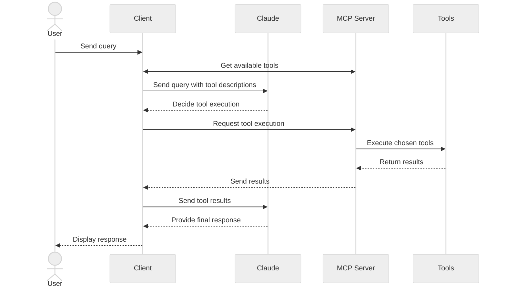

在本教程中，你将学习如何构建一个由 LLM 驱动的聊天机器人客户端，使其能够连接到 MCP 服务器。

开始之前，建议先完成我们的[构建 MCP 服务器](/docs/draft/develop/build-server)教程，以便了解客户端和服务器如何通信。

<Tabs>
<Tab title="Python">

[你可以在此处找到本教程的完整代码。](https://github.com/modelcontextprotocol/quickstart-resources/tree/main/mcp-client-python)

## 系统要求

开始之前，请确保你的系统满足以下要求：

- Mac 或 Windows 计算机
- 已安装最新版本的 Python
- 已安装最新版本的 `uv`
- 必须使用 Python MCP SDK 2.0.0 或更高版本

## 设置环境

首先，使用 `uv` 创建一个新的 Python 项目：

<CodeGroup>

```bash macOS/Linux
# Create project directory
uv init mcp-client
cd mcp-client

# Create virtual environment
uv venv

# Activate virtual environment
source .venv/bin/activate

# Install required packages
uv add mcp anthropic python-dotenv

# Remove boilerplate files
rm main.py

# Create our main file
touch client.py
```

```powershell Windows
# Create project directory
uv init mcp-client
cd mcp-client

# Create virtual environment
uv venv

# Activate virtual environment
.venv\Scripts\activate

# Install required packages
uv add mcp anthropic python-dotenv

# Remove boilerplate files
del main.py

# Create our main file
new-item client.py
```

</CodeGroup>

## 设置 API 密钥

你需要从 [Anthropic Console](https://console.anthropic.com/settings/keys) 获取 Anthropic API 密钥。

创建一个 `.env` 文件来存储它：

```bash
echo "ANTHROPIC_API_KEY=your-api-key-goes-here" > .env
```

将 `.env` 添加到 `.gitignore`：

```bash
echo ".env" >> .gitignore
```

<Warning>

请务必妥善保管你的 `ANTHROPIC_API_KEY`！

</Warning>

## 创建客户端

### 导入和设置

首先，设置导入项以及文件其余部分共享的内容：

```python
import asyncio
import sys

from mcp import Client, StdioServerParameters
from mcp.client.stdio import stdio_client
from mcp_types import TextContent

from anthropic import Anthropic
from dotenv import load_dotenv

load_dotenv()  # load environment variables from .env

MODEL = "claude-opus-5"
anthropic = Anthropic()
```

`Client` 是你的程序与服务器通信时使用的唯一对象。列出工具、调用工具、读取资源：这些操作都对应于它的一个方法。

### 服务器连接管理

接下来，我们确定针对给定服务器脚本需要启动哪个进程：

```python
def server_params(server_script_path: str) -> StdioServerParameters:
    """Describe the subprocess that runs an MCP server

    Args:
        server_script_path: Path to the server script (.py or .js)
    """
    if server_script_path.endswith(".py"):
        command = "python"
    elif server_script_path.endswith(".js"):
        command = "node"
    else:
        raise ValueError("Server script must be a .py or .js file")

    return StdioServerParameters(command=command, args=[server_script_path])
```

`StdioServerParameters` 是配置，而不是连接。`stdio_client()` 会将其转换为 stdio 传输，而 `Client` 会在进入其 `async with` 代码块时打开该传输。我们将在 `main()` 中完成这两步。

### 查询处理逻辑

现在，添加处理查询和处理工具调用的核心功能：

```python
async def process_query(client: Client, query: str) -> str:
    """Process a query using Claude and available tools"""
    messages = [
        {
            "role": "user",
            "content": query
        }
    ]

    tool_list = await client.list_tools()
    available_tools = [{
        "name": tool.name,
        "description": tool.description,
        "input_schema": tool.input_schema
    } for tool in tool_list.tools]

    # Initial Claude API call
    response = anthropic.messages.create(
        model=MODEL,
        max_tokens=1000,
        messages=messages,
        tools=available_tools
    )

    # Process response and handle tool calls
    final_text = []
    tool_results = []

    for content in response.content:
        if content.type == 'text':
            final_text.append(content.text)
        elif content.type == 'tool_use':
            tool_name = content.name
            tool_args = content.input

            # Execute tool call
            result = await client.call_tool(tool_name, tool_args)
            final_text.append(f"[Calling tool {tool_name} with args {tool_args}]")

            tool_results.append({
                "type": "tool_result",
                "tool_use_id": content.id,
                "content": "\n".join(
                    block.text
                    for block in result.content
                    if isinstance(block, TextContent)
                ),
                "is_error": result.is_error
            })

    if tool_results:
        messages.append({"role": "assistant", "content": response.content})
        messages.append({"role": "user", "content": tool_results})

        # Get next response from Claude
        response = anthropic.messages.create(
            model=MODEL,
            max_tokens=1000,
            messages=messages,
            tools=available_tools
        )

        for content in response.content:
            if content.type == 'text':
                final_text.append(content.text)

    return "\n".join(final_text)
```

`call_tool` 返回一个 `CallToolResult`。它的 `content` 是一个代码块列表，因此我们需要先将其缩小到 `TextContent`，然后再读取 `.text`。工具发生异常时不会在此处抛出异常：它会返回设置了 `is_error` 的结果，传递该标志后，Claude 就能读取消息并尝试其他操作。

### 交互式聊天界面

现在添加聊天循环：

```python
async def chat_loop(client: Client) -> None:
    """Run an interactive chat loop"""
    print("\nMCP Client Started!")
    print("Type your queries or 'quit' to exit.")

    while True:
        try:
            query = (await asyncio.to_thread(input, "\nQuery: ")).strip()
        except EOFError:
            break

        if query.lower() == 'quit':
            break

        try:
            response = await process_query(client, query)
            print("\n" + response)
        except Exception as e:
            print(f"\nError: {e}")
```

`input()` 会阻塞，因此它会在工作线程上运行。这样可以让事件循环在你输入时继续处理连接。

### 主入口

最后，添加主执行逻辑：

```python
async def main() -> None:
    if len(sys.argv) < 2:
        print("Usage: python client.py <path_to_server_script>")
        sys.exit(1)

    async with Client(stdio_client(server_params(sys.argv[1]))) as client:
        tool_list = await client.list_tools()
        tool_names = [tool.name for tool in tool_list.tools]
        print("\nConnected to server with tools:", tool_names)

        await chat_loop(client)


if __name__ == "__main__":
    asyncio.run(main())
```

这个 `async with` 包含了完整的连接生命周期。进入它会启动服务器并与服务器协商协议版本；离开它会断开连接并关闭子进程。无需手动关闭任何内容。

你可以在[此处](https://github.com/modelcontextprotocol/quickstart-resources/blob/main/mcp-client-python/client.py)找到完整的 `client.py` 文件。

## 关键组件说明

### 1. 客户端初始化

- 单个 `Client` 负责维护连接，而 `async with` 包含其完整生命周期
- 无需调用连接/关闭方法，也无需在之后进行清理
- 配置 Anthropic 客户端以进行 Claude 交互

### 2. 服务器连接

- 同时支持 Python 和 Node.js 服务器
- 验证服务器脚本类型
- 将服务器作为子进程启动，并通过 stdio 与其通信
- 连接打开后列出可用工具

### 3. 查询处理

- 维护对话上下文
- 处理 Claude 的响应和工具调用
- 管理 Claude 与工具之间的消息流
- 将结果组合成连贯的响应

### 4. 交互式界面

- 提供简单的命令行界面
- 处理用户输入并显示响应
- 包含基本的错误处理
- 支持正常退出

### 5. 资源管理

- 离开 `async with` 代码块会断开连接并关闭服务器子进程
- 查询失败时会报告错误，但不会结束会话
- 输入 `quit` 或关闭标准输入后会正常退出

## 常见自定义点

1. **工具处理**
   - 修改 `process_query()` 以处理特定工具类型
   - 为工具调用添加自定义错误处理
   - 实现针对特定工具的响应格式化

2. **响应处理**
   - 自定义工具结果的格式化方式
   - 添加响应过滤或转换
   - 实现自定义日志记录

3. **用户界面**
   - 添加 GUI 或 Web 界面
   - 实现丰富的控制台输出
   - 添加命令历史或自动补全

## 运行客户端

要让客户端与任意 MCP 服务器一起运行：

```bash
uv run client.py path/to/server.py # python server
uv run client.py path/to/build/index.js # node server
```

<Note>

如果你正在继续完成[服务器快速入门中的天气教程](https://github.com/modelcontextprotocol/quickstart-resources/tree/main/weather-server-python)，你的命令可能类似于：`python client.py .../quickstart-resources/weather-server-python/weather.py`

</Note>

客户端将：

1. 连接到指定的服务器
2. 列出可用工具
3. 启动交互式聊天会话，你可以在其中：
   - 输入查询
   - 查看工具执行情况
   - 获取 Claude 的响应

以下是连接到服务器快速入门中的天气服务器时的示例：

<Frame>
  
</Frame>

## 工作原理

提交查询时：

1. 客户端从服务器获取可用工具列表
2. 将你的查询连同工具描述一起发送给 Claude
3. Claude 决定使用哪些工具（如果有）
4. 客户端通过服务器执行请求的工具调用
5. 将结果发送回 Claude
6. Claude 提供自然语言响应
7. 将响应显示给你

## 最佳实践

1. **错误处理**
   - 检查 `result.is_error`，而不是期待失败的工具抛出异常
   - 提供有意义的错误消息
   - 正确处理连接问题

2. **资源管理**
   - 让 `async with` 代码块负责连接
   - 在需要服务器期间保持连接打开
   - 处理服务器断开连接的情况

3. **安全性**
   - 将 API 密钥安全地存储在 `.env` 中
   - 验证服务器响应
   - 谨慎处理工具权限

4. **工具名称**
   - 可以根据[此处](/specification/draft/server/tools#tool-names)指定的格式验证工具名称
   - 如果工具名称符合指定格式，则 MCP 客户端不应因验证而失败

## 故障排除

### 服务器路径问题

- 仔细检查服务器脚本路径是否正确
- 如果相对路径不起作用，请使用绝对路径
- Windows 用户请确保在路径中使用正斜杠（/）或转义反斜杠（\\）
- 确认服务器文件具有正确的扩展名（Python 使用 .py，Node.js 使用 .js）

正确的路径用法示例：

```bash
# Relative path
uv run client.py ./server/weather.py

# Absolute path
uv run client.py /Users/username/projects/mcp-server/weather.py

# Windows path (either format works)
uv run client.py C:/projects/mcp-server/weather.py
uv run client.py C:\\projects\\mcp-server\\weather.py
```

### 响应时间

- 首次响应可能需要最多 30 秒
- 这是正常现象，期间会发生：
  - 服务器初始化
  - Claude 处理查询
  - 执行工具
- 后续响应通常会更快
- 在初始等待期间不要中断进程

### 常见错误消息

如果看到：

- `FileNotFoundError`：检查服务器路径
- `Connection refused`：确保服务器正在运行且路径正确
- `Tool execution failed`：确认已设置工具所需的环境变量
- `Timeout error`：考虑在 `Client` 上提高 `read_timeout_seconds`

</Tab>

<Tab title="TypeScript">

[你可以在此处找到本教程的完整代码。](https://github.com/modelcontextprotocol/quickstart-resources/tree/main/mcp-client-typescript)

## 系统要求

开始之前，请确保你的系统满足以下要求：

- Mac 或 Windows 计算机
- 已安装 Node.js 20 或更高版本
- 已安装最新版本的 `npm`
- Anthropic API 密钥（Claude）

## 设置环境

首先，创建并设置项目：

<CodeGroup>

```bash macOS/Linux
# Create project directory
mkdir mcp-client-typescript
cd mcp-client-typescript

# Initialize npm project
npm init -y

# Install dependencies
npm install @anthropic-ai/sdk @modelcontextprotocol/client dotenv

# Install dev dependencies
npm install -D @types/node typescript

# Create source file
touch index.ts
```

```powershell Windows
# Create project directory
md mcp-client-typescript
cd mcp-client-typescript

# Initialize npm project
npm init -y

# Install dependencies
npm install @anthropic-ai/sdk @modelcontextprotocol/client dotenv

# Install dev dependencies
npm install -D @types/node typescript

# Create source file
new-item index.ts
```

</CodeGroup>

更新 `package.json`，将 `type` 设置为 `"module"`，并添加构建脚本：

```json package.json
{
  "type": "module",
  "scripts": {
    "build": "tsc && chmod 755 build/index.js"
  }
}
```

在项目根目录创建 `tsconfig.json`：

```json tsconfig.json
{
  "compilerOptions": {
    "target": "ES2022",
    "module": "Node16",
    "moduleResolution": "Node16",
    "types": ["node"],
    "outDir": "./build",
    "rootDir": "./",
    "strict": true,
    "esModuleInterop": true,
    "skipLibCheck": true,
    "forceConsistentCasingInFileNames": true
  },
  "include": ["index.ts"],
  "exclude": ["node_modules"]
}
```

## 设置 API 密钥

你需要从 [Anthropic Console](https://console.anthropic.com/settings/keys) 获取 Anthropic API 密钥。

创建一个 `.env` 文件来存储它：

```bash
echo "ANTHROPIC_API_KEY=<your key here>" > .env
```

将 `.env` 添加到 `.gitignore`：

```bash
echo ".env" >> .gitignore
```

<Warning>

请务必妥善保管你的 `ANTHROPIC_API_KEY`！

</Warning>

## 创建客户端

### 基本客户端结构

首先，在 `index.ts` 中设置导入项并创建基本客户端类：

```typescript
import { Anthropic } from "@anthropic-ai/sdk";
import {
  MessageParam,
  Tool,
} from "@anthropic-ai/sdk/resources/messages/messages.mjs";
import { Client } from "@modelcontextprotocol/client";
import { StdioClientTransport } from "@modelcontextprotocol/client/stdio";
import readline from "readline/promises";
import dotenv from "dotenv";

dotenv.config();

const ANTHROPIC_API_KEY = process.env.ANTHROPIC_API_KEY;
if (!ANTHROPIC_API_KEY) {
  throw new Error("ANTHROPIC_API_KEY is not set");
}

class MCPClient {
  private mcp: Client;
  private anthropic: Anthropic;
  private transport: StdioClientTransport | null = null;
  private tools: Tool[] = [];

  constructor() {
    this.anthropic = new Anthropic({
      apiKey: ANTHROPIC_API_KEY,
    });
    this.mcp = new Client({ name: "mcp-client-cli", version: "1.0.0" });
  }
  // methods will go here
}
```

### 服务器连接管理

接下来，实现连接到 MCP 服务器的方法：

```typescript
async connectToServer(serverScriptPath: string) {
  try {
    const isJs = serverScriptPath.endsWith(".js");
    const isPy = serverScriptPath.endsWith(".py");
    if (!isJs && !isPy) {
      throw new Error("Server script must be a .js or .py file");
    }
    const command = isPy
      ? process.platform === "win32"
        ? "python"
        : "python3"
      : process.execPath;

    this.transport = new StdioClientTransport({
      command,
      args: [serverScriptPath],
    });
    await this.mcp.connect(this.transport);

    const toolsResult = await this.mcp.listTools();
    this.tools = toolsResult.tools.map((tool) => {
      return {
        name: tool.name,
        description: tool.description,
        input_schema: tool.inputSchema,
      };
    });
    console.log(
      "Connected to server with tools:",
      this.tools.map(({ name }) => name)
    );
  } catch (e) {
    console.log("Failed to connect to MCP server: ", e);
    throw e;
  }
}
```

### 查询处理逻辑

现在，添加处理查询和处理工具调用的核心功能：

```typescript
async processQuery(query: string) {
  const messages: MessageParam[] = [
    {
      role: "user",
      content: query,
    },
  ];

  const response = await this.anthropic.messages.create({
    model: "claude-opus-5",
    max_tokens: 1000,
    messages,
    tools: this.tools,
  });

  const finalText = [];

  for (const content of response.content) {
    if (content.type === "text") {
      finalText.push(content.text);
    } else if (content.type === "tool_use") {
      const toolName = content.name;
      const toolArgs = content.input as { [x: string]: unknown } | undefined;

      const result = await this.mcp.callTool({
        name: toolName,
        arguments: toolArgs,
      });
      finalText.push(
        `[Calling tool ${toolName} with args ${JSON.stringify(toolArgs)}]`
      );

      messages.push({
        role: "user",
        content: result.content
          .filter((block) => block.type === "text")
          .map((block) => block.text)
          .join("\n"),
      });

      const response = await this.anthropic.messages.create({
        model: "claude-opus-5",
        max_tokens: 1000,
        messages,
      });

      finalText.push(
        response.content[0].type === "text" ? response.content[0].text : ""
      );
    }
  }

  return finalText.join("\n");
}
```

### 交互式聊天界面

现在添加聊天循环和清理功能：

```typescript
async chatLoop() {
  const rl = readline.createInterface({
    input: process.stdin,
    output: process.stdout,
  });

  try {
    console.log("\nMCP Client Started!");
    console.log("Type your queries or 'quit' to exit.");

    while (true) {
      const message = await rl.question("\nQuery: ");
      if (message.toLowerCase() === "quit") {
        break;
      }
      const response = await this.processQuery(message);
      console.log("\n" + response);
    }
  } finally {
    rl.close();
  }
}

async cleanup() {
  await this.mcp.close();
}
```

### 主入口

最后，添加主执行逻辑：

```typescript
async function main() {
  if (process.argv.length < 3) {
    console.log("Usage: node index.ts <path_to_server_script>");
    return;
  }
  const mcpClient = new MCPClient();
  try {
    await mcpClient.connectToServer(process.argv[2]);
    await mcpClient.chatLoop();
  } catch (e) {
    console.error("Error:", e);
    await mcpClient.cleanup();
    process.exit(1);
  } finally {
    await mcpClient.cleanup();
    process.exit(0);
  }
}

main();
```

## 运行客户端

要让客户端与任意 MCP 服务器一起运行：

```bash
# Build TypeScript
npm run build

# Run the client
node build/index.js path/to/server.py # python server
node build/index.js path/to/build/index.js # node server
```

<Note>

如果你正在继续完成[服务器快速入门中的天气教程](https://github.com/modelcontextprotocol/quickstart-resources/tree/main/weather-server-typescript)，你的命令可能类似于：`node build/index.js .../quickstart-resources/weather-server-typescript/build/index.js`

</Note>

**客户端将：**

1. 连接到指定的服务器
2. 列出可用工具
3. 启动交互式聊天会话，你可以在其中：
   - 输入查询
   - 查看工具执行情况
   - 获取 Claude 的响应

## 工作原理

提交查询时：

1. 客户端从服务器获取可用工具列表
2. 将你的查询连同工具描述一起发送给 Claude
3. Claude 决定使用哪些工具（如果有）
4. 客户端通过服务器执行请求的工具调用
5. 将结果发送回 Claude
6. Claude 提供自然语言响应
7. 将响应显示给你

## 最佳实践

1. **错误处理**
   - 使用 TypeScript 的类型系统来更好地检测错误
   - 将工具调用包装在 try-catch 代码块中
   - 提供有意义的错误消息
   - 正确处理连接问题

2. **安全性**
   - 将 API 密钥安全地存储在 `.env` 中
   - 验证服务器响应
   - 谨慎处理工具权限

## 故障排除

### 服务器路径问题

- 仔细检查服务器脚本路径是否正确
- 如果相对路径不起作用，请使用绝对路径
- Windows 用户请确保在路径中使用正斜杠（/）或转义反斜杠（\\）
- 确认服务器文件具有正确的扩展名（Node.js 使用 .js，Python 使用 .py）

正确的路径用法示例：

```bash
# Relative path
node build/index.js ./server/build/index.js

# Absolute path
node build/index.js /Users/username/projects/mcp-server/build/index.js

# Windows path (either format works)
node build/index.js C:/projects/mcp-server/build/index.js
node build/index.js C:\\projects\\mcp-server\\build\\index.js
```

### 响应时间

- 首次响应可能需要最多 30 秒
- 这是正常现象，期间会发生：
  - 服务器初始化
  - Claude 处理查询
  - 执行工具
- 后续响应通常会更快
- 在初始等待期间不要中断进程

### 常见错误消息

如果看到：

- `Error: Cannot find module`：检查构建文件夹，并确保 TypeScript 编译成功
- `Connection refused`：确保服务器正在运行且路径正确
- `Tool execution failed`：确认已设置工具所需的环境变量
- `ANTHROPIC_API_KEY is not set`：检查 `.env` 文件和环境变量
- `TypeError`：确保工具参数使用了正确的类型
- `BadRequestError`：确保你有足够的额度访问 Anthropic API

</Tab>

<Tab title="Java">

<Note>

这是一个基于 Spring AI MCP 自动配置和启动器的快速入门示例。
如果想了解如何手动创建同步和异步 MCP 客户端，请参阅 [Java SDK Client](https://java.sdk.modelcontextprotocol.io/) 文档。

</Note>

此示例演示如何构建一个交互式聊天机器人，将 Spring AI 的模型上下文协议（MCP）与 [Brave Search MCP Server](https://github.com/modelcontextprotocol/servers-archived/tree/main/src/brave-search) 相结合。该应用程序创建了一个由 Anthropic 的 Claude AI 模型驱动的对话界面，可以通过 Brave Search 执行互联网搜索，从而使用实时 Web 数据进行自然语言交互。
[你可以在此处找到本教程的完整代码。](https://github.com/spring-projects/spring-ai-examples/tree/main/model-context-protocol/web-search/brave-chatbot)

## 系统要求

开始之前，请确保你的系统满足以下要求：

- Java 17 或更高版本
- Maven 3.6+
- npx 包管理器
- Anthropic API 密钥（Claude）
- Brave Search API 密钥

## 设置环境

1. 安装 npx（Node Package eXecute）：
   首先，确保安装了 [npm](https://docs.npmjs.com/downloading-and-installing-node-js-and-npm)，
   然后运行：

   ```bash
   npm install -g npx
   ```

2. 克隆代码仓库：

   ```bash
   git clone https://github.com/spring-projects/spring-ai-examples.git
   cd model-context-protocol/web-search/brave-chatbot
   ```

3. 设置 API 密钥：

   ```bash
   export ANTHROPIC_API_KEY='your-anthropic-api-key-here'
   export BRAVE_API_KEY='your-brave-api-key-here'
   ```

4. 构建应用程序：

   ```bash
   ./mvnw clean install
   ```

5. 使用 Maven 运行应用程序：
   ```bash
   ./mvnw spring-boot:run
   ```

<Warning>

请务必妥善保管你的 `ANTHROPIC_API_KEY` 和 `BRAVE_API_KEY` 密钥！

</Warning>

## 工作原理

该应用程序通过以下几个组件，将 Spring AI 与 Brave Search MCP 服务器集成：

### MCP 客户端配置

1. pom.xml 中的必需依赖：

```xml
<dependency>
    <groupId>org.springframework.ai</groupId>
    <artifactId>spring-ai-starter-mcp-client</artifactId>
</dependency>
<dependency>
    <groupId>org.springframework.ai</groupId>
    <artifactId>spring-ai-starter-model-anthropic</artifactId>
</dependency>
```

2. 应用程序属性（application.yml）：

```yml
spring:
  ai:
    mcp:
      client:
        enabled: true
        name: brave-search-client
        version: 1.0.0
        type: SYNC
        request-timeout: 20s
        stdio:
          root-change-notification: true
          servers-configuration: classpath:/mcp-servers-config.json
        toolcallback:
          enabled: true
    anthropic:
      api-key: ${ANTHROPIC_API_KEY}
```

这会激活 `spring-ai-starter-mcp-client`，根据提供的服务器配置创建一个或多个 `McpClient`。
`spring.ai.mcp.client.toolcallback.enabled=true` 属性启用工具回调机制，该机制会自动将所有 MCP 工具注册为 Spring AI 工具。
默认情况下，此功能处于禁用状态。

3. MCP 服务器配置（`mcp-servers-config.json`）：

```json
{
  "mcpServers": {
    "brave-search": {
      "command": "npx",
      "args": ["-y", "@modelcontextprotocol/server-brave-search"],
      "env": {
        "BRAVE_API_KEY": "<PUT YOUR BRAVE API KEY>"
      }
    }
  }
}
```

### 聊天实现

聊天机器人使用带有 MCP 工具集成的 Spring AI `ChatClient` 实现：

```java
var chatClient = chatClientBuilder
    .defaultSystem("You are useful assistant, expert in AI and Java.")
    .defaultToolCallbacks((Object[]) mcpToolAdapter.toolCallbacks())
    .defaultAdvisors(new MessageChatMemoryAdvisor(new InMemoryChatMemory()))
    .build();
```

主要功能：

- 使用 Claude AI 模型进行自然语言理解
- 通过 MCP 集成 Brave Search，实现实时 Web 搜索能力
- 使用 InMemoryChatMemory 维护对话记忆
- 作为交互式命令行应用程序运行

### 构建和运行

```bash
./mvnw clean install
java -jar ./target/ai-mcp-brave-chatbot-0.0.1-SNAPSHOT.jar
```

或

```bash
./mvnw spring-boot:run
```

应用程序将启动交互式聊天会话，你可以提出问题。当需要从互联网查找信息来回答你的查询时，聊天机器人会使用 Brave Search。

聊天机器人可以：

- 使用其内置知识回答问题
- 需要时使用 Brave Search 执行 Web 搜索
- 记住对话中之前消息的上下文
- 结合多个来源的信息，提供全面的回答

### 高级配置

MCP 客户端支持其他配置选项：

- 通过 `McpClientCustomizer<McpClient.SyncSpec>` 或 `McpClientCustomizer<McpClient.AsyncSpec>` Bean 自定义客户端
- 使用多种传输类型的多个客户端：`STDIO` 和 Streamable HTTP
- 与 Spring AI 工具执行框架集成
- 自动初始化客户端并管理其生命周期

要通过 Streamable HTTP 连接到远程 MCP 服务器，请配置连接 URL：

```properties
spring.ai.mcp.client.streamable-http.connections.server1.url=http://localhost:8080
```

对于基于 WebFlux 的应用程序，也可以改用 WebFlux 启动器：

```xml
<dependency>
    <groupId>org.springframework.ai</groupId>
    <artifactId>spring-ai-starter-mcp-client-webflux</artifactId>
</dependency>
```

它提供类似的功能，但使用基于 WebFlux 的 Streamable HTTP 传输实现，推荐用于生产部署。

</Tab>

<Tab title="Kotlin">

[你可以在此处找到本教程的完整代码。](https://github.com/modelcontextprotocol/kotlin-sdk/tree/main/samples/kotlin-mcp-client)

## 系统要求

开始之前，请确保你的系统满足以下要求：

- JDK 11 或更高版本
- Anthropic API 密钥（Claude）

## 设置环境

首先，如果尚未安装，请安装 `java` 和 `gradle`。
你可以从[官方 Oracle JDK 网站](https://www.oracle.com/java/technologies/downloads/)下载 `java`。
验证你的 `java` 安装：

```bash
java --version
```

现在，创建并设置项目：

<CodeGroup>

```bash macOS/Linux
# Create a new directory for our project
mkdir kotlin-mcp-client
cd kotlin-mcp-client

# Initialize a new kotlin project
gradle init
```

```powershell Windows
# Create a new directory for our project
md kotlin-mcp-client
cd kotlin-mcp-client
# Initialize a new kotlin project
gradle init
```

</CodeGroup>

运行 `gradle init` 后，选择 **Application** 作为项目类型，选择 **Kotlin** 作为编程语言。

或者，你可以使用 [IntelliJ IDEA 项目向导](https://kotlinlang.org/docs/jvm-get-started.html)创建 Kotlin 应用程序。

创建项目后，将 `build.gradle.kts` 的内容替换为：

```kotlin build.gradle.kts
// Check latest versions at https://github.com/modelcontextprotocol/kotlin-sdk/releases
val mcpVersion = "0.9.0"
val ktorVersion = "3.2.3"
val anthropicVersion = "2.15.0"
val slf4jVersion = "2.0.17"

plugins {
    kotlin("jvm") version "2.3.20"
    id("com.gradleup.shadow") version "8.3.9"
    application
}

application {
    mainClass.set("MainKt")
}

dependencies {
    implementation("io.modelcontextprotocol:kotlin-sdk:$mcpVersion")
    implementation("io.ktor:ktor-client-cio:$ktorVersion")
    implementation("com.anthropic:anthropic-java:$anthropicVersion")
    implementation("org.slf4j:slf4j-simple:$slf4jVersion")
}
```

验证所有内容是否设置正确：

```bash
./gradlew build
```

## 设置 API 密钥

你需要从 [Anthropic Console](https://console.anthropic.com/settings/keys) 获取 Anthropic API 密钥。

设置 API 密钥：

```bash
export ANTHROPIC_API_KEY='your-anthropic-api-key-here'
```

<Warning>

请务必妥善保管你的 `ANTHROPIC_API_KEY`！

</Warning>

## 创建客户端

### 基本客户端结构

首先，创建基本客户端类：

```kotlin
class MCPClient(apiKey: String) : AutoCloseable {
    private val anthropic = AnthropicOkHttpClient.builder()
        .apiKey(apiKey)
        .build()

  private val mcp: Client = Client(
        clientInfo = Implementation(name = "mcp-client-cli", version = "1.0.0")
  )
    private var serverProcess: Process? = null
    private lateinit var tools: List<ToolUnion>

    // methods will go here

    override fun close() {
        runBlocking {
            mcp.close()
        }
        serverProcess?.destroy()
        anthropic.close()
    }
}
```

### 服务器连接管理

接下来，实现连接到 MCP 服务器的方法：

```kotlin
suspend fun connectToServer(serverScriptPath: String) {
    val command = buildList {
        when (serverScriptPath.substringAfterLast(".")) {
            "js" -> add("node")
            "py" -> add(if (System.getProperty("os.name").lowercase().contains("win")) "python" else "python3")
            "jar" -> addAll(listOf("java", "-jar"))
            else -> throw IllegalArgumentException("Server script must be a .js, .py or .jar file")
        }
        add(serverScriptPath)
    }

    val process = ProcessBuilder(command).start()
    serverProcess = process

    val transport = StdioClientTransport(
        input = process.inputStream.asSource().buffered(),
        output = process.outputStream.asSink().buffered(),
    )

    mcp.connect(transport)

    val toolsResult = mcp.listTools()
    tools = toolsResult.tools.map { tool ->
        ToolUnion.ofTool(
            Tool.builder()
                .name(tool.name)
                .description(tool.description ?: "")
                .inputSchema(
                    Tool.InputSchema.builder()
                        .type(JsonValue.from(tool.inputSchema.type))
                        .properties(tool.inputSchema.properties?.toJsonValue() ?: EmptyJsonObject.toJsonValue())
                        .putAdditionalProperty("required", JsonValue.from(tool.inputSchema.required))
                        .build(),
                )
                .build(),
        )
    }
    println("Connected to server with tools: ${tools.joinToString(", ") { it.tool().get().name() }}")
}
```

<Accordion title="JsonObject.toJsonValue() helper">

此辅助函数使用 Jackson 将 kotlinx.serialization `JsonObject` 转换为 Anthropic SDK `JsonValue`：

```kotlin
private fun JsonObject.toJsonValue(): JsonValue {
    val mapper = ObjectMapper()
    val node = mapper.readTree(this.toString())
    return JsonValue.fromJsonNode(node)
}
```

</Accordion>

### 查询处理逻辑

现在，添加处理查询和处理工具调用的核心功能：

```kotlin
suspend fun processQuery(query: String): String {
    val messages = mutableListOf(
        MessageParam.builder()
            .role(MessageParam.Role.USER)
            .content(query)
            .build(),
    )

    val response = anthropic.messages().create(
        MessageCreateParams.builder()
            .model("claude-opus-5")
            .maxTokens(1024)
            .messages(messages)
            .tools(tools)
            .build(),
    )

    val finalText = mutableListOf<String>()
    response.content().forEach { content ->
        when {
            content.isText() -> finalText.add(content.text().get().text())

            content.isToolUse() -> {
                val toolName = content.toolUse().get().name()
                val toolArgs =
                    content.toolUse().get()._input().convert(object : TypeReference<Map<String, JsonValue>>() {})

                val result = mcp.callTool(
                    name = toolName,
                    arguments = toolArgs ?: emptyMap(),
                )
                finalText.add("[Calling tool $toolName with args $toolArgs]")

                messages.add(
                    MessageParam.builder()
                        .role(MessageParam.Role.USER)
                        .content(
                            result.content
                                .filterIsInstance<TextContent>()
                                .joinToString("\n") { it.text }
                        )
                        .build(),
                )

                val aiResponse = anthropic.messages().create(
                    MessageCreateParams.builder()
                        .model("claude-opus-5")
                        .maxTokens(1024)
                        .messages(messages)
                        .build(),
                )

                finalText.add(aiResponse.content().first().text().get().text())
            }
        }
    }

    return finalText.joinToString("\n")
}
```

### 交互式聊天

添加聊天循环：

```kotlin
suspend fun chatLoop() {
    println("\nMCP Client Started!")
    println("Type your queries or 'quit' to exit.")

    while (true) {
        print("\nQuery: ")
        val message = readlnOrNull() ?: break
        if (message.trim().lowercase() == "quit") break

        try {
            val response = processQuery(message)
            println("\n$response")
        } catch (e: Exception) {
            println("\nError: ${e.message}")
        }
    }
}
```

### 主入口

最后，添加主执行函数：

```kotlin
fun main(args: Array<String>) = runBlocking {
    require(args.isNotEmpty()) { "Usage: java -jar <path> <path_to_server_script>" }

    val apiKey = System.getenv("ANTHROPIC_API_KEY")
    require(!apiKey.isNullOrBlank()) { "ANTHROPIC_API_KEY environment variable is not set" }

    val client = MCPClient(apiKey)
    client.use {
        client.connectToServer(args.first())
        client.chatLoop()
    }
}
```

## 运行客户端

要让客户端与任意 MCP 服务器一起运行：

```bash
./gradlew build

# Run the client
java -jar build/libs/kotlin-mcp-client-0.1.0-all.jar path/to/server.jar # JVM server
java -jar build/libs/kotlin-mcp-client-0.1.0-all.jar path/to/server.py  # Python server
java -jar build/libs/kotlin-mcp-client-0.1.0-all.jar path/to/build/index.js # Node server
```

也可以直接使用 Gradle 运行：

```bash
./gradlew run --args="path/to/server.jar"
```

<Note>

如果你正在继续完成服务器快速入门中的天气教程，你的命令可能类似于：`java -jar build/libs/kotlin-mcp-client-0.1.0-all.jar .../samples/weather-stdio-server/build/libs/weather-stdio-server-0.1.0-all.jar`

</Note>

**客户端将：**

1. 连接到指定的服务器
2. 列出可用工具
3. 启动交互式聊天会话，你可以在其中：
   - 输入查询
   - 查看工具执行情况
   - 获取 Claude 的响应

## 工作原理

以下是高级工作流示意图：



提交查询时：

1. 客户端从服务器获取可用工具列表
2. 将你的查询连同工具描述一起发送给 Claude
3. Claude 决定使用哪些工具（如果有）
4. 客户端通过服务器执行请求的工具调用
5. 将结果发送回 Claude
6. Claude 提供自然语言响应
7. 将响应显示给你

## 最佳实践

1. **错误处理**
   - 利用 Kotlin 的类型系统显式建模错误
   - 在可能发生异常时，将外部工具和 API 调用包装在 `try-catch` 代码块中
   - 提供清晰且有意义的错误消息
   - 正确处理网络超时和连接问题

2. **安全性**
   - 将 API 密钥和机密安全地存储在 `local.properties`、环境变量或机密管理器中
   - 验证所有外部响应，避免意外或不安全的数据使用
   - 使用工具时谨慎处理权限和信任边界

3. **环境**
   - 通过环境变量设置 `ANTHROPIC_API_KEY`，而不是硬编码
   - 在本地开发中使用带有适当 `.gitignore` 规则的 `.env` 文件

## 故障排除

### 服务器路径问题

- 仔细检查服务器脚本路径是否正确
- 如果相对路径不起作用，请使用绝对路径
- Windows 用户请确保在路径中使用正斜杠（/）或转义反斜杠（\\）
- 确认已安装所需的运行时（Java 使用 java，Node.js 使用 npm，Python 使用 uv）
- 确认服务器文件具有正确的扩展名（Java 使用 .jar，Node.js 使用 .js，Python 使用 .py）

正确的路径用法示例：

```bash
# Relative path
java -jar build/libs/client.jar ./server/build/libs/server.jar

# Absolute path
java -jar build/libs/client.jar /Users/username/projects/mcp-server/build/libs/server.jar

# Windows path (either format works)
java -jar build/libs/client.jar C:/projects/mcp-server/build/libs/server.jar
java -jar build/libs/client.jar C:\\projects\\mcp-server\\build\\libs\\server.jar
```

### 构建问题

- 使用 `./gradlew build` 或 `./gradlew shadowJar`（而不是 `./gradlew jar`）来创建包含所有依赖项的 shadow JAR
- 如果遇到 JDK 版本错误，请确保已安装的 JDK 版本与 `build.gradle.kts` 中的 `jvmToolchain` 设置相匹配或更高

### 响应时间

- 首次响应可能需要最多 30 秒
- 这是正常现象，期间会发生：
  - 服务器初始化
  - Claude 处理查询
  - 执行工具
- 后续响应通常会更快
- 在初始等待期间不要中断进程

### 常见错误消息

如果看到：

- `Connection refused`：确保服务器正在运行且路径正确
- `Tool execution failed`：确认已设置工具所需的环境变量
- `ANTHROPIC_API_KEY is not set`：检查环境变量

</Tab>

<Tab title="C#">

[你可以在此处找到本教程的完整代码。](https://github.com/modelcontextprotocol/csharp-sdk/tree/main/samples/QuickstartClient)

## 系统要求

开始之前，请确保你的系统满足以下要求：

- .NET 8.0 或更高版本
- Anthropic API 密钥（Claude）
- Windows、Linux 或 macOS

## 设置环境

首先，创建一个新的 .NET 项目：

```bash
dotnet new console -n QuickstartClient
cd QuickstartClient
```

然后，将所需依赖项添加到项目中：

```bash
dotnet add package ModelContextProtocol --prerelease
dotnet add package Anthropic.SDK
dotnet add package Microsoft.Extensions.Hosting
dotnet add package Microsoft.Extensions.AI
```

## 设置 API 密钥

你需要从 [Anthropic Console](https://console.anthropic.com/settings/keys) 获取 Anthropic API 密钥。

```bash
dotnet user-secrets init
dotnet user-secrets set "ANTHROPIC_API_KEY" "<your key here>"
```

## 创建客户端

### 基本客户端结构

首先，在 `Program.cs` 文件中设置基本客户端类：

```csharp
using Anthropic.SDK;
using Microsoft.Extensions.AI;
using Microsoft.Extensions.Configuration;
using Microsoft.Extensions.Hosting;
using ModelContextProtocol.Client;
using ModelContextProtocol.Protocol.Transport;

var builder = Host.CreateApplicationBuilder(args);

builder.Configuration
    .AddEnvironmentVariables()
    .AddUserSecrets<Program>();
```

这创建了一个 .NET 控制台应用程序的基础，该应用程序可以从用户机密中读取 API 密钥。

接下来，设置 MCP 客户端：

```csharp
var (command, arguments) = GetCommandAndArguments(args);

var clientTransport = new StdioClientTransport(new()
{
    Name = "Demo Server",
    Command = command,
    Arguments = arguments,
});

await using var mcpClient = await McpClient.CreateAsync(clientTransport);

var tools = await mcpClient.ListToolsAsync();
foreach (var tool in tools)
{
    Console.WriteLine($"Connected to server with tools: {tool.Name}");
}
```

将此函数添加到 `Program.cs` 文件末尾：

```csharp
static (string command, string[] arguments) GetCommandAndArguments(string[] args)
{
    return args switch
    {
        [var script] when script.EndsWith(".py") => ("python", args),
        [var script] when script.EndsWith(".js") => ("node", args),
        [var script] when Directory.Exists(script) || (File.Exists(script) && script.EndsWith(".csproj")) => ("dotnet", ["run", "--project", script, "--no-build"]),
        _ => throw new NotSupportedException("An unsupported server script was provided. Supported scripts are .py, .js, or .csproj")
    };
}
```

这会创建一个 MCP 客户端，该客户端连接到作为命令行参数提供的服务器，然后列出所连接服务器中的可用工具。

### 查询处理逻辑

现在，添加处理查询和处理工具调用的核心功能：

```csharp
using var anthropicClient = new AnthropicClient(new APIAuthentication(builder.Configuration["ANTHROPIC_API_KEY"]))
    .Messages
    .AsBuilder()
    .UseFunctionInvocation()
    .Build();

var options = new ChatOptions
{
    MaxOutputTokens = 1000,
    ModelId = "claude-opus-5",
    Tools = [.. tools]
};

Console.ForegroundColor = ConsoleColor.Green;
Console.WriteLine("MCP Client Started!");
Console.ResetColor();

PromptForInput();
while(Console.ReadLine() is string query && !"exit".Equals(query, StringComparison.OrdinalIgnoreCase))
{
    if (string.IsNullOrWhiteSpace(query))
    {
        PromptForInput();
        continue;
    }

    await foreach (var message in anthropicClient.GetStreamingResponseAsync(query, options))
    {
        Console.Write(message);
    }
    Console.WriteLine();

    PromptForInput();
}

static void PromptForInput()
{
    Console.WriteLine("Enter a command (or 'exit' to quit):");
    Console.ForegroundColor = ConsoleColor.Cyan;
    Console.Write("> ");
    Console.ResetColor();
}
```

## 关键组件说明

### 1. 客户端初始化

- 使用 `McpClient.CreateAsync()` 初始化客户端，该方法设置传输类型以及运行服务器所需的命令

### 2. 服务器连接

- 支持 Python、Node.js 和 .NET 服务器
- 使用参数中指定的命令启动服务器
- 配置使用 stdio 与服务器通信
- 初始化会话和可用工具

### 3. 查询处理

- 使用 [Microsoft.Extensions.AI](https://learn.microsoft.com/dotnet/ai/ai-extensions) 处理聊天客户端
- 配置 `IChatClient` 使用自动工具（函数）调用
- 客户端读取用户输入并将其发送到服务器
- 服务器处理查询并返回响应
- 将响应显示给用户

## 运行客户端

要让客户端与任意 MCP 服务器一起运行：

```bash
dotnet run -- path/to/server.csproj # dotnet server
dotnet run -- path/to/server.py # python server
dotnet run -- path/to/server.js # node server
```

<Note>

如果你正在继续完成服务器快速入门中的天气教程，你的命令可能类似于：`dotnet run -- path/to/QuickstartWeatherServer`

</Note>

客户端将：

1. 连接到指定的服务器
2. 列出可用工具
3. 启动交互式聊天会话，你可以在其中：
   - 输入查询
   - 查看工具执行情况
   - 获取 Claude 的响应
4. 完成后退出会话

以下是连接到天气服务器快速入门时的示例：

<Frame>
  
</Frame>

</Tab>

<Tab title="Ruby">

[你可以在此处找到本教程的完整代码。](https://github.com/modelcontextprotocol/quickstart-resources/tree/main/mcp-client-ruby)

## 系统要求

开始之前，请确保你的系统满足以下要求：

- Mac 或 Windows 计算机
- 已安装 Ruby 3.2.0 或更高版本（[Anthropic SDK](https://github.com/anthropics/anthropic-sdk-ruby) 要求）
- Anthropic API 密钥（Claude）

## 设置环境

首先，创建一个新的 Ruby 项目：

<CodeGroup>

```bash macOS/Linux
# Create project directory
mkdir mcp-client
cd mcp-client

# Create a Gemfile
bundle init

# Add required dependencies
bundle add anthropic dotenv mcp

# Create our main file
touch client.rb
```

```powershell Windows
# Create project directory
mkdir mcp-client
cd mcp-client

# Create a Gemfile
bundle init

# Add required dependencies
bundle add anthropic base64 dotenv mcp

# Create our main file
new-item client.rb
```

</CodeGroup>

## 设置 API 密钥

你需要从 [Anthropic Console](https://console.anthropic.com/settings/keys) 获取 Anthropic API 密钥。

创建一个 `.env` 文件来存储它：

```bash
echo "ANTHROPIC_API_KEY=your-api-key-goes-here" > .env
```

将 `.env` 添加到 `.gitignore`：

```bash
echo ".env" >> .gitignore
```

<Warning>

请务必妥善保管你的 `ANTHROPIC_API_KEY`！

</Warning>

## 创建客户端

### 基本客户端结构

首先，设置 require 并创建基本客户端类：

```ruby
require "anthropic"
require "dotenv/load"
require "json"
require "mcp"

class MCPClient
  ANTHROPIC_MODEL = "claude-opus-5"

  def initialize
    @mcp_client = nil
    @transport = nil
    @anthropic_client = nil
  end

  # methods will go here
end
```

### 服务器连接管理

接下来，实现连接到 MCP 服务器的方法：

```ruby
def connect_to_server(server_script_path)
  command = case File.extname(server_script_path)
  when ".rb"
    "ruby"
  when ".py"
    "python3"
  when ".js"
    "node"
  else
    raise ArgumentError, "Server script must be a .rb, .py, or .js file."
  end

  @transport = MCP::Client::Stdio.new(command: command, args: [server_script_path])
  @mcp_client = MCP::Client.new(transport: @transport)
  @mcp_client.connect

  tool_names = @mcp_client.tools.map(&:name)
  puts "\nConnected to server with tools: #{tool_names}"
end
```

### 查询处理逻辑

现在，添加处理查询和处理工具调用的核心功能：

```ruby
private

def process_query(query)
  messages = [{ role: "user", content: query }]

  available_tools = @mcp_client.tools.map do |tool|
    { name: tool.name, description: tool.description, input_schema: tool.input_schema }
  end

  # Initial Claude API call.
  response = chat(messages, tools: available_tools)

  # Process response and handle tool calls.
  if response.content.any?(Anthropic::Models::ToolUseBlock)
    assistant_content = response.content.filter_map do |content_block|
      case content_block
      when Anthropic::Models::TextBlock
        { type: "text", text: content_block.text }
      when Anthropic::Models::ToolUseBlock
        { type: "tool_use", id: content_block.id, name: content_block.name, input: content_block.input }
      end
    end
    messages << { role: "assistant", content: assistant_content }
  end

  response.content.each_with_object([]) do |content, response_parts|
    case content
    when Anthropic::Models::TextBlock
      response_parts << content.text
    when Anthropic::Models::ToolUseBlock
      # Execute tool call via MCP.
      result = @mcp_client.call_tool(name: content.name, arguments: content.input)
      response_parts << "[Calling tool #{content.name} with args #{content.input.to_json}]"

      tool_result_content = result.dig("result", "content")
      result_text = if tool_result_content.is_a?(Array)
        tool_result_content.filter_map { |content_item| content_item["text"] }.join("\n")
      else
        tool_result_content.to_s
      end

      messages << {
        role: "user",
        content: [{
          type: "tool_result",
          tool_use_id: content.id,
          content: result_text
        }]
      }

      # Get next response from Claude.
      response = chat(messages)

      response.content.each do |content_block|
        response_parts << content_block.text if content_block.is_a?(Anthropic::Models::TextBlock)
      end
    end
  end.join("\n")
end

def chat(messages, tools: nil)
  params = { model: ANTHROPIC_MODEL, max_tokens: 1000, messages: messages }
  params[:tools] = tools if tools

  anthropic_client.messages.create(**params)
end

def anthropic_client
  @anthropic_client ||= Anthropic::Client.new(api_key: ENV["ANTHROPIC_API_KEY"])
end
```

### 交互式聊天界面

现在添加聊天循环和清理功能：

```ruby
def chat_loop
  puts <<~MESSAGE
    MCP Client Started!
    Type your queries or 'quit' to exit.
  MESSAGE

  loop do
    print "\nQuery: "
    line = $stdin.gets
    break if line.nil?

    query = line.chomp.strip
    break if query.downcase == "quit"
    next if query.empty?

    begin
      response = process_query(query)
      puts "\n#{response}"
    rescue => e
      puts "\nError: #{e.message}"
    end
  end
end

def cleanup
  @transport&.close
end
```

### 主入口

最后，添加主执行逻辑：

```ruby
if ARGV.empty?
  puts "Usage: ruby client.rb <path_to_server_script>"
  exit 1
end

client = MCPClient.new

begin
  client.connect_to_server(ARGV[0])

  api_key = ENV["ANTHROPIC_API_KEY"]
  if api_key.nil? || api_key.empty?
    puts <<~MESSAGE
      No ANTHROPIC_API_KEY found. To query these tools with Claude, set your API key:
        export ANTHROPIC_API_KEY=your-api-key-here
    MESSAGE
    exit
  end

  client.chat_loop
rescue => e
  puts "Error: #{e.message}"
  exit 1
ensure
  client.cleanup
end
```

你可以在[此处](https://github.com/modelcontextprotocol/quickstart-resources/blob/main/mcp-client-ruby/client.rb)找到完整的 `client.rb` 文件。

## 关键组件说明

### 1. 客户端初始化

- `MCPClient` 类初始化时使用 nil 引用，以便延迟设置
- Anthropic 客户端通过 `anthropic_client` 方法延迟初始化
- 使用 `dotenv` 从 `.env` 加载环境变量

### 2. 服务器连接

- 支持 Ruby、Python 和 Node.js 服务器
- 使用 `File.extname` 确定服务器脚本类型
- 使用 `MCP::Client::Stdio` 进行 stdio 传输
- 初始化 MCP 客户端并列出可用工具

### 3. 查询处理

- 将 MCP 工具映射为 Anthropic 工具格式（`name`、`description`、`input_schema`）
- 使用 `Anthropic::Models::TextBlock` 和 `Anthropic::Models::ToolUseBlock` 进行模式匹配
- 在遍历工具调用之前构建一次 assistant 内容
- 通过 `@mcp_client.call_tool` 执行工具调用
- 使用 `chat` 辅助方法封装 Anthropic API 调用
- 使用 `result.dig("result", "content")` 提取工具结果内容
- 将工具结果传回 Claude 以获取最终响应

### 4. 交互式界面

- 提供简单的命令行界面
- 处理用户输入并显示响应
- 跳过空查询
- 包含基本的错误处理

### 5. 资源管理

- 通过 `begin`...`ensure` 正确清理传输
- 使用顶层 `rescue` 进行错误处理
- 在连接服务器后验证 API 密钥

## 运行客户端

要让客户端与任意 MCP 服务器一起运行：

```bash
bundle exec ruby client.rb path/to/server.rb # ruby server
bundle exec ruby client.rb path/to/server.py # python server
bundle exec ruby client.rb path/to/build/index.js # node server
```

<Note>

如果你正在继续完成[服务器快速入门中的天气教程](https://github.com/modelcontextprotocol/quickstart-resources/tree/main/weather-server-ruby)，你的命令可能类似于：`bundle exec ruby client.rb /path/to/weather-server-ruby/weather.rb`

</Note>

客户端将：

1. 连接到指定的服务器
2. 列出可用工具
3. 启动交互式聊天会话，你可以在其中：
   - 输入查询
   - 查看工具执行情况
   - 获取 Claude 的响应

## 工作原理

提交查询时：

1. 客户端从服务器获取可用工具列表
2. 将你的查询连同工具描述一起发送给 Claude
3. Claude 决定使用哪些工具（如果有）
4. 客户端通过服务器执行请求的工具调用
5. 将结果发送回 Claude
6. Claude 提供自然语言响应
7. 将响应显示给你

## 最佳实践

1. **错误处理**
   - 将工具调用包装在 `begin`...`rescue` 代码块中
   - 提供有意义的错误消息
   - 正确处理连接问题

2. **资源管理**
   - 完成后始终关闭传输
   - 使用 `begin`...`ensure` 进行正确清理
   - 处理服务器断开连接的情况

3. **安全性**
   - 将 API 密钥安全地存储在 `.env` 中
   - 验证服务器响应
   - 谨慎处理工具权限

4. **工具名称**
   - 可以根据[此处](/specification/draft/server/tools#tool-names)指定的格式验证工具名称
   - 如果工具名称符合指定格式，则 MCP 客户端不应因验证而失败

## 故障排除

### 服务器路径问题

- 仔细检查服务器脚本路径是否正确
- 如果相对路径不起作用，请使用绝对路径
- Windows 用户请确保在路径中使用正斜杠（/）或转义反斜杠（\\）
- 确认服务器文件具有正确的扩展名（Python 使用 .py，Node.js 使用 .js，Ruby 使用 .rb）

正确的路径用法示例：

```bash
# Relative path
bundle exec ruby client.rb ./server/weather.rb

# Absolute path
bundle exec ruby client.rb /Users/username/projects/mcp-server/weather.rb

# Windows path (either format works)
bundle exec ruby client.rb C:/projects/mcp-server/weather.rb
bundle exec ruby client.rb C:\\projects\\mcp-server\\weather.rb
```

### 响应时间

- 首次响应可能需要最多 30 秒
- 这是正常现象，期间会发生：
  - 服务器初始化
  - Claude 处理查询
  - 执行工具
- 后续响应通常会更快
- 在初始等待期间不要中断进程

### 常见错误消息

如果看到：

- `Errno::ENOENT`：检查服务器路径，并确保命令（`ruby`、`python3`、`node`）可用
- `Connection refused`：确保服务器正在运行且路径正确
- `Tool execution failed`：确认已设置工具所需的环境变量
- `Anthropic::Errors::AuthenticationError`：检查 `.env` 文件中是否有有效的 `ANTHROPIC_API_KEY`

</Tab>

<Tab title="Rust">

[你可以在此处找到本教程的完整代码。](https://github.com/modelcontextprotocol/quickstart-resources/tree/main/mcp-client-rust)

## 系统要求

开始之前，请确保你的 Linux 系统满足以下要求：

- 最新稳定版的 [Rust 和 Cargo](https://www.rust-lang.org/tools/install)
- Anthropic API 密钥（Claude）
- 要连接的 Python、Node.js 或可执行 MCP 服务器

## 设置环境

首先，创建一个新的 Rust 项目：

```bash
cargo new mcp-client-rust
cd mcp-client-rust
```

将 `Cargo.toml` 的内容替换为以下内容：

```toml Cargo.toml
[package]
name = "mcp-client-rust"
version = "0.1.0"
edition = "2024"

[dependencies]
anyhow = "1.0.100"
genai = "0.4.2"
rmcp = { version = "0.8.0", features = ["server", "client", "transport-io", "transport-child-process"] }
tokio = { version = "1.47.1", features = ["full"] }
tracing = "0.1.41"
tracing-subscriber = { version = "0.3", features = ["env-filter"] }
serde_json = "1.0.128"
dotenvy = "0.15.7"
reqwest = "0.12.23"
```

[`rmcp`](https://github.com/modelcontextprotocol/rust-sdk) crate 提供 Rust MCP SDK 和子进程传输。此示例使用 [`genai`](https://github.com/jeremychone/rust-genai) crate 向 Claude 发送请求，并在模型请求中表示工具。

## 设置 API 密钥

你需要从 [Anthropic Console](https://console.anthropic.com/settings/keys) 获取 Anthropic API 密钥。

创建一个 `.env` 文件来存储它：

```bash
echo "ANTHROPIC_API_KEY=your-api-key-goes-here" > .env
```

将 `.env` 添加到 `.gitignore`：

```bash
echo ".env" >> .gitignore
```

<Warning>

请务必妥善保管你的 `ANTHROPIC_API_KEY`！

</Warning>

## 创建客户端

打开 `src/main.rs`，并按照以下各节逐步替换其内容。

### 导入和客户端结构

首先，添加导入项、模型常量和基本客户端结构：

```rust
use anyhow::{Context, Result, bail};
use genai::Client;
use genai::chat::{
    ChatMessage, ChatRequest, ChatResponse, ContentPart, Tool as GenaiTool, ToolResponse,
};
use rmcp::model::{CallToolRequestParam, Tool as McpTool};
use rmcp::service::{RoleClient, RunningService, ServiceExt};
use rmcp::transport::TokioChildProcess;
use serde_json::Value;
use tokio::io::{self, AsyncBufReadExt, BufReader};
use tokio::process::Command;

const MODEL_ANTHROPIC: &str = "claude-opus-5";

struct MCPClient {
    anthropic: Client,
    session: Option<RunningService<RoleClient, ()>>,
    tools: Vec<GenaiTool>,
}
```

客户端会保存模型 API 客户端、活动的 MCP 会话以及所连接服务器公布的工具。

### 客户端初始化

接下来，初始化模型客户端，并在没有 MCP 会话或工具的状态下启动：

```rust
impl MCPClient {
    fn new() -> Result<Self> {
        Ok(MCPClient {
            anthropic: Client::default(),
            session: None,
            tools: Vec::new(),
        })
    }

    // Additional methods will go here.
}
```

`genai::Client::default()` 会在发送请求时读取 `ANTHROPIC_API_KEY` 环境变量。

### 服务器连接管理

在 `impl MCPClient` 代码块中添加此方法：

```rust
async fn connect_to_server(&mut self, server_args: &[String]) -> Result<()> {
    if self.session.is_some() {
        bail!("Client is already connected to a server");
    }

    let mut command = Command::new(&server_args[0]);
    command.args(&server_args[1..]);

    let process = TokioChildProcess::new(command)
        .with_context(|| format!("Failed to spawn server process for {:?}", server_args))?;

    let session = ().serve(process).await?;

    let rmcp_tools = session
        .list_all_tools()
        .await
        .context("Unable to list tools from server")?;

    let tool_names: Vec<String> = rmcp_tools
        .iter()
        .map(|tool| tool.name.to_string())
        .collect();

    println!("Connected to server with tools: {tool_names:?}");

    self.tools = convert_tools(&rmcp_tools);
    self.session = Some(session);
    Ok(())
}
```

此方法：

1. 使用命令行提供的命令和参数，将服务器作为子进程启动
2. 通过 stdio 建立 MCP 会话
3. 列出服务器公布的所有工具
4. 将这些工具转换为模型请求使用的格式

### 转换 MCP 工具

在 `impl MCPClient` 代码块外添加此函数：

```rust
fn convert_tools(tools: &[McpTool]) -> Vec<GenaiTool> {
    tools
        .iter()
        .map(|tool| GenaiTool {
            name: tool.name.to_string(),
            description: tool.description.as_deref().map(str::to_string),
            schema: Some(Value::Object(tool.input_schema.as_ref().clone())),
            config: None,
        })
        .collect()
}
```

MCP 和模型 API 使用相似的信息描述工具，但使用不同的 Rust 类型。`convert_tools` 会将每个 MCP 工具的名称、描述和输入模式映射为 `genai` 工具定义。

### 发送模型请求

在 `impl MCPClient` 中添加此辅助方法：

```rust
async fn request_model(&self, chat_req: &ChatRequest) -> Result<ChatResponse> {
    let response = self
        .anthropic
        .exec_chat(MODEL_ANTHROPIC, chat_req.clone(), None)
        .await
        .context("Anthropic chat request failed")?;

    Ok(response)
}
```

这会将模型请求处理集中到一个位置，并在 API 请求失败时添加有用的上下文。

### 查询处理逻辑

现在，在 `impl MCPClient` 中添加核心查询处理方法：

```rust
async fn process_query(&mut self, query: &str) -> Result<String> {
    let session = self
        .session
        .as_ref()
        .context("Client is not connected to any server")?;

    let mut messages = vec![ChatMessage::user(query)];
    let mut final_text = Vec::new();

    // Initial Claude API call with tools
    let mut chat_req = ChatRequest::new(messages.clone()).with_tools(self.tools.clone());
    let mut chat_rsp = self.request_model(&chat_req).await?;

    // Process response content - collect text and handle tool calls
    for text in chat_rsp.texts() {
        final_text.push(text.to_string());
    }

    let tool_calls = chat_rsp.tool_calls();
    if !tool_calls.is_empty() {
        // Append assistant's response to message history
        messages.push(ChatMessage::assistant(chat_rsp.content.clone()));

        // Execute each tool call and collect responses
        let mut tool_results = Vec::new();
        for tool_call in tool_calls {
            // Add information about the tool call to final text
            let tool_args_str = serde_json::to_string(&tool_call.fn_arguments)
                .unwrap_or_else(|_| "{}".to_string());

            final_text.push(format!(
                "[Calling tool {} with args {}]",
                tool_call.fn_name, tool_args_str
            ));

            // Query the MCP server
            let tool_result = session
                .call_tool(CallToolRequestParam {
                    name: tool_call.fn_name.clone().into(),
                    arguments: tool_call.fn_arguments.as_object().cloned(),
                })
                .await
                .with_context(|| format!("Tool call {} failed", tool_call.fn_name))?;

            let payload = serde_json::to_string(&tool_result)
                .context("Failed to serialize tool result")?;

            tool_results.push(ContentPart::ToolResponse(ToolResponse::new(
                tool_call.call_id.clone(),
                payload,
            )));
        }

        // Append tool responses to message history
        messages.push(ChatMessage::user(tool_results));

        // Build the next request and query model
        chat_req = ChatRequest::new(messages.clone());
        chat_rsp = self.request_model(&chat_req).await?;

        // Collect text from response
        for text in chat_rsp.texts() {
            final_text.push(text.to_string());
        }
    }

    Ok(final_text.join("\n"))
}
```

该方法首先将用户查询和可用工具发送给 Claude。当 Claude 请求工具时，客户端通过 MCP 会话执行每个请求，将结果发送回 Claude，并收集最终文本响应。

### 交互式聊天界面

在 `impl MCPClient` 中添加交互式终端循环：

```rust
async fn chat_loop(&mut self) -> Result<()> {
    println!("\nMCP Client Started!");
    println!("Type your queries or 'quit' to exit.");

    let mut stdin = BufReader::new(io::stdin());
    let mut input = String::new();

    loop {
        print!("\nQuery: ");
        std::io::Write::flush(&mut std::io::stdout())?;

        input.clear();
        if stdin.read_line(&mut input).await? == 0 {
            break; // EOF
        }

        let query = input.trim();
        if query.eq_ignore_ascii_case("quit") {
            break;
        }
        if query.is_empty() {
            continue;
        }

        match self.process_query(query).await {
            Ok(response) => println!("\n{}", response),
            Err(err) => println!("\nError: {}", err),
        }
    }

    Ok(())
}
```

循环会持续接受查询，直到用户输入 `quit` 或关闭标准输入。查询错误会被打印出来，但不会终止客户端。

### 清理

在 `impl MCPClient` 中添加此方法，以停止 MCP 会话和子进程：

```rust
async fn cleanup(&mut self) -> Result<()> {
    if let Some(session) = self.session.take() {
        let _ = session.cancel().await;
    }
    Ok(())
}
```

### 主入口

最后，在 `impl MCPClient` 代码块外添加异步入口：

```rust
#[tokio::main]
async fn main() -> Result<()> {
    dotenvy::dotenv().context("Failed to load env file")?;

    let mut args = std::env::args();
    let _ = args.next();
    let server_args: Vec<String> = args.collect();

    if server_args.is_empty() {
        eprintln!("Usage: cargo run -- <server_script_or_binary> [args...]");
        std::process::exit(1);
    }

    let mut client = MCPClient::new()?;

    let result = async {
        client.connect_to_server(&server_args).await?;
        client.chat_loop().await
    }
    .await;

    let cleanup_result = client.cleanup().await;

    result?;
    cleanup_result?;

    Ok(())
}
```

入口会加载 `.env`，将其余所有命令行参数视为服务器命令，连接客户端，启动聊天循环，并确保在退出前完成清理。

### 验证完整文件

运行客户端之前，确认 `src/main.rs` 中的项目位于正确的作用域：

- `new`、`connect_to_server`、`process_query`、`request_model`、`chat_loop` 和 `cleanup` 都是单个 `impl MCPClient` 代码块中的方法
- `main` 和 `convert_tools` 是 `impl MCPClient` 代码块外的函数

Rust 不要求这些项目按照特定顺序出现，但方法和自由函数必须位于正确的作用域中。将你的文件与[完整的 `src/main.rs` 示例](https://github.com/modelcontextprotocol/quickstart-resources/blob/main/mcp-client-rust/src/main.rs)进行比较，然后检查其是否可以编译：

```bash
cargo fmt --check
cargo check
```

## 运行客户端

使用 `cargo run --`，后面跟上通常用于启动 MCP 服务器的命令：

```bash
# Python server
cargo run -- python path/to/server.py

# Node.js server
cargo run -- node path/to/build/index.js

# Executable server
cargo run -- path/to/server-binary
```

在没有服务器命令的情况下直接运行 `cargo run` 会打印用法消息并退出。

<Note>

如果你正在继续完成[服务器快速入门中的天气教程](https://github.com/modelcontextprotocol/quickstart-resources/tree/main/weather-server-rust)，请先构建服务器，然后运行类似以下的命令：`cargo run -- ../weather-server-rust/target/debug/weather`

</Note>

客户端将：

1. 启动并连接到指定的 MCP 服务器
2. 列出该服务器提供的工具
3. 启动交互式聊天会话，你可以在其中：
   - 输入查询
   - 查看工具执行情况
   - 获取 Claude 的响应

## 工作原理

提交查询时：

1. 客户端将你的查询和服务器的可用工具发送给 Claude
2. Claude 决定使用哪些工具（如果有）
3. 客户端通过 MCP 会话执行请求的工具
4. 将工具结果发送回 Claude
5. Claude 提供自然语言响应
6. 在终端中显示响应

## 最佳实践

1. **错误处理**
   - 在进程、MCP、模型 API 和序列化边界处为错误添加上下文
   - 报告单个查询错误，但不要终止交互式会话
   - 运行服务器前验证服务器命令

2. **资源管理**
   - 清理期间始终取消 MCP 会话
   - 确保即使连接或聊天循环操作失败也会运行清理
   - 活动会话期间避免启动第二个服务器

3. **安全性**
   - 将 API 密钥安全地存储在 `.env` 中
   - 在允许模型驱动调用之前检查服务器公开的工具
   - 仅连接到你信任的服务器和可执行命令

## 故障排除

### 服务器命令问题

`cargo run --` 后面的参数必须组成一个完整命令。解释执行的服务器脚本需要其运行时：

```bash
# Correct
cargo run -- python ./server/weather.py
cargo run -- node ./server/build/index.js

# Incorrect: a Python script is not necessarily executable by itself
cargo run -- ./server/weather.py
```

如果找不到命令，请使用其绝对路径，或确认该命令在你的 `PATH` 中可用。

### 环境文件问题

如果看到 `Failed to load env file`，请确保运行客户端的目录中存在 `.env`。

如果模型请求报告缺少 API 密钥，请确认 `.env` 包含：

```text
ANTHROPIC_API_KEY=your-api-key-goes-here
```

### 工具和响应错误

- `Unable to list tools from server`：确认服务器成功启动并通过 stdio 通信
- `Tool call ... failed`：确认服务器工具所需的参数和环境变量
- `Failed to serialize tool result`：检查服务器响应中是否存在不受支持或格式错误的内容

</Tab>

</Tabs>

## 后续步骤

<CardGroup cols={2}>
  <Card title="示例服务器" icon="grid" href="/examples">
    查看我们的官方 MCP 服务器和实现集合
  </Card>
</CardGroup>
