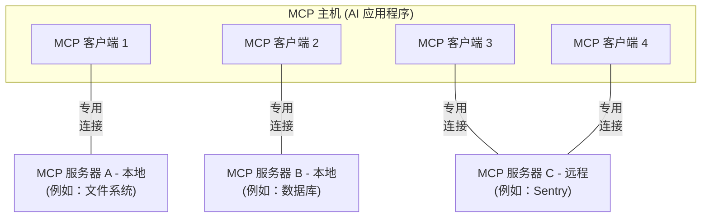

本模型上下文协议 (MCP) 概览讨论了其 [范围](#scope) 和 [MCP 的核心概念](#concepts-of-mcp)，并提供了一个 [示例](#example) 来演示每个核心概念。

由于 MCP SDK 抽象了许多关注点，大多数开发者可能会发现 [数据层协议](#data-layer-protocol) 部分最有用。它讨论了 MCP 服务器如何为 AI 应用程序提供上下文。

有关具体实现细节，请参阅 [特定语言的 SDK](/docs/sdk) 文档。

## 范围

模型上下文协议包括以下项目：

- [MCP 规范](https://modelcontextprotocol.io/specification/latest)：MCP 的规范，概述了客户端和服务器的实现要求。
- [MCP SDK](/docs/sdk)：实现 MCP 的不同编程语言的 SDK。
- **MCP 开发工具**：用于开发 MCP 服务器和客户端的工具，包括 [MCP Inspector](https://github.com/modelcontextprotocol/inspector)
- [MCP 参考服务器实现](https://github.com/modelcontextprotocol/servers)：MCP 服务器的参考实现。

<Note>
  MCP 仅专注于上下文交换的协议——它不规定
  AI 应用程序如何使用 LLM 或管理提供的上下文。
</Note>

## MCP 的核心概念

### 参与者

MCP 遵循客户端 - 服务器架构，其中 MCP 主机（一个 AI 应用程序，如 [Claude Code](https://www.anthropic.com/claude-code) 或 [Claude Desktop](https://www.claude.ai/download)）建立到一个或多个 MCP 服务器的连接。MCP 主机通过为每个 MCP 服务器创建一个 MCP 客户端来实现这一点。每个 MCP 客户端与其对应的 MCP 服务器保持专用连接。

使用 STDIO 传输的本地 MCP 服务器通常服务于单个 MCP 客户端，而使用 Streamable HTTP 传输的远程 MCP 服务器通常服务于多个 MCP 客户端。

MCP 架构中的关键参与者是：

- **MCP 主机**：协调和管理一个或多个 MCP 客户端的 AI 应用程序
- **MCP 客户端**：维护与 MCP 服务器的连接并从 MCP 服务器获取上下文供 MCP 主机使用的组件
- **MCP 服务器**：向 MCP 客户端提供上下文的程序

**例如**：Visual Studio Code 充当 MCP 主机。当 Visual Studio Code 建立到 MCP 服务器（例如 [Sentry MCP 服务器](https://docs.sentry.io/product/sentry-mcp/)）的连接时，Visual Studio Code 运行时会实例化一个 MCP 客户端对象来维护与 Sentry MCP 服务器的连接。
当 Visual Studio Code 随后连接到另一个 MCP 服务器（例如 [本地文件系统服务器](https://github.com/modelcontextprotocol/servers/tree/main/src/filesystem)）时，Visual Studio Code 运行时会实例化另一个 MCP 客户端对象来维护此连接。



请注意，**MCP 服务器**指的是提供上下文数据的程序，无论其运行在哪里。MCP 服务器可以在本地或远程执行。例如，当
Claude Desktop 启动 [文件系统
服务器](https://github.com/modelcontextprotocol/servers/tree/main/src/filesystem) 时，
服务器在同一台机器上本地运行，因为它使用 STDIO
传输。这通常被称为“本地”MCP 服务器。官方
[Sentry MCP 服务器](https://docs.sentry.io/product/sentry-mcp/) 运行在
Sentry 平台上，并使用 Streamable HTTP 传输。这通常被
称为“远程”MCP 服务器。

### 层级

MCP 由两层组成：

- **数据层**：定义基于 JSON-RPC 的客户端 - 服务器通信协议，包括生命周期管理和核心原语，如工具、资源、提示词和通知。
- **传输层**：定义启用客户端和服务器之间数据交换的通信机制和通道，包括特定传输的连接建立、消息 framing 和授权。

从概念上讲，数据层是内层，而传输层是外层。

#### 数据层

数据层实现基于 [JSON-RPC 2.0](https://www.jsonrpc.org/) 的交换协议，定义消息结构和语义。
该层包括：

- **生命周期管理**：处理客户端和服务器之间的连接初始化、能力协商和连接终止
- **服务器功能**：使服务器能够提供核心功能，包括用于 AI 操作的工具、用于上下文数据的资源以及用于与客户端交互的提示词模板
- **客户端功能**：使服务器能够请求客户端从主机 LLM 采样、从用户那里征求输入以及向客户端记录消息
- **实用功能**：支持额外功能，如用于实时更新的通知和用于长时间运行操作的进度跟踪

#### 传输层

传输层管理客户端和服务器之间的通信通道和身份验证。它处理连接建立、消息 framing 以及 MCP 参与者之间的安全通信。

MCP 支持两种传输机制：

- **Stdio 传输**：使用标准输入/输出流在同一机器上的本地进程之间进行直接进程通信，提供最佳性能且无网络开销。
- **Streamable HTTP 传输**：使用 HTTP POST 进行客户端到服务器的消息传递，可选使用 Server-Sent Events 进行流式传输。此传输支持远程服务器通信，并支持标准 HTTP 身份验证方法，包括 bearer 令牌、API 密钥和自定义标头。MCP 建议使用 OAuth 获取身份验证令牌。

传输层从协议层抽象出通信细节，使所有传输机制都能使用相同的 JSON-RPC 2.0 消息格式。

### 数据层协议

MCP 的核心部分是定义 MCP 客户端和 MCP 服务器之间的模式和语义。开发者可能会发现数据层——特别是 [原语](#primitives) 集合——是 MCP 中最有趣的部分。它是 MCP 定义开发者如何从 MCP 服务器共享上下文到 MCP 客户端的部分。

MCP 使用 [JSON-RPC 2.0](https://www.jsonrpc.org/) 作为其底层 RPC 协议。客户端和服务器相互发送请求并相应地响应。当不需要响应时，可以使用通知。

#### 生命周期管理

MCP 是一个 <Tooltip tip="MCP 的子集可以使用 Streamable HTTP 传输实现无状态">有状态协议</Tooltip>，需要生命周期管理。生命周期管理的目的是协商客户端和服务器都支持的 <Tooltip tip="客户端或服务器支持的功能和操作，例如工具、资源或提示词">功能</Tooltip>。详细信息可在 [规范](/specification/latest/basic/lifecycle) 中找到，[示例](#example) 展示了初始化序列。

#### 原语

MCP 原语是 MCP 中最重要的概念。它们定义了客户端和服务器可以相互提供什么。这些原语指定了可以与 AI 应用程序共享的上下文信息类型以及可以执行的操作范围。

MCP 定义了 _服务器_ 可以暴露的三个核心原语：

- **工具**：AI 应用程序可以调用以执行操作的可执行函数（例如，文件操作、API 调用、数据库查询）
- **资源**：为 AI 应用程序提供上下文信息的数据源（例如，文件内容、数据库记录、API 响应）
- **提示词**：帮助构建与语言模型交互的可重用模板（例如，系统提示词、few-shot 示例）

每种原语类型都有相关联的发现 (`*/list`)、检索 (`*/get`) 方法，在某些情况下还有执行 (`tools/call`) 方法。
MCP 客户端将使用 `*/list` 方法来发现可用的原语。例如，客户端可以先列出所有可用的工具 (`tools/list`)，然后执行它们。这种设计允许列表是动态的。

作为一个具体示例，考虑一个提供有关数据库上下文的 MCP 服务器。它可以暴露用于查询数据库的工具、包含数据库模式的资源，以及包含与工具交互的 few-shot 示例的提示词。

有关服务器原语的更多详细信息，请参阅 [服务器概念](./server-concepts)。

MCP 还定义了 _客户端_ 可以暴露的原语。这些原语允许 MCP 服务器作者构建更丰富的交互。

- **采样**：允许服务器从客户端的 AI 应用程序请求语言模型补全。当服务器作者希望访问语言模型，但又希望保持模型无关性，并且不在其 MCP 服务器中包含语言模型 SDK 时，这很有用。他们可以使用 `sampling/createMessage` 方法从客户端的 AI 应用程序请求语言模型补全。
- **诱导**：允许服务器向用户请求额外信息。当服务器作者希望从用户那里获取更多信息，或请求确认某项操作时，这很有用。他们可以使用 `elicitation/create` 方法从用户那里请求额外信息。
- **日志记录**：使服务器能够向客户端发送日志消息，以用于调试和监控目的。

有关客户端原语的更多详细信息，请参阅 [客户端概念](./client-concepts)。

除了服务器和客户端原语外，协议还提供跨领域的实用原语，以增强请求的执行方式：

- **任务（实验性）**：持久执行包装器，支持 MCP 请求的延迟结果检索和状态跟踪（例如，昂贵计算、工作流自动化、批处理、多步操作）

#### 通知

该协议支持实时通知，以启用服务器和客户端之间的动态更新。例如，当服务器的可用工具发生变化时（例如，当新功能可用或现有工具被修改时），服务器可以发送工具更新通知，以告知连接的客户端这些变化。通知作为 JSON-RPC 2.0 通知消息发送（不期望响应），并使 MCP 服务器能够向连接的客户端提供实时更新。

## 示例

### 数据层

本节提供了 MCP 客户端 - 服务器交互的逐步演练，重点关注数据层协议。我们将使用 JSON-RPC 2.0 消息演示生命周期序列、工具操作和通知。

<Steps>
<Step title="初始化（生命周期管理）">

MCP 通过能力协商握手开始生命周期管理。如 [生命周期管理](#lifecycle-management) 部分所述，客户端发送 `initialize` 请求以建立连接并协商支持的功能。

<CodeGroup>
  ```json Initialize Request
  {
    "jsonrpc": "2.0",
    "id": 1,
    "method": "initialize",
    "params": {
      "protocolVersion": "2025-06-18",
      "capabilities": {
        "elicitation": {}
      },
      "clientInfo": {
        "name": "example-client",
        "version": "1.0.0"
      }
    }
  }
  ```
  ```json Initialize Response
  {
    "jsonrpc": "2.0",
    "id": 1,
    "result": {
      "protocolVersion": "2025-06-18",
      "capabilities": {
        "tools": {
          "listChanged": true
        },
        "resources": {}
      },
      "serverInfo": {
        "name": "example-server",
        "version": "1.0.0"
      }
    }
  }
  ```
</CodeGroup>

#### 理解初始化交换

初始化过程是 MCP 生命周期管理的关键部分，具有几个关键目的：

1. **协议版本协商**：`protocolVersion` 字段（例如 "2025-06-18"）确保客户端和服务器使用兼容的协议版本。这防止了不同版本尝试交互时可能发生的通信错误。如果未协商出相互兼容的版本，则应终止连接。

2. **能力发现**：`capabilities` 对象允许各方声明他们支持的功能，包括他们可以处理哪些 [原语](#primitives)（工具、资源、提示）以及他们是否支持 [通知](#notifications) 等功能。这通过避免不支持的操作来实现高效通信。

3. **身份交换**：`clientInfo` 和 `serverInfo` 对象提供用于调试和兼容性的标识和版本信息。

在此示例中，能力协商展示了如何声明 MCP 原语：

**客户端能力**：

- `"elicitation": {}` - 客户端声明它可以处理用户交互请求（可以接收 `elicitation/create` 方法调用）

**服务器能力**：

- `"tools": {"listChanged": true}` - 服务器支持工具原语，并且可以在其工具列表更改时发送 `tools/list_changed` 通知
- `"resources": {}` - 服务器还支持资源原语（可以处理 `resources/list` 和 `resources/read` 方法）

成功初始化后，客户端发送通知以表明已准备就绪：

```json Notification
{
  "jsonrpc": "2.0",
  "method": "notifications/initialized"
}
```

#### 这在 AI 应用中如何工作

在初始化期间，AI 应用的 MCP 客户端管理器建立与配置服务器的连接，并存储其能力以供后续使用。应用使用此信息来确定哪些服务器可以提供特定类型的功能（工具、资源、提示）以及它们是否支持实时更新。

```python
# 伪代码
async with stdio_client(server_config) as (read, write):
    async with ClientSession(read, write) as session:
        init_response = await session.initialize()
        if init_response.capabilities.tools:
            app.register_mcp_server(session, supports_tools=True)
        app.set_server_ready(session)
```

</Step>

<Step title="工具发现（原语）">
现在连接已建立，客户端可以通过发送 `tools/list` 请求来发现可用工具。此请求是 MCP 工具发现机制的基础——它允许客户端在尝试使用工具之前了解服务器上有哪些可用工具。

<CodeGroup>
  ```json Tools List Request
  {
    "jsonrpc": "2.0",
    "id": 2,
    "method": "tools/list"
  }
  ```
  ```json Tools List Response
  {
    "jsonrpc": "2.0",
    "id": 2,
    "result": {
      "tools": [
        {
          "name": "calculator_arithmetic",
          "title": "Calculator",
          "description": "Perform mathematical calculations including basic arithmetic, trigonometric functions, and algebraic operations",
          "inputSchema": {
            "type": "object",
            "properties": {
              "expression": {
                "type": "string",
                "description": "Mathematical expression to evaluate (e.g., '2 + 3 * 4', 'sin(30)', 'sqrt(16)')"
              }
            },
            "required": ["expression"]
          }
        },
        {
          "name": "weather_current",
          "title": "Weather Information",
          "description": "Get current weather information for any location worldwide",
          "inputSchema": {
            "type": "object",
            "properties": {
              "location": {
                "type": "string",
                "description": "City name, address, or coordinates (latitude,longitude)"
              },
              "units": {
                "type": "string",
                "enum": ["metric", "imperial", "kelvin"],
                "description": "Temperature units to use in response",
                "default": "metric"
              }
            },
            "required": ["location"]
          }
        }
      ]
    }
  }
  ```
</CodeGroup>

#### 理解工具发现请求

`tools/list` 请求很简单，不包含任何参数。

#### 理解工具发现响应

响应包含一个 `tools` 数组，提供有关每个可用工具的全面元数据。这种基于数组的结构允许服务器同时公开多个工具，同时保持不同功能之间的清晰界限。

响应中的每个工具对象包含几个关键字段：

- **`name`**：服务器命名空间内工具的唯一标识符。这作为工具执行的主键，应遵循清晰的命名模式（例如 `calculator_arithmetic` 而不仅仅是 `calculate`）
- **`title`**：客户端可以向用户显示的工具的人类可读显示名称
- **`description`**：关于工具做什么以及何时使用的详细说明
- **`inputSchema`**：定义预期输入参数的 JSON Schema，启用类型验证并提供有关必需和可选参数的清晰文档

#### 这在 AI 应用中如何工作

AI 应用从所有连接的 MCP 服务器获取可用工具，并将它们合并到语言模型可以访问的统一工具注册表中。这允许 LLM 了解它可以执行哪些操作，并在对话期间自动生成适当的工具调用。

```python
# 使用 MCP Python SDK 模式的伪代码
available_tools = []
for session in app.mcp_server_sessions():
    tools_response = await session.list_tools()
    available_tools.extend(tools_response.tools)
conversation.register_available_tools(available_tools)
```

</Step>

<Step title="工具执行（原语）">
客户端现在可以使用 `tools/call` 方法执行工具。这展示了如何在实践中使用 MCP 原语：在发现可用工具后，客户端可以使用适当的参数调用它们。

#### 理解工具执行请求

`tools/call` 请求遵循结构化格式，确保客户端和服务器之间的类型安全和清晰通信。请注意，我们使用的是发现响应中的正确工具名称（`weather_current`），而不是简化的名称：

<CodeGroup>
  ```json Tool Call Request
  {
    "jsonrpc": "2.0",
    "id": 3,
    "method": "tools/call",
    "params": {
      "name": "weather_current",
      "arguments": {
        "location": "San Francisco",
        "units": "imperial"
      }
    }
  }
  ```
  ```json Tool Call Response
  {
    "jsonrpc": "2.0",
    "id": 3,
    "result": {
      "content": [
        {
          "type": "text",
          "text": "Current weather in San Francisco: 68°F, partly cloudy with light winds from the west at 8 mph. Humidity: 65%"
        }
      ]
    }
  }
  ```
</CodeGroup>

#### 工具执行的关键要素

请求结构包含几个重要组件：

1. **`name`**：必须与发现响应中的工具名称完全匹配（`weather_current`）。这确保服务器可以正确识别要执行哪个工具。

2. **`arguments`**：包含由工具的 `inputSchema` 定义的输入参数。在此示例中：
   - `location`: "San Francisco"（必需参数）
   - `units`: "imperial"（可选参数，如果未指定则默认为 "metric"）

3. **JSON-RPC 结构**：使用标准的 JSON-RPC 2.0 格式，带有唯一的 `id` 用于请求 - 响应关联。

#### 理解工具执行响应

响应展示了 MCP 灵活的内容系统：

1. **`content` 数组**：工具响应返回内容对象数组，允许丰富的多格式响应（文本、图像、资源等）

2. **内容类型**：每个内容对象都有一个 `type` 字段。在此示例中，`"type": "text"` 表示纯文本内容，但 MCP 支持各种用例的各种内容类型。

3. **结构化输出**：响应提供可操作的信息，AI 应用可将其用作语言模型交互的上下文。

此执行模式允许 AI 应用动态调用服务器功能并接收结构化响应，这些响应可以集成到与语言模型的对话中。

#### 这在 AI 应用中如何工作

当语言模型决定在对话期间使用工具时，AI 应用拦截工具调用，将其路由到适当的 MCP 服务器，执行它，并将结果作为对话流的一部分返回给 LLM。这使得 LLM 能够访问实时数据并在外部世界执行操作。

```python
# AI 应用工具执行的伪代码
async def handle_tool_call(conversation, tool_name, arguments):
    session = app.find_mcp_session_for_tool(tool_name)
    result = await session.call_tool(tool_name, arguments)
    conversation.add_tool_result(result.content)
```

</Step>

<Step title="实时更新（通知）">
MCP 支持实时通知，使服务器能够在未被明确请求的情况下通知客户端变更。这展示了通知系统，这是保持 MCP 连接同步和响应的关键功能。

#### 理解工具列表变更通知

当服务器的可用工具发生变化时——例如当新功能可用、现有工具被修改或工具暂时不可用时——服务器可以主动通知连接的客户端：

```json Request
{
  "jsonrpc": "2.0",
  "method": "notifications/tools/list_changed"
}
```

#### MCP 通知的关键特性

1. **无需响应**：注意通知中没有 `id` 字段。这遵循 JSON-RPC 2.0 通知语义，其中不期望或发送响应。

2. **基于能力**：此通知仅由在初始化期间在其工具能力中声明 `"listChanged": true` 的服务器发送（如步骤 1 所示）。

3. **事件驱动**：服务器根据内部状态变化决定何时发送通知，使 MCP 连接具有动态性和响应性。

#### 客户端对通知的响应

收到此通知后，客户端通常通过请求更新的工具列表来做出反应。这创建了一个刷新循环，使客户端对可用工具的理解保持最新：

```json Request
{
  "jsonrpc": "2.0",
  "id": 4,
  "method": "tools/list"
}
```

#### 为什么通知很重要

此通知系统至关重要，原因如下：

1. **动态环境**：工具可能会根据服务器状态、外部依赖或用户权限而出现或消失
2. **效率**：客户端无需轮询更改；它们在更新发生时收到通知
3. **一致性**：确保客户端始终拥有有关可用服务器能力的准确信息
4. **实时协作**：启用可适应变化上下文的响应式 AI 应用

此通知模式扩展到工具以外的其他 MCP 原语，实现客户端和服务器之间的全面实时同步。

#### 这在 AI 应用中如何工作

当 AI 应用收到有关工具更改的通知时，它会立即刷新其工具注册表并更新 LLM 的可用能力。这确保持续的对话始终可以访问最新的工具集，并且 LLM 可以动态适应新功能的可用性。

```python
# AI 应用通知处理的伪代码
async def handle_tools_changed_notification(session):
    tools_response = await session.list_tools()
    app.update_available_tools(session, tools_response.tools)
    if app.conversation.is_active():
        app.conversation.notify_llm_of_new_capabilities()
```

</Step>
</Steps>
