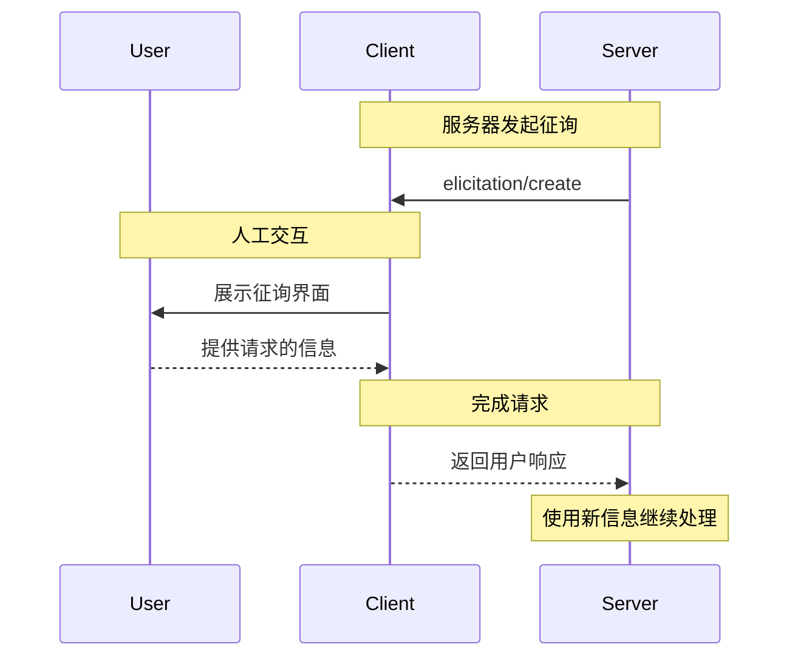
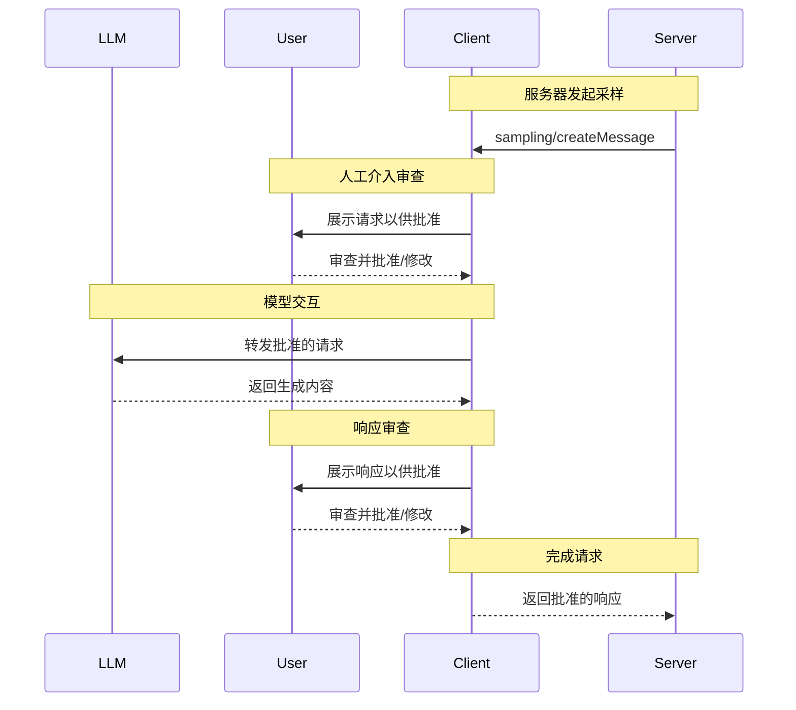

MCP 客户端由宿主应用程序实例化，以便与特定的 MCP 服务器通信。宿主应用程序（如 Claude.ai 或 IDE）管理整体用户体验并协调多个客户端。每个客户端处理与一个服务器的直接通信。

理解这种区别很重要：_宿主_ 是用户交互的应用程序，而 _客户端_ 是启用服务器连接的协议级组件。

## 核心客户端功能

除了利用服务器提供的上下文外，客户端还可以向服务器提供 several 功能。这些客户端功能允许服务器作者构建更丰富的交互。

| 功能 | 解释 | 示例 |
| --------------- | --------------------------------------------------------------------------------------------------------------------------------- | -------------------------------------------------------------------------------------------------------------------------------------- |
| **征询 (Elicitation)** | 征询功能使服务器能够在交互过程中请求用户的特定信息，为服务器提供一种按需收集信息的结构化方式。 | 预订旅行的服务器可能会询问用户对飞机座位、房间类型的偏好或其联系电话，以完成预订。 |
| **根目录 (Roots)** | 根目录允许客户端指定服务器应关注的目录，通过协调机制传达预期的范围。 | 预订旅行的服务器可能被授予访问特定目录的权限，从中它可以读取用户的日历。 |
| **采样 (Sampling)** | 采样允许服务器通过客户端请求大语言模型 (LLM) 补全，从而实现代理工作流。这种方法使客户端完全控制用户权限和安全措施。 | 预订旅行的服务器可以将航班列表发送给大语言模型，并请求大语言模型为用户选择最佳航班。 |

### 征询 (Elicitation)

征询功能使服务器能够在交互过程中请求用户的特定信息，创建更动态和响应式的工作流。

#### 概述

征询为服务器提供了一种按需收集必要信息的结构化方式。服务器无需预先要求所有信息或在数据缺失时失败，而是可以暂停操作以请求用户的特定输入。这创造了更灵活的交互，服务器适应用户需求而不是遵循僵化的模式。

**征询流程：**



该流程支持动态信息收集。服务器可以在需要时请求特定数据，用户通过适当的界面提供信息，服务器使用新获取的上下文继续处理。

**征询组件示例：**

```typescript
{
  method: "elicitation/requestInput",
  params: {
    message: "请确认您的巴塞罗那度假预订详情：",
    schema: {
      type: "object",
      properties: {
        confirmBooking: {
          type: "boolean",
          description: "确认预订（航班 + 酒店 = $3,000）"
        },
        seatPreference: {
          type: "string",
          enum: ["window", "aisle", "no preference"],
          description: "航班首选座位类型"
        },
        roomType: {
          type: "string",
          enum: ["sea view", "city view", "garden view"],
          description: "酒店首选房间类型"
        },
        travelInsurance: {
          type: "boolean",
          default: false,
          description: "添加旅行保险 ($150)"
        }
      },
      required: ["confirmBooking"]
    }
  }
}
```

#### 示例：假期预订审批

旅行预订服务器通过最终预订确认流程展示了征询功能的强大之处。当用户选择了理想的巴塞罗那度假套餐后，服务器需要在继续之前收集最终审批和任何缺失的详细信息。

服务器通过结构化请求征询预订确认，其中包括行程摘要（巴塞罗那航班 6 月 15-22 日，海滨酒店，总计 $3,000）以及任何额外偏好的字段——例如座位选择、房间类型或旅行保险选项。

随着预订的进行，服务器征询完成预订所需的联系信息。它可能会询问航班预订的旅行者详细信息、酒店的特殊请求或紧急联系信息。

#### 用户交互模型

征询交互旨在清晰、具有上下文意识并尊重用户自主权：

**请求展示**：客户端展示征询请求时，会提供关于哪个服务器在请求、为何需要该信息以及将如何使用的清晰上下文。请求消息解释目的，而模式提供结构和验证。

**响应选项**：用户可以通过适当的 UI 控件（文本字段、下拉菜单、复选框）提供请求的信息，选择拒绝提供信息（可选解释），或取消整个操作。客户端在将响应返回给服务器之前，会根据提供的模式验证响应。

**隐私考虑**：征询从不请求密码或 API 密钥。客户端会警告可疑请求，并让用户在发送前审查数据。

### 根目录 (Roots)

根目录定义服务器操作的文件系统边界，允许客户端指定服务器应关注的目录。

#### 概述

根目录是客户端向服务器传达文件系统访问边界的机制。它们由文件 URI 组成，指示服务器可以操作的目录，帮助服务器理解可用文件和文件夹的范围。虽然根目录传达预期的边界，但它们不执行安全限制。实际安全必须在操作系统级别通过文件权限和/或沙箱来执行。

**根目录结构：**

```json
{
  "uri": "file:///Users/agent/travel-planning",
  "name": "旅行规划工作区"
}
```

根目录专门用于文件系统路径，并且始终使用 `file://` URI 方案。它们帮助服务器理解项目边界、工作区组织和可访问的目录。根目录列表可以随着用户使用不同项目或文件夹而动态更新，当边界更改时，服务器会通过 `roots/list_changed` 接收通知。

#### 示例：旅行规划工作区

处理多个客户行程的旅行代理受益于使用根目录来组织文件系统访问。考虑一个具有不同目录用于旅行规划各个方面的工作区。

客户端向旅行规划服务器提供文件系统根目录：

- `file:///Users/agent/travel-planning` - 包含所有旅行文件的主工作区
- `file:///Users/agent/travel-templates` - 可重用的行程模板和资源
- `file:///Users/agent/client-documents` - 客户护照和旅行文件

当代理创建巴塞罗那行程时，行为良好的服务器会尊重这些边界——在指定的根目录内访问模板、保存新行程以及引用客户文档。服务器通常通过使用根目录的相对路径或利用尊重根目录边界的文件搜索工具来访问根目录内的文件。

如果代理打开存档文件夹（如 `file:///Users/agent/archive/2023-trips`），客户端会通过 `roots/list_changed` 更新根目录列表。

有关尊重根目录的服务器的完整实现，请参阅官方服务器仓库中的 [文件系统服务器](https://github.com/modelcontextprotocol/servers/tree/main/src/filesystem)。

#### 设计理念

根目录作为客户端和服务器之间的协调机制，而不是安全边界。规范要求服务器“应该尊重根目录边界”，而不是“必须执行”它们，因为服务器运行客户端无法控制的代码。

当服务器受信任或经过审查、用户理解其咨询性质，且目标是防止意外而不是阻止恶意行为时，根目录效果最佳。它们擅长上下文范围界定（告诉服务器关注哪里）、事故预防（帮助行为良好的服务器保持在边界内）和工作流组织（例如自动管理项目边界）。

#### 用户交互模型

根目录通常由宿主应用程序根据用户操作自动管理，尽管某些应用程序可能会暴露手动根目录管理：

**自动根目录检测**：当用户打开文件夹时，客户端会自动将它们暴露为根目录。打开旅行工作区允许客户端将该目录暴露为根目录，帮助服务器理解哪些行程和文档在当前工作范围内。

**手动根目录配置**：高级用户可以通过配置指定根目录。例如，添加 `/travel-templates` 用于可重用资源，同时排除包含财务记录的目录。

### 采样 (Sampling)

采样允许服务器通过客户端请求语言模型补全，从而实现代理行为，同时保持安全性和用户控制。

#### 概述

采样使服务器能够执行依赖 AI 的任务，而无需直接集成或支付 AI 模型费用。相反，服务器可以请求已经具有 AI 模型访问权限的客户端代表它们处理这些任务。这种方法使客户端完全控制用户权限和安全措施。由于采样请求发生在其他操作的上下文中（如工具分析数据），并作为单独的模型调用处理，它们在不同上下文之间保持清晰的边界，从而更有效地使用上下文窗口。

**采样流程：**



该流程通过多个人工介入检查点确保安全性。用户在初始请求和生成的响应返回服务器之前，可以审查并修改它们。

**请求参数示例：**

```typescript
{
  messages: [
    {
      role: "user",
      content: "分析这些航班选项并推荐最佳选择：\n" +
               "[47 个航班，包含价格、时间、航空公司和中转信息]\n" +
               "用户偏好：早晨出发，最多 1 次中转"
    }
  ],
  modelPreferences: {
    hints: [{
      name: "claude-sonnet-4-20250514"  // 建议的模型
    }],
    costPriority: 0.3,      // 不太关心 API 成本
    speedPriority: 0.2,     // 可以等待 thorough 分析
    intelligencePriority: 0.9  // 需要复杂的权衡评估
  },
  systemPrompt: "你是一位旅行专家，帮助用户根据偏好找到最佳航班",
  maxTokens: 1500
}
```

#### 示例：航班分析工具

考虑一个具有名为 `findBestFlight` 的工具的旅行预订服务器，该工具使用采样来分析可用航班并推荐最佳选择。当用户询问“为我预订下个月去巴塞罗那的最佳航班”时，该工具需要 AI 协助来评估复杂的权衡。

该工具查询航空公司 API 并收集 47 个航班选项。然后请求 AI 协助分析这些选项：“分析这些航班选项并推荐最佳选择：[47 个航班，包含价格、时间、航空公司和中转信息] 用户偏好：早晨出发，最多 1 次中转。”

客户端发起采样请求，允许 AI 评估权衡——例如更便宜的红眼航班与方便的早晨出发。该工具使用此分析来呈现前三个推荐。

#### 用户交互模型

虽然不是强制要求，但采样旨在允许人工介入控制。用户可以通过几种机制保持监督：

**批准控制**：采样请求可能需要明确的用户同意。客户端可以显示服务器想要分析的内容及原因。用户可以批准、拒绝或修改请求。

**透明度功能**：客户端可以显示确切的提示、模型选择和令牌限制，允许用户在响应返回服务器之前审查 AI 响应。

**配置选项**：用户可以设置模型偏好，为受信任的操作配置自动批准，或要求所有内容都需批准。客户端可以提供选项以编辑敏感信息。

**安全考虑**：客户端和服务器都必须在采样期间适当处理敏感数据。客户端应实施速率限制并验证所有消息内容。人工介入设计确保服务器发起的 AI 交互不会危及安全或在没有明确用户同意的情况下访问敏感数据。
