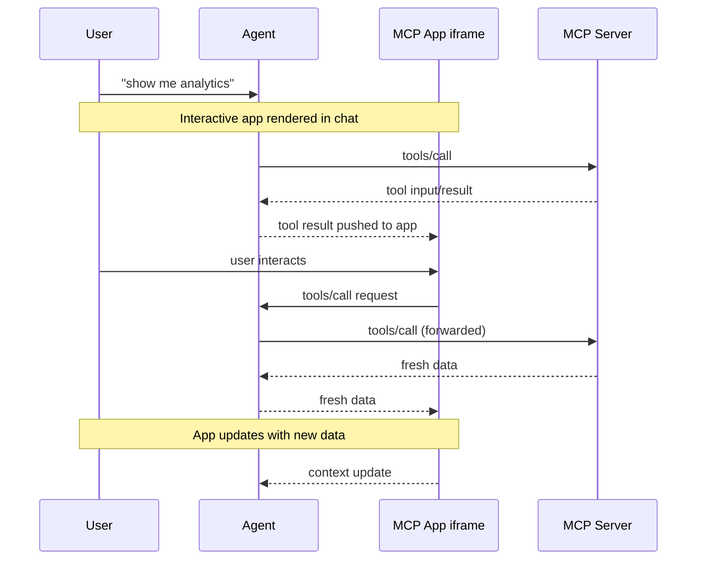

<Tip>

如需全面的 API 文档、高级模式和完整规范，请访问 [官方 MCP 应用文档](https://apps.extensions.modelcontextprotocol.io)。

</Tip>

文本回复的能力有限。有时用户需要与数据交互，而不仅仅是阅读。MCP 应用允许服务器返回交互式 HTML 界面（数据可视化、表单、仪表盘），这些界面可以直接渲染在聊天窗口中。

## 为什么不直接构建一个 Web 应用？

您可以构建一个独立的 Web 应用并向用户发送链接。然而，MCP 应用提供了独立页面无法比拟的关键优势：

- **上下文保留。** 应用存在于对话内部。用户无需切换标签页、丢失位置或疑惑哪个聊天线程中有该仪表盘。UI 就在那里，与导致它的讨论并肩呈现。
- **双向数据流。** 您的应用可以调用 MCP 服务器上的任何工具，主机可以将新鲜结果推送到您的应用。独立的 Web 应用需要自己的 API、身份验证和状态管理。MCP 应用通过现有的 MCP 模式获得这些功能。
- **与主机功能的集成**。应用可以将操作委托给主机，主机随后可以调用用户已连接的功能和工具（需经用户同意）。无需每个应用都实现和维护直接集成（例如电子邮件提供商），应用可以请求结果（如“安排此会议”），主机将其通过用户现有的已连接功能进行路由。
- **安全保障。** MCP 应用在由主机控制的沙箱 iframe 中运行。它们无法访问父页面、窃取 cookie 或逃逸其容器。这意味着主机可以安全地渲染第三方应用，而无需完全信任服务器作者。

如果您的用例没有从这些属性中受益，普通的 Web 应用可能更简单。但如果您希望与基于 LLM 的对话紧密集成，MCP 应用是更好的工具。

## MCP 应用的工作原理

传统 MCP 工具返回文本、图像、资源或结构化数据，主机将其作为对话的一部分显示。MCP 应用扩展了这种模式，允许工具在其工具描述中声明对交互式 UI 的引用，主机将其原地渲染。

核心模式结合了两个 MCP 原语：一个在其描述中声明 UI 资源的工具，加上一个将数据渲染为交互式 HTML 界面的 UI 资源。

当大型语言模型 (LLM) 决定调用支持 MCP 应用的工具时，会发生以下情况：

1. **UI 预加载**：工具描述包含一个 `_meta.ui.resourceUri` 字段，指向 `ui://` 资源。主机甚至在工具被调用之前就可以预加载此资源，从而实现将流式工具输入到应用等功能。

2. **资源获取**：主机从服务器获取 UI 资源。此资源包含一个 HTML 页面，为简便起见，通常与其 JavaScript 和 CSS 捆绑在一起。应用也可以从 `_meta.ui.csp` 中指定的来源加载外部脚本和资源。

3. **沙箱渲染**：Web 主机通常在对话内的沙箱 [iframe](https://developer.mozilla.org/en-US/docs/Web/HTML/Element/iframe) 中渲染 HTML。沙箱限制应用对父页面的访问，确保安全性。资源的 `_meta.ui` 对象可以包含 `permissions` 以请求额外功能（例如麦克风、摄像头），以及 `csp` 以控制应用可以从哪些外部来源加载资源。

4. **双向通信**：应用和主机通过形成自己 MCP 方言的 JSON-RPC 协议进行通信。一些请求和通知与核心 MCP 协议共享（例如 `tools/call`），一些类似（例如 `ui/initialize`），大多数是带有 `ui/` 方法名前缀的新内容。应用可以请求工具调用、发送消息、更新模型的上下文并从主机接收数据。

应用与主机保持隔离，但仍可以通过安全的 postMessage 通道调用 MCP 工具。

## 何时使用 MCP 应用

当您的用例涉及以下情况时，MCP 应用非常合适：

**探索复杂数据。** 用户询问“按地区显示销售额”。文本回复可能会列出数字，但 MCP 应用可以渲染交互式地图，用户可以在其中点击地区进行深入查看、悬停查看详细信息以及在指标之间切换，所有这些都无需额外的提示。

**配置众多选项。** 设置部署涉及数十个相互依赖的选择。MCP 应用无需来回对话（“哪个地区？”“什么实例大小？”“启用自动缩放？”），而是呈现一个表单，用户可以在其中一次性看到所有选项，并进行验证和默认设置。

**查看富媒体。** 当用户要求查看 PDF、查看 3D 模型或预览生成的图像时，文本描述显得不足。MCP 应用将实际查看器（平移、缩放、旋转）直接嵌入对话中。

**实时监控。** 显示实时指标、日志或系统状态的仪表盘需要持续更新。MCP 应用保持持久连接，在数据变化时更新显示，无需用户询问“现在状态如何？”。

**多步骤工作流。** 批准费用报告、审查代码更改或分类问题涉及逐个检查项目。MCP 应用提供导航控件、操作按钮以及在交互之间持久存在的状态。

## 安全模型

MCP 应用在沙箱 [iframe](https://developer.mozilla.org/docs/Web/HTML/Element/iframe) 中运行，这与主机应用程序提供了强大的隔离。沙箱防止您的应用访问父窗口的 [DOM](https://developer.mozilla.org/docs/Web/API/Document_Object_Model)、读取主机的 cookie 或本地存储、导航父页面或在父上下文中执行脚本。

您的应用与主机之间的所有通信都通过 [postMessage API](https://developer.mozilla.org/docs/Web/API/Window/postMessage) 进行。主机控制您的应用可以访问哪些功能。例如，主机可能会限制应用可以调用哪些工具或禁用 `sendOpenLink` 功能。

沙箱旨在防止应用逃逸以访问主机或用户数据。

## 框架支持

MCP 应用使用自己的 MCP 方言，像核心协议一样建立在 JSON-RPC 之上。一些消息与常规 MCP 共享（例如 `tools/call`），而另一些则是应用特定的（例如 `ui/initialize`）。传输是 [postMessage](https://developer.mozilla.org/docs/Web/API/Window/postMessage) 而不是 stdio 或 HTTP。由于都是标准 Web 原语，您可以使用任何框架或根本不使用。

来自 `@modelcontextprotocol/ext-apps` 的 `App` 类是一个便利的包装器，并非必需。如果您希望避免依赖或需要更紧密的控制，可以直接实现 [postMessage 协议](https://github.com/modelcontextprotocol/ext-apps/blob/main/specification/2026-01-26/apps.mdx)。

[示例目录](https://github.com/modelcontextprotocol/ext-apps/tree/main/examples) 包括 React、Vue、Svelte、Preact、Solid 和 vanilla JavaScript 的入门模板。这些展示了每个框架系统的推荐模式，但它们只是示例而非要求。您可以选择最适合您用例的任何方案。

## 客户端支持

<Note>

MCP 应用是 [核心 MCP 规范](/specification) 的扩展。主机支持因客户端而异。

</Note>

MCP 应用目前受 [Claude](https://claude.ai)、[Claude Desktop](https://claude.ai/download)、[VS Code GitHub Copilot](https://code.visualstudio.com/)、[Goose](https://block.github.io/goose/)、[Postman](https://postman.com)、[MCPJam](https://www.mcpjam.com/) 和 [Archestra.AI](https://www.archestra.ai/) 支持。有关各客户端扩展支持的完整列表，请参阅 [客户端矩阵](/extensions/client-matrix)。

如果您正在构建 MCP 客户端并希望支持 MCP 应用，您有两个选项：

1. **使用框架**：[`@mcp-ui/client`](https://github.com/MCP-UI-Org/mcp-ui) 包提供 React 组件，用于在主机应用程序中渲染和与 MCP 应用视图交互。请参阅 [MCP-UI 文档](https://mcpui.dev/) 以获取使用详情。

2. **基于 AppBridge 构建**：SDK 包含一个 [**App Bridge**](https://apps.extensions.modelcontextprotocol.io/api/modules/app-bridge.html) 模块，用于处理在沙箱 iframe 中渲染应用、消息传递、工具调用代理和安全策略执行。[basic-host 示例](https://github.com/modelcontextprotocol/ext-apps/tree/main/examples/basic-host) 展示了如何集成它。

请参阅 [API 文档](https://apps.extensions.modelcontextprotocol.io/api/) 以获取实现详情。

## 示例

[ext-apps 仓库](https://github.com/modelcontextprotocol/ext-apps/tree/main/examples) 包括现成的示例，展示不同的用例：

- **3D 与可视化**：
  [map-server](https://github.com/modelcontextprotocol/ext-apps/tree/main/examples/map-server)
  (CesiumJS 地球仪),
  [threejs-server](https://github.com/modelcontextprotocol/ext-apps/tree/main/examples/threejs-server)
  (Three.js 场景),
  [shadertoy-server](https://github.com/modelcontextprotocol/ext-apps/tree/main/examples/shadertoy-server)
  (着色器效果)
- **数据探索**：
  [cohort-heatmap-server](https://github.com/modelcontextprotocol/ext-apps/tree/main/examples/cohort-heatmap-server),
  [customer-segmentation-server](https://github.com/modelcontextprotocol/ext-apps/tree/main/examples/customer-segmentation-server),
  [wiki-explorer-server](https://github.com/modelcontextprotocol/ext-apps/tree/main/examples/wiki-explorer-server)
- **商业应用**：
  [scenario-modeler-server](https://github.com/modelcontextprotocol/ext-apps/tree/main/examples/scenario-modeler-server),
  [budget-allocator-server](https://github.com/modelcontextprotocol/ext-apps/tree/main/examples/budget-allocator-server)
- **媒体**：
  [pdf-server](https://github.com/modelcontextprotocol/ext-apps/tree/main/examples/pdf-server),
  [video-resource-server](https://github.com/modelcontextprotocol/ext-apps/tree/main/examples/video-resource-server),
  [sheet-music-server](https://github.com/modelcontextprotocol/ext-apps/tree/main/examples/sheet-music-server),
  [say-server](https://github.com/modelcontextprotocol/ext-apps/tree/main/examples/say-server)
  (文本转语音)
- **实用工具**：
  [qr-server](https://github.com/modelcontextprotocol/ext-apps/tree/main/examples/qr-server),
  [system-monitor-server](https://github.com/modelcontextprotocol/ext-apps/tree/main/examples/system-monitor-server),
  [transcript-server](https://github.com/modelcontextprotocol/ext-apps/tree/main/examples/transcript-server)
  (语音转文本)
- **入门模板**：
  [React](https://github.com/modelcontextprotocol/ext-apps/tree/main/examples/basic-server-react),
  [Vue](https://github.com/modelcontextprotocol/ext-apps/tree/main/examples/basic-server-vue),
  [Svelte](https://github.com/modelcontextprotocol/ext-apps/tree/main/examples/basic-server-svelte),
  [Preact](https://github.com/modelcontextprotocol/ext-apps/tree/main/examples/basic-server-preact),
  [Solid](https://github.com/modelcontextprotocol/ext-apps/tree/main/examples/basic-server-solid),
  [vanilla JavaScript](https://github.com/modelcontextprotocol/ext-apps/tree/main/examples/basic-server-vanillajs)

要开始构建您自己的 MCP 应用，请参阅 [构建指南](/extensions/apps/build)。
