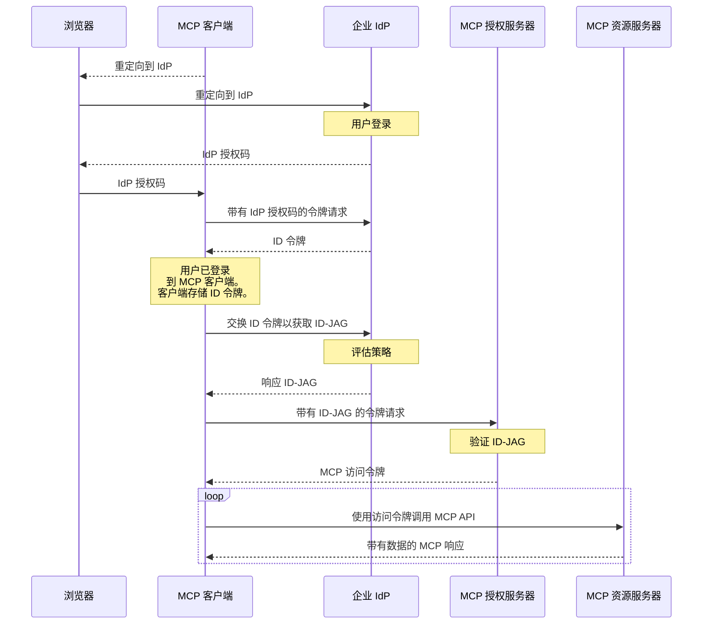

Enterprise-Managed Authorization 扩展（`io.modelcontextprotocol/enterprise-managed-authorization`）使组织能够通过现有的身份提供商 (IdP) 集中控制 MCP 服务器访问。组织的 IT 或安全团队可以在一个地方管理访问策略，而不是让每位员工单独授权每个 MCP 服务器。

<Card
  title="规范"
  icon="file-lines"
  href="https://github.com/modelcontextprotocol/ext-auth/blob/main/specification/stable/enterprise-managed-authorization.mdx"
>
  Enterprise-Managed Authorization 扩展的完整技术规范。
</Card>

## 是什么

在标准的 MCP 部署中，每个用户独立授权 MCP 客户端访问每个 MCP 服务器。对于消费者应用程序，这种用户驱动的模式是理想的——它让个人控制谁可以访问他们的数据。

在企业环境中，这种模式会产生摩擦和安全漏洞：

- 员工不需要了解其组织使用的每个 MCP 服务器的授权细节
- 如果每个用户独立授权，安全团队无法执行一致的访问策略
- 入职新员工需要他们手动授权数十项服务
- 离职需要在每项服务中单独撤销访问权限

Enterprise-Managed Authorization 通过引入组织的 IdP 作为权威决策者来解决这个问题。IdP（如 Okta、Azure AD 或企业 SSO 系统）控制员工可以访问哪些 MCP 服务器以及在什么条件下访问。员工使用其企业身份（与他们用于电子邮件、Slack 和其他工作工具相同的凭据）进行身份验证，IdP 根据组织策略授予或拒绝 MCP 服务器访问权限。

## 何时使用

在以下情况下使用 Enterprise-Managed Authorization：

- **在企业环境中部署 MCP**，其中 IT 管理所有业务应用程序的访问权限
- **执行组织访问策略**——你需要确保只有授权员工才能访问特定的 MCP 服务器
- **集中访问控制**——你希望从单个管理控制台添加或撤销对 MCP 服务器的访问权限
- **满足合规性要求**——你的组织需要所有 MCP 服务器访问的可审计授权轨迹
- **简化员工体验**——员工应使用现有的企业 SSO 凭据访问 MCP 工具，无需每个服务的授权流程

## 工作原理

该扩展建立了一个委托授权流程，其中企业 IdP 充当 MCP 客户端和 MCP 服务器之间的中介。MCP 客户端向企业 IdP 请求一种特殊类型的令牌，称为身份断言 JWT 授权授予（Identity Assertion JWT Authorization Grant），简称 ID-JAG。然后，MCP 客户端将 ID-JAG 交换为来自 MCP 服务器授权服务器的访问令牌：



流程的关键方面：

1. **集中策略**：企业 IdP 维护已批准的 MCP 服务器注册表及每个服务器的访问策略。管理员在其现有的身份管理工具中配置这些内容。

2. **单点登录**：员工使用企业凭据进行一次身份验证。IdP 颁发令牌，授予对已批准 MCP 服务器的访问权限，无需额外的每服务器授权提示。

3. **策略执行**：IdP 在颁发令牌之前评估访问策略（组成员资格、角色分配、条件访问规则）。缺乏授权的员工将收到适当的错误——MCP 客户端永远不会收到未授权服务器的令牌。

4. **集中撤销**：撤销员工对 MCP 服务器的访问权限发生在 IdP 级别，立即在所有 MCP 客户端生效。无需每客户端、每服务器撤销。

## 实施指南

### 对于 MCP 客户端

要支持 Enterprise-Managed Authorization，你的客户端必须：

1. **在 `initialize` 请求中声明支持**：

```json
{
  "capabilities": {
    "extensions": {
      "io.modelcontextprotocol/enterprise-managed-authorization": {}
    }
  }
}
```

2. **支持 SSO** —— 用户应使用企业 IdP 向 MCP 客户端进行身份验证。保存登录期间颁发的身份断言（OpenID ID 令牌或 SAML 断言）以供后续使用。

3. **处理 ID-JAG** —— 当服务器指示需要企业托管授权时，使用之前获得的身份断言向企业 IdP 的授权端点请求 ID-JAG 令牌。将此 ID-JAG 交换为来自 MCP 授权服务器的访问令牌。不要将用户重定向到 MCP 授权服务器的授权端点。

4. **支持组织配置** —— 允许管理员配置企业 IdP 的端点，通常通过组织级设置而不是每用户设置。

5. **尊重令牌范围** —— 企业 IdP 颁发的令牌可能具有与标准 MCP 授权不同的范围限制。优雅地处理范围错误。

### 对于 MCP 服务器

要要求企业托管授权：

1. **在服务器的授权元数据中声明扩展**，指示客户端必须使用企业托管流程。

2. **与 IdP 管理 API 集成**（可选）—— 发布服务器的资源描述符，以便企业管理员可以在其 IdP 管理控制台中配置访问策略。

### 对于 MCP 授权服务器

1. **验证企业 IdP 颁发的 ID-JAG**。这通常意味着针对 IdP 的 JWKS 端点验证 JWT 签名，并检查令牌的受众、颁发者和过期时间。

2. **将 IdP 声明映射到权限** —— ID-JAG 令牌携带声明（范围和资源信息），你的服务器使用这些声明来确定员工是谁以及员工可以访问什么。基于这些声明定义你的授权逻辑。

3. **处理账户关联** —— ID-JAG 令牌始终会包含 `subject` 声明，并且还可能包含 `email` 声明，可用于将企业身份链接到你系统中的现有账户。将 `subject` 声明用作用户的主要稳定标识符，并在匹配企业托管授权配置之前已创建的现有账户时，将 `email` 声明作为回退。

## 客户端支持

<Note>

对此扩展的支持因客户端而异。扩展是可选的，默认情况下从不激活。

</Note>

查看 [客户端矩阵](/extensions/client-matrix) 以了解当前跨 MCP 客户端的实施状态。Enterprise-Managed Authorization 通常除了 MCP 客户端应用程序外，还需要组织的 IT 团队提供客户端级支持。

## 相关资源

<CardGroup cols={2}>
  <Card
    title="ext-auth 仓库"
    icon="github"
    href="https://github.com/modelcontextprotocol/ext-auth"
  >
    源代码和参考实现
  </Card>
  <Card
    title="完整规范"
    icon="file-lines"
    href="https://github.com/modelcontextprotocol/ext-auth/blob/main/specification/stable/enterprise-managed-authorization.mdx"
  >
    带有规范性要求的技术规范
  </Card>
  <Card
    title="SEP-990"
    icon="file-lines"
    href="/seps/990-enable-enterprise-idp-policy-controls-during-mcp-o"
  >
    原始提案：启用企业 IdP 策略控制
  </Card>
  <Card
    title="MCP 授权"
    icon="lock"
    href="/specification/latest/basic/authorization"
  >
    核心 MCP 授权规范
  </Card>
</CardGroup>
