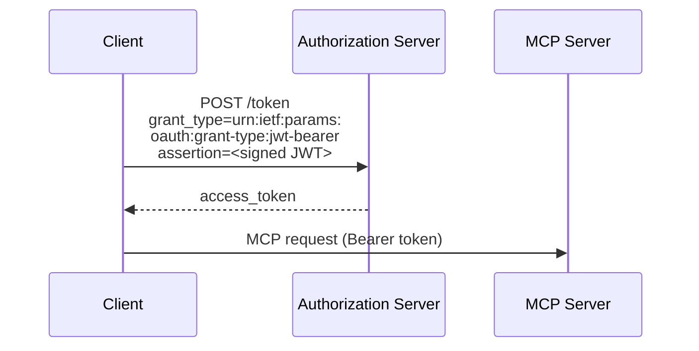
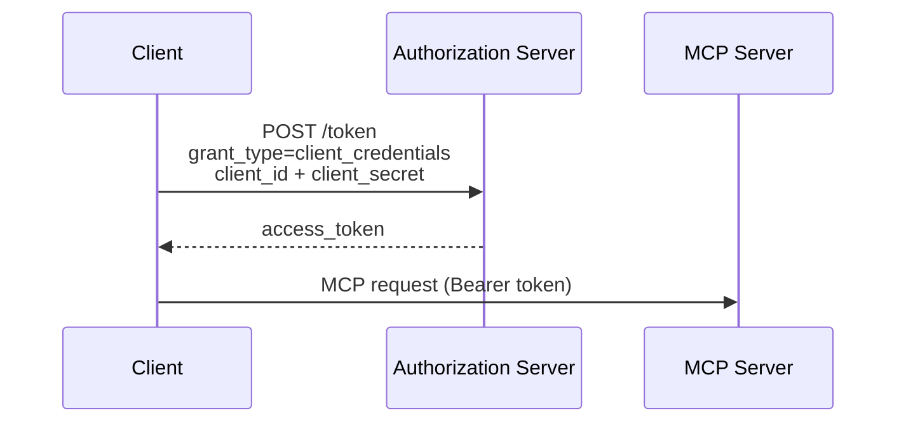

OAuth 客户端凭证扩展（`io.modelcontextprotocol/oauth-client-credentials`）为 MCP 添加了对 [OAuth 2.0 客户端凭证流程](https://datatracker.ietf.org/doc/html/rfc6749#section-4.4) 的支持。这使得自动化系统能够在无需交互式用户授权的情况下连接到 MCP 服务器。

<Card
  title="规范"
  icon="file-lines"
  href="https://github.com/modelcontextprotocol/ext-auth/blob/main/specification/draft/oauth-client-credentials.mdx"
>
  OAuth 客户端凭证扩展的完整技术规范。
</Card>

## 它是什么

标准 MCP 授权流程要求用户交互式地批准访问——浏览器打开，用户登录，并授予权限。这对人类用户效果很好，但当没有用户在场时会失效。

OAuth 客户端凭证扩展通过允许客户端使用应用级凭证（客户端 ID 和密钥，或签名的 JWT 断言）而不是委托的用户凭证进行认证来解决这个问题。客户端直接向授权服务器证明其身份，授权服务器颁发访问令牌，无需浏览器重定向或用户交互。

## 何时使用

当以下情况时使用 OAuth 客户端凭证：

- **后台服务**需要在没有用户在场的情况下按计划或响应事件调用 MCP 工具
- **CI/CD 流水线**作为自动化构建、测试或部署工作流的一部分调用 MCP 服务器
- **服务器到服务器的集成**连接两个没有最终用户参与的后端系统
- **守护进程**或长期运行的工作者需要持久访问 MCP 资源

如果您的集成涉及应该明确授权访问的人类用户，请改用标准 MCP 授权流程。

## 工作原理

该扩展支持两种凭证格式：

### JWT Bearer 断言（推荐）

定义于 [RFC 7523](https://datatracker.ietf.org/doc/html/rfc7523)，JWT Bearer 断言允许客户端使用其私钥签名令牌，并将其作为身份证明呈现。授权服务器使用客户端注册的公钥验证签名。



JWT 断言通常包括：

- `iss`: 客户端 ID（颁发者）
- `sub`: 客户端 ID（被认证的主体）
- `aud`: 授权服务器令牌端点 URL
- `exp`: 过期时间
- `iat`: 签发时间

### 客户端密钥

对于更简单的部署，该扩展还支持使用 `client_id` 和 `client_secret` 的标准客户端凭证流程。客户端将其凭证直接发送到授权服务器的令牌端点，并接收访问令牌作为交换。



<Warning>

客户端密钥是**长期凭证**，授予无需用户交互的访问权限。如果密钥泄露，攻击者可以静默认证为您的应用，直到密钥被轮换。为了降低风险：

- 将密钥存储在密钥管理器中，切勿存储在签入版本控制的源代码或环境文件中。
- 定期轮换密钥，并在任何疑似泄露后立即轮换。
- 将凭证权限范围限制为所需的最小权限。
- 尽可能首选 JWT 断言——它们是短期的，且不需要传输签名密钥。

</Warning>

## 实施指南

### 对于 MCP 客户端

要使用 OAuth 客户端凭证扩展，您的客户端必须：

<Steps>
<Step title="声明支持">

在 `initialize` 请求能力中包含该扩展：

```json
{
  "capabilities": {
    "extensions": {
      "io.modelcontextprotocol/oauth-client-credentials": {}
    }
  }
}
```

</Step>
<Step title="获取访问令牌">

在连接到 MCP 服务器之前，使用客户端凭证授权从授权服务器请求令牌。

</Step>
<Step title="包含令牌">

在发送给 MCP 服务器的 HTTP 请求的 `Authorization` 头中传递令牌：

```
Authorization: Bearer <access_token>
```

</Step>
<Step title="处理令牌刷新">

客户端凭证令牌通常比用户委托令牌的寿命更短。实施令牌刷新逻辑以便在过期前获取新令牌。

</Step>
</Steps>

### 对于 MCP 服务器

要接受客户端凭证令牌，您的服务器必须：

<Steps>
<Step title="验证令牌">

在每个请求上，针对授权服务器的公钥验证 JWT 签名和声明（通常通过 JWKS 端点）。

</Step>
<Step title="检查作用域">

确保令牌包含请求操作所需的作用域。

</Step>
<Step title="宣告支持">

可选地（但为了可发现性推荐），在 `initialize` 响应中包含该扩展：

```json
{
  "capabilities": {
    "extensions": {
      "io.modelcontextprotocol/oauth-client-credentials": {}
    }
  }
}
```

</Step>
</Steps>

## SDK 示例

官方 MCP SDK 提供对客户端凭证认证的内置支持。两者都自动处理令牌获取和刷新。

<Steps>
<Step title="安装 SDK">

<Tabs>
<Tab title="TypeScript">

```bash
npm install @modelcontextprotocol/client
```

</Tab>
<Tab title="Python">

```bash
pip install mcp
```

</Tab>
</Tabs>

</Step>
<Step title="创建提供者并连接">

选择与您设置匹配的凭证格式：

#### 使用客户端密钥

<Tabs>
<Tab title="TypeScript">

```typescript
import {
  Client,
  ClientCredentialsProvider,
  StreamableHTTPClientTransport,
} from "@modelcontextprotocol/client";

const provider = new ClientCredentialsProvider({
  clientId: "my-service",
  clientSecret: "s3cr3t",
});

const client = new Client(
  { name: "my-service", version: "1.0.0" },
  { capabilities: {} },
);

const transport = new StreamableHTTPClientTransport(
  new URL("https://mcp.example.com/mcp"),
  { authProvider: provider },
);

await client.connect(transport);

// 使用客户端
const tools = await client.listTools();
console.log(
  "Available tools:",
  tools.tools.map((t) => t.name),
);

await transport.close();
```

</Tab>
<Tab title="Python">

```python
from mcp.client.auth.extensions.client_credentials import (
    ClientCredentialsOAuthProvider,
)
from mcp.client.streamable_http import streamablehttp_client
from mcp import ClientSession

provider = ClientCredentialsOAuthProvider(
    server_url="https://mcp.example.com/mcp",
    client_id="my-service",
    client_secret="s3cr3t",
    scopes="read write",
)

async with streamablehttp_client(
    "https://mcp.example.com/mcp",
    auth_provider=provider,
) as (read_stream, write_stream, _):
    async with ClientSession(read_stream, write_stream) as session:
        await session.initialize()

        # 使用客户端
        tools = await session.list_tools()
        print("Available tools:", [t.name for t in tools.tools])
```

</Tab>
</Tabs>

#### 使用 JWT 私钥

<Tabs>
<Tab title="TypeScript">

```typescript
import {
  Client,
  PrivateKeyJwtProvider,
  StreamableHTTPClientTransport,
} from "@modelcontextprotocol/client";

const provider = new PrivateKeyJwtProvider({
  clientId: "my-service",
  privateKey: process.env.CLIENT_PRIVATE_KEY_PEM,
  algorithm: "RS256",
});

const client = new Client(
  { name: "my-service", version: "1.0.0" },
  { capabilities: {} },
);

const transport = new StreamableHTTPClientTransport(
  new URL("https://mcp.example.com/mcp"),
  { authProvider: provider },
);

await client.connect(transport);

// 使用客户端
const tools = await client.listTools();
console.log(
  "Available tools:",
  tools.tools.map((t) => t.name),
);

await transport.close();
```

</Tab>
<Tab title="Python">

```python
from mcp.client.auth.extensions.client_credentials import (
    PrivateKeyJWTOAuthProvider,
    SignedJWTParameters,
)
from mcp.client.streamable_http import streamablehttp_client
from mcp import ClientSession

# 从密钥参数创建签名的 JWT 断言提供者
jwt_params = SignedJWTParameters(
    issuer="my-service",
    subject="my-service",
    signing_key=open("private_key.pem").read(),
    signing_algorithm="RS256",
    lifetime_seconds=300,
)

provider = PrivateKeyJWTOAuthProvider(
    server_url="https://mcp.example.com/mcp",
    client_id="my-service",
    assertion_provider=jwt_params.create_assertion_provider(),
    scopes="read write",
)

async with streamablehttp_client(
    "https://mcp.example.com/mcp",
    auth_provider=provider,
) as (read_stream, write_stream, _):
    async with ClientSession(read_stream, write_stream) as session:
        await session.initialize()

        # 使用客户端
        tools = await session.list_tools()
        print("Available tools:", [t.name for t in tools.tools])
```

</Tab>
</Tabs>

</Step>
</Steps>

## 客户端支持

<Note>

对此扩展的支持因客户端而异。扩展是可选加入的，默认从不激活。

</Note>

查看 [客户端矩阵](/extensions/client-matrix) 以了解跨 MCP 客户端的当前实现状态。

## 相关资源

<CardGroup cols={2}>
  <Card
    title="ext-auth 仓库"
    icon="github"
    href="https://github.com/modelcontextprotocol/ext-auth"
  >
    源代码和参考实现
  </Card>
  <Card
    title="完整规范"
    icon="file-lines"
    href="https://github.com/modelcontextprotocol/ext-auth/blob/main/specification/draft/oauth-client-credentials.mdx"
  >
    带有规范性要求的技术规范
  </Card>
  <Card
    title="RFC 6749 — 客户端凭证授权"
    icon="link"
    href="https://datatracker.ietf.org/doc/html/rfc6749#section-4.4"
  >
    底层 OAuth 2.0 规范
  </Card>
  <Card
    title="RFC 7523 — JWT Bearer 断言"
    icon="link"
    href="https://datatracker.ietf.org/doc/html/rfc7523"
  >
    JWT 断言格式规范
  </Card>
</CardGroup>
