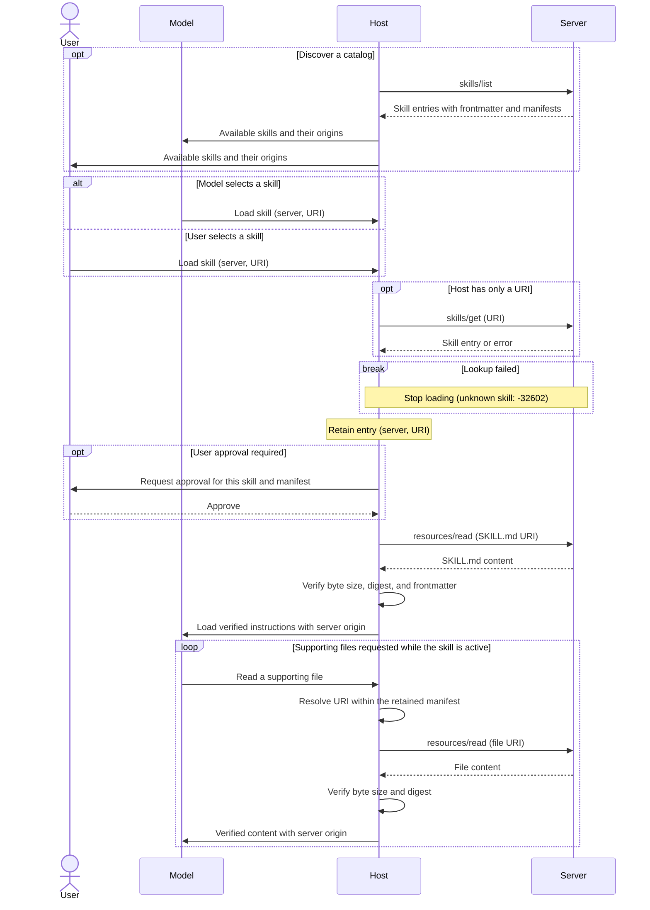

[ext-skills repository](https://github.com/modelcontextprotocol/ext-skills)
包含通过 MCP 使用 Skills 的规范。

<Card
  title="modelcontextprotocol/ext-skills"
  icon="github"
  href="https://github.com/modelcontextprotocol/ext-skills"
>
  通过 MCP 使用 Skills 的规范和文档。
</Card>

Skills 扩展允许 MCP 服务器向客户端公开工作流说明和支持文件。客户端可以发现可用的
Skills，检索其元数据，并使用现有的 Resources 原语读取其内容。

Skill 是一个包含 `SKILL.md` 文件和可选支持文件的目录，遵循 [Agent Skills 规范](https://agentskills.io/specification)。
此扩展定义了通过 MCP 进行发现和检索的方式。

Skills 适用于可复用的工作流，这些工作流组合了多个工具或需要支持性参考资料，例如代码审查或文档处理。通过 MCP 提供这些内容，可以让说明与其所描述的服务保持在一起。客户端可以从元数据中发现可用的工作流，并仅在需要时加载说明和支持文件。

## 用户交互模型

宿主应用决定如何向模型和用户公开 Skills。模型可以根据 Skills 的名称和描述选择它们，也可以由用户明确选择。此扩展不强制规定特定的用户交互模型。

通过 `resources/read` 读取 `SKILL.md` 本身不会激活 Skill。
要加载 Skill，宿主会通过其 Skill 加载路径路由读取请求，该路径会验证内容，并在将其加载到模型上下文之前应用任何必要的用户批准。

## 能力

支持 Skills 的服务器**必须**在
[`server/discover`](/specification/draft/server/discover) 中声明 `resources` 能力和
`io.modelcontextprotocol/skills` 扩展：

```json
{
  "capabilities": {
    "resources": {},
    "extensions": {
      "io.modelcontextprotocol/skills": {
        "directoryRead": true
      }
    }
  }
}
```

声明此扩展的服务器**必须**实现 `skills/list` 和
`skills/get`。Skill 文件通过 `resources/read` 提供。

可选的 `directoryRead` 设置表示支持
`resources/directory/read`，默认为 `false`。空扩展对象表示支持该扩展但不支持目录读取。客户端仅在观察到服务器的声明后才会发出 `skills/list` 和 `skills/get` 请求。

<Note>
  这些示例使用协议修订版本 `2026-07-28` 或更高版本。为简洁起见，请求示例省略了 `_meta`。每个请求**必须**包含所需的
  [请求元数据](/specification/draft/basic/index#_meta)。
</Note>

## 协议消息

### 列出 Skills

要发现可用的 Skills，客户端发送 `skills/list` 请求。此操作支持[分页](/specification/draft/server/utilities/pagination)
和[缓存](/specification/draft/server/utilities/caching)。

**请求：**

```json
{
  "jsonrpc": "2.0",
  "id": 1,
  "method": "skills/list",
  "params": {}
}
```

**响应：**

```json
{
  "jsonrpc": "2.0",
  "id": 1,
  "result": {
    "resultType": "complete",
    "skills": [
      {
        "uri": "skill://code-review/SKILL.md",
        "frontmatter": {
          "name": "code-review",
          "description": "Review code using the team's checklist."
        },
        "resources": [
          {
            "uri": "skill://code-review/SKILL.md",
            "digest": "sha256:d2489d6c182e8df9c178563ff9f2eac7998a0c1bb1278c52a7fd5306e4259160",
            "size": 149
          },
          {
            "uri": "skill://code-review/references/checklist.md",
            "digest": "sha256:dbab2de7bf7db9cc95cb6ce681c3690b26184db39f75b958a0287ca6d9e24e20",
            "size": 65
          }
        ]
      }
    ],
    "ttlMs": 300000,
    "cacheScope": "public"
  }
}
```

每个条目包含：

| 字段         | 含义                                                                     |
| ------------- | --------------------------------------------------------------------------- |
| `uri`         | Skill 的 `SKILL.md` 的资源 URI。                                 |
| `frontmatter` | 所有 YAML frontmatter 字段，保持不变，包括 `name` 和 `description`。 |
| `resources`   | 完整的文件清单，或表示生成内容的 `"dynamic"`。           |

清单**必须**包含 `SKILL.md` 和每个支持文件，并包含每个文件的 URI、SHA-256 摘要和字节大小。`skills/list` 返回的每个条目都是完整的；客户端无需调用 `skills/get` 来获取其他元数据。

当响应包含 `nextCursor` 时，客户端将其作为 `params.cursor` 传入，以检索下一页。列表和获取结果**必须**包含
`resultType: "complete"`、`ttlMs` 和 `cacheScope`。缓存字段描述新鲜度和共享范围；它们不提供内容完整性保证。

Skill 的身份由其来源服务器的身份和 Skill URI 组成。名称是标签，不保证唯一。宿主在注册表、批准记录和缓存中**必须**同时保留服务器身份和 URI。服务器**应该**使用 `skill://` 方案，但**可以**使用其他方案。宿主**不得**仅根据 URI 方案将资源识别为 Skill。

### 获取 Skill

要通过 URI 检索 Skill 条目，客户端发送 `skills/get` 请求。URI 可以由用户、另一个 Skill 或服务器说明提供。

**请求：**

```json
{
  "jsonrpc": "2.0",
  "id": 2,
  "method": "skills/get",
  "params": {
    "uri": "skill://code-review/SKILL.md"
  }
}
```

响应在 `result.skill` 下包含一个 Skill 条目，其结构与 `skills/list` 中的条目相同，同时包含 `resultType: "complete"`、`ttlMs` 和 `cacheScope`。客户端也可以使用此方法刷新现有条目。

服务器**可以**返回空列表或部分列表，但对于其提供的每个 Skill，**必须**响应 `skills/get`。宿主**必须**支持按 URI 加载，包括列表中未出现的 Skills。

### 读取 Skill 内容

要检索 Skill 说明或支持文件，客户端发送一个
[`resources/read`](/specification/draft/server/resources#reading-resources)
请求。此示例从上面的列表中检索 `SKILL.md`。

**请求：**

```json
{
  "jsonrpc": "2.0",
  "id": 3,
  "method": "resources/read",
  "params": {
    "uri": "skill://code-review/SKILL.md"
  }
}
```

**响应：**

```json
{
  "jsonrpc": "2.0",
  "id": 3,
  "result": {
    "resultType": "complete",
    "contents": [
      {
        "uri": "skill://code-review/SKILL.md",
        "mimeType": "text/markdown",
        "text": "---\nname: code-review\ndescription: Review code using the team's checklist.\n---\n\n# Code review\n\nRead `references/checklist.md`, then review the diff.\n"
      }
    ],
    "ttlMs": 300000,
    "cacheScope": "public"
  }
}
```

`SKILL.md` 文件**必须**以包含 `name` 和
`description` 的 YAML frontmatter 开头。其父目录路径的最后一段**必须**与
`name` 匹配。

客户端根据 Skill 的根目录解析相对引用。在此示例中，`references/checklist.md` 解析为
`skill://code-review/references/checklist.md`。支持文件使用 `resources/read` 从同一服务器检索，内容如下：

```markdown
# Review checklist

Check correctness, tests, and compatibility.
```

两个示例文件都以换行符结尾；其摘要和大小与清单匹配。宿主**不得**提前检索文件，包括连接、列出或批准时。批准绑定到清单，不要求检索文件。

### 读取目录

要列出目录的直接子项，客户端发送 `resources/directory/read`
请求。此方法是可选的。除非服务器声明 `directoryRead: true`，否则客户端**不得**调用此方法。

**请求：**

```json
{
  "jsonrpc": "2.0",
  "id": 4,
  "method": "resources/directory/read",
  "params": {
    "uri": "skill://code-review/references"
  }
}
```

**响应：**

```json
{
  "jsonrpc": "2.0",
  "id": 4,
  "result": {
    "resultType": "complete",
    "resources": [
      {
        "uri": "skill://code-review/references/checklist.md",
        "name": "checklist.md",
        "mimeType": "text/markdown"
      }
    ]
  }
}
```

目录 URI 没有尾部斜杠。子目录使用
`mimeType: "inode/directory"`。客户端通过为子目录发出另一个请求来继续深入。结果支持
`cursor` / `nextCursor` 分页，并且仅包含直接子项。

对于具有清单的 Skills，宿主**可以**根据该清单响应目录查询。目录读取也支持动态 Skills 和其他资源树。宿主**不得**将实时目录结果视为扩展了保留的清单，也不得将新列出的文件作为 Skill 的一部分公开。访问这些文件需要刷新条目并获得任何所需的用户批准。

## 消息流程

此示例展示了在发现服务器能力后，加载带有文件清单的 Skill。宿主的 MCP 客户端发送协议请求。Skill 选择和用户批准属于宿主交互。



已知 URI 可以在不列出的情况下加载。`skills/list` 返回的条目可以重复使用；否则，宿主会调用 `skills/get`。未列出的 Skill 可能仍然存在，但未知 URI 会返回 `-32602`（无效参数）并停止加载。所有 Skill 读取都使用来源服务器。

如果查找失败、批准被拒绝或验证失败，宿主不会加载或使用该内容。从已更改的清单中恢复需要刷新条目并重新获得任何所需的批准，具体如下所述。

## 完整性和验证

在处理 Skill 时，宿主会保留用于加载它的条目。此期间至少会持续到 Skill 的 `SKILL.md` 离开模型上下文为止。对于具有清单的 Skills，宿主**必须**：

1. 将文件读取限制在保留清单中的 URI。
2. 在使用每个文件之前，验证其原始字节大小和 SHA-256 摘要。
3. 解析 `SKILL.md` 的 frontmatter，并将其与条目的
   `frontmatter` 逐字段比较。

宿主**不得**使用未通过验证的内容。要从过期元数据中恢复，宿主使用 `skills/get` 刷新条目。持久化批准**必须**绑定到完整的文件 URI 和摘要集合。文件的更改、添加或删除都会撤销该批准；宿主在加载或执行之前**必须**再次获得批准。

宿主**应该**按需缓存已验证的内容。磁盘缓存**必须**防止模型、其工具或其他用户修改缓存，并保持文件不可变；或者在每次访问时验证缓存字节。宿主**必须**将缓存文件排除在基于文件系统的 Skill 发现路径之外，并保留其 MCP 来源，包括重启之后。

<Note>
  摘要用于建立与服务器清单的一致性，而不是建立对其内容的信任。对于没有稳定摘要的生成内容，条目使用
  `"resources": "dynamic"`。宿主**可以**拒绝这些 Skills。如果接受，宿主仍然**必须**验证 frontmatter，并且**不得**将持久化批准视为涵盖任意未来内容。
</Note>

## 实现要求

### 服务器

服务器**必须**：

- 提供有效的 Agent Skills 并实现所声明的方法，包括基础 Resources 支持。
- 保留所有 frontmatter 字段，并根据所提供的字节计算和发布完整清单，除非 Skill 的资源声明为 `"dynamic"`。
- 独立于列表支持直接查找。每个 Skill 条目都是原子的；其清单**不得**跨页面拆分。
- 声明 `directoryRead: true` 时，支持所提供 Skill 命名空间中的每个目录。

服务器**不应**让每个 Skill 超过**512 个文件或 16 MiB**，包括
`SKILL.md`。宿主**必须**支持不超过这些限制的 Skills，并且**可以**支持更大的 Skills。

### 安全注意事项

宿主**必须**：

- 防止同名 Skills 静默替换彼此。
- 为加载的内容标记其来源服务器，并使用宿主分配的标签将资源读取绑定到该服务器。跨服务器读取需要明确的逐调用批准，并点名两个服务器。
- 将 Skill 内容视为不受信任的输入。宿主端代码执行以及授予 `allowed-tools` 等权限，需要针对每个 Skill 的明确用户批准。
- 在激活嵌套 Skill 之前获得新的用户同意。将其 `SKILL.md` 作为支持内容读取不会激活该 Skill 或其 frontmatter。

完整的批准、来源和缓存规则请参见[安全要求](https://github.com/modelcontextprotocol/ext-skills/blob/main/specification/stable/skills.mdx#security-considerations)。

## 错误处理

| 条件                                       | 处理                                      |
| ----------------------------------------------- | --------------------------------------------- |
| 未知 Skill／文件，或无效的目录 URI    | JSON-RPC `-32602`（无效参数）。           |
| 服务器内部故障                         | JSON-RPC `-32603`（内部错误）。           |
| 摘要、大小、frontmatter 或清单不匹配 | 宿主拒绝内容并刷新条目。 |

验证失败属于宿主端条件，而不是协议错误。
其处理方式如[完整性和验证](#integrity-and-verification)中所述。

## 客户端支持

有关 Skills 支持和实现文档链接，请参阅[客户端矩阵](/extensions/client-matrix)。

## 规范

完整规范位于 [ext-skills repository](https://github.com/modelcontextprotocol/ext-skills/blob/main/specification/stable/skills.mdx)。
开发工作由 [Skills Over MCP Working Group](/community/working-groups/skills-over-mcp) 协调。
