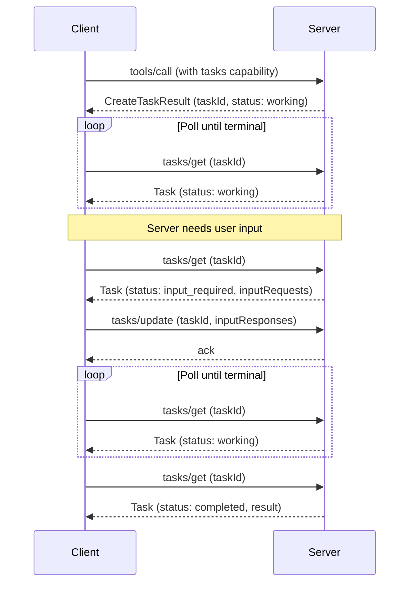

[experimental-ext-tasks 仓库](https://github.com/modelcontextprotocol/experimental-ext-tasks)包含 MCP Tasks 的完整规范和文档。

<Card
  title="modelcontextprotocol/experimental-ext-tasks"
  icon="github"
  href="https://github.com/modelcontextprotocol/experimental-ext-tasks"
>
  MCP Tasks 的完整规范和文档。
</Card>

并非每次工具调用都会立即返回。有些操作——CI 流水线、批处理、人工审批——会耗费数秒、数分钟甚至更久。MCP Tasks 允许服务器返回一个持久句柄而不是阻塞，这样客户端就可以轮询进度、在需要时提供输入，并在重新连接后获取最终结果。

## 为什么不直接阻塞？

你可以保持连接打开直到工作完成。Tasks 解决了阻塞无法处理的问题：

- **没有长连接。** 阻塞会在操作持续期间占用一个连接。许多客户端和传输中介都会设置超时，使得超过几秒的场景变得不切实际。
- **崩溃恢复能力。** 任务 ID 是一个持久句柄。如果客户端断开连接或重启，它可以使用相同的 ID 继续轮询。
- **进度可见性。** Tasks 携带状态元数据（`working`、`input_required`、`completed`、`failed`、`cancelled`）以及可选的状态消息，让客户端能够查看进度。
- **执行中交互。** 当任务需要输入时（例如，为用户确认进行询问），它会切换到 `input_required` 并显示请求。客户端通过 `tasks/update` 响应——不需要第二条连接，也不需要服务器到客户端的主动消息。
- **由服务器驱动。** 服务器按请求决定是否创建任务。客户端通过一次扩展能力声明完成接入，并处理返回的任意结果形态。无需按工具预热，也无需每次请求都加标志。

## Tasks 的工作方式

Tasks 扩展了标准请求流程。当服务器判断某个请求会是长时间运行时，它返回任务句柄而不是最终结果。客户端随后轮询完成状态。

1. **能力协商。** 客户端在每次请求的能力中包含 `io.modelcontextprotocol/tasks`。服务器在自己的 `server/discover` 能力中声明同样的扩展。

2. **创建任务。** 对于受支持的请求，服务器返回一个 `CreateTaskResult`（通过 `resultType: "task"` 识别），其中包含 `taskId`、初始状态、TTL 和建议的轮询间隔。任务会在响应发送前持久创建。

3. **轮询。** 客户端使用 `taskId` 调用 `tasks/get`。响应会携带当前状态；对于终态，还会携带最终结果或错误。

4. **执行中输入。** 如果任务进入 `input_required`，`tasks/get` 响应会包含一个 `inputRequests` 映射，其中列出询问或其他服务器请求。客户端通过 `tasks/update` 完成这些请求。

5. **完成。** 当状态达到 `completed` 时，`result` 字段包含原本同步请求会返回的内容。如果状态是 `failed`，`error` 字段包含 JSON-RPC 错误。

6. **取消。** 客户端可以随时发送 `tasks/cancel`。取消是协作式的——服务器会确认该意图，但没有义务停止工作。



## 何时使用 Tasks

当你的用例涉及以下场景时，Tasks 很适合：

**长时间运行的操作。** CI 流水线、批量数据处理，或需要数分钟或数小时的模型训练任务。

**有人参与的工作流。** 审批关卡、评审步骤，或任何会暂停等待用户确认的操作。任务会转入 `input_required`，客户端会展示请求。

**外部作业系统。** 如果你的服务器封装的是已经使用作业 ID 的 API（云部署、异步 API、队列任务），在创建作业时返回任务，并在作业完成时解析它。

**不可靠连接。** 移动客户端、间歇性网络，或连接容易中断的环境。任务 ID 可以在断线后继续存在。

**批处理。** 处理大量条目的操作（批量导入、大规模更新），其中部分进度是有意义的。状态消息会报告进度。

## 任务生命周期

| 状态             | 含义                                                                 |
| ---------------- | -------------------------------------------------------------------- |
| `working`        | 操作正在进行中。                                                     |
| `input_required` | 服务器在继续之前需要客户端输入。参见 `inputRequests`。               |
| `completed`      | 操作已完成。`result` 字段包含最终输出。                              |
| `failed`         | 执行过程中发生了 JSON-RPC 错误。`error` 字段包含详细信息。           |
| `cancelled`      | 操作已被取消（不一定会被接受）。                                     |

`completed`、`failed` 和 `cancelled` 都是终态——一旦到达，任务状态不会再改变。

## 通知

Servers can push status updates via `notifications/tasks`. Clients opt
into these through the `subscriptions/listen` mechanism. Each notification
carries the full task state, eliminating the need for an extra `tasks/get`
round-trip.

轮询是默认方式。如果服务器支持通知，客户端可以改为依赖通知而不是轮询。

## 实现指南

### 对于 MCP 客户端

要消费带任务增强的响应，你的客户端必须：

<Steps>
<Step title="声明支持">

在每次请求的能力中包含该扩展：

```json
{
  "params": {
    "_meta": {
      "io.modelcontextprotocol/clientCapabilities": {
        "extensions": {
          "io.modelcontextprotocol/tasks": {}
        }
      }
    }
  }
}
```

</Step>
<Step title="处理多态结果">

在发出受支持的请求（例如 `tools/call`）时，要准备接收标准结果或 `resultType: "task"` 的 `CreateTaskResult`。

</Step>
<Step title="轮询完成状态">

使用返回的 `taskId` 调用 `tasks/get`，并遵守 `pollIntervalMs` 值。持续轮询直到任务达到终态（`completed`、`failed` 或 `cancelled`）。

</Step>
<Step title="处理输入请求">

如果任务状态是 `input_required`，读取 `inputRequests` 映射，将请求展示给用户或模型，并通过 `tasks/update` 提交响应。

</Step>
<Step title="持久化任务 ID">

将任务 ID 持久化保存，以便客户端崩溃或重启后能够恢复轮询。

</Step>
</Steps>

### 对于 MCP 服务器

要从你的服务器返回任务：

<Steps>
<Step title="声明支持">

在你的 `server/discover` 能力中包含该扩展：

```json
{
  "capabilities": {
    "extensions": {
      "io.modelcontextprotocol/tasks": {}
    }
  }
}
```

</Step>
<Step title="检查客户端能力">

在返回 `CreateTaskResult` 之前，确认客户端已在其每次请求的能力中包含该扩展。绝不要向未声明支持的客户端返回任务。

</Step>
<Step title="返回 CreateTaskResult">

当某个请求会是长时间运行时，使用 `resultType: "task"` 和一个 `Task` 对象进行响应，该对象包含唯一的 `taskId`、初始状态、`ttlMs` 和 `pollIntervalMs`。任务必须在发送响应前持久创建。

</Step>
<Step title="提供 tasks/get">

在每次轮询时返回当前任务状态。对于终态，在 `completed` 时包含 `result` 字段，或在 `failed` 时包含 `error` 字段。

</Step>
<Step title="处理 tasks/update">

接受以未完成的 `inputRequests` 为键的 `inputResponses`。用空结果进行确认。忽略针对未知或已满足键的响应。

</Step>
<Step title="处理 tasks/cancel">

用空结果确认取消请求。尽可能接受取消，但取消是协作式的——任务仍可能到达一个非 `cancelled` 的终态。

</Step>
</Steps>

## 客户端支持

<Note>

MCP Tasks 是 [core MCP specification](/specification/latest) 的一个扩展。主机
支持因客户端而异。

</Note>

请参阅 [客户端矩阵](/extensions/client-matrix) 以了解各客户端对扩展的支持情况。任务支持要求客户端和服务器双方显式选择启用。

## 规范

Tasks 扩展的规范位于 [experimental-ext-tasks 仓库](https://github.com/modelcontextprotocol/experimental-ext-tasks)。它使用标准的 MCP [扩展协商](/extensions/overview#negotiation) 机制：客户端和服务器在初始化期间在其能力的 `extensions` 字段中声明支持。
