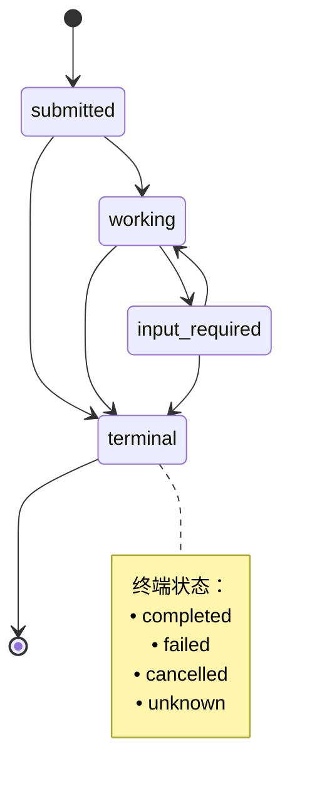
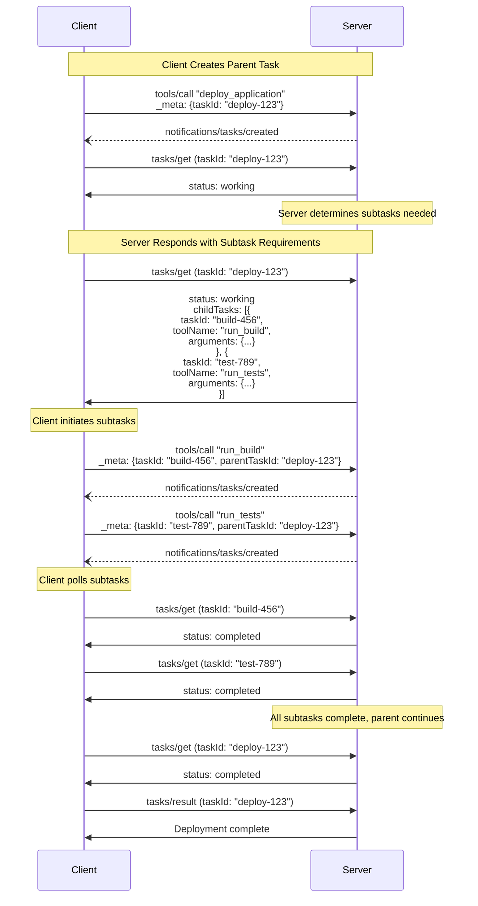

<div className="flex items-center gap-2 mb-4">
  <Badge color="green" shape="pill">
    最终版
  </Badge>
  <Badge color="gray" shape="pill">
    标准轨道
  </Badge>
</div>

| 字段          | 值                                                                            |
| ------------- | ------------------------------------------------------------------------------- |
| **SEP**       | 1686                                                                            |
| **标题**      | 任务                                                                            |
| **状态**      | 最终版                                                                          |
| **类型**      | 标准轨道                                                                        |
| **创建时间**  | 2025-10-20                                                                      |
| **作者**      | Surbhi Bansal, Luca Chang                                                       |
| **赞助者**    | 无                                                                            |
| **PR**        | [#1686](https://github.com/modelcontextprotocol/modelcontextprotocol/pull/1686) |

---

## 摘要

本 SEP 改进了模型上下文协议（MCP）中对基于任务的工作流的支持。它引入了**任务原语**以及关联的**任务 ID**，可用于查询任务的状态和结果，查询有效期可持续至任务完成后的一段服务器定义的时间。此原语旨在增强其他请求（如工具调用），以便在支持此原语的服务器上，对所有请求实现“即时调用，稍后获取”的执行模式。

## 动机

当前的 MCP 规范支持执行请求并最终接收响应的工具调用，并且工具调用可以传递进度令牌以集成 MCP 的进度跟踪功能，使宿主应用程序能够通过通知接收工具调用的状态更新。但是，客户端无法显式请求工具调用的状态，导致可能出现工具调用在服务器端被丢弃，且未知是否会有响应或通知到达的状态。同样，客户端也无法在工具调用完成后显式检索其结果——如果结果被丢弃，客户端必须再次调用该工具，这对于预计需要几分钟或更长时间的工具来说是不可取的。这对于抽象现有基于工作流的 API 的 MCP 服务器尤其相关，例如 AWS Step Functions、Google Cloud Workflows 或代表 CI/CD 管道的 API 等应用。

目前，单个 MCP 服务器可以通过某些妥协来表示工具以实现此目的。例如，服务器可能公开一个 `long_running_tool` 并希望支持此模式，将其拆分为三个单独的工具以适应此需求：

1. `start_long_running_tool`：这将启动 `long_running_tool` 所代表的工作，并返回某种跟踪令牌，例如作业 ID。
2. `get_long_running_tool_status(token)`：这将接受跟踪令牌并返回工具调用的当前状态，通知调用者操作仍在进行中。
3. `get_long_running_tool_result(token)`：这将接受跟踪令牌并返回工具调用的结果（如果可用）。

以这种方式表示工具似乎解决了用例问题，但它引入了一个新问题：工具通常预期由代理编排，而代理驱动的轮询既不必要的昂贵又不一致——它依赖于提示工程来引导代理进行轮询。在原始的 `long_running_tool` 情况下，客户端无法知道是否会收到响应，而在 `start_long_running_tool` 情况下，应用程序无法知道代理是否会按照服务器的特定合同编排工具。

宿主应用程序也不可能接管此编排，因为这种工具拆分是基于约定的，并且可能在不同的 MCP 服务器中以不同的方式实现——一个服务器可能为一个概念操作使用三个工具（如我们的示例），或者在更复杂的多步操作情况下使用更多工具。

另一方面，如果不需要主动任务轮询，现有的 MCP 服务器可以在单个工具调用中完全包装一个工作流 API 以轮询结果，但这引入了不可取的实现成本：一个包装现有工作流 API 的 MCP 服务器是一个仅存在于轮询其他系统的服务器。

**受影响的客户用例**
这些担忧得到了亚马逊内部及其外部客户（非公开身份已脱敏）看到的真实用例的支持：

**1. 医疗保健与生命科学数据分析**
**_挑战:_** 亚马逊在医疗保健和生命科学行业的客户正尝试使用 MCP 包装现有的计算工具，以分析分子特性并预测药物相互作用，通过多个推理模型同时处理来自化学库的每个作业数十万个数据点。这些复杂的多步工作流需要一种主动检查状态的方法，因为它们需要数小时以上，使得重试变得不可取。
**_当前变通方案:_** 尚未确定。
**_影响:_** 无法与实时研究工作流集成，阻碍交互式药物发现平台，并阻塞自动化研究管道。这些客户正在寻找基于工作流的工具调用的最佳实践，并指出 MCP 缺乏一流支持是一个担忧。如果这些客户没有长运行工具调用的解决方案，他们可能会放弃 MCP 并继续使用现有平台。
**_理想方案:_** 并发且可轮询的工具调用作为执行时间在几分钟范围内的操作的答案，以及某种形式的推送通知系统，以避免其代理在长达数小时的长时间分析上被阻塞。本 SEP 支持前一种用例，并提供了一个可扩展以支持后一种用例的框架。

**2. 企业自动化平台**
**_挑战:_** 亚马逊的大型企业客户正寻求开发内部 MCP 平台，以自动化其组织内的 SDLC 流程，扩展到销售、客户服务、法律、人力资源和跨部门团队。他们指出他们有长时间运行的代理和代理工具交互，支持复杂的业务流程自动化。
**_当前变通方案:_** 尚未确定。正在考虑在 MCP 之外由 Webhook 支持的应用程序级系统。
**_影响:_** 与宿主应用程序不知道工具执行状态相关的限制阻碍了复杂的业务流程自动化，并限制了复杂的多步操作。这些客户希望并发调度进程并在稍后收集其结果，并指出缺乏显式的后期检索是一个担忧——并且正在考虑复杂的应用程序级通知系统作为可能的变通方案。
**_理想方案:_** 内置机制用于主动检查正在进行的工作的状态，以避免需要为其自己的工具约定实施特定的通知系统。

**3. 代码迁移工作流**
**_挑战:_** 亚马逊已自动化代码迁移和转换工具，以在其自己的代码库和外部客户的代码库中执行升级，并正尝试将这些工具包装在 MCP 服务器中。这些迁移分析依赖项，转换代码以避免弃用的运行时功能，并在多个存储库中验证更改。根据迁移范围、复杂性和验证要求，这些迁移需要几分钟到几小时不等。
**_当前变通方案:_** 开发人员通过将作业拆分为 `create` 和 `get` 工具来实现手动跟踪，迫使模型管理状态并反复轮询完成情况。
**_影响:_** 由于需要在许多工具中复制这种手工制作的轮询机制，导致开发人员体验不佳。一个团队不得不调试一个问题，即如果模型没有首先列出作业名称，它就会幻觉出作业名称。在大型工具集中验证这种情况不会发生在许多工具上是耗时且容易出错的。
**_理想方案:_** 在数据层原生支持轮询工具状态，以支持将工具推送到后台并避免阻塞聊天会话中的其他任务，同时仍支持确定性轮询和结果检索。该团队需要在其 MCP 服务器中的许多工具上使用相同的模式，并希望在这些工具之间有一个通用的解决方案，本 SEP 直接支持这一点。

**4. 测试执行平台**
**_挑战:_** 亚马逊内部的测试基础设施执行全面的测试套件，包括数千个案例、跨服务的集成测试和性能基准测试。他们构建了一个包装此现有基础设施的 MCP 服务器。
**_当前变通方案:_** 对于流式测试日志，MCP 服务器公开了一个可以读取一定范围日志行的工具，因为它无法有效地通知客户端执行何时完成。目前还没有执行测试运行的变通方案。
**_影响:_** 无法运行测试套件并同时流式传输其日志，除非使用单个长达数小时的工具调用，但这会在客户端或服务器上超时。这阻止了代理在整个测试套件完成（可能是几小时后）之前查看不完整测试运行中的测试失败。
**_理想方案:_** 支持宿主应用程序驱动的工具轮询以获取中间结果，以便客户端可以在长运行工具完成时收到通知。本 SEP 不完全支持此用例（它确实启用了轮询），但任务执行模型可以扩展以支持此用例，如“未来工作”部分所述。

**5. 深度研究**
**_挑战:_** 深度研究工具生成多个研究代理来收集和总结有关主题的信息，在内部经过几轮搜索和对话回合，为调用应用程序生成最终结果。该工具需要较长时间执行，并且并不总是清楚工具是否仍在执行。
**_当前变通方案:_** 研究工具被拆分为一个单独的 `create` 工具来创建报告作业，以及一个 `get` 工具来稍后获取该作业的状态/结果。
**_影响:_** 当与宿主应用程序一起使用时，代理有时会遇到反复调用 `get` 工具的问题——特别是，它在结束对话回合之前调用一次工具，声称在再次调用工具之前正在“等待”。它在收到新的用户消息之前无法恢复。这也使过期时间复杂化，因为当这种情况发生时，无法预测客户端何时检索结果。可以通过为模型添加 `wait` 工具来解决此问题，但这会阻止模型同时执行任何其他操作。
**_理想方案:_** 以确定性方式支持轮询工具调用的状态，并在结果准备就绪时通知模型，以便可以立即检索工具结果并从服务器删除。除了通知模型（这是一个宿主应用程序关注点）之外，本 SEP 完全支持此用例。

**6. 代理到代理通信（多代理系统）**
**_挑战:_** 亚马逊内部用于客户问答的多代理系统之一面临这样的场景：代理需要大量的处理时间来进行复杂的推理、研究或分析。当代理通过 MCP 通信时，慢速代理会导致整个系统的级联延迟，因为代理被迫等待其同伴完成工作。
**_当前变通方案:_** 尚未确定。
**_影响:_** 通信模式造成级联延迟，阻止并行代理处理，并降低其他时间敏感交互的系统响应能力。
**_理想方案:_** 某种方法允许代理并发执行其他工作，并在长运行任务完成后收到通知。本 SEP 通过使宿主应用程序能够实现对选定工具调用的后台轮询而不阻塞代理来支持此用例。

这些用例表明，主动跟踪工具调用和延迟结果的机制是生产环境中此类 MCP 部署的实际需求。

**与现有架构的集成**
许多工作流驱动的系统已经提供了具有内置状态元数据、监控和数据保留策略的主动执行跟踪功能。此提案使 MCP 服务器能够通过薄 MCP 包装器暴露这些现有 API，同时保持其现有的可靠性。

**现有架构的好处：**

- **利用现有状态管理：** 像 AWS Step Functions、Google Cloud Workflows 和 CI/CD 平台这样的系统已经维护执行状态、日志和结果。MCP 服务器可以暴露这些系统的现有 API，而无需将轮询责任推给容易出错的代理。
- **保留原生监控：** 现有的监控、警报和可观察性工具继续不变地工作。执行几乎完全在现有的工作流管理系统内进行。
- **减少实现开销：** 服务器实现者无需构建新的状态管理、持久性或监控基础设施。他们可以专注于将现有 API 映射到任务的 MCP 协议。

本 SEP 简化了与现有工作流的集成，并允许工作流服务继续管理自己的状态，同时提供优质的客户体验，而不是卸载给代理轮询或构建仅用于轮询其他服务的 MCP 服务器。

## 规范

本 SEP 引入了一种机制，允许请求方（根据通信方向的不同，可以是客户端或服务器）使用 **任务** 来增强他们的请求。任务是持久的状态机，携带有关其所包装请求的底层执行状态的信息，旨在用于请求方轮询和延迟结果检索。每个任务都可以通过请求方生成的 **任务 ID** 进行唯一标识。

### 1. 用户交互模型

任务被设计为 **应用驱动** 的——接收方严格控制哪些请求（如果有）支持基于任务的执行并管理这些任务的生命周期；同时，请求方负责使用任务增强请求，并轮询这些任务的结果。

实现可以通过任何适合其需求的接口模式来暴露任务——协议本身不强制任何特定的用户交互模型。

### 2. 能力

支持任务增强请求的服务器和客户端 **必须** 在初始化期间声明 `tasks` 能力。`tasks` 能力按请求类别构建，具有布尔属性，指示哪些特定请求类型支持任务增强。

详情请参考 https://github.com/modelcontextprotocol/modelcontextprotocol/pull/1732。

### 3. 协议消息

#### 3.1. 创建任务

要创建任务，请求方发送一个请求，其中 `_meta` 包含 `modelcontextprotocol.io/task` 键，以及代表任务 ID 的 `taskId` 值。请求方 **可以** 包含 `keepAlive`，其值代表请求方希望在完成后保留任务结果的时间长度。

**请求：**

```json
{
  "jsonrpc": "2.0",
  "id": 1,
  "method": "some_method",
  "params": {
    "_meta": {
      "modelcontextprotocol.io/task": {
        "taskId": "786512e2-9e0d-44bd-8f29-789f320fe840",
        "keepAlive": 60000
      }
    }
  }
}
```

#### 3.2. 获取任务

要检索任务的状态，请求方发送 `tasks/get` 请求：

**请求：**

```json
{
  "jsonrpc": "2.0",
  "id": 3,
  "method": "tasks/get",
  "params": {
    "taskId": "786512e2-9e0d-44bd-8f29-789f320fe840",
    "_meta": {
      "modelcontextprotocol.io/related-task": {
        "taskId": "786512e2-9e0d-44bd-8f29-789f320fe840"
      }
    }
  }
}
```

**响应：**

```json
{
  "jsonrpc": "2.0",
  "id": 3,
  "result": {
    "taskId": "786512e2-9e0d-44bd-8f29-789f320fe840",
    "keepAlive": 30000,
    "pollFrequency": 5000,
    "status": "submitted",
    "_meta": {
      "modelcontextprotocol.io/related-task": {
        "taskId": "786512e2-9e0d-44bd-8f29-789f320fe840"
      }
    }
  }
}
```

#### 3.3. 检索任务结果

要检索已完成任务的结果，请求方发送 `tasks/result` 请求：

**请求：**

```json
{
  "jsonrpc": "2.0",
  "id": 4,
  "method": "tasks/result",
  "params": {
    "taskId": "786512e2-9e0d-44bd-8f29-789f320fe840",
    "_meta": {
      "modelcontextprotocol.io/related-task": {
        "taskId": "786512e2-9e0d-44bd-8f29-789f320fe840"
      }
    }
  }
}
```

**响应：**

```json
{
  "jsonrpc": "2.0",
  "id": 4,
  "result": {
    "content": [
      {
        "type": "text",
        "text": "Current weather in New York:\nTemperature: 72°F\nConditions: Partly cloudy"
      }
    ],
    "isError": false,
    "_meta": {
      "modelcontextprotocol.io/related-task": {
        "taskId": "786512e2-9e0d-44bd-8f29-789f320fe840"
      }
    }
  }
}
```

#### 3.4. 任务创建通知

当接收方创建任务时，它 **必须** 发送 `notifications/tasks/created` 通知，以告知请求方任务已创建且可以开始轮询。

**通知：**

```json
{
  "jsonrpc": "2.0",
  "method": "notifications/tasks/created",
  "params": {
    "_meta": {
      "modelcontextprotocol.io/related-task": {
        "taskId": "786512e2-9e0d-44bd-8f29-789f320fe840"
      }
    }
  }
}
```

任务 ID 通过 `modelcontextprotocol.io/related-task` 元数据键传达。通知参数 otherwise 为空。

此通知解决了请求方可能在接收方完成创建任务之前尝试轮询任务的竞争条件。通过在任务创建后立即发送此通知，接收方信号表明任务已准备好通过 `tasks/get` 进行查询。

不支持任务（因此忽略请求中的任务元数据）的接收方不会发送此通知，允许请求方回退到等待原始请求响应。

#### 3.5. 列出任务

要检索任务列表，请求方发送 `tasks/list` 请求。此操作支持分页。

**请求：**

```json
{
  "jsonrpc": "2.0",
  "id": 5,
  "method": "tasks/list",
  "params": {
    "cursor": "optional-cursor-value"
  }
}
```

**响应：**

```json
{
  "jsonrpc": "2.0",
  "id": 5,
  "result": {
    "tasks": [
      {
        "taskId": "786512e2-9e0d-44bd-8f29-789f320fe840",
        "status": "working",
        "keepAlive": 30000,
        "pollFrequency": 5000
      },
      {
        "taskId": "abc123-def456-ghi789",
        "status": "completed",
        "keepAlive": 60000
      }
    ],
    "nextCursor": "next-page-cursor"
  }
}
```

#### 3.6 删除任务

要显式删除任务及其关联结果，请求方发送 `tasks/delete` 请求。

**请求：**

```json
{
  "jsonrpc": "2.0",
  "id": 6,
  "method": "tasks/delete",
  "params": {
    "taskId": "786512e2-9e0d-44bd-8f29-789f320fe840",
    "_meta": {
      "modelcontextprotocol.io/related-task": {
        "taskId": "786512e2-9e0d-44bd-8f29-789f320fe840"
      }
    }
  }
}
```

**响应：**

```json
{
  "jsonrpc": "2.0",
  "id": 6,
  "result": {
    "_meta": {
      "modelcontextprotocol.io/related-task": {
        "taskId": "786512e2-9e0d-44bd-8f29-789f320fe840"
      }
    }
  }
}
```

### 4. 行为要求

这些要求适用于所有支持接收任务增强请求的各方。

#### 4.1. 任务支持与处理

1. 不支持请求任务增强的接收方 **必须** 正常处理请求，忽略 `_meta` 中的任何任务元数据。
2. 支持任务增强的接收方 **可以** 选择哪些请求类型支持任务。

#### 4.2. 任务 ID 要求

1. 任务 ID **必须** 是字符串值。
2. 任务 ID **应当** 在接收方控制的所有任务中唯一。
3. 带有 `_meta` 中任务 ID 的请求的接收方 **可以** 验证提供的任务 ID 尚未与该接收方控制的任务关联。

#### 4.3. 任务状态生命周期

1. 任务创建时 **必须** 始于 `submitted` 状态。
2. 接收方 **必须** 仅通过以下有效路径转换任务：
   1. 从 `submitted`：可以移动到 `working`、`input_required`、`completed`、`failed`、`cancelled` 或 `unknown`
   2. 从 `working`：可以移动到 `input_required`、`completed`、`failed`、`cancelled` 或 `unknown`
   3. 从 `input_required`：可以移动到 `working`、`completed`、`failed`、`cancelled` 或 `unknown`
   4. 处于 `completed`、`failed`、`cancelled` 或 `unknown` 状态的任务 **不得** 转换到任何其他状态（终端状态）
3. 如果执行立即完成，接收方 **可以** 直接从 `submitted` 移动到 `completed`。
4. `unknown` 状态是用于意外错误条件的终端回退状态。接收方 **应当** 在可能时使用带有错误消息的 `failed`。

**任务状态状态图：**



#### 4.4. 需要输入状态

1. 当接收方发送与任务关联的请求（例如，启发、采样）时，接收方 **必须** 将任务移动到 `input_required` 状态。
2. 接收方 **必须** 在请求中包含 `modelcontextprotocol.io/related-task` 元数据以将其与任务关联。
3. 当接收方收到所有必需的响应时，任务 **可以** 转换出 `input_required` 状态（通常回到 `working`）。
4. 如果多个相关请求挂起，任务 **应当** 保持 `input_required` 状态直到所有请求都解决。

#### 4.5. 保持活跃与资源管理

1. 接收方 **可以** 覆盖请求的 `keepAlive` 持续时间。
2. 接收方 **必须** 在 `tasks/get` 响应中包含实际的 `keepAlive` 持续时间（或 `null` 表示无限）。
3. 任务达到终端状态（`completed`、`failed` 或 `cancelled`）且其 `keepAlive` 持续时间 elapsed 后，接收方 **可以** 删除任务及其结果。
4. 接收方 **可以** 在 `tasks/get` 响应中包含 `pollFrequency` 值（以毫秒为单位）以建议轮询间隔。请求方 **应当** 在提供时尊重此值。

#### 4.6. 结果检索

1. 仅当任务状态为 `completed` 时，接收方 **必须** 才从 `tasks/result` 返回结果。
2. 如果为任何其他状态的任务调用 `tasks/result`，接收方 **必须** 返回错误。
3. 请求方 **可以** 在任务保持可用期间多次调用同一任务的 `tasks/result`。

#### 4.7. 关联任务相关消息

1. 所有与任务相关的请求、通知和响应 **必须** 在其 `_meta` 中包含 `modelcontextprotocol.io/related-task` 键，值设置为具有与关联任务 ID 匹配的 `taskId` 的对象。
2. 例如，任务增强工具调用所依赖的启发 **必须** 与该工具调用的任务共享相同的相关任务 ID。

#### 4.8. 任务取消

1. 当接收方收到任务增强请求的 JSON-RPC 请求 ID 的 `notifications/cancelled` 通知时，接收方 **应当** 立即将任务移动到 `cancelled` 状态并停止与该任务关联的所有处理。
2. 由于通知的异步性质，接收方 **可能** 无法即时取消任务处理。接收方 **应当** 尽最大努力尽快停止执行。
3. 如果 `notifications/cancelled` 通知在任务已达到终端状态（`completed`、`failed`、`cancelled` 或 `unknown`）后到达，接收方 **应当** 忽略该通知。
4. 任务达到 `cancelled` 状态且其 `keepAlive` 持续时间 elapsed 后，接收方 **可以** 删除任务及其元数据。
5. 请求方 **可以** 在任务执行期间的任何时间发送 `notifications/cancelled`，包括任务处于 `input_required` 状态时。如果任务在 `input_required` 状态时被取消，接收方 **应当** 也忽略关联请求的任何挂起响应。
6. 因为通知不提供接收确认，请求方 **应当** 在发送取消通知后继续使用 `tasks/get` 轮询以确认任务已转换到 `cancelled` 状态。如果任务未在合理时间范围内转换到 `cancelled`，请求方 **可以** 假设取消未被处理。

#### 4.9. 任务列表

1. 接收方 **应当** 使用基于游标的分页来限制单个响应中返回的任务数量。
2. 如果有更多任务可用，接收方 **必须** 在响应中包含 `nextCursor`。
3. 请求方 **必须** 将游标视为不透明令牌，不要尝试解析或修改它们。
4. 如果请求方可通过 `tasks/get` 检索任务，则该请求方 **必须** 可通过 `tasks/list` 检索它。

#### 4.10 任务删除

1. 接收方 **可以** 自行决定接受或拒绝任何任务的删除请求。
1. 如果接收方接受删除请求，它 **应当** 删除任务及所有关联结果和元数据。
1. 接收方 **可以** 选择完全不支持删除，或仅支持某些状态的任务删除（例如，仅终端状态）。
1. 请求方 **应当** 及时删除包含敏感数据的任务，而不是仅依赖 `keepAlive` 过期进行清理。

### 5. 消息流

https://github.com/modelcontextprotocol/modelcontextprotocol/issues/1686#issuecomment-3452378176

### 6. 数据类型

#### 任务

任务表示请求的执行状态。任务元数据包括：

- `taskId`：任务的唯一标识符
- `keepAlive`：完成后结果将保持可用的时间（毫秒）
- `pollFrequency`：状态检查之间的建议时间（毫秒）
- `status`：任务执行的当前状态

#### 任务状态

任务可以处于以下状态之一：

- `submitted`：请求已接收并排队等待执行
- `working`：请求目前正在处理中
- `input_required`：请求正在等待请求方的额外输入
- `completed`：请求成功完成，结果可用
- `failed`：任务生命周期本身遇到错误，与关联请求逻辑无关
- `cancelled`：请求在完成前被取消
- `unknown`：当接收方无法确定实际任务状态时，用于意外错误条件的终端回退状态

#### 任务元数据

当使用任务执行增强请求时，`modelcontextprotocol.io/task` 键包含在 `_meta` 中：

```json
{
  "modelcontextprotocol.io/task": {
    "taskId": "786512e2-9e0d-44bd-8f29-789f320fe840",
    "keepAlive": 60000
  }
}
```

字段：

- `taskId`（字符串，必需）：客户端生成的任务唯一标识符
- `keepAlive`（数字，可选）：完成后保留结果的请求持续时间（毫秒）

#### 任务创建通知

当接收方创建任务时，它发送 `notifications/tasks/created` 通知以信号表明任务已准备好进行轮询。通知具有空参数，任务 ID 通过 `modelcontextprotocol.io/related-task` 元数据键传达：

```json
{
  "jsonrpc": "2.0",
  "method": "notifications/tasks/created",
  "params": {
    "_meta": {
      "modelcontextprotocol.io/related-task": {
        "taskId": "786512e2-9e0d-44bd-8f29-789f320fe840"
      }
    }
  }
}
```

此通知使请求方能够开始轮询，而不会遇到任务可能尚未在接收方存在的竞争条件。

#### 任务获取请求

`tasks/get` 请求检索任务的当前状态：

```typescript
{
  taskId: string; // 要查询的任务标识符
}
```

#### 任务获取响应

`tasks/get` 响应包括：

```typescript
{
  taskId: string; // 任务标识符
  status: TaskStatus; // 当前任务状态
  keepAlive: number | null; // 实际保留持续时间（毫秒），null 表示无限
  pollFrequency?: number; // 建议的轮询间隔（毫秒）
  error?: string; // 如果状态为 "failed" 则为错误消息
}
```

#### 任务结果请求

`tasks/result` 检索已完成任务的结果：

```typescript
{
  taskId: string; // 要检索结果的任务标识符
}
```

#### 任务结果响应

`tasks/result` 响应返回原始请求本应返回的原始结果：

```typescript
{
  // 结构匹配原始请求的结果类型
  // 例如，tools/call 任务将返回 CallToolResult 结构
  [key: string]: unknown;
}
```

结果结构取决于原始请求类型。接收方返回与请求在没有任务增强的情况下执行本应返回的相同结果结构。

#### 任务列表请求

`tasks/list` 请求检索任务列表：

```typescript
{
  cursor?: string; // 可选的游标用于分页
}
```

#### 任务列表响应

`tasks/list` 响应包括：

```typescript
{
  tasks: Array<{
    taskId: string;           // 任务标识符
    status: TaskStatus;       // 当前任务状态
    keepAlive: number | null; // 保留持续时间（毫秒），null 表示无限
    pollFrequency?: number;   // 建议的轮询间隔（毫秒）
    error?: string;           // 如果状态为 "failed" 则为错误消息
  }>;
  nextCursor?: string;        // 下一页的游标，如果没有更多结果则不存在
}
```

#### 相关任务元数据

所有与任务关联的请求、响应和通知 **必须** 在 `_meta` 中包含 `modelcontextprotocol.io/related-task` 键：

```json
{
  "modelcontextprotocol.io/related-task": {
    "taskId": "786512e2-9e0d-44bd-8f29-789f320fe840"
  }
}
```

这将消息与其在整个请求生命周期中的来源任务关联起来。

### 7. 错误处理

任务使用两种错误报告机制：

1. **协议错误**：用于协议级问题的标准 JSON-RPC 错误
2. **任务执行错误**：底层请求执行中的错误，通过任务状态报告

#### 7.1. 协议错误

对于以下协议错误情况，接收方 **必须** 返回标准 JSON-RPC 错误：

- `tasks/get`、`tasks/list` 或 `tasks/result` 中的 `taskId` 无效或不存在：`-32602` (Invalid params)
- `tasks/list` 中的游标无效或不存在：`-32602` (Invalid params)
- 带有已用于不同任务的 `taskId` 的请求（如果接收方验证任务 ID 唯一性）：`-32602` (Invalid params)
- 尝试在任务未处于 `completed` 状态时检索结果：`-32602` (Invalid params)
- 内部错误：`-32603` (Internal error)

接收方 **应当** 提供信息性错误消息以描述错误原因。

**示例：任务未找到**

```json
{
  "jsonrpc": "2.0",
  "id": 70,
  "error": {
    "code": -32602,
    "message": "Failed to retrieve task: Task not found"
  }
}
```

**示例：任务已过期**

```json
{
  "jsonrpc": "2.0",
  "id": 71,
  "error": {
    "code": -32602,
    "message": "Failed to retrieve task: Task has expired"
  }
}
```

> 注意：接收方没有义务无限期保留任务元数据。如果接收方已清除过期任务，返回“未找到”错误是合规行为。

**示例：为未完成任务请求结果**

```json
{
  "jsonrpc": "2.0",
  "id": 72,
  "error": {
    "code": -32602,
    "message": "Cannot retrieve result: Task status is 'working', not 'completed'"
  }
}
```

**示例：重复任务 ID（如果接收方验证唯一性）**

```json
{
  "jsonrpc": "2.0",
  "id": 73,
  "error": {
    "code": -32602,
    "message": "Task ID already exists: 786512e2-9e0d-44bd-8f29-789f320fe840"
  }
}
```

#### 7.2. 任务执行错误

当底层请求在执行期间失败时，任务移动到 `failed` 状态。`tasks/get` 响应 **应当** 包含带有失败详细信息的 `error` 字段：

```typescript
{
  taskId: string;
  status: "failed";
  keepAlive: number | null;
  pollFrequency?: number;
  error?: string;  // 出了什么问题的描述
}
```

**示例：带有执行错误的任务**

```json
{
  "jsonrpc": "2.0",
  "id": 4,
  "result": {
    "taskId": "786512e2-9e0d-44bd-8f29-789f320fe840",
    "status": "failed",
    "keepAlive": 30000,
    "error": "Tool execution failed: API rate limit exceeded"
  }
}
```

对于包装具有自己错误语义的请求的任务（如带有 `isError: true` 的 `tools/call`），任务仍应达到 `completed` 状态，错误信息通过原始请求类型的结果结构传达。

### 8. 安全注意事项

#### 8.1. 任务隔离与访问控制

1. 接收方 **应当** 限定任务 ID 范围以防止未经授权的访问：
   1. 将任务绑定到创建它们的会话（如果支持会话）
   2. 将任务绑定到认证上下文（如果使用认证）
   3. 拒绝来自不同会话或认证上下文的任务的 `tasks/get`、`tasks/list` 或 `tasks/result` 请求
2. 未实现会话或认证绑定的接收方 **应当** 清楚记录此限制，因为任务结果可能可被任何能猜出任务 ID 的请求方访问。
3. 接收方 **应当** 对以下项实施速率限制：
   1. 任务创建以防止资源耗尽
   2. 任务状态轮询以防止拒绝服务
   3. 任务结果检索尝试
   4. 任务列表请求以防止拒绝服务

#### 8.2. 资源管理

> 警告：任务结果可能比原始请求执行时间持久更长。对于敏感操作，请求方应仔细考虑延长结果保留的安全影响，并可能希望及时检索结果并请求更短的 `keepAlive` 持续时间。

1. 接收方 **应当**：
   1. 对每个请求方的并发任务实施限制
   2. 实施最大 `keepAlive` 持续时间以防止无限资源保留
   3. 及时清理过期任务以释放资源
2. 接收方 **应当**：
   1. 记录支持的最大 `keepAlive` 持续时间
   2. 记录每个请求方的最大并发任务
   3. 实施资源使用的监控和警报

#### 8.3. 审计与日志

1. 接收方 **应当**：
   1. 记录任务创建、完成和检索事件以用于审计
   2. 在可用时在日志中包含会话/认证上下文
   3. 监控可疑模式（例如，许多失败的任务查找，过度轮询）
2. 请求方 **应当**：
   1. 记录任务生命周期事件以用于调试和审计
   2. 跟踪任务 ID 及其关联操作

## 设计理由

### 设计决策：通用任务原语

决定将任务实现为通用请求增强机制（而不是特定于工具或特定于方法的），是为了最大化协议的简单性和灵活性。

任务旨在与 MCP 协议中的任何请求类型一起工作，而不仅仅是工具调用。这意味着 `resources/read`、`prompts/get`、`sampling/createMessage` 以及任何未来的请求类型都可以用任务元数据进行增强。与特定于工具的设计相比，这种方法提供了显著的优势。

从协议的角度来看，这种设计消除了为每种请求类型单独实现任务的需求。与其为工具、资源和提示定义不同的异步模式，不如使用单一的任务管理方法集（`tasks/get` 和 `tasks/result`）在所有请求类型中统一工作。这种一致性降低了实现者的认知负荷，并为使用该协议的应用程序创造了统一的体验。

通用设计还提供了实现灵活性。服务器可以选择哪些请求支持任务增强，而无需协议更改或版本协商。如果服务器不支持特定请求类型的任务，它只需忽略任务元数据并正常处理请求。这允许服务器逐步为请求添加任务支持，从高价值操作开始，并根据实际使用模式随时间扩展。

在架构上，任务被视为元数据而不是独立的执行模型。它们增强现有请求而不是替换它们。原始的请求/响应流保持不变——请求最终仍会得到响应。任务只是提供了一种基于轮询的额外结果检索机制。这种设计确保相关消息（例如任务执行期间的请求）可以通过 `modelcontextprotocol.io/related-task` 元数据键一致地关联，无论底层请求类型如何。

### 设计决策：基于元数据的增强

选择使用 `_meta` 来存储任务信息，而不是专用的请求参数，是为了在请求语义和执行跟踪之间保持清晰的关注点分离。

任务信息从根本上正交于请求语义。任务 ID 和 keepAlive 持续时间不会影响请求做什么——它们只影响结果如何检索和保留。无论 `tools/call` 请求是否包含任务元数据，它执行的操作都是相同的。任务元数据 simply 提供了一种访问结果的替代机制。

通过将任务信息放在 `_meta` 中，我们在“执行什么”（请求参数）和“如何跟踪执行”（任务元数据）之间创建了清晰的架构边界。这个边界使实现者更容易理解协议。请求参数定义正在执行的操作，而元数据提供正交的关注点，如进度跟踪、任务管理和其他与执行相关的信息。

这种方法还提供了自然的向后兼容性。不支持任务的服务器可以忽略 `_meta` 内容而不破坏请求处理。请求参数保持有效和完整，因此操作可以正常进行。这意味着不需要协议版本协商——新功能纯粹是附加的且非破坏性的。

SDK 可以在任务原语之上提供易用的抽象，同时保持关注点分离，例如：

```typescript
// === MCP SDK（伪代码，大致基于 modelcontextprotocol/typescript-sdk）===

/**
 * NEW: 一个解析为结果的请求，要么直接解析，要么通过轮询任务解析。
 */
class PendingRequest<TResult> {
  constructor(readonly protocol: Protocol, readonly result: Promise<TResult>, readonly taskId?: string) {}

  /**
   * 等待结果，如果提供了 onTaskStatus 且创建了任务，则调用它。
   */
  async result({ onTaskStatus }): Promise<TResult> => {
    if (!onTaskStatus || !this.taskId) {
      // 未提供任务监听器或任务 ID，仅阻塞等待结果
      return await result;
    }

    // 返回最先成功的结果（如果都失败则返回失败）。
    return Promise.any([
      result, // 阻塞等待结果
      (async () => {
        // 阻塞等待具有所提供任务 ID 的 notifications/tasks/created
        await this.protocol.waitForTask(this.taskId);
        return await taskHandler(this.taskId);
      })(),
    ]);
  }

  /**
   * 封装结果轮询，在查询任务后调用 onTaskStatus。
   */
  private async taskHandler({ onTaskStatus }): Promise<TResult> => {
    // 轮询完成状态
    let task: Task;
    do {
      task = await this.protocol.getTask(this.taskId);
      await onTaskStatus(task);
      await sleep(task.pollFrequency ?? DEFAULT_POLLING_INTERNAL);
    } while (!task.isTerminal());

    // 处理结果
    return await this.protocol.getTaskResult(this.taskId);
  }
}

/**
 * 简化的/部分客户端会话实现，仅用于说明目的。
 * 扩展它与服务器共享的基类。
 */
class Client extends Protocol {
  /**
   * 现有请求方法，但大部分实现已重构为 beginCallTool
   */
  async callTool<TResult>(
    params: CallToolRequest['params'],
    resultSchema: Schema<TResult>,
  ) {
    // 现有请求方法可以更改为复用为分离请求/响应流而公开的新方法。
    const request = await this.beginCallTool(params, resultSchema);
    return request.result();
  }

  /**
   * NEW: 启动工具调用并返回 PendingRequest 对象的底层方法，以实现更细粒度的控制。
   */
  async beginCallTool<TResult>(
    params: CallToolRequest['params'],
    resultSchema: Schema<TResult>,
  ) {
    const request = await this.beginRequest({ method: 'tools/call', params }, resultSchema, options);
    return request;
  }
}

// === 主机应用程序 ===

// 开始支持任务的工具调用
const pending: PendingRequest<CallToolResult> = await client.beginCallTool(
  {
    name: "analyze_dataset",
    arguments: { dataset: "large_file.csv" },
  },
  CallToolResultSchema,
  {
    keepAlive: 3600000,
  },
);

// 客户端代码可以假设支持任务，回退情况可以在内部处理
const result = await pending.result({
  onTaskStatus: async (task) => {
    await sendLatestStateSomewhere(task);
  },
});
```

由于设计不改变基本的请求语义，现有形式也将继续工作：

```typescript
const result = await client.callTool(
  {
    name: "analyze_dataset",
    arguments: { dataset: "large_file.csv" },
  },
  CallToolResultSchema,
);
```

### 设计决策：客户端生成的任务 ID

选择让客户端生成任务 ID 而不是让服务器分配它们，提供了几个关键优势：

**幂等性与容错性：**
主要的好处是能够实现幂等的任务创建。当客户端生成任务 ID 时，如果没有收到响应，它可以安全地重试任务增强的请求，知道服务器将识别重复的任务 ID 并返回错误。这对于在不可靠网络上的可靠操作至关重要：

- 如果请求超时，客户端可以安全地重试而不会创建重复任务
- 如果连接在响应到达之前断开，客户端可以重新连接并重试
- 服务器验证任务 ID 的唯一性并为重复项返回错误，确认任务是否已创建

使用服务器生成的任务 ID，超时或连接故障会造成不确定性——客户端不知道任务是否已创建，并且没有安全的方法重试而不可能创建重复任务。

**客户端的简单性：**
客户端生成的任务 ID 通过消除将初始响应与任务标识符关联的需要，简化了客户端的实现。客户端可以立即开始使用其生成的任务 ID 轮询任务状态，而无需解析响应以提取服务器分配的标识符。这对于异步编程模型特别有价值，客户端可能希望在响应到达之前存储任务 ID。

**服务器的权衡：**
主要的权衡是，包装具有自己任务标识符的现有工作流系统的服务器通常将通过维护客户端提供的任务 ID 与底层系统标识符之间的映射来处理这个问题。例如，包装 AWS Step Functions 的 MCP 服务器可能会收到一个客户端生成的任务 ID，如 `"client-abc-123"`，并需要跟踪它对应于 Step Functions 执行 ARN `"arn:aws:states:...:exec-xyz"`。

这需要：

- 用于任务 ID 映射的持久存储（通常是一个简单的键值存储）
- 在任务的 keepAlive 持续时间内维护映射
- 处理任务状态和结果检索的映射查找

然而，与将现有工作流系统集成到 MCP 的整体工作相比，这种复杂性通常较小。大多数工作流系统已经需要状态管理来跟踪执行，维护任务 ID 映射是一个直接的补充。映射结构很简单（客户端任务 ID 映射到内部标识符），并且可以使用服务器可能已经用于其他状态管理的现有数据库或键值存储来实现。

### 设计决策：任务创建通知

决定使用 `notifications/tasks/created` 通知而不是改变响应语义（如 #1391 所提议），承认了任务创建的异步性质，并实现了基于任务的轮询和传统请求/响应流之间的高效竞争模式。

当服务器创建任务时，它必须向客户端发出信号表明任务已准备好进行轮询。至少有两种可能的方法：(1) 初始请求可以同步返回任务元数据，或者 (2) 服务器可以发送通知。本提案使用通知有几个关键原因：

1. 通知支持发后即忘的请求处理。服务器可以接受请求，开始处理它，并在任务创建后发送通知，而无需阻塞初始请求/响应周期。这对于将工作分派给后台系统或队列的服务器尤为重要——它们可以立即确认请求，并在后台系统确认任务创建后发送通知。
2. 通知支持实现优雅降级的竞争模式。客户端可以在等待原始请求的响应和等待 `notifications/tasks/created` 通知之间竞争。如果服务器不支持任务，则不会到达通知，原始响应获胜。如果服务器支持任务，通知通常首先到达（或大约同时），使轮询能够开始。同步响应将迫使客户端在知道是否轮询之前等待响应。
3. 通知避免了与现有协议语义的歧义。如果初始请求响应包含任务元数据并且客户端随后轮询结果，它将改变现有通知类型的隐含含义：
   1. **进度通知**：当前的 MCP 规范要求进度通知引用“与进行中操作关联”的令牌。虽然“操作”没有正式定义，但隐含的理解是操作由请求/响应对界定——进度通知在发送响应时停止。使用包含任务元数据的同步响应，进度通知需要在任务执行时继续，将“操作”的隐含含义扩展到包括寿命超过原始请求/响应周期的异步任务。基于通知的方法通过将进度通知保持在初始请求的生命周期内，避免了这种语义扩展，而未来的基于任务的进度可以通过 `modelcontextprotocol.io/related-task` 元数据干净地关联。我们建议未来的 SEP 澄清进度规范中“操作”的定义。
   2. **取消语义**：使用基于通知的方法，`notifications/cancelled` 清楚地针对原始请求 ID，并使关联的任务移动到 `cancelled` 状态，在请求取消和任务生命周期管理之间保持清晰的分离。

虽然规范要求创建任务的服务器必须发送通知，但在某些边缘情况下可能不可用：

- **不支持流的 sHTTP**：在客户端或服务器不支持 SSE 流的环境中，无法传递通知。在这种情况下，客户端可以选择使用指数退避主动轮询 `tasks/get`，尽管这是非标准的，如果服务器不支持任务，可能会导致不必要的轮询尝试。
- **连接降级场景**：如果通知在传输中丢失，客户端应实施合理的超时行为并回退到原始响应。

标准和推荐的方法是在开始轮询之前等待 `notifications/tasks/created` 通知。在不等待通知的情况下主动轮询应仅被视为受限环境的回退机制。

### 设计决策：无能力声明

与其他协议功能（如工具、资源和提示）不同，任务不需要能力协商。做出此决定是为了实现优雅降级和每请求的灵活性。

任务支持可以通过使用隐式确定，而不是通过能力声明显式确定。当客户端发送任务增强的请求时，服务器将根据其能力处理它。如果服务器不支持该请求类型的任务，它只需忽略任务元数据并通过原始请求/响应流正常返回结果。然后，客户端可以通过尝试调用 `tasks/get` 并处理任何结果错误来检测缺乏任务支持。

这种方法消除了对复杂握手或功能检测协议的需求。客户端可以乐观地尝试任务增强，并在需要时优雅地回退到直接响应处理。这使得协议更具弹性且更易于实现。

此外，这种设计提供了难以通过能力表达的每请求灵活性。服务器可能支持某些请求类型的任务而不支持其他类型，或者支持可能基于运行时条件（如资源可用性或负载）而变化。要求每个请求类型的细粒度能力声明将显著复杂化协议而不提供实质性的好处。隐式检测模型更简单且更灵活。

### 考虑的替代设计

**特定于工具的异步执行：**
此提案的早期版本（#1391）专门关注工具调用，在工具定义上引入了 `invocationMode` 字段，将工具标记为支持同步、异步或两种执行模式。这种方法将在工具调用请求和响应结构中添加专用字段，并具有服务器端能力声明以指示对异步工具执行的支持。

虽然这种设计将解决长期运行工具调用的即时需求，但出于几个原因，它被更有利于通用任务原语而拒绝。首先，它人为地将异步执行模式限制为工具，而其他请求类型也有类似需求。资源读取可能很昂贵，提示可能需要复杂处理，采样请求可能涉及漫长的用户交互。为每种请求类型创建单独的异步模式将导致协议碎片化和不一致的实现模式。

其次，特定于工具的方法需要更复杂的能力协商和版本处理。服务器需要根据客户端能力过滤工具列表，并且 SDK 需要管理同步与异步工具的不同调用模式。这种复杂性将波及实现堆栈的每一层。

最后，特定于工具的设计没有解决跨所有 MCP 请求类型延迟结果检索的更广泛架构需求。通过推广到增强任何请求的任务原语，本提案提供了一种可以统一应用于整个协议的一致模式。更重要的是，这个基础可扩展到未来的协议消息和功能，如子任务，使其成为协议演进的更合适的构建块。

**传输层解决方案：**
另一种方法是纯粹在传输层解决这个问题，而不引入新的数据层原语。几项提案（#1335、#1442、#1597）解决了特定于传输的问题，如连接弹性、请求重试语义和 sHTTP 的流管理。这些都是有价值的改进，可以缓解与可能需要较长时间完成的请求相关的许多扩展性和可靠性挑战。

然而，仅靠传输层解决方案不足以解决本 SEP 解决的用例。即使具有完美的传输层可靠性，仍然存在几个数据层问题：

首先，服务器和客户端需要一种方法来传达关于执行模式的期望。如果没有这个，主机应用程序无法就 UX 模式做出明智的决定——它们应该阻塞、显示加载指示器，还是允许用户继续工作？仅注释可以信号请求可能需要较长时间，但没有提供主动检查状态或稍后检索结果的机制。

其次，传输层解决方案无法提供对仍在进行中的请求执行状态的可见性。如果请求停止发送进度通知，客户端无法区分“服务器正在进行昂贵的工作”和“请求丢失”。传输级重试可以确认连接是活动的，但不能回答“这个特定请求仍在执行吗？”这种可见性对于用户需要确信其工作正在 progress 的操作至关重要。

第三，不同的传输将需要不同的机制来解决这些问题。sHTTP 提案调整流管理和重试语义以满足这些要求，但 stdio 没有等效的扩展点。这造成了特定于传输的碎片化，实现者必须根据他们选择的传输以不同方式解决相同的问题。数据层操作在所有传输中提供一致的语义。

最后，延迟结果检索和主动状态检查是仅靠传输改进无法解决的数据层问题。多次检索结果、指定保留持续时间和处理清理的能力正交于底层消息的传递方式。

**基于资源的方法：**
另一种可能的方法是利用现有的 MCP 资源来跟踪长期运行的操作。例如，工具可以返回一个链接资源来传达操作状态，客户端可以订阅该资源以在操作完成时接收更新。这将允许服务器使用资源原语表示任务状态，可能带有建议轮询频率的注释。

虽然这种方法在技术上是可行的，并且服务器仍然可以自由采用此类约定，但它 suffers 与动机部分中描述的工具拆分模式类似的限制。像 `start_tool` 和 `get_tool` 约定一样，基于资源的跟踪系统将是基于约定而不是标准化的，造成几个挑战：

最根本的问题是客户缺乏一致的方法来区分普通资源（旨在暴露给模型）和状态跟踪资源（旨在由应用程序轮询）。状态资源应该呈现给模型吗？客户端应该如何将返回的资源与原始工具调用关联？如果没有标准化，不同的服务器将实现不同的约定，迫使客户端/主机/模型处理每个服务器的特定方法。用类似任务的语义（如轮询频率、keepalive 持续时间和显式状态状态）扩展资源将为资源创建一个新的且 distinct 的目的，这将难以与其作为模型可访问内容的现有目的区分开来。

资源订阅模型还有一个额外的问题：由于它是基于推送的，它要求客户端等待资源更改的通知，而不是主动轮询状态。虽然这适用于某些用例，但它没有解决客户端需要主动检查状态的场景——例如，主动且确定地检查工作是否仍在进行，这是本提案的原始意图。

任务原语通过提供专门为此用例设计的标准化、协议级机制来解决这些问题，具有任何客户端可以利用的一致语义，而无需主机应用程序理解特定于服务器的约定。虽然基于资源的跟踪对于喜欢它和/或已经使用它的服务器仍然可能，但本 SEP 提供了一个一流的选择，解决了之前确定的更广泛的需求集。

### 向后兼容性

本 SEP 引入**无向后不兼容性**。所有现有的 MCP 功能保持不变：

**兼容性保证：**

- 现有请求无论有无任务元数据都同样工作
- 不理解任务的服务器正常处理请求
- 不需要协议版本协商
- 不需要能力声明

**优雅降级：**

- 客户端在等待原始请求的响应和等待 `notifications/tasks/created` 通知随后轮询之间竞争
- 无论哪个先完成（原始响应或基于任务的检索）都由客户端使用
- 如果服务器不支持任务，则不发送 `notifications/tasks/created`，并使用原始请求的响应
- 如果服务器支持任务，则发送 `notifications/tasks/created` 通知，使客户端能够开始轮询结果
- 这种竞争模式确保优雅降级，而无需能力协商或版本检测
- 部分支持是可能的——服务器可以支持某些请求的任务而不支持其他请求

**采用路径：**

- 服务器可以逐步实现任务支持，从高价值请求类型开始
- 客户端可以在支持的地方机会性地使用任务
- 客户端和服务器更新之间不需要协调

## 未来工作

本 SEP 中引入的任务原语为若干重要的扩展奠定了基础，这些扩展将增强 MCP 的工作流能力。

### 推送通知

虽然本 SEP 侧重于客户端驱动的轮询，但未来的工作可以引入服务器发起的通知来告知任务状态变化。这对于耗时数小时或更长的操作特别有价值，因为持续轮询变得不切实际。

基于通知的方法将允许服务器在以下情况主动通知客户端：

- 任务完成或失败
- 任务达到里程碑或发生重大状态转换
- 任务需要输入（补充 `input_required` 状态）

这可以通过 webhook 风格的机制或持久通知通道来实现，具体取决于传输能力。提议的任务 ID 和状态模型提供了必要的基础设施，使服务器能够识别哪些任务需要通知，并使客户端能够将通知与其未决任务关联起来。

### 中间结果

当前的任务模型仅在完成时返回结果。未来的扩展可以使任务在执行期间报告中间结果或进度产物。这将支持服务器在最终完成之前产生部分输出的用例，例如：

- 随着分析结果的可用进行流式传输
- 报告多步操作中已完成的阶段
- 在完整处理继续进行时提供预览数据

中间结果将建立在提议的任务 ID 关联机制之上，允许服务器在其生命周期内发送多个与同一任务 ID 关联的结果通知或响应消息。

### 嵌套任务执行

一个重要的未来增强功能是对层次化任务关系的支持，其中任务可以在执行过程中生成子任务。这将使服务器能够编排复杂的多步工作流。

在嵌套任务模型中，服务器可以：

- 响应父任务达到需要额外操作的状态而创建子任务
- 向客户端传达子任务要求，可能包括所需的工具调用或采样请求
- 跟踪子任务完成情况并使用子任务结果来推进父任务
- 通过任务 ID 层次结构维护来源，显示父任务和子任务之间的关系

例如，一个复杂的分析任务可能会生成几个用于数据收集的子任务，每个子任务都由自己的任务 ID 表示，但与父任务关联。父任务将保持 pending 状态（可能处于新的 `tool_required` 状态），直到所有必需的子任务完成。

这种层次模型将支持复杂的服务器控制工作流，同时保持客户端在任务树的任何级别监控和检索结果的能力。

<details>

<summary>示例嵌套任务流程</summary>



**潜在数据模型扩展：**
任务状态响应可以扩展为包含父任务和子任务关系：

```typescript
{
  taskId: string;
  status: TaskStatus;
  keepAlive: number | null;
  pollFrequency?: number;
  error?: string;

  // 嵌套任务的扩展
  parentTaskId?: string;        // 父任务的 ID，如果这是一个子任务
  childTasks?: Array<{          // 此任务所需的子任务
    taskId: string;             // 为子任务预生成的任务 ID
    toolName: string;           // 为此子任务调用的工具
    arguments?: object;         // 工具调用的参数
  }>;
}
```

这将允许客户端：

- 通过 `childTasks` 数组发现父任务所需的子任务
- 使用预生成的任务 ID 和提供的参数发起所需的子任务工具调用
- 通过 `parentTaskId` 跟随父/子关系导航任务层次结构
- 通过轮询每个子任务 ID 来监控所有子任务
- 等待所有子任务完成后再检查父任务完成情况

现有的任务元数据和状态生命周期设计为与这些扩展向前兼容。

</details>
