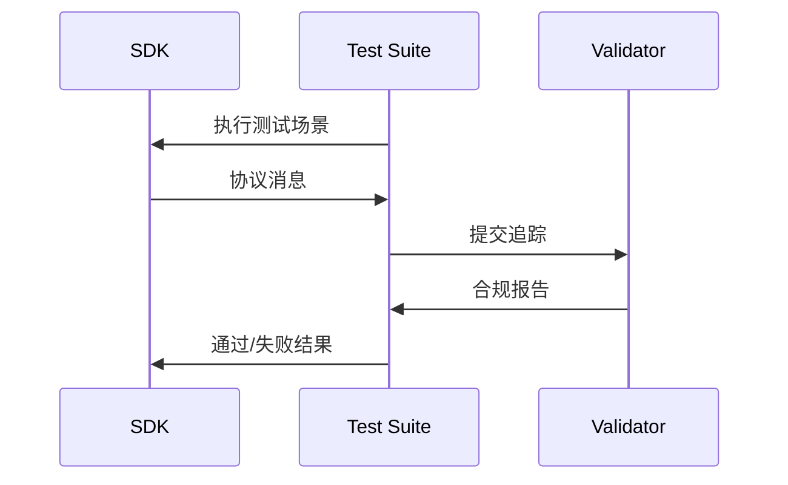

  <Badge color="green" shape="pill">
    最终版
  </Badge>
  <Badge color="gray" shape="pill">
    标准轨道
  </Badge>

| 字段         | 值                                                                           |
| ------------- | ------------------------------------------------------------------------------- |
| **SEP**       | 1730                                                                            |
| **Title**     | SDK 层级系统                                                             |
| **Status**    | 最终版                                                                           |
| **Type**      | 标准轨道                                                                 |
| **Created**   | 2025-10-29                                                                      |
| **Author(s)** | Inna Harper, Felix Weinberger                                                   |
| **Sponsor**   | 无                                                                            |
| **PR**        | [#1730](https://github.com/modelcontextprotocol/modelcontextprotocol/pull/1730) |

---

## 摘要

本 SEP  propose 了一个模型上下文协议 (MCP) SDK 的层级系统，以建立对功能支持、维护承诺和质量标准的清晰预期。该系统定义了三个 SDK 支持层级，并具有客观、可衡量的分类标准。

## 动机

MCP 生态系统需要 SDK 协调以帮助用户做出明智的决定。用户目前面临挑战：

- **功能支持不确定性**：没有标准化的方法来了解哪些 SDK 支持特定的 MCP 功能（OAuth、客户端/服务器/系统功能，如采样、传输）
- **维护预期**：对于错误修复、安全补丁和功能更新的承诺级别不明确
- **实施时间表**：无法了解 SDK 何时支持新协议版本和功能

## 规范

### 层级定义

#### 层级 1：完全支持

此层级中的 SDK 提供完整的协议实现且得到良好支持

**要求：**

- **功能完整且完全支持协议**
  - 所有一致性测试通过
  - 新协议功能在新规范版本发布前实现。（在发布候选版和新协议版本发布之间有两周的时间窗口）
- **SDK 维护**
  - 在两个工作日内确认并分类问题
  - 在七天内解决安全和关键漏洞
  - 稳定发布且 SDK 版本控制有清晰文档
- **文档**
  - 包含所有功能示例的综合文档
  - 已发布的依赖更新策略

#### 层级 2：承诺完全支持

已建立的实现正积极致力于完全协议支持的 SDK。

**要求：**

- **功能完整且完全支持协议**
  - 80% 的一致性测试通过
  - 新协议功能在六个月内实现
- **SDK 维护**
  - 活跃的问题跟踪和管理
  - 至少一次稳定发布
- **文档**
  - 涵盖核心功能的基础文档
  - 已发布的依赖更新策略
- **晋升至层级 1 的承诺**
  - 发布路线图显示达到层级 1 的意图，或者如果 SDK 将无限期保持在层级 2，则提供关于 SDK 方向及为何功能不完整的透明路线图

#### 层级 3：实验性

探索协议空间的早期或专用 SDK。

**特征：**

- 无功能完整性保证
- 无稳定发布要求
- 可能专注于特定用例或实验性功能
- 无更新时间表承诺
- 适用于可能保留在此层级的小众实现

### 一致性测试

所有 SDK 必须使用协议追踪验证进行一致性测试：详情见 [一致性测试 RFC（即将发布）](https://github.com/modelcontextprotocol/modelcontextprotocol/issues/1627)。本 SEP 不专注于一致性测试。对于初始版本的层级划分，我们将采用简化版本，即为每个 SDK 提供一个示例服务器并针对这些服务器运行简化的一致性测试。

**合规评分：**

- SDK 根据测试结果获得百分比评分
- 评分可以显示为徽章（例如，"90% MCP 合规"）
- 层级 1：要求 100% 合规
- 层级 2：要求 80% 合规
- 层级 3：无最低要求

### 层级晋升流程

1. **自我评估：** 维护者根据层级标准评估其 SDK
2. **申请：** 提交带有证据的层级晋升请求
3. **审查：** 社区审查期（2 周）
4. **验证：** 自动化一致性测试，GitHub 问题统计
5. **决定：** 由 MCP 维护者分配层级

### 层级降级流程

1. **自动验证：**
   1. 层级 1 的合规测试连续四周未通过
   2. 层级 2 的 20% 合规测试连续四周未通过
2. 问题：
   1. 问题在两个月内未得到解决

### 需求矩阵

| 功能                                           | SDK A   | SDK B    | SDK C  |
| :------------------------------------------------ | :------ | :------- | :----- |
| **协议功能支持（一致性测试）** | 85%     | 60%%     | 100%   |
| **GitHub 支持统计**                          | 10 天 | 100 天 | 5 天 |
| **文档（自报）**                 | 良好    | 最小化  | 良好   |
| **层级（根据上述计算）**                    | 层级 2  | 层级 3   | 层级 1 |

## 理由

### 为什么是三个层级？

- **层级 1** 确保用户拥有支持良好、功能齐全的 SDK
- **层级 2** 为改进 SDK 提供清晰的路径
- **层级 3** 允许实验而不造成进入壁垒

### 为什么是基于时间的承诺？

虽然社区对严格的时间表提出了担忧，但它们提供了：

- 用户的清晰预期
- 维护者的可衡量目标
- 通过层级晋升的灵活性

### 为什么不只是功能矩阵？

仅功能矩阵无法传达：

- 维护承诺
- 质量标准
- 支持预期

层级系统结合了功能支持质量保证。

## 考虑的替代方案

### 1\. 仅功能矩阵

**拒绝原因：** 无法传达维护承诺或质量标准

### 2\. 基于百分比的评分

**拒绝原因：** 过于细化且无法捕捉支持等定性方面

### 3\. 基于属性的系统

**拒绝原因：** 多个重叠的属性可能会混淆用户

### 4\. 仅列出最新版本

**拒绝原因：** 仅列出“支持 MCP 日期”无法捕捉关键信息：

- 版本支持可能不完整（例如，支持 \<日期\> 但不包括 OAuth）
- 无维护承诺或问题响应时间的指示
- 缺乏安全补丁时间表的信息
- 无法传达依赖更新策略
- 仅版本号不能表明生产就绪状态

### 5\. 无正式系统

**拒绝原因：** 当前的临时方法为用户创造了不确定性

## 向后兼容性

本提案引入了一种新的分类系统，无破坏性变更：

- 现有 SDK 继续运行
- 分类最初是可选加入的
- 现有 SDK 达到层级状态的宽限期

## 安全影响

- 层级 1 SDK 必须在 7 天内解决安全问题
- 鼓励所有层级遵循安全最佳实践
- 一致性测试包括安全验证

## 实施计划

- [ ] 完成简化的一致性测试套件 \- 2025 年 11 月 4 日
- [ ] SDK 维护者自我评估并申请层级 \- 2025 年 11 月 14 日
- [ ] 初始层级分配 \- 11 月规范发布前
- [ ] 实施完整合规测试
- [ ] 实施 SDK 自动问题跟踪分析

## 社区影响

### SDK 维护者

- 清晰的改进目标
- 对高质量实现的认可
- 结构化的晋升路径

### SDK 用户

- 明智地选择 SDK
- 清晰的支持预期
- 对层级 1 实现的信心

### 生态系统

- 整体 SDK 质量提高
- 标准化功能支持
- 实现之间的健康竞争

## 参考资料

- [SDK 维护者会议记录 (\#1648)](https://github.com/modelcontextprotocol/modelcontextprotocol/issues/1648)
- [SDK 协调目标 (\#1444)](https://github.com/modelcontextprotocol/modelcontextprotocol/issues/1444)
- [一致性测试 SEP（草案）](https://github.com/modelcontextprotocol/modelcontextprotocol/issues/1627)

## 附录

### 简化的一致性测试

虽然我们正在致力于 [一致性测试的综合提案](https://github.com/modelcontextprotocol/modelcontextprotocol/issues/1627)，这需要一些时间来实施，但我们希望至少通过某种自动化方式来检查 SDK 是否拥有全套功能。我们将从服务器功能集开始，因为我们的服务器比客户端多得多，而且绝大多数使用 SDK 的开发者是服务器实现者。

最直接的方法是为每个 SDK 提供一个示例服务器，类似于 [Everything 服务器](https://github.com/modelcontextprotocol/servers/tree/main/src/everything)。然后我们将拥有包含所有我们想要测试的测试用例的一致性测试客户端，例如：

- 执行"hello world"工具
- 获取提示
- 获取补全
- 获取资源模板
- 接收通知

**SDK 维护者需要提供什么：** 基于规范实现 everything 服务器。规范将如下所示：

- 工具"say_hello"返回简单文本
- 工具"show_image"返回图像
- 工具"tool_with_logging"以格式 \<\> 返回结构化输出并记录三个事件：开始、处理、结束
- 工具 "tool_with_notifications" 以格式 \<\> 返回结构化输出并拥有两个通知 \<\>

鉴于定义良好的服务器规范和 SDK 文档，在任何编码代理的帮助下实现它应该很容易。我们希望将其签入每个 SDK 仓库，因为它将作为服务器实现者的示例。

一旦每个 SDK 拥有了 Everything 服务器，我们将针对它运行一致性测试客户端。
