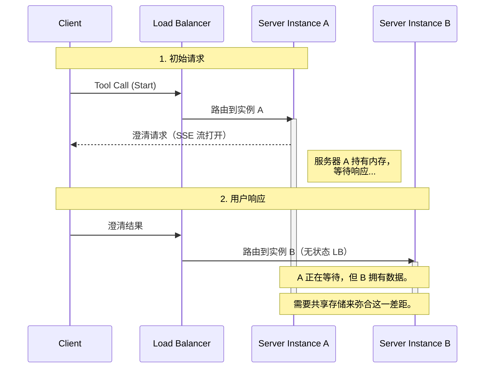
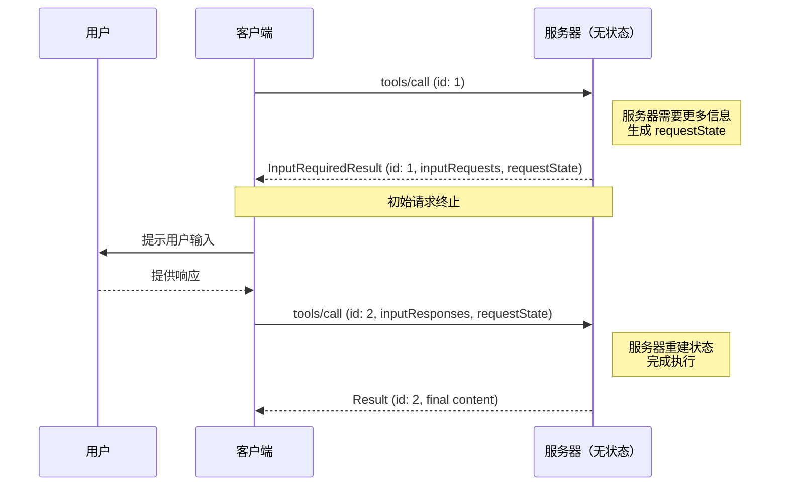
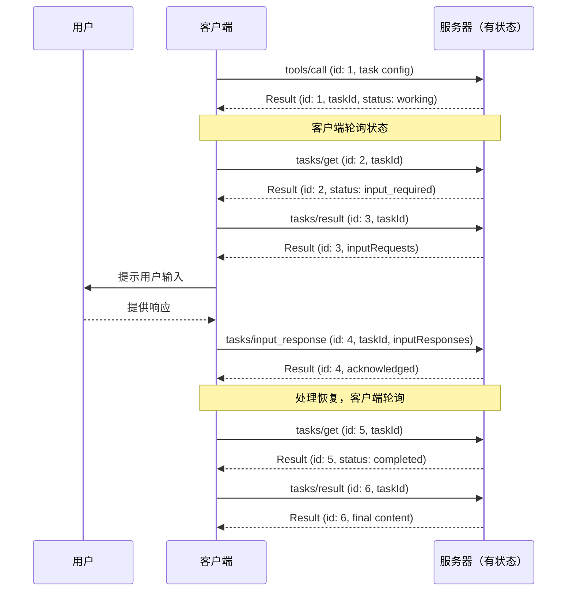

<div className="flex items-center gap-2 mb-4">
  <Badge color="blue" shape="pill">
    已接受
  </Badge>
  <Badge color="gray" shape="pill">
    标准跟踪
  </Badge>
</div>

| Field         | Value                                                                                                                     |
| ------------- | ------------------------------------------------------------------------------------------------------------------------- |
| **SEP**       | 2322                                                                                                                      |
| **Title**     | 多轮往返请求                                                                                                               |
| **Status**    | 已接受                                                                                                                    |
| **Type**      | 标准跟踪                                                                                                                  |
| **Created**   | 2026-02-03                                                                                                                |
| **Author(s)** | Mark D. Roth ([@markdroth](https://github.com/markdroth)), Caitie McCaffrey ([@CaitieM20](https://github.com/CaitieM20)), |
| **Sponsor**   | Caitie McCaffrey ([@CaitieM20](https://github.com/CaitieM20))                                                             |
| **PR**        | [#2322](https://github.com/modelcontextprotocol/modelcontextprotocol/pull/2322)                                           |

---

## 摘要

本提案规定了一种简单的方法，用于在客户端发起的请求上下文中处理服务器发起的请求
（例如，在工具调用上下文中的澄清请求），而无需在各个服务器实例之间共享
存储层，也无需负载均衡具备状态性，这将显著降低
在常见情况下大规模运行 MCP 服务器的成本。它还减少了 HTTP
传输对 SSE 流的依赖，而 SSE 流在许多无法支持长连接的
环境中都会引发问题。

这种拟议的服务器发起请求处理方式将取代当前发送服务器发起请求的做法。这是一个破坏性变更。

本 SEP 还规定了服务器可以在哪些客户端请求的子集上发送服务器发起请求。与当前规范相比，这一范围有所缩小，这同样是一个破坏性变更。

之所以必须在此做出破坏性变更，是因为由于支持 SSE 流和服务器端状态所带来的运维复杂性，诸如 Elicitation、Sampling 和 ListRoots 之类的服务器发起请求功能在许多远程 MCP 服务器或服务器托管客户端中的采用率非常低，或者根本无法启用。

## 动机

注意：本 SEP 旨在为处理任何客户端发起请求上下文中的任何服务器发起请求提供通用机制。为了清晰起见，本文档中我们将专门以工具调用作为任何客户端发起请求的代表，但应将其理解为同样适用于（例如）资源请求或提示请求；类似地，我们将以澄清请求作为任何服务器发起请求的代表，但应将其理解为同样适用于（例如）采样请求。

我们先从一个观察开始：MCP 工具有两种类型：

1. **短暂型**：服务器端不会累积状态。
   - 如果服务器需要更多信息来处理工具调用，它可以在收到额外信息时从头开始。
   - 示例：天气应用、访问电子邮件
2. **持久型**：服务器端会累积状态。
   - 在向客户端请求更多信息之前，服务器可能会生成大量状态；在收到客户端的信息后，它可能需要恢复这些状态以继续处理。
   - 服务器可能需要在等待客户端提供更多信息的同时在后台继续处理，在这种情况下就需要服务器端状态来跟踪该持续进行的处理。
   - 示例：访问代理、启动虚拟机并需要用户交互来操作该虚拟机

绝大多数 MCP 工具都是短暂型的，而且工具通常以横向扩展、负载均衡的服务形式部署，因此我们需要针对这种情况进行优化。

如今，如果某个工具需要发送澄清请求才能继续执行，工作流程如下：

1. 客户端发送工具调用请求。以此为例，假设负载均衡器碰巧将该请求发送到了服务器实例 A。
2. 服务器 A 打开一个 SSE 流，并在该流上发送澄清请求。
3. 客户端将澄清响应作为一个单独的请求发送，负载均衡器会完全独立于步骤 1 中所选实例来选择服务器实例。以此为例，假设负载均衡器碰巧将该请求发送到了服务器实例 B。
4. 服务器 A 必须以某种方式发现发往服务器 B 的澄清响应。
5. 然后服务器 A 在步骤 2 中打开的 SSE 流上发送工具调用结果。



这里的难点在于步骤 4，它要求服务器端具备某种状态性。如今解决这个问题的主要方式，是在所有服务器实例之间共享一个存储层，
这样多个服务器实例就可以将某个服务器实例上的澄清响应与另一个服务器实例上原本正在进行的工具调用对应起来。

如今可用于解决此问题的主要有两种方式：

- **跨服务器实例共享的持久化存储层**：服务器可以
  部署并管理一个持久化存储层（例如 PostgreSQL、Redis、
  DynamoDB），使多个服务器实例能够将一个服务器实例上的澄清响应与另一个服务器实例上原本正在进行的
  工具调用对应起来。这种方式有若干缺点：
  - 持久化存储层**极其昂贵**，尤其是对于
    可能原本并不具备此类存储层的短暂型工具（例如天气
    工具）而言。
  - 持久化存储层带来显著的可靠性问题：
    它会成为关键依赖，因此也可能成为单点故障。为了避免这一点，它必须提供高可用、复制和备份机制。
  - 持久化存储层会成为瓶颈，限制横向
    扩展能力。地理分布式部署要么需要昂贵的
    全局复制，要么需要粘性路由。
  - 持久化存储层还带来显著的运维
    复杂性。在横向扩展部署中，它需要
    分布式锁或共识协议。它还需要特殊的
    垃圾回收逻辑来判断何时可以清理共享内容，
    这需要仔细权衡：过于激进地清理状态会降低存储成本，但会限制用户可响应的时长；
    而较不激进地清理则能容纳响应缓慢的用户，但会
    增加存储成本。
  - 这种方式要求工具实现中具备特殊行为，
    以便与持久化存储层集成。如今的 MCP SDK 并没有针对这类存储层集成的特殊钩子，
    这意味着通过 SDK 编写内联代码会非常困难。
- **负载均衡中的状态性**：借助 cookie，可以
  让负载均衡层确保步骤 3 中的澄清请求被送达与步骤 1 中原始请求相同的服务器实例。该方式虽然
  通常比持久化存储层更便宜，但也有以下
  缺点：
  - 它要求负载
    均衡器进行特殊配置和行为，这通常难以管理。
  - 它打破了正常的负载均衡模型，导致负载分布不均，从而增加运行服务的成本。
  - 它要求客户端具备特殊行为，以传递用于状态性的 cookie。
  - 它要求工具实现将澄清请求与正在进行的工具调用对应起来。（MCP SDK 中有一些代码来处理这一点，但在 HTTP 世界中这仍然是一个非常奇怪的模式。）
  - 它没有故障容错能力。如果服务器实例宕机，所有
    状态都会丢失，工具调用就需要从头开始。（这对短暂型工具不一定重要，但对持久型工具而言是个问题。）

此外，这两种方式都依赖 SSE 流，而
这会在无法支持长连接的环境中造成问题。它们还要求工具的某个实例在特定服务器实例中无限期地保持驻留。对于澄清请求而言，这尤其成问题，因为结果可能
在相当长的时间内都不会从用户那里返回（例如，可能是几天或几个月，甚至可能永远不会返回）。

本 SEP 的目标是提出一种更简单的方法，用于处理客户端发起的请求上下文中的服务器发起请求模式。具体而言，我们需要让这种模式在
短暂型工具、横向扩展、负载均衡部署的常见情况下支持成本更低。这意味着我们需要一种不依赖 SSE 流、也不需要持久化存储层或有状态负载均衡的解决方案，这反过来意味着我们需要避免请求之间的依赖关系：服务器必须能够仅使用该单个请求中所包含的信息来处理每个独立请求。

需要注意的是，虽然这里的目标是优化短暂型工具这一常见场景，但我们确实希望继续支持持久型工具，而这类工具通常已经需要一个持久化存储层。

## 规范

本 SEP 提出了一种在客户端请求上下文中处理服务器请求的新机制。这种新机制对于短暂工具和持久工具会有略有不同的工作流，后者将利用 Tasks。不过，这两种工作流都会使用相同的数据结构。

### Schema 变更

首先，我们引入 `InputRequests` 的概念，它表示一组要发送给客户端的一个或多个服务器发起的请求；以及 `InputResponses`，它表示客户端对这些请求的响应。请求和响应都存储在一个以字符串为键的映射中。对于 `InputRequests`，映射值是服务器发起的请求（例如，elicitation 或 sampling 请求）；而对于 `InputResponses`，映射值是这些请求的响应。下面是它在 typescript MCP schema 中的样子：

```typescript
export type InputRequest =
  | CreateMessageRequest
  | ElicitRequest
  | ListRootsRequest;

export interface InputRequests {
  [key: string]: InputRequest;
}

export type InputResponse =
  | CreateMessageResult
  | ElicitResult
  | ListRootsResult;

export interface InputResponses {
  [key: string]: InputResponse;
}
```

这些键由服务器在发起请求时分配。客户端将使用相应的键为每个请求发送响应。例如，服务器可能会发送如下输入请求：

```json5
"inputRequests": {
  // 询问请求。
  "github_login": {
    "method": "elicitation/create",
    "params": {
      "mode": "form",
      "message": "Please provide your GitHub username",
      "requestedSchema": {
        "type": "object",
        "properties": {
          "name": {
            "type": "string"
          }
        },
        "required": ["name"]
      }
    }
  },
  // 采样请求。
  "capital_of_france" : {
    "method": "sampling/createMessage",
    "params": {
      "messages": [
        {
          "role": "user",
          "content": {
            "type": "text",
            "text": "What is the capital of France?"
          }
        }
      ],
      "modelPreferences": {
        "hints": [
          {
            "name": "claude-3-sonnet"
          }
        ],
        "intelligencePriority": 0.8,
        "speedPriority": 0.5
      },
      "systemPrompt": "You are a helpful assistant.",
      "maxTokens": 100
    }
  }
}
```

随后，客户端会按以下形式发送响应：

```json5
"inputResponses": {
  // 询问响应（ElicitResult）。
  "github_login": {
    "action": "accept",
    "content": {
      "name": "octocat"
    }
  },
  // 采样响应（CreateMessageResult）。
  "capital_of_france": {
    "role": "assistant",
    "content": {
      "type": "text",
      "text": "The capital of France is Paris."
    },
    "model": "claude-3-sonnet-20240307",
    "stopReason": "endTurn"
  }
}
```

Schema 如下：

```typescript
export interface InputRequiredResult extends Result {
  // 由服务器发起的请求，客户端必须在重试原始请求之前完成。
  inputRequests?: InputRequests;
  // 客户端在重试原始请求时需要回传给服务器的请求状态。
  // 注意：客户端必须将其视为不透明的 blob；不得以任何方式解释它。
  requestState?: string;
}

// 包含 input responses 和 request state 的 RequestParams 类型。
// 这些参数可以包含在任何客户端发起的请求中。
export interface InputResponseRequestParams extends RequestParams {
  // 用于承载 InputRequiredResult 消息中服务器请求的响应的新字段。
  // 对于 response 的 inputRequests 字段中的每个键，这里必须出现相同的键及其关联响应。
  inputResponses?: InputResponses;
  // 从客户端回传给服务器的 request state。
  requestState?: string;
}
```

由于这一变更为诸如 'tools/call' 之类的方法调用创建了一个多态响应，因此我们在 `Result` 中引入了一个新字段来指示 `ResultType`。客户端应解析该字段以确定消息中所包含 Result 的类型。如果未提供该字段，为了向后兼容，客户端应假定 `ResultType` 为 "complete"。Schema 变更如下：

```typescript
/**
 * 通用结果字段。
 *
 * @category Common Types
 */
export interface Result {
  _meta?: MetaObject;
  // 指示结果类型的新字段，允许客户端确定如何解析结果对象。如果未指定 resultType，则应假定为 "complete"。
  resultType: ResultType;
  [key: string]: unknown;
}

export type ResultType =
  | "complete" // 请求已成功完成，结果包含最终内容。
  | "input_required"; // 请求尚未完成，结果包含一个 {@link InputRequiredResult} 对象
```

我们预计这个字段对未来的可扩展性会很有帮助，因为它允许我们引入新的结果类型，也可以同样适用于 `tasks`。

这些类型将用于两种不同的工作流：一种用于短暂工具，另一种用于持久工具。

### 客户端请求的服务器发起请求支持

许多 `ClientRequest` 并没有明确的使用场景，需要服务器向客户端请求更多信息。本 SEP 在 [SEP-2260](https://modelcontextprotocol.io/seps/2260-Require-Server-requests-to-be-associated-with-Client-requests) 的基础上进一步限制了服务器何时可以向客户端发送服务器发起请求。

服务器 MAY 在以下 ClientRequest 上发送 `InputRequiredResult` 响应：

| ClientRequest           | ServerResult           | 支持 InputRequiredResult |
| ----------------------- | ---------------------- | ----------------------------- |
| `GetPromptRequest`      | `GetPromptResult`      | Yes                           |
| `ReadResourceRequest`   | `ReadResourceResult`   | Yes                           |
| `CallToolRequest`       | `CallToolResult`       | Yes                           |
| `GetTaskPayloadRequest` | `GetTaskPayloadResult` | Yes                           |

服务器 MUST NOT 在任何其他 ClientRequest 上发送 `InputRequiredResult` 响应。下表表示在撰写本 SEP 时，这排除了哪些 `ClientRequest`。

| ClientRequest                  | 支持 InputRequiredResult |
| ------------------------------ | ----------------------------- |
| `PingRequest`                  | No                            |
| `InitializeRequest`            | No                            |
| `CompleteRequest`              | No                            |
| `SetLevelRequest`              | No                            |
| `ListPromptsRequest`           | No                            |
| `ListResourcesRequest`         | No                            |
| `ListResourceTemplatesRequest` | No                            |
| `SubscribeRequest`             | No                            |
| `UnsubscribeRequest`           | No                            |
| `ListToolsRequest`             | No                            |
| `GetTaskRequest`               | No                            |
| `ListTasksRequest`             | No                            |
| `CancelTaskRequest`            | No                            |
| `TaskInputResponseRequest`     | No                            |

### 短暂工具工作流

对于短暂使用场景，除了输入请求之外，我们还引入了请求状态（request state）的概念。在服务器需要更多信息的情况下，请求状态会发送给客户端，客户端再将该状态回传给服务器，从而使服务器保持无状态。

我们将为短暂工具采用以下工作流：

1. 客户端发送工具调用请求。
2. 服务器返回一个单独的响应，表明该请求尚未完成。该响应可以包含客户端必须完成的输入请求。它也可以包含一些请求状态，客户端必须将其回传给服务器。该响应会终止原始请求。通常它会作为单独的响应发送，而不是通过 SSE 流发送，不过目前（这在未来的 SEP 中可能会改变）也允许在 SSE 流中发送该响应，且可以跟随（例如）进度通知。如果这个未完成响应是通过 SSE 流发送的，那么它必须是 SSE 流中的最后一条消息，就像普通响应一样。
3. 客户端发送一个新的工具调用请求，与原始请求完全独立。这个新的工具调用包含对第 2 步输入请求的响应。它还包含服务器在第 2 步中指定的请求状态。
4. 服务器返回一个 CallToolResponse。



请注意，第 1 步和第 3 步中的请求是完全独立的：处理第 3 步请求的服务器不需要任何不直接存在于请求中的信息。为了支持这种解耦，步骤 1 和步骤 3 中发送的 JsonRPC Id MUST 不同。

另请注意，"inputRequests" 和 "requestState" 字段只会影响客户端对原始请求的下一次重试。它们不会用于客户端可能并行发送的任何其他请求（例如工具列表，甚至另一个工具调用）。

<details>
<summary>点击展开短暂工具示例流程</summary>
<b>短暂工具示例流程</b>

注意：这是一个人为构造的示例，仅用于说明流程。

1. 客户端发送初始的调用工具请求：

```json
{
  "jsonrpc": "2.0",
  "id": 2,
  "method": "tools/call",
  "params": {
    "name": "get_weather",
    "arguments": {
      "location": "New York"
    }
  }
}
```

2. 服务器返回一个未完成响应，表明客户端需要对一个询问请求作出响应才能完成工具调用，并包含要回传的请求状态：

```json
{
  "jsonrpc": "2.0",
  "id": 2,
  "result": {
    "resultType": "input_required",
    "inputRequests": {
      "github_login": {
        "method": "elicitation/create",
        "params": {
          "mode": "form",
          "message": "Please provide your GitHub username",
          "requestedSchema": {
            "type": "object",
            "properties": {
              "name": {
                "type": "string"
              }
            },
            "required": ["name"]
          }
        }
      }
    },
    "requestState": "foo"
  }
}
```

3. 然后客户端重试原始工具调用，这次包括对服务器输入请求的响应以及请求状态：

```json
{
  "jsonrpc": "2.0",
  "id": 3,
  "method": "tools/call",
  "params": {
    "name": "get_weather",
    "arguments": {
      "location": "New York"
    },
    "inputResponses": {
      "github_login": {
        "action": "accept",
        "content": {
          "name": "octocat"
        }
      }
    },
    "requestState": "foo"
  }
}
```

4. 最后，服务器完成工具调用：

```json
{
  "jsonrpc": "2.0",
  "id": 3,
  "result": {
    "resultType": "complete",
    "content": [
      {
        "type": "text",
        "text": "Current weather in New York:\nTemperature: 72°F\nConditions: Partly cloudy"
      }
    ],
    "isError": false
  }
}
```

</details>

#### 短暂工作流的真实示例

这个示例展示了 `requestState` 如何支持由 [Azure DevOps 自定义规则](https://learn.microsoft.com/en-us/azure/devops/organizations/settings/work/custom-rules?view=azure-devops) 驱动的多轮询问流程。该场景涉及一个 `update_work_item` 工具，它将一个 Bug 工作项转换为 "Resolved"。ADO 自定义规则在某些状态转换发生时要求特定字段，服务器使用迭代式询问来收集这些字段——在多轮交互中将上下文累积到 `requestState` 中，从而最终能够在不依赖任何服务器端存储的情况下执行最终更新。

<details>
<summary>点击展开 ADO 自定义规则示例</summary>

**背景 — ADO 自定义规则生效：**

- _规则 1：_ 当 State 变为 "Resolved" → 需要 "Resolution" 字段（例如 Fixed、Won't Fix、Duplicate、By Design）。
- _规则 2：_ 当 Resolution 为 "Duplicate" → 需要 "Duplicate Of" 字段（指向原始工作项的链接）。

##### 第 1 轮 — 工具调用触发状态变更，服务器询问 Resolution

1. 客户端调用 `update_work_item` 工具来解决 Bug #4522：

```json
{
  "jsonrpc": "2.0",
  "id": 1,
  "method": "tools/call",
  "params": {
    "name": "update_work_item",
    "arguments": {
      "workItemId": 4522,
      "fields": { "System.State": "Resolved" }
    }
  }
}
```

2. 服务器识别到将 State 设置为 "Resolved" 会触发规则 1，而该规则需要一个 Resolution 值。服务器没有让调用失败，而是返回一个带有询问请求的未完成响应。此时还不需要 `requestState`，因为原始工具调用参数会在重试时重新发送：

```json
{
  "jsonrpc": "2.0",
  "id": 1,
  "result": {
    "resultType": "input_required",
    "inputRequests": {
      "resolution": {
        "method": "elicitation/create",
        "params": {
          "message": "Resolving Bug #4522 requires a resolution. How was this bug resolved?",
          "requestedSchema": {
            "type": "object",
            "properties": {
              "resolution": {
                "type": "string",
                "enum": ["Fixed", "Won't Fix", "Duplicate", "By Design"],
                "description": "Resolution type for this bug"
              }
            },
            "required": ["resolution"]
          }
        }
      }
    }
  }
}
```

3. 用户选择 "Duplicate"。客户端使用询问响应重试原始工具调用：

```json
{
  "jsonrpc": "2.0",
  "id": 2,
  "method": "tools/call",
  "params": {
    "name": "update_work_item",
    "arguments": {
      "workItemId": 4522,
      "fields": { "System.State": "Resolved" }
    },
    "inputResponses": {
      "resolution": {
        "action": "accept",
        "content": { "resolution": "Duplicate" }
      }
    }
  }
}
```

##### 第 2 轮 — Resolution 触发另一条规则，服务器询问 Duplicate Of

4. 服务器合并用户响应后发现，Resolution = "Duplicate" 触发规则 2，因此需要一个 "Duplicate Of" 链接。它再次返回一个未完成响应，这一次将已经收集到的 resolution 编码到 `requestState` 中，以便无论下一次重试由哪一个服务器实例处理，都可获得该信息：

```json
{
  "jsonrpc": "2.0",
  "id": 2,
  "result": {
    "resultType": "input_required",
    "inputRequests": {
      "duplicate_of": {
        "method": "elicitation/create",
        "params": {
          "message": "Since this is a duplicate, which work item is the original?",
          "requestedSchema": {
            "type": "object",
            "properties": {
              "duplicateOfId": {
                "type": "number",
                "description": "Work item ID of the original bug"
              }
            },
            "required": ["duplicateOfId"]
          }
        }
      }
    },
    "requestState": "eyJyZXNvbHV0aW9uIjoiRHVwbGljYXRlIn0..."
  }
}
```

5. 用户提供原始工作项 ID。客户端重试工具调用，回传 `requestState` 并包含新的询问响应：

```json
{
  "jsonrpc": "2.0",
  "id": 3,
  "method": "tools/call",
  "params": {
    "name": "update_work_item",
    "arguments": {
      "workItemId": 4522,
      "fields": { "System.State": "Resolved" }
    },
    "inputResponses": {
      "duplicate_of": {
        "action": "accept",
        "content": { "duplicateOfId": 4301 }
      }
    },
    "requestState": "eyJyZXNvbHV0aW9uIjoiRHVwbGljYXRlIn0..."
  }
}
```

##### 最终 — 服务器完成更新

6. 服务器解码 `requestState`（其中包含 resolution），读取 `inputResponses`（其中包含 duplicate ID），现在已拥有所有必需字段。于是它完成工具调用：

```json
{
  "jsonrpc": "2.0",
  "id": 3,
  "result": {
    "resultType": "complete",
    "content": [
      {
        "type": "text",
        "text": "Bug #4522 resolved as Duplicate of Bug #4301. State set to Resolved and duplicate link created."
      }
    ],
    "isError": false
  }
}
```

**关键结论：** 在两轮询问过程中，服务器没有持有任何内存中的或持久化的状态。`requestState` 字段通过客户端承载了累积的上下文，因此任意服务器实例都可以处理任一轮交互。

</details>

#### 请求状态的使用场景

“requestState” 机制提供了一种对同一个逻辑请求进行多次往返交互的方式。它主要有两个使用场景。

##### 使用场景 1：滚动升级

假设你正在对水平扩展的服务器实例进行滚动升级，以部署某个工具实现的新版本。旧版本有两个输入请求，键分别是 "github_login" 和 "google_login"。然而在新版本的工具实现中，它仍然使用 "github_login" 输入请求，但将 "google_login" 输入请求替换为新的 "microsoft_login" 输入请求。

如果第一次请求被路由到旧版本服务器，而第二次尝试（包含 input responses）被路由到新版本服务器，那么服务器会看到它需要的 "github_login" 的结果，但不会看到 "microsoft_login" 的结果。（它也会看到 "google_login" 的结果，但它已经不再需要它，所以无关紧要。）此时，服务器需要发送一个针对 "microsoft_login" 的新输入请求，但它也不想丢失已经获取到的 "github_login" 答案，因此它会使用 1685 中提出的那种状态来保留这些信息，而无需在服务器端存储状态。

这里的工作流如下：

1. 客户端发送工具调用请求，命中运行旧版本的服务器实例。
2. 服务器返回一个未完成响应，指示 "github_login" 和 "google_login" 的输入请求。
3. 客户端发送一个新的工具调用请求，其中包含对 "github_login" 和 "google_login" 输入请求的响应。这一次它命中了运行新版本的服务器实例。
4. 服务器返回另一个未完成响应，指示客户端尚未提供的 "microsoft_login" 输入请求。然而，该响应还包含请求状态，其中包含已提供的 "github_login" 响应，因此客户端不需要再次提示用户输入相同的信息。
5. 客户端发送第三个工具调用请求，其中包含对 "microsoft_login" 输入请求的响应，并回传服务器在第 4 步提供的请求状态。
6. 服务器现在在请求状态中看到了 "github_login" 信息，在 input responses 中看到了 "microsoft_login" 状态，因此该请求现在包含了服务器执行工具调用并返回完整响应所需的一切信息。

##### 使用场景 2：负载卸载

假设你有一个 MCP 服务器实例正在处理大量工具调用，并且它发现当前负载过重，因此想把其中一个正在进行的工具调用迁移到另一个服务器实例。然而，它已经在该工具调用上完成了大量处理，所以它不想简单地让调用失败并让客户端在另一个服务器实例上从头开始；相反，它希望保留已经累积的状态，以便恢复处理的任何服务器实例都可以从原服务器实例停止的地方继续。这可以通过发送一个包含请求状态但不包含任何 input requests 的未完成请求来实现。

这里的工作流如下：

1. 客户端发送原始请求，负载均衡器将其路由到服务器实例 A。
2. 服务器实例 A 在做完大量计算后决定需要卸载负载。它发送一个未完成响应，在 `requestState` 字段中包含其已累积的状态，但不包含 `inputRequests` 字段。
3. 客户端使用附加了 `requestState` 字段的请求进行重试。负载均衡器将此请求路由到服务器实例 B。
4. 服务器实例 B 从 `requestState` 字段中看到的状态开始，因此从服务器实例 A 停止的地方继续计算，并最终返回完整响应。

#### 短暂工作流的协议要求

1. **服务器行为：**
   - 服务器 MAY 对任何客户端发起的请求响应 `InputRequiredResult`。该消息 MAY 作为独立响应发送，或作为 SSE 流中的最后一条消息发送，不过实现方建议优先采用前者。如果使用 SSE 流，服务器 MUST NOT 在未完成响应消息之后再发送任何消息。
   - `InputRequiredResult` MAY 包含 `inputRequests` 字段。
   - `InputRequiredResult` MAY 包含 `requestState` 字段。如果指定，该字段是仅对服务器有意义的不透明字符串。服务器可以自由地以任何格式编码状态（例如纯 JSON、base64 编码 JSON、加密 JWT、序列化二进制等）。
   - 如果请求包含 `requestState` 字段，服务器 MUST 始终验证该状态，因为客户端是不受信任的中介。如果担心篡改，服务器 SHOULD 使用其选择的加密算法对 `requestState` 字段进行加密（例如，可以使用 AES-GCM 或签名 JWT），以确保机密性和完整性。请注意，还存在重放/劫持攻击的风险：经过身份验证的攻击者可能会重新发送原本发给另一个用户的状态。因此，如果请求状态包含任何特定于原始用户的数据，服务器 MUST 使用某种机制在密码学上将该数据绑定到原始用户，并且 MUST 验证客户端发送的 `requestState` 数据是否与当前已认证用户相关联。使用明文状态的服务器 MUST 将解码后的值视为不可信输入，并以与验证任何客户端提供数据相同的方式进行验证。

2. **客户端行为：**
   - 如果客户端收到一条 `InputRequiredResult` 消息，并且该消息包含 `inputRequests` 字段，那么客户端 MUST 在重试原始请求之前构造所请求的输入。相反，如果消息不包含 `inputRequests` 字段，那么客户端 MAY 立即重试原始请求。
   - 如果客户端收到一条包含 `requestState` 字段的 `InputRequiredResult` 消息，它在重试原始请求时 MUST 回传该字段的精确值。客户端 MUST NOT 检查、解析、修改 `requestState` 的内容，也不得对其内容作任何假设。如果 `InputRequiredResult` 不包含 `requestState` 字段，那么客户端 MUST NOT 在重试中包含该字段。

### 持久工具工作流

持久工具工作流将利用 Tasks。[`Tasks`](https://modelcontextprotocol.io/specification/draft/basic/utilities/tasks) 已经提供了一种机制，用于表示完成请求还需要更多信息。`input_required` Task Status 允许服务器表明处理该任务还需要额外信息。

`Tasks` 的工作流如下：

1. 服务器将 Task Status 设为 `input_required`。此时服务器可以暂停处理请求。
2. 客户端通过调用 `tasks/get` 获取 Task Status，并看到需要更多信息。
3. 客户端调用 `tasks/result`
4. 服务器返回 `InputRequests` 对象。
5. 客户端调用包含 `InputResponses` 对象以及 Task 元数据字段的 `tasks/input_response` 请求。
6. 服务器恢复处理，并将 TaskStatus 设回 `working`。



由于 `Tasks` 往往运行时间更长、与其关联状态更多，而且计算成本更高，因此请求更多信息并不会终止原始请求的操作（例如工具调用）。相反，一旦提供了必要信息，服务器就可以恢复处理。

为了与 MRTR 语义保持一致，服务器将对 `tasks/result` 请求返回一个 `InputRequests` 对象。这两者将具有相同的 JsonRPC `id`。当客户端以 `InputResponses` 对象进行响应时，这是一个带有新 JSONRPC `id` 的新客户端请求，因此需要一个新的方法名。我们建议使用 `tasks/input_response`。

上面的工作流以及下面的示例都没有使用任何可选的 Task Status 通知，不过本 SEP 并不排除其使用。

<details>
<summary>点击展开持久工具示例流程</summary>

下面的示例演示了完整的 Task Message 流程，针对一个 Echo Tool，它可以通过 Elicitation 向客户端请求额外信息。

1. <b>客户端请求</b>，调用 EchoTool。

```json
{
  "jsonrpc": "2.0",
  "id": 1,
  "method": "tools/call",
  "params": {
    "name": "echo",
    "task": {
      "ttl": 60000
    }
  }
}
```

2. <b>服务器响应</b>，返回一个 `Task`

```json
{
  "id": 1,
  "jsonrpc": "2.0",
  "result": {
    "task": {
      "taskId": "echo_dc792e24-01b5-4c0a-abcb-0559848ca3c5",
      "status": "working",
      "statusMessage": "已为 echo 工具调用创建任务。",
      "createdAt": "2026-01-27T03:32:48.3148180Z",
      "lastUpdatedAt": "2026-01-27T03:32:48.3148180Z",
      "ttl": 60000,
      "pollInterval": 100
    }
  }
}
```

3. <b>客户端请求</b>，使用 `tasks/get` 定期检查 `Task` 的状态。

```json
{
  "jsonrpc": "2.0",
  "id": 2,
  "method": "tasks/get",
  "params": {
    "taskId": "echo_dc792e24-01b5-4c0a-abcb-0559848ca3c5"
  }
}
```

4. <b>服务器响应</b>，Task 状态为 `input_required`

```json
{
  "id": 2,
  "jsonrpc": "2.0",
  "result": {
    "taskId": "echo_dc792e24-01b5-4c0a-abcb-0559848ca3c5",
    "status": "input_required",
    "statusMessage": "需要输入以继续调用 tasks/result",
    "createdAt": "2026-01-27T03:38:07.7534643Z",
    "lastUpdatedAt": "2026-01-27T03:38:07.7534643Z",
    "ttl": 60000,
    "pollInterval": 100
  }
}
```

5. <b>客户端请求</b> 发送消息 `tasks/result`，以了解继续进行所需的输入。

```json
{
  "jsonrpc": "2.0",
  "id": 3,
  "method": "tasks/result",
  "params": {
    "taskId": "echo_dc792e24-01b5-4c0a-abcb-0559848ca3c5"
  }
}
```

6. <b>服务器响应</b> 返回 `inputRequests` 以请求额外输入

```json
{
  "id": 3,
  "jsonrpc": "2.0",
  "result": {
    "resultType": "input_required",
    "inputRequests": {
      "echo_input": {
        "method": "elicitation/create",
        "params": {
          "mode": "form",
          "message": "Please provide the input string to echo back",
          "requestedSchema": {
            "type": "object",
            "properties": {
              "input": { "type": "string" }
            },
            "required": ["input"]
          }
        }
      }
    }
  },
  "_meta": {
    "io.modelcontextprotocol/related-task": {
      "taskId": "echo_dc792e24-01b5-4c0a-abcb-0559848ca3c5"
    }
  }
}
```

7. <b>客户端请求</b> 向用户展示 Elicitation 并收集输入，然后向服务器发送消息。

```json
{
  "jsonrpc": "2.0",
  "id": 4,
  "method": "tasks/input_response",
  "params": {
    "inputResponses": {
      "echo_input": {
        "action": "accept",
        "content": {
          "input": "Hello World!"
        }
      }
    },
    "_meta": {
      "io.modelcontextprotocol/related-task": {
        "taskId": "echo_dc792e24-01b5-4c0a-abcb-0559848ca3c5"
      }
    }
  }
}
```

8. <b>服务器响应</b> 服务器应通过发送 `JSONRPCResponse` 来确认已收到 `tasks/input_response` 消息。如果消息成功接收，则会发送一个包含 `taskId` 的 `JSONRPCResultResponse`。如果发生错误，则会发送 `JSONRPCErrorResponse`。服务器现在可以使用提供的输入继续完成 `Task`，并且 `Task` 状态变为 `Working`。

```json
{
  "id": 4,
  "jsonrpc": "2.0",
  "result": {
    "_meta": {
      "io.modelcontextprotocol/related-task": {
        "taskId": "echo_dc792e24-01b5-4c0a-abcb-0559848ca3c5"
      }
    }
  }
}
```

9. <b>客户端请求</b> 继续使用 `tasks/get` 轮询输入状态，直到服务器返回 Task 状态为 `Completed`

```json
{
  "jsonrpc": "2.0",
  "id": 5,
  "method": "tasks/get",
  "params": {
    "taskId": "echo_dc792e24-01b5-4c0a-abcb-0559848ca3c5"
  }
}
```

10. <b>服务器响应</b>，Task 状态为 `completed`

```json
{
  "id": 5,
  "jsonrpc": "2.0",
  "result": {
    "taskId": "echo_dc792e24-01b5-4c0a-abcb-0559848ca3c5",
    "status": "completed",
    "statusMessage": "任务已成功完成，请调用 tasks/result",
    "createdAt": "2026-01-27T03:38:07.7534643Z",
    "lastUpdatedAt": "2026-01-27T03:38:08.1234567Z",
    "ttl": 60000,
    "pollInterval": 100
  }
}
```

11. <b>客户端请求</b> 调用 `tasks/result`，从服务器获取 `Task` 的最终结果。

```json
{
  "id": 6,
  "jsonrpc": "2.0",
  "method": "tasks/result",
  "params": {
    "taskId": "echo_dc792e24-01b5-4c0a-abcb-0559848ca3c5"
  }
}
```

12. <b>服务器响应</b>，返回 `Task` 的最终结果

```json
{
  "id": 6,
  "jsonrpc": "2.0",
  "result": {
    "resultType": "complete",
    "isError": false,
    "content": [
      {
        "type": "text",
        "text": "Echo: Hello World!"
      }
    ],
    "_meta": {
      "io.modelcontextprotocol/related-task": {
        "taskId": "echo_dc792e24-01b5-4c0a-abcb-0559848ca3c5"
      }
    }
  }
}
```

</details>

#### 持久工作流的协议要求

1. **服务器行为：**
   - 服务器 MAY 通过指示任务处于 `input_required` 状态来响应 `tasks/get`。
   - 当任务处于 `input_required` 状态时，服务器 MUST 在 `tasks/result` 响应中包含 `inputRequests` 字段。

2. **客户端行为：**
   - 当 `tasks/get` 显示状态为 `input_required` 时，客户端 MUST 调用 `tasks/result` 以获取输入请求。客户端 SHOULD 构造这些请求的结果，然后调用 `tasks/input_response`，连同 input responses 一起提供任务所需输入。
   - 客户端 MAY 选择不满足这些输入请求，在这种情况下可以取消任务。

### 短暂与持久工作流之间的交互

如果某个工具实现需要客户端先响应一组输入请求，然后才能开始处理，但之后又需要进行持久化处理，那么它可以先使用短暂工作流，然后在那一时刻通过创建任务切换到持久工作流。这样可以避免服务器在真正获得开始处理请求所需的信息之前就必须存储状态。

该工作流如下：

1. 客户端发送带有 task 元数据的工具调用请求。
2. 服务器返回 `inputRequests` 响应，表明处理该请求还需要更多信息。该响应会终止原始请求。
3. 客户端发送一个新的工具调用请求，与原始请求完全独立，其中包含 `inputResponses` 对象以及 task 元数据。
4. 服务器返回一个 task ID，表明它将会在后台处理该请求。后续所有交互都将通过 Tasks API 完成。

请注意，反向流程并不成立：一旦某个工具实现返回了一个 task，它就已经承诺在任务持续期间在服务器端存储状态，并且没有办法再切换回短暂模型。之后的所有交互都必须通过 Tasks API 进行。

### 错误处理指导

本节为以下场景中的错误处理提供实现指导：客户端在 `inputResponses` 对象中提供了意外或格式错误的数据。

与处理任何收到的请求一样，服务器 SHOULD 验证客户端提供的数据是否是有效的 `inputResponses` 对象，以及其中的信息是否可以被正确解析。协议错误，例如格式错误的 JSON、无效 schema，或阻止请求处理的服务器内部错误，应返回带有适当错误代码和消息的 `JSONRPCErrorResponse`。

如果在 `inputResponses` 对象中提供了额外参数，服务器 SHOULD 将其视为可选参数。因此，它 SHOULD 忽略 `inputResponses` 对象中任何它不认识或不需要的意外信息。

客户端也可能没有发送前一轮 `inputRequests` 中请求的全部信息。如果缺失的信息对于服务器处理请求是必要的，那么服务器 SHOULD 返回一个新的 `InputRequiredResult`。

我们曾讨论过返回一个特定的应用层错误码，但在所有场景下客户端可能都没有足够信息来恢复。因此，我们决定依赖现有的通过 `InputRequiredResult` 请求更多输入的机制，以确保客户端总是可以通过让服务器再次请求必要信息来恢复。

恶意客户端可能会故意在 `inputResponses` 对象中发送错误信息，并通过反复触发服务器请求相同信息来制造负载。不过，这并不是此工作流引入的新问题，因为恶意客户端此前就已经可以通过发送格式错误的请求来制造负载。服务器实现者可以使用速率限制和节流等标准技术来防范此类攻击。

在短暂工作流中，这将如下所示：

1. 客户端重试原始工具调用，这次包含 `inputResponses` 对象，但响应缺少服务器处理请求所需的必需信息。

```json
{
  "jsonrpc": "2.0",
  "id": 3,
  "method": "tools/call",
  "params": {
    "name": "get_weather",
    "arguments": {
      "location": "New York"
    },
    "inputResponses": {
      "not_requested_info": {
        "action": "accept",
        "content": {
          "not_requested_param_name": "Information the server did not request"
        }
      }
    }
  }
}
```

2. 服务器返回一个未完成响应，表明客户端需要对一个询问请求作出响应才能完成工具调用，并包含要回传的请求状态：

```json
{
  "jsonrpc": "2.0",
  "id": 2,
  "result": {
    "resultType": "input_required",
    "inputRequests": {
      "github_login": {
        "method": "elicitation/create",
        "params": {
          "mode": "form",
          "message": "Please provide your GitHub username",
          "requestedSchema": {
            "type": "object",
            "properties": {
              "name": {
                "type": "string"
              }
            },
            "required": ["name"]
          }
        }
      }
    }
  }
}
```

2. 服务器返回一个未完成响应，表明客户端需要提供缺失信息以使请求成功。

在持久工作流中，这将如下所示：
上文第 7 步：<b>客户端请求</b> 客户端错误地或恶意地向服务器发送了意外但格式正确的数据，以响应输入请求。

```json
{
  "jsonrpc": "2.0",
  "id": 4,
  "method": "tasks/input_response",
  "params": {
    "inputResponses": {
      "echo_input": {
        "action": "accept",
        "content": {
          "not_requested_parameter": "Information the server did not request."
        }
      }
    },
    "_meta": {
      "io.modelcontextprotocol/related-task": {
        "taskId": "echo_dc792e24-01b5-4c0a-abcb-0559848ca3c5"
      }
    }
  }
}
```

上文第 8 步。<b>服务器响应</b> 服务器通过发送 `JSONRPCResultResponse` 确认已收到响应。然而，由于响应缺少必需信息，服务器不会继续处理该任务，并将 Task 状态保持为 `input_required`。客户端下次调用 `tasks/result` 时，服务器将返回一个新的 `inputRequest`，再次请求所需信息。

```json
{
  "id": 4,
  "jsonrpc": "2.0",
  "result": {
    "_meta": {
      "io.modelcontextprotocol/related-task": {
        "taskId": "echo_dc792e24-01b5-4c0a-abcb-0559848ca3c5"
      }
    }
  }
}
```

## 原因说明

我们考虑过采用双向流的方式来替代 SSE 流。
不过，这种方式会使线协议更加复杂（例如，它需要 HTTP/2 或 HTTP/3）。此外，它也不会消除那些无法支持长连接的环境中的问题，也无法解决容错方面的问题。

关于输入请求应该是一个 map 还是仅仅一个单独对象，曾有过讨论，也有人考虑利用请求内部的某个字段（例如 elicitation ID）来区分它们。我们最终决定使用 map，因为它在结构上保证了键的唯一性，这将避免 SDK 和应用程序中为了避免冲突而进行显式检查的需要。

在持久化工作流中，我们曾考虑将输入请求直接包含在 `tasks/get` 响应中，而不是要求客户端先看到 `input_required` 状态，然后再调用 `tasks/result` 获取输入请求。我们决定将这两者分开，以尊重那些为任务状态和实际工具实现使用不同基础设施的实现方式；这样做的想法是，无论任务状态实际是什么，`tasks/get` 调用都应具有一致的延迟特征。我们认识到这需要额外一次到服务器的往返，但如果这成为问题，我们可以在未来进行优化。

## 向后兼容性

目前，许多 SDK 通过一种内联但异步的方式支持 elicitation：它会在原始 SSE 流上发送工具调用响应之前，等待 elicitation 响应。这种方式适用于单进程的 MCP Server，或者能够确保请求粘性路由的场景。

```python
def my_tool():
  do_work()
  await elicit_more_info()
  do_more_work()
  return tool_result
```

SDK **可以**继续为现有工具和向后兼容性支持这种 elicitation 方式，但**应当**将这种模式标记为 legacy/deprecated。

未来，示例和 SDK 需要支持新的 elicitation 方式，在这种方式下，代码不能假设由同一个进程同时处理工具调用。这个编程模型吸引力较弱，不过它能确保 MCP Server 可以从单进程的 Stdio MCP server 平滑迁移到多进程的远程 MCP Server，而无需大规模重写，并确保我们在未来有一种统一推荐的 elicitation 方式。

```python
def my_tool(request):
  if(request.requestState):
      state = decode(request.requestState)
  if(request.inputResponses):
      additionalInfo = decode(request.inputResponses)

  do_work(state, additionalInfo)
  if(more_info_needed):
    return IncompleteResponse();
  else
    do_more_work()
    return tool_result
```

这里考虑过的其他方案是提供两种不同的编程模型，开发者可以根据自己的 MCP Server 部署是单进程还是多进程来选择，以继续支持 await 语义；不过，这会增加开发者体验的复杂度，并且会让开发者更难在单进程和多进程部署之间切换。

## 安全影响

由于 `requestState` 会经过客户端传递，恶意或被入侵的客户端可能会尝试修改它，以改变服务器行为、绕过授权检查或破坏服务器逻辑。为减轻这一风险，我们要求服务器按照上面的协议要求验证该状态。

## 参考实现

待定

### 致谢

感谢 Luca Chang (@LucaButBoring) 提供的宝贵意见，帮助将输入请求集成到 Tasks 中。
