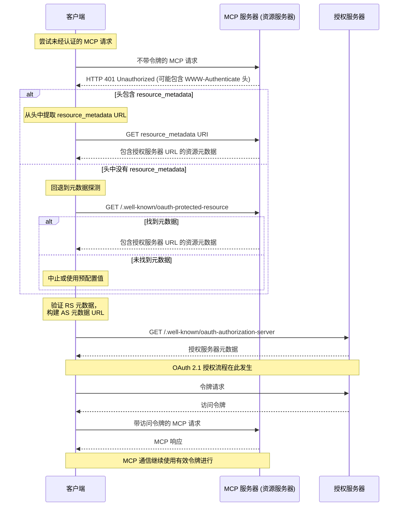

<div className="flex items-center gap-2 mb-4">
  <Badge color="green" shape="pill">
    最终版
  </Badge>
  <Badge color="gray" shape="pill">
    标准轨道
  </Badge>
</div>

| 字段          | 值                                                                            |
| ------------- | ----------------------------------------------------------------------------- |
| **SEP**       | 985                                                                           |
| **标题**      | 使 OAuth 2.0 受保护资源元数据与 RFC 9728 保持一致                             |
| **状态**      | 最终版                                                                        |
| **类型**      | 标准轨道                                                                      |
| **创建日期**  | 2025-07-16                                                                    |
| **作者**      | sunishsheth2009                                                               |
| **赞助人**    | 无                                                                            |
| **PR**        | [#985](https://github.com/modelcontextprotocol/modelcontextprotocol/pull/985) |

---

## 摘要

本提案使 MCP 规范中处理 OAuth 2.0 受保护资源元数据的方式与 [RFC 9728](https://datatracker.ietf.org/doc/html/rfc9728#name-obtaining-protected-resourc) 保持一致。

目前，MCP 规范要求在使用 401 Unauthorized 响应时通过 HTTP WWW-Authenticate 头来指示受保护资源元数据的位置。然而，[RFC 9728，第 5 节](https://datatracker.ietf.org/doc/html/rfc9728#section-5) 指出：

“受保护资源可以使用 WWW-Authenticate HTTP 响应头字段（如 RFC 9110 中所述），向客户端返回其受保护资源元数据的 URL。”

这表明 MCP 规范可以在保持符合 RFC 的同时变得更加灵活。

## 理由

许多大规模、动态、多租户环境依赖于与后端资源服务器分离的集中式身份验证服务。在这样的部署中，由于关注点分离和基础设施复杂性，从后端服务注入 WWW-Authenticate 头并非易事。

在这些场景中，提供通过知名 URL 发现元数据的选项为更容易采用 MCP 提供了一条实用路径。仅要求头信息将在组件之间施加巨大的通信开销，特别是当数百或数千个 MCP 实例动态创建和销毁时。此外，如果有特定的托管 MCP 服务器，在集中式系统中采用头信息将增加巨大的开销。

虽然这增加了客户端的复杂性——客户端现在必须实现探测元数据端点的逻辑——但它减少了服务器部署的摩擦，并可能鼓励更广泛的采用。存在权衡：

服务器开发者的优点：避免复杂的头信息注入；简化分布式环境中的集成。

客户端开发者的缺点：当头信息缺失时，客户端必须回退到元数据发现逻辑，增加了客户端复杂性。

## 提议状态

更新 MCP 规范以：

```
客户端必须解释 WWW-Authenticate 头，如果不存在则回退到探测元数据。
服务器应该返回 WWW-Authenticate 头
```

**偏离 RFC 一点的原因：**
对 WWW-Authenticate 使用 SHOULD 而不是 MAY 的原因是，这使得支持其他功能（例如增量授权）更容易（例如，你请求一个工具，但需要额外的作用域，并收到指示作用域的 WWW-Authenticate 挑战）。

基于上述，遵循更新后的流程：

- 尝试不带令牌发起 MCP 请求。
- 如果收到 401 Unauthorized 响应：检查 WWW-Authenticate 头。如果存在且包含 resource_metadata 参数，使用它来定位资源元数据。
- 如果头不存在或不包含 resource_metadata，回退到请求 /.well-known/oauth-protected-resource。

此更改允许更灵活的部署模型，而无需移除现有功能。



## 向后兼容性

本提案完全向后兼容。

它保留了对 WWW-Authenticate 头的支持（已在规范中），并引入了使用 .well-known 元数据路径的回退机制，这在 MCP 中已定义为必须支持的位置。

已经支持元数据探测的客户端将受益于改进的互操作性。如果不可行，服务器不需要发出 WWW-Authenticate 头，但仍鼓励这样做以减少客户端复杂性并启用未来的可扩展性。
