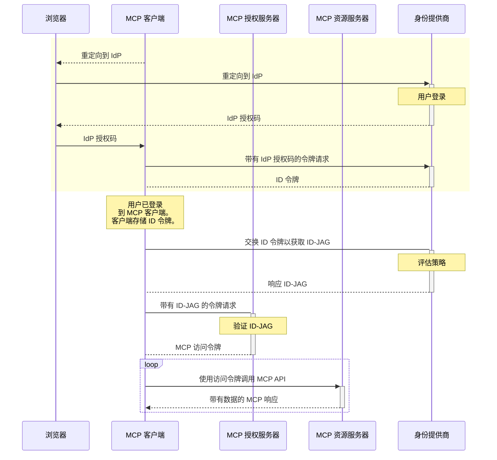

  <Badge color="green" shape="pill">
    最终版
  </Badge>
  <Badge color="gray" shape="pill">
    标准轨道
  </Badge>

| 字段           | 值                                                                            |
| -------------- | ----------------------------------------------------------------------------- |
| **SEP**        | 990                                                                           |
| **标题**       | 在 MCP OAuth 流程中启用企业 IdP 策略控制                                      |
| **状态**       | 最终版                                                                        |
| **类型**       | 标准轨道                                                                      |
| **创建日期**   | 2025-06-04                                                                    |
| **作者**       | Aaron Parecki ([@aaronpk](https://github.com/aaronpk))                        |
| **赞助方**     | 无                                                                            |
| **PR**         | [#646](https://github.com/modelcontextprotocol/modelcontextprotocol/pull/646) |

---

## 摘要

此扩展旨在利用现有的企业身份基础设施，促进企业环境中 MCP 客户端的安全且可互操作的授权。

- 对于最终用户，这消除了手动连接和授权 MCP 客户端到组织内各个服务的需求。
- 对于企业管理员，这使得他们能够可见并控制组织内可以使用哪些 MCP 服务器。

## 如何测试？

我们在此处有一个端到端的实现 [此处](https://github.com/oktadev/okta-cross-app-access-mcp)，并且正在与合作伙伴进行中的 MCP 实现。

## 破坏性变更

此设计旨在通过在企业 IdP 下使用时提供替代方案来增强现有的 OAuth 配置文件。MCP 客户端可以在必要时选择加入此配置文件。

## 附加背景

关于此问题的更多背景，您可以参考我在此处的博客文章：

[支持企业的 MCP](https://aaronparecki.com/2025/05/12/27/enterprise-ready-mcp)

我还在五月的 MCP 开发者峰会上展示了这一点。

流程的高级概述如下：

> [!IMPORTANT]
> **状态：** 准备审查
