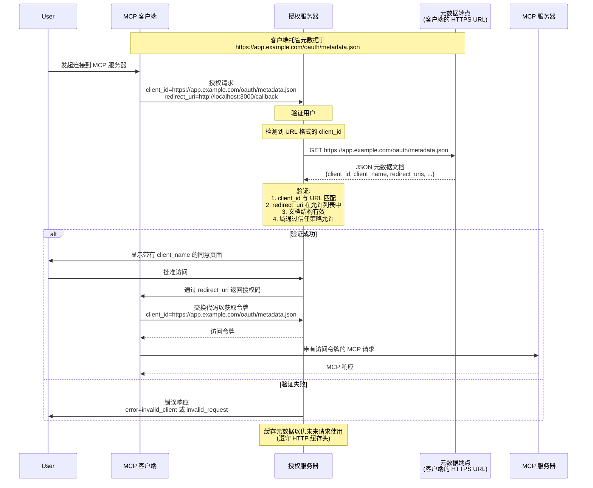

<div className="flex items-center gap-2 mb-4">
  <Badge color="green" shape="pill">
    最终版
  </Badge>
  <Badge color="gray" shape="pill">
    标准轨道
  </Badge>
</div>

| 字段           | 值                                                                                                              |
| -------------- | --------------------------------------------------------------------------------------------------------------- |
| **SEP**        | 991                                                                                                             |
| **标题**       | 启用基于 URL 的客户端注册，使用 OAuth Client ID 元数据文档                                                      |
| **状态**       | 最终版                                                                                                          |
| **类型**       | 标准轨道                                                                                                        |
| **创建日期**   | 2025-07-07                                                                                                      |
| **作者**       | Paul Carleton ([@pcarleton](https://github.com/pcarleton)) Aaron Parecki ([@aaronpk](https://github.com/aaronpk)) |
| **赞助者**     | 无                                                                                                              |
| **PR**         | [#991](https://github.com/modelcontextprotocol/modelcontextprotocol/pull/991)                                   |

---

## 摘要

本 SEP 提议采用 [draft-parecki-oauth-client-id-metadata-document-03](https://datatracker.ietf.org/doc/draft-parecki-oauth-client-id-metadata-document/) 中指定的 OAuth Client ID 元数据文档，作为模型上下文协议 (MCP) 的额外客户端注册机制。这种方法允许 OAuth 客户端使用 HTTPS URL 作为客户端标识符，其中该 URL 指向包含客户端元数据的 JSON 文档。这专门解决了常见的 MCP 场景，即服务器和客户端之间没有预先存在的关系，使服务器能够在无需预先协调的情况下信任客户端，同时保持对访问策略的完全控制。

## 动机

模型上下文协议目前支持两种客户端注册方法：

1. **预注册**：要求客户端开发人员或用户手动向每个服务器注册客户端
2. **动态客户端注册 (DCR)**：允许通过向授权服务器上的注册端点发送客户端元数据进行即时注册。

对于 MCP 的用例（客户端经常需要连接到它们以前从未遇到过的服务器），这两种方法都有显著的局限性：

- 开发人员进行预注册是不切实际的，因为客户端发布时服务器可能尚不存在
- 用户进行预注册会造成糟糕的用户体验，需要手动管理凭据
- DCR 要求服务器管理无边界数据库、处理过期问题，并信任自我声明的元数据

### 目标用例：无预先存在的关系

本提议专门针对常见的 MCP 场景，其中：

- 用户希望将客户端连接到他们发现的服务器
- 客户端开发人员从未听说过此服务器
- 服务器运营商从未听说过此客户端
- 双方需要在无需预先协调的情况下建立信任

对于存在预先关系的场景，预注册仍然是最佳解决方案。然而，MCP 的价值在于其能够连接任意客户端和服务器，因此解决“无预先存在的关系”的情况至关重要。

相关地，MCP 服务器的数量远多于客户端（类似于网页浏览器远多于 API 的情况）。一个常见的场景是 MCP 服务器开发人员希望将使用限制为他们信任的一组客户端。

### 关键创新：无需预先协调的服务器控制信任

Client ID 元数据文档启用了一种独特的信任模型，其中：

1. **服务器可以信任它们以前从未见过的客户端**，基于：
   - 托管元数据的 HTTPS 域名
   - 元数据内容本身
   - 域名声誉和安全策略

2. **服务器通过灵活的策略保持完全控制**：
   - **开放服务器**：可以接受任何 HTTPS client_id，实现最大互操作性
   - **受保护服务器**：可以限制为受信任的域或特定客户端

3. **无需客户端预先协调**：
   - 客户端无需提前了解服务器
   - 客户端只需托管其元数据文档
   - 信任源自客户端的域，而非预先注册

## 规范变更

对规范的变更是将 Client ID 元数据文档添加为 SHOULD（应该），并将 DCR 更改为 MAY（可以），因为我们认为 Client ID 元数据文档是此场景的更好默认选项。

我们将主要依赖链接的 RFC 中的文本， aim 不重复大部分内容。以下是我们需要指定的简短版本。



### 客户端要求

- 客户端必须遵循 RFC 要求在其 HTTPS URL 上托管元数据文档
- client_id URL 必须使用 "https" 方案并包含路径组件
- 元数据文档必须是有效的 JSON 并至少包括：
  - `client_id`：与文档 URL 完全匹配
  - `client_name`：用于授权提示的人类可读名称
  - `redirect_uris`：允许的重定向 URI 数组
  - `token_endpoint_auth_method`：公共客户端为 "none"

注意，鉴于客户端元数据可以提供公钥信息，客户端可以对 `token_endpoint_auth_method` 使用 `private_key_jwt`。

### 服务器要求

- 服务器在遇到 URL 格式的 client_ids 时应获取元数据文档
- 服务器必须验证获取的文档包含匹配的 client_id
- 服务器应缓存元数据并遵守 HTTP 头（建议最多 24 小时）
- 服务器必须验证重定向 URI 与元数据文档中的匹配

### 发现

- 服务器通过 OAuth 元数据广告支持：`client_id_metadata_document_supported: true`
- 客户端检测支持，如果不可用可以回退到 DCR 或预注册

元数据文档示例：

```json
{
  "client_id": "https://app.example.com/oauth/client-metadata.json",
  "client_name": "示例 MCP 客户端",
  "client_uri": "https://app.example.com",
  "logo_uri": "https://app.example.com/logo.png",
  "redirect_uris": [
    "http://127.0.0.1:3000/callback",
    "http://localhost:3000/callback"
  ],
  "grant_types": ["authorization_code"],
  "response_types": ["code"],
  "token_endpoint_auth_method": "none"
}
```

### 与现有 MCP 认证的集成

本提议将 Client ID 元数据文档作为第三种注册选项添加到预注册和 DCR 之外。服务器可以支持这些方法的任何组合：

- 预注册保持不变
- DCR 保持不变
- Client ID 元数据文档通过 URL 格式的 client_ids 检测，服务器支持在 OAuth 元数据中广告。

## 理由

### 为何这能解决“无预先存在的关系”问题

与需要协调的预注册或需要服务器管理注册数据库的 DCR 不同，Client ID 元数据文档提供：

1. **可验证的身份**：HTTPS URL 既作为标识符又作为信任锚点
2. **无需协调**：客户端发布元数据，服务器消费它
3. **灵活的信任策略**：服务器决定自己的信任标准，无需客户端更改
4. **稳定的标识符**：与 DCR 的临时 ID 不同，URL 是稳定且可审计的

### 重定向 URI 证明

Client ID 元数据文档的一个关键好处是重定向 URI 的证明：

1. **元数据文档通过 HTTPS 将重定向 URI 加密绑定到客户端身份**
2. **服务器可以信任元数据中的重定向 URI 由客户端控制** - 而非攻击者提供
3. **这防止了自我声明注册中常见的重定向 URI 操纵攻击**

### 此方法的风险

#### 风险：Localhost URL 冒充

Client ID 元数据文档的一个局限性是它们本身无法防止 localhost URL 冒充。攻击者可以通过以下方式声称是任何客户端：

1. 提供合法客户端的元数据 URL 作为其 client_id
2. 绑定到合法客户端使用的相同 localhost 端口
3. 当用户批准时拦截授权码

这种攻击令人担忧，因为服务器看到正确的元数据
文档，用户看到正确的客户端名称，使得检测
变得困难。

特定平台的证明（iOS DeviceCheck, Android
Play Integrity）可以解决此问题，但它们并非普遍可用。这
将通过开发人员运行后端服务来实现，该服务消费 DeviceCheck / Play Integrity
签名并返回可用作 `token_endpoint_auth_method` 的 `private_key_jwt` 认证的 JWT。

一种类似的方法不需要特定平台的证明，但仍提高了攻击成本，
可以使用 JWKS 和由客户端开发人员托管的服务器端组件签发的短期 JWT。该组件可以使用除特定平台之外的证明机制来证明客户端身份，例如客户端的标准登录流程。使用短期 JWT 降低了凭据泄露和重放的风险，但并未完全消除它
- 攻击者仍然可以将请求代理到合法
客户端的签名端点。

完全缓解此风险超出了本提议的范围。本
提议在 localhost 重定向场景中与 DCR 具有相同的风险。

服务器应对仅 localhost 的客户端显示额外警告。

#### 风险：服务器端请求伪造 (SSRF)

授权服务器接受来自未知客户端的 URL 作为输入，然后获取该 URL。恶意客户端可以利用此代表授权服务器发送非元数据请求。例如，发送对应于授权服务器有权访问的私有管理端点的 URL。

这可以通过在发起获取请求之前验证 URL 和这些 URL 解析到的 IP 来防止。

#### 风险：分布式拒绝服务 (DDoS)

类似地，攻击者可能试图利用授权服务器池对非 MCP 服务器执行拒绝服务攻击。

获取请求没有任何额外的放大（即，客户端发出请求的带宽大致等于发送到目标服务器的请求带宽），并且每个授权服务器可以积极缓存这些元数据获取的结果，因此它不太可能成为一个有吸引力的 DDoS 向量。

#### 风险：引用规范的成熟度

Client ID 元数据文档的 RFC 仍然是草案。它已被平台 Bluesky 实现，但尚未被批准或在该平台之外广泛采用，并且可能会随时间演变。我们的意图是 evolve 并与后续草案和任何最终标准保持一致，同时最大限度地减少对现有实现的干扰和破坏。

这种方法存在风险，即协议中尚未出现的实现挑战或缺陷。然而，即使 DCR 已被批准，它在开发人员试图在像 MCP 这样的开放生态系统上下文中使用时也面临许多实现挑战。这些挑战是本提议背后的动机。

#### 风险：客户端实现负担，尤其是本地客户端

本规范要求客户端具备额外的基础设施，因为他们需要在 HTTPS URL 后面托管元数据文件。没有本规范，例如客户端可以严格是一个桌面应用程序。

托管此端点的负担预计较低，因为托管静态 JSON 文件相当简单，并且大多数已知客户端都有网页广告其客户端或提供下载链接。

#### 风险：授权方法的碎片化

对于客户端和服务器来说，MCP 的授权已经难以完全实现。关于如何正确执行和最佳实践的问题是社区中最常见的问题。在授权流程中添加另一个分支意味着这可能变得更加复杂和分散，意味着更少的开发人员成功遵循规范，兼容性和开放生态系统的承诺因此受损。

本提议旨在通过提供更清晰的机制来信任重定向 URI 和减少操作开销，简化授权服务器和资源服务器开发人员的故事。本提议取决于这种简单性对大多数人来说显然是更好的选择，这将推动更多采用并最终成为支持最多的选项。如果我们不认为它显然是更好的选择，那么我们不应采用本提议。

本提议还为开放服务器和希望限制可使用哪些客户端的服务器提供了统一机制。本提议的替代方案要求客户端和服务器为开放和受保护用例实现不同的机制。

## 考虑的替代方案

1. **带有软件声明的增强型 DCR**：更复杂，需要 JWKS 托管和 JWT 签名
2. **强制预注册**：对于 MCP 的分布式生态系统而言，开发者和用户体验较差
3. **双向 TLS**：需要信任客户端证书颁发机构，在开放生态系统中不切实际
4. **现状**：继续存在服务器实现者当前的痛点

客户端 ID 元数据文档是针对最常见的开放生态系统用例对 DCR 的严格改进。它可以进一步扩展，以便在未来更好地支持操作系统级别的证明和 jwks_uri 等内容。

## 向后兼容性

本提案完全向后兼容：

- 现有的预注册客户端继续正常工作，无需更改
- 现有的 DCR 实现继续正常工作，无需更改
- 服务器可以逐步采用客户端 ID 元数据文档
- 客户端可以检测支持情况并回退到其他方法

## 原型实现

原型实现可在 [此处](https://github.com/modelcontextprotocol/typescript-sdk/pull/839) 获取，演示了：

1. 客户端侧元数据文档托管
2. 服务器侧元数据获取和验证
3. 与现有 MCP OAuth 流程集成
4. 适当的错误处理和回退行为

## 安全影响

1. **网络钓鱼预防**：显著显示客户端主机名
2. **SSRF 保护**：验证 URL，限制响应大小，设置请求超时，限制出站请求速率

### 最佳实践

- 仅在认证用户后获取客户端元数据
- 对出站元数据获取实施速率限制
- 考虑对新的/未知的/本地主机域名发出额外警告
- 记录元数据获取失败以便监控

## 参考资料

- [draft-parecki-oauth-client-id-metadata-document-03](https://www.ietf.org/archive/id/draft-parecki-oauth-client-id-metadata-document-03.txt)
- [OAuth 2.1](https://datatracker.ietf.org/doc/draft-ietf-oauth-v2-1/)
- [RFC 7591 - OAuth 2.0 动态客户端注册](https://www.rfc-editor.org/rfc/rfc7591.html)
- [MCP 规范 - 授权](https://modelcontextprotocol.org/docs/spec/authorization)
- [在模型上下文协议中演进 OAuth 客户端注册](https://github.com/modelcontextprotocol/modelcontextprotocol/pull/1027/)
