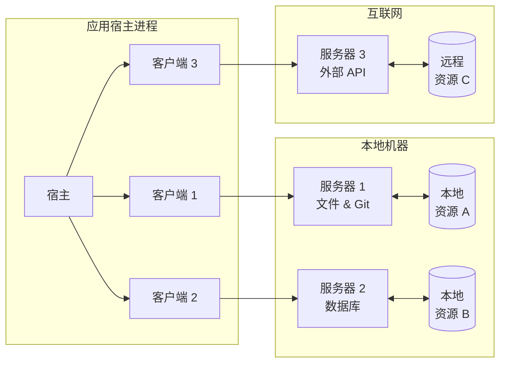
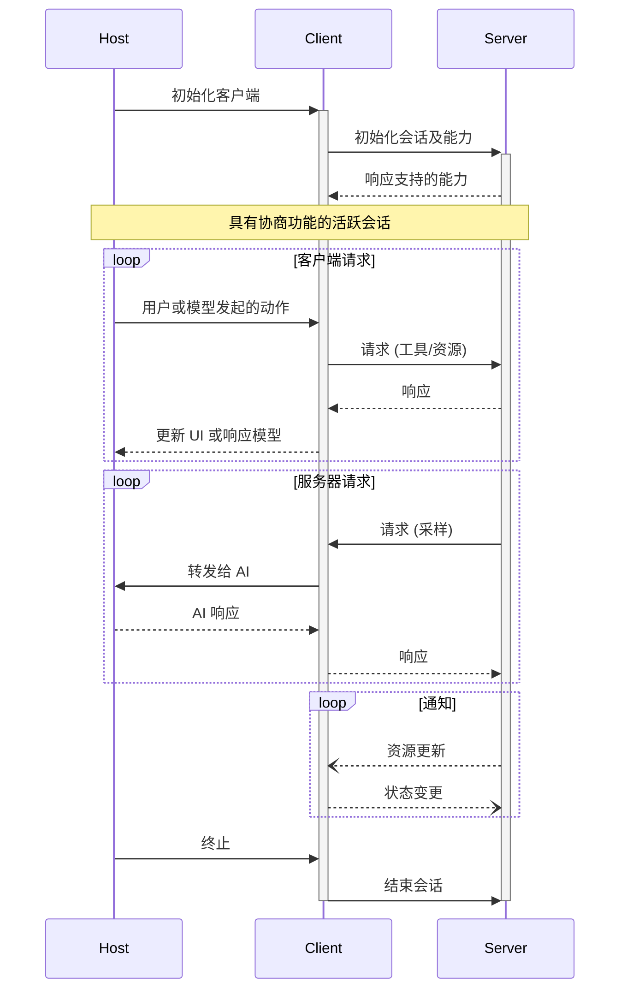

模型上下文协议 (MCP) 遵循客户端 - 宿主 - 服务器架构，其中每个宿主可以运行多个客户端实例。这种架构使用户能够在保持清晰的安全边界和隔离关注点的同时，跨应用程序集成 AI 能力。MCP 基于 JSON-RPC 构建，提供一种有状态的会话协议，专注于客户端和服务器之间的上下文交换和采样协调。

## 核心组件

### 宿主

宿主进程充当容器和协调者：

- 创建并管理多个客户端实例
- 控制客户端连接权限和生命周期
- 执行安全策略和同意要求
- 处理用户授权决策
- 协调 AI/LLM 集成和采样
- 管理跨客户端的上下文聚合

### 客户端

每个客户端由宿主创建并维护隔离的服务器连接：

- 为每个服务器建立一个有状态会话
- 处理协议协商和能力交换
- 双向路由协议消息
- 管理订阅和通知
- 维护服务器之间的安全边界

宿主应用程序创建并管理多个客户端，每个客户端与特定服务器保持 1:1 关系。

### 服务器

服务器提供专门的上下文和能力：

- 通过 MCP 原语暴露资源、工具和提示
- 独立运行，职责专注
- 通过客户端接口请求采样
- 必须尊重安全约束
- 可以是本地进程或远程服务

## 设计原则

MCP 建立在几个关键设计原则之上，这些原则指导其架构和实现：

1. **服务器应该极其易于构建**
   - 宿主应用程序处理复杂的编排责任
   - 服务器专注于特定的、定义明确的能力
   - 简单的接口最小化实现开销
   - 清晰的分离实现可维护的代码

2. **服务器应该具有高度可组合性**
   - 每个服务器孤立地提供专注的功能
   - 多个服务器可以无缝组合
   - 共享协议实现互操作性
   - 模块化设计支持可扩展性

3. **服务器不应该能够读取整个对话，也不应该“看到”其他服务器**
   - 服务器仅接收必要的上下文信息
   - 完整对话历史保留在宿主处
   - 每个服务器连接保持隔离
   - 服务器间交互由宿主控制
   - 宿主进程执行安全边界

4. **功能可以逐步添加到服务器和客户端**
   - 核心协议提供最小的必需功能
   - 额外能力可按需协商
   - 服务器和客户端独立演进
   - 协议设计为未来可扩展
   - 保持向后兼容性

## 消息类型

MCP 基于 [JSON-RPC 2.0](https://www.jsonrpc.org/specification) 定义了三种核心消息类型：

- **请求**：带有方法和参数的双向消息，期望得到响应
- **响应**：匹配特定请求 ID 的成功结果或错误
- **通知**：不需要响应的单向消息

每种消息类型都遵循 JSON-RPC 2.0 规范的结构和交付语义。

## 能力协商

模型上下文协议使用基于能力的协商系统，客户端和服务器在初始化期间明确声明其支持的功能。能力决定会话期间哪些协议功能和原语可用。

- 服务器声明能力，如资源订阅、工具支持和提示模板
- 客户端声明能力，如采样支持和通知处理
- 双方必须在整个会话期间尊重声明的能力
- 额外能力可以通过协议扩展进行协商

每个能力解锁会话期间使用的特定协议功能。例如：

- 已实现的 [服务器功能](/specification/2024-11-05/server) 必须在服务器的能力中声明
- 发出资源订阅通知需要服务器声明订阅支持
- 工具调用需要服务器声明工具能力
- [采样](/specification/2024-11-05/client/sampling) 需要客户端在其能力中声明支持

这种能力协商确保客户端和服务器清楚地了解支持的功能，同时保持协议的可扩展性。
