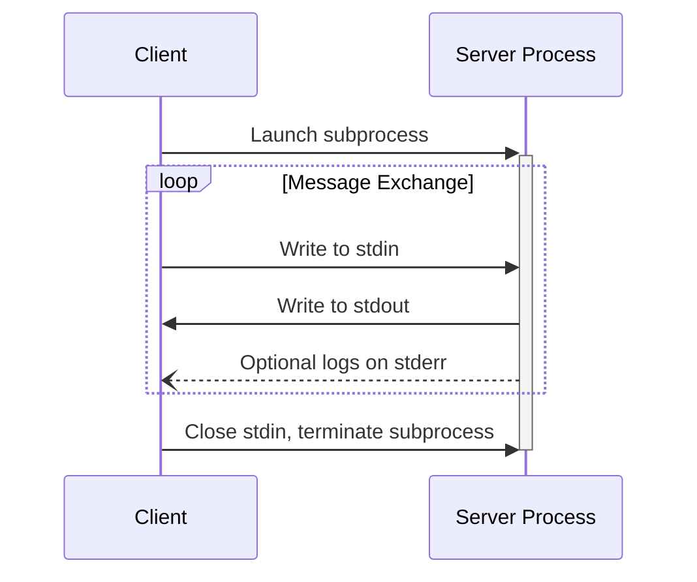
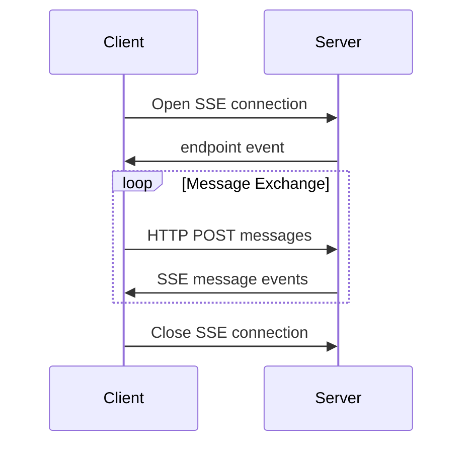

MCP 目前定义了两种标准的客户端 - 服务器通信传输机制：

1. [stdio](#stdio)，通过标准输入和标准输出通信
2. [带有服务器发送事件的 HTTP](#http-with-sse) (SSE)

客户端 **SHOULD** 在可能的情况下支持 stdio。

客户端和服务器也可以以可插拔的方式实现[自定义传输](#custom-transports)。

## stdio

在 **stdio** 传输中：

- 客户端将 MCP 服务器作为子进程启动。
- 服务器在其标准输入 (`stdin`) 上接收 JSON-RPC 消息，并将响应写入其标准输出 (`stdout`)。
- 消息由换行符分隔，且 **MUST NOT** 包含嵌入式换行符。
- 服务器 **MAY** 将 UTF-8 字符串写入其标准错误 (`stderr`) 以用于日志记录目的。客户端 **MAY** 捕获、转发或忽略此日志记录。
- 服务器 **MUST NOT** 向 `stdout` 写入任何非有效 MCP 消息的内容。
- 客户端 **MUST NOT** 向服务器的 `stdin` 写入任何非有效 MCP 消息的内容。

## HTTP with SSE

在 **SSE** 传输中，服务器作为独立进程运行，可以处理多个客户端连接。

#### 安全警告

当实现带有 SSE 传输的 HTTP 时：

1. 服务器 **MUST** 验证所有传入连接上的 `Origin` 头，以防止 DNS 重绑定攻击
2. 当在本地运行时，服务器 **SHOULD** 仅绑定到 localhost (127.0.0.1)，而不是所有网络接口 (0.0.0.0)
3. 服务器 **SHOULD** 为所有连接实现适当的身份验证

如果没有这些保护措施，攻击者可能会利用 DNS 重绑定从远程网站与本地 MCP 服务器交互。

服务器 **MUST** 提供两个端点：

1. 一个 SSE 端点，用于客户端建立连接并从服务器接收消息
2. 一个常规 HTTP POST 端点，用于客户端向服务器发送消息

当客户端连接时，服务器 **MUST** 发送一个 `endpoint` 事件，其中包含客户端用于发送消息的 URI。所有后续客户端消息 **MUST** 作为 HTTP POST 请求发送到此端点。

服务器消息作为 SSE `message` 事件发送，消息内容在事件数据中编码为 JSON。

## Custom Transports

客户端和服务器 **MAY** 实现额外的自定义传输机制以满足其特定需求。该协议与传输无关，可以在任何支持双向消息交换的通信通道上实现。

选择支持自定义传输的实现者 **MUST** 确保它们保留 MCP 定义的 JSON-RPC 消息格式和生命周期要求。自定义传输 **SHOULD** 记录其特定的连接建立和消息交换模式，以帮助互操作性。
