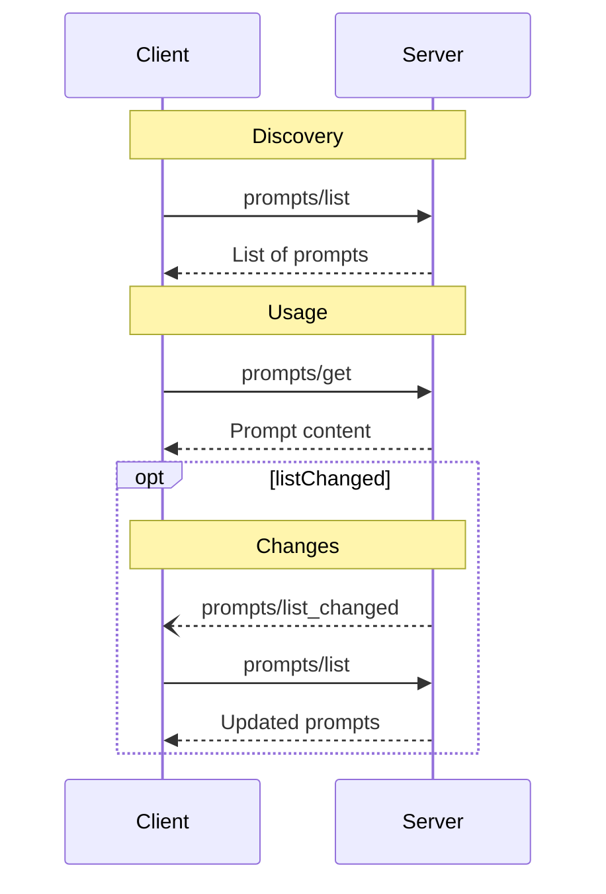

模型上下文协议 (MCP) 提供了一种标准化方式，供服务器向客户端暴露提示词模板。提示词允许服务器提供结构化的消息和指令，以便与语言模型交互。客户端可以发现可用的提示词，检索其内容，并提供参数以自定义它们。

## 用户交互模型

提示词旨在由**用户控制**，这意味着它们从服务器暴露给客户端，目的是让用户能够明确选择它们以供使用。

通常，提示词会通过用户界面中用户发起的命令触发，这允许用户自然地发现并调用可用的提示词。

例如，作为斜杠命令：


但是，实现者可以自由地通过任何适合其需求的界面模式来暴露提示词——协议本身并不强制任何特定的用户交互模型。

## 能力

支持提示词的服务器**必须**在[初始化](/specification/2024-11-05/basic/lifecycle#initialization)期间声明 `prompts` 能力：

```json
{
  "capabilities": {
    "prompts": {
      "listChanged": true
    }
  }
}
```

`listChanged` 指示当可用提示词列表发生变化时，服务器是否会发出通知。

## 协议消息

### 列出提示词

要检索可用的提示词，客户端发送 `prompts/list` 请求。此操作支持[分页](/specification/2024-11-05/server/utilities/pagination)。

**请求：**

```json
{
  "jsonrpc": "2.0",
  "id": 1,
  "method": "prompts/list",
  "params": {
    "cursor": "optional-cursor-value"
  }
}
```

**响应：**

```json
{
  "jsonrpc": "2.0",
  "id": 1,
  "result": {
    "prompts": [
      {
        "name": "code_review",
        "description": "Asks the LLM to analyze code quality and suggest improvements",
        "arguments": [
          {
            "name": "code",
            "description": "The code to review",
            "required": true
          }
        ]
      }
    ],
    "nextCursor": "next-page-cursor"
  }
}
```

### 获取提示词

要检索特定提示词，客户端发送 `prompts/get` 请求。参数可以通过[补全 API](/specification/2024-11-05/server/utilities/completion) 自动补全。

**请求：**

```json
{
  "jsonrpc": "2.0",
  "id": 2,
  "method": "prompts/get",
  "params": {
    "name": "code_review",
    "arguments": {
      "code": "def hello():\n    print('world')"
    }
  }
}
```

**响应：**

```json
{
  "jsonrpc": "2.0",
  "id": 2,
  "result": {
    "description": "Code review prompt",
    "messages": [
      {
        "role": "user",
        "content": {
          "type": "text",
          "text": "Please review this Python code:\ndef hello():\n    print('world')"
        }
      }
    ]
  }
}
```

### 列表变更通知

当可用提示词列表发生变化时，声明了 `listChanged` 能力的服务器**应当**发送通知：

```json
{
  "jsonrpc": "2.0",
  "method": "notifications/prompts/list_changed"
}
```

## 消息流



## 数据类型

### 提示词

提示词定义包括：

- `name`：提示词的唯一标识符
- `description`：可选的人类可读描述
- `arguments`：可选的用于自定义的参数列表

### 提示词消息

提示词中的消息可以包含：

- `role`：为 "user" 或 "assistant" 以指示发言者
- `content`：以下内容类型之一：

#### 文本内容

文本内容表示纯文本消息：

```json
{
  "type": "text",
  "text": "The text content of the message"
}
```

这是用于自然语言交互最常见的内容类型。

#### 图片内容

图片内容允许在消息中包含视觉信息：

```json
{
  "type": "image",
  "data": "base64-encoded-image-data",
  "mimeType": "image/png"
}
```

图片数据**必须**进行 base64 编码并包含有效的 MIME 类型。这使得在视觉上下文很重要的情况下能够进行多模态交互。

#### 嵌入资源

嵌入资源允许在消息中直接引用服务器端资源：

```json
{
  "type": "resource",
  "resource": {
    "uri": "resource://example",
    "mimeType": "text/plain",
    "text": "Resource content"
  }
}
```

资源可以包含文本或二进制（blob）数据，并且**必须**包括：

- 有效的资源 URI
- 适当的 MIME 类型
- 文本内容或 base64 编码的 blob 数据

嵌入资源使提示词能够无缝地将服务器管理的内容（如文档、代码示例或其他参考材料）直接纳入对话流中。

## 错误处理

服务器**应当**为常见失败情况返回标准 JSON-RPC 错误：

- 无效的提示词名称：`-32602` (无效参数)
- 缺少必需参数：`-32602` (无效参数)
- 内部错误：`-32603` (内部错误)

## 实现注意事项

1. 服务器**应当**在处理之前验证提示词参数
2. 客户端**应当**处理大型提示词列表的分页
3. 双方**应当**遵守能力协商

## 安全性

实现**必须**仔细验证所有提示词输入和输出，以防止注入攻击或未经授权的资源访问。
