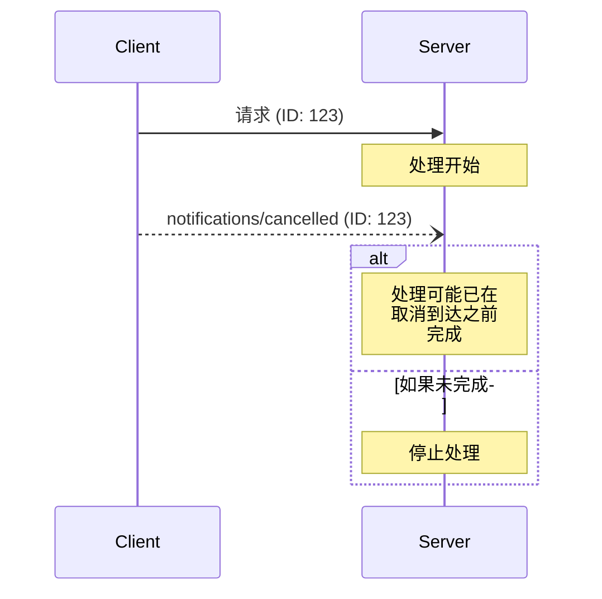

Model Context Protocol (MCP) 支持通过通知消息可选地取消进行中的请求。任何一方都可以发送取消通知，表明之前发出的请求应该被终止。

## 取消流程

当一方想要取消进行中的请求时，它发送一个 `notifications/cancelled` 通知，包含：

- 要取消的请求的 ID
- 一个可选的原因字符串，可以记录或显示

```json
{
  "jsonrpc": "2.0",
  "method": "notifications/cancelled",
  "params": {
    "requestId": "123",
    "reason": "用户请求取消"
  }
}
```

## 行为要求

1. 取消通知 **必须** 仅引用以下请求：
   - 之前在同一方向发出的
   - 被认为仍在进行中的
2. 客户端 **不得** 取消 `initialize` 请求
3. 取消通知的接收者 **应该**：
   - 停止处理被取消的请求
   - 释放相关资源
   - 不为被取消的请求发送响应
4. 如果出现以下情况，接收者 **可以** 忽略取消通知：
   - 引用的请求未知
   - 处理已经完成
   - 请求无法被取消
5. 取消通知的发送者 **应该** 忽略随后到达的对该请求的任何响应

## 时序考虑

由于网络延迟，取消通知可能在请求处理完成后到达，甚至可能在响应已经发送之后到达。

双方 **必须** 优雅地处理这些竞争条件：



## 实现说明

- 双方 **应该** 记录取消原因以便调试
- 应用程序 UI **应该** 指示何时请求了取消

## 错误处理

无效的取消通知 **应该** 被忽略：

- 未知的请求 ID
- 已完成的请求
- 格式错误的通知

这保持了通知的“即发即弃”特性，同时允许异步通信中的竞争条件。
