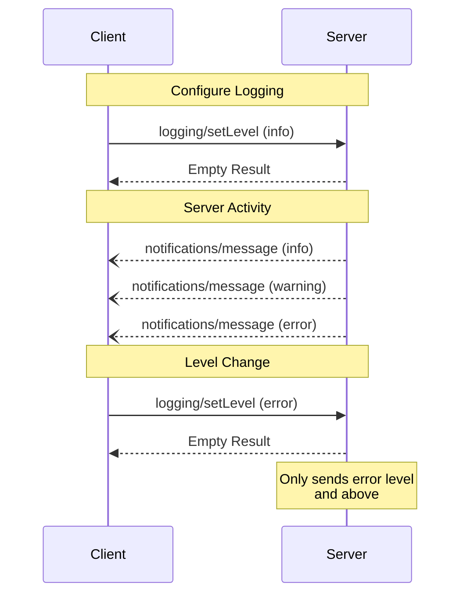

Model Context Protocol (MCP) 提供了一种标准化方式，供服务器向客户端发送结构化日志消息。客户端可以通过设置最低日志级别来控制日志记录的详细程度，服务器发送的通知包含严重级别、可选的记录器名称以及任意可 JSON 序列化的数据。

## 用户交互模型

实现可以通过任何适合其需求的接口模式暴露日志记录功能&mdash;协议本身不强制要求任何特定的用户交互模型。

## 能力

发出日志消息通知的服务器 **必须** 声明 `logging` 能力：

```json
{
  "capabilities": {
    "logging": {}
  }
}
```

## 日志级别

协议遵循 [RFC 5424](https://datatracker.ietf.org/doc/html/rfc5424#section-6.2.1) 中指定的标准 syslog 严重级别：

| Level     | Description                      | Example Use Case           |
| --------- | -------------------------------- | -------------------------- |
| debug     | 详细调试信息                     | 函数入口/出口点            |
| info      | 一般信息消息                     | 操作进度更新               |
| notice    | 正常但显著的事件                 | 配置更改                   |
| warning   | 警告条件                         | 已弃用功能的使用           |
| error     | 错误条件                         | 操作失败                   |
| critical  | 严重条件                         | 系统组件故障               |
| alert     | 必须立即采取行动                 | 检测到数据损坏             |
| emergency | 系统不可用                       | 完全系统故障               |

## 协议消息

### 设置日志级别

要配置最低日志级别，客户端 **可以** 发送 `logging/setLevel` 请求：

**请求：**

```json
{
  "jsonrpc": "2.0",
  "id": 1,
  "method": "logging/setLevel",
  "params": {
    "level": "info"
  }
}
```

### 日志消息通知

服务器使用 `notifications/message` 通知发送日志消息：

```json
{
  "jsonrpc": "2.0",
  "method": "notifications/message",
  "params": {
    "level": "error",
    "logger": "database",
    "data": {
      "error": "Connection failed",
      "details": {
        "host": "localhost",
        "port": 5432
      }
    }
  }
}
```

## 消息流



## 错误处理

服务器 **应该** 为常见失败情况返回标准 JSON-RPC 错误：

- 无效日志级别：`-32602`（无效参数）
- 配置错误：`-32603`（内部错误）

## 实现注意事项

1. 服务器 **应该**：
   - 限制日志消息速率
   - 在数据字段中包含相关上下文
   - 使用一致的记录器名称
   - 移除敏感信息

2. 客户端 **可以**：
   - 在 UI 中展示日志消息
   - 实现日志过滤/搜索
   - 可视化显示严重级别
   - 持久化日志消息

## 安全性

1. 日志消息 **不得** 包含：
   - 凭证或密钥
   - 个人身份信息
   - 可能协助攻击的内部系统细节

2. 实现 **应该**：
   - 限制消息速率
   - 验证所有数据字段
   - 控制日志访问
   - 监控敏感内容
