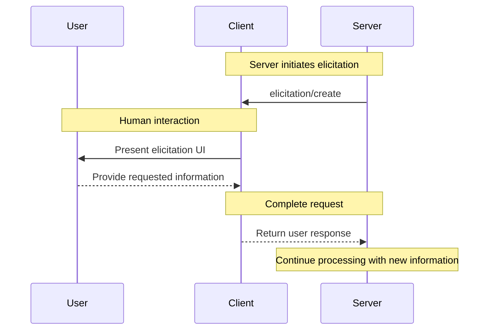

<div id="enable-section-numbers" />

<Note>

信息收集（Elicitation）是在此版本的 MCP 规范中新引入的，其设计可能会在未来的协议版本中演变。

</Note>

模型上下文协议（MCP）提供了一种标准化方式，允许服务器在交互过程中通过客户端向用户请求额外信息。此流程允许客户端保持对用户交互和数据共享的控制，同时使服务器能够动态收集必要信息。
服务器使用 JSON Schema 请求来自用户的结构化数据以验证响应。

## 用户交互模型

MCP 中的信息收集允许服务器通过启用用户输入请求发生在其他 MCP 服务器功能_内部_来实现交互式工作流。

实现可以自由暴露信息收集功能，通过任何适合其需求的界面模式——协议本身不强制任何特定的用户交互模型。

<Warning>

为了信任、安全和安全性：

- 服务器**不得**使用信息收集来请求敏感信息。

应用程序**应该**：

- 提供 UI 以明确哪个服务器正在请求信息
- 允许用户在发送前审查和修改他们的响应
- 尊重用户隐私并提供明确的拒绝和取消选项

</Warning>

## 能力

支持信息收集的客户端**必须**在 [初始化](/specification/2025-06-18/basic/lifecycle#initialization) 期间声明 `elicitation` 能力：

```json
{
  "capabilities": {
    "elicitation": {}
  }
}
```

## 协议消息

### 创建信息收集请求

要向用户请求信息，服务器发送一个 `elicitation/create` 请求：

#### 简单文本请求

**请求：**

```json
{
  "jsonrpc": "2.0",
  "id": 1,
  "method": "elicitation/create",
  "params": {
    "message": "Please provide your GitHub username",
    "requestedSchema": {
      "type": "object",
      "properties": {
        "name": {
          "type": "string"
        }
      },
      "required": ["name"]
    }
  }
}
```

**响应：**

```json
{
  "jsonrpc": "2.0",
  "id": 1,
  "result": {
    "action": "accept",
    "content": {
      "name": "octocat"
    }
  }
}
```

#### 结构化数据请求

**请求：**

```json
{
  "jsonrpc": "2.0",
  "id": 2,
  "method": "elicitation/create",
  "params": {
    "message": "Please provide your contact information",
    "requestedSchema": {
      "type": "object",
      "properties": {
        "name": {
          "type": "string",
          "description": "Your full name"
        },
        "email": {
          "type": "string",
          "format": "email",
          "description": "Your email address"
        },
        "age": {
          "type": "number",
          "minimum": 18,
          "description": "Your age"
        }
      },
      "required": ["name", "email"]
    }
  }
}
```

**响应：**

```json
{
  "jsonrpc": "2.0",
  "id": 2,
  "result": {
    "action": "accept",
    "content": {
      "name": "Monalisa Octocat",
      "email": "octocat@github.com",
      "age": 30
    }
  }
}
```

**拒绝响应示例：**

```json
{
  "jsonrpc": "2.0",
  "id": 2,
  "result": {
    "action": "decline"
  }
}
```

**取消响应示例：**

```json
{
  "jsonrpc": "2.0",
  "id": 2,
  "result": {
    "action": "cancel"
  }
}
```

## 消息流程



## 请求 Schema

`requestedSchema` 字段允许服务器使用 JSON Schema 的受限子集来定义预期响应的结构。为了简化客户端的实现，信息收集 Schema 仅限于具有原始属性的扁平对象：

```json
"requestedSchema": {
  "type": "object",
  "properties": {
    "propertyName": {
      "type": "string",
      "title": "Display Name",
      "description": "Description of the property"
    },
    "anotherProperty": {
      "type": "number",
      "minimum": 0,
      "maximum": 100
    }
  },
  "required": ["propertyName"]
}
```

### 支持的 Schema 类型

Schema 限制为以下原始类型：

1. **字符串 Schema**

   ```json
   {
     "type": "string",
     "title": "Display Name",
     "description": "Description text",
     "minLength": 3,
     "maxLength": 50,
     "format": "email" // 支持："email", "uri", "date", "date-time"
   }
   ```

   支持的格式：`email`, `uri`, `date`, `date-time`

2. **数字 Schema**

   ```json
   {
     "type": "number", // 或 "integer"
     "title": "Display Name",
     "description": "Description text",
     "minimum": 0,
     "maximum": 100
   }
   ```

3. **布尔值 Schema**

   ```json
   {
     "type": "boolean",
     "title": "Display Name",
     "description": "Description text",
     "default": false
   }
   ```

4. **枚举 Schema**
   ```json
   {
     "type": "string",
     "title": "Display Name",
     "description": "Description text",
     "enum": ["option1", "option2", "option3"],
     "enumNames": ["Option 1", "Option 2", "Option 3"]
   }
   ```

客户端可以使用此 Schema 来：

1. 生成适当的输入表单
2. 在发送前验证用户输入
3. 为用户提供更好的指导

请注意，复杂的嵌套结构、对象数组和其他高级 JSON Schema 功能故意不支持，以简化客户端实现。

## 响应动作

信息收集响应使用三动作模型来清楚区分不同的用户动作：

```json
{
  "jsonrpc": "2.0",
  "id": 1,
  "result": {
    "action": "accept", // 或 "decline" 或 "cancel"
    "content": {
      "propertyName": "value",
      "anotherProperty": 42
    }
  }
}
```

三个响应动作是：

1. **接受** (`action: "accept"`)：用户明确批准并提交数据
   - `content` 字段包含与请求的 Schema 匹配的提交数据
   - 示例：用户点击了 "Submit", "OK", "Confirm" 等

2. **拒绝** (`action: "decline"`)：用户明确拒绝请求
   - `content` 字段通常被省略
   - 示例：用户点击了 "Reject", "Decline", "No" 等

3. **取消** (`action: "cancel"`)：用户解散而未做出明确选择
   - `content` 字段通常被省略
   - 示例：用户关闭了对话框、点击外部、按 Escape 键等

服务器应该适当处理每种状态：

- **接受**：处理提交的数据
- **拒绝**：处理明确拒绝（例如，提供替代方案）
- **取消**：处理解散（例如，稍后再次提示）

## 安全考虑

1. 服务器**不得**通过信息收集请求敏感信息
2. 客户端**应该**实现用户批准控制
3. 双方**应该**根据提供的 Schema 验证信息收集内容
4. 客户端**应该**提供明确指示哪个服务器正在请求信息
5. 客户端**应该**允许用户随时拒绝信息收集请求
6. 客户端**应该**实施速率限制
7. 客户端**应该**以清楚表明正在请求什么信息以及为何请求的方式呈现信息收集请求
