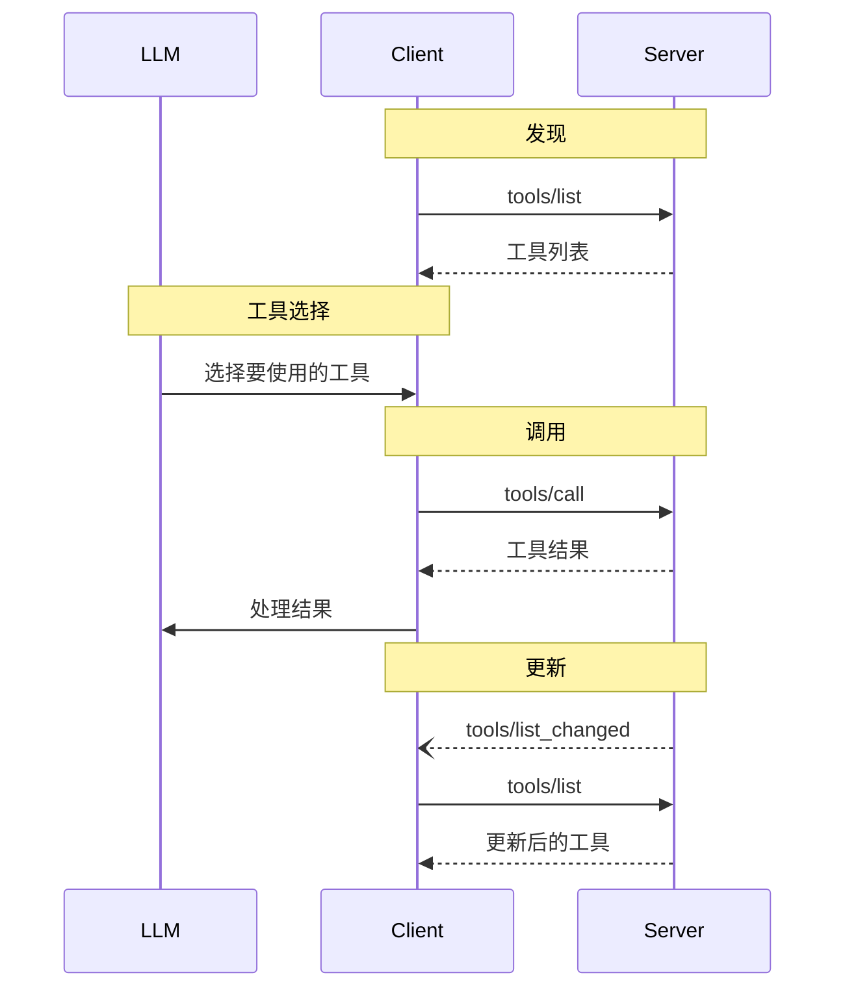

<div id="enable-section-numbers" />

模型上下文协议 (MCP) 允许服务器暴露可由语言模型调用的工具。工具使模型能够与外部系统交互，例如查询数据库、调用 API 或执行计算。每个工具都通过名称唯一标识，并包含描述其模式的元数据。

## 用户交互模型

MCP 中的工具设计为 **模型控制**，这意味着语言模型可以根据其上下文理解和用户的提示自动发现并调用工具。

然而，实现者可以自由地通过任何适合其需求的界面模式暴露工具——协议本身并不强制任何特定的用户交互模型。

<Warning>

为了信任、安全和安全性，**应该**始终有人类参与循环，并能够拒绝工具调用。

应用程序 **应该**：

- 提供 UI，明确哪些工具正暴露给 AI 模型
- 在调用工具时插入清晰的视觉指示
- 向用户展示操作确认提示，以确保人类参与循环

</Warning>

## 能力

支持工具的服务器 **必须** 声明 `tools` 能力：

```json
{
  "capabilities": {
    "tools": {
      "listChanged": true
    }
  }
}
```

`listChanged` 指示服务器是否在可用工具列表变更时发出通知。

## 协议消息

### 列出工具

要发现可用工具，客户端发送 `tools/list` 请求。此操作支持 [分页](/specification/2025-06-18/server/utilities/pagination)。

**请求：**

```json
{
  "jsonrpc": "2.0",
  "id": 1,
  "method": "tools/list",
  "params": {
    "cursor": "optional-cursor-value"
  }
}
```

**响应：**

```json
{
  "jsonrpc": "2.0",
  "id": 1,
  "result": {
    "tools": [
      {
        "name": "get_weather",
        "title": "Weather Information Provider",
        "description": "Get current weather information for a location",
        "inputSchema": {
          "type": "object",
          "properties": {
            "location": {
              "type": "string",
              "description": "City name or zip code"
            }
          },
          "required": ["location"]
        }
      }
    ],
    "nextCursor": "next-page-cursor"
  }
}
```

### 调用工具

要调用工具，客户端发送 `tools/call` 请求：

**请求：**

```json
{
  "jsonrpc": "2.0",
  "id": 2,
  "method": "tools/call",
  "params": {
    "name": "get_weather",
    "arguments": {
      "location": "New York"
    }
  }
}
```

**响应：**

```json
{
  "jsonrpc": "2.0",
  "id": 2,
  "result": {
    "content": [
      {
        "type": "text",
        "text": "Current weather in New York:\nTemperature: 72°F\nConditions: Partly cloudy"
      }
    ],
    "isError": false
  }
}
```

### 列表变更通知

当可用工具列表变更时，声明了 `listChanged` 能力的服务器 **应该** 发送通知：

```json
{
  "jsonrpc": "2.0",
  "method": "notifications/tools/list_changed"
}
```

## 消息流



## 数据类型

### 工具

工具定义包括：

- `name`：工具的唯一标识符
- `title`：工具的可选人类可读名称，用于显示目的。
- `description`：功能的人类可读描述
- `inputSchema`：定义预期参数的 JSON Schema
- `outputSchema`：定义预期输出结构的可选 JSON Schema
- `annotations`：描述工具行为的可选属性

<Warning>

为了信任、安全和安全性，客户端 **必须** 将工具注解视为不可信，除非它们来自受信任的服务器。

</Warning>

### 工具结果

工具结果可能包含 [**结构化**](#structured-content) 或 **非结构化** 内容。

**非结构化** 内容在结果的 `content` 字段中返回，并且可以包含多种不同类型的内容项：

<Note>
  所有内容类型（文本、图像、音频、资源链接和嵌入资源）
  都支持可选的
  [注解](/specification/2025-06-18/server/resources#annotations)，
  提供有关受众、优先级和修改时间的元数据。这是
  资源和提示使用的相同注解格式。
</Note>

#### 文本内容

```json
{
  "type": "text",
  "text": "Tool result text"
}
```

#### 图像内容

```json
{
  "type": "image",
  "data": "base64-encoded-data",
  "mimeType": "image/png"
  "annotations": {
    "audience": ["user"],
    "priority": 0.9
  }

}
```

此示例演示了可选注解的使用。

#### 音频内容

```json
{
  "type": "audio",
  "data": "base64-encoded-audio-data",
  "mimeType": "audio/wav"
}
```

#### 资源链接

工具 **可以** 返回指向 [资源](/specification/2025-06-18/server/resources) 的链接，以提供额外的上下文
或数据。在这种情况下，工具将返回一个 URI，客户端可以订阅或获取该 URI：

```json
{
  "type": "resource_link",
  "uri": "file:///project/src/main.rs",
  "name": "main.rs",
  "description": "Primary application entry point",
  "mimeType": "text/x-rust",
  "annotations": {
    "audience": ["assistant"],
    "priority": 0.9
  }
}
```

资源链接支持与常规资源相同的 [资源注解](/specification/2025-06-18/server/resources#annotations)，以帮助客户端了解如何使用它们。

<Info>
  工具返回的资源链接不保证出现在
  `resources/list` 请求的结果中。
</Info>

#### 嵌入资源

[资源](/specification/2025-06-18/server/resources) **可以** 被嵌入以提供额外的上下文
或数据，使用合适的 [URI 方案](./resources#common-uri-schemes)。使用嵌入资源的服务器 **应该** 实现 `resources` 能力：

```json
{
  "type": "resource",
  "resource": {
    "uri": "file:///project/src/main.rs",
    "mimeType": "text/x-rust",
    "text": "fn main() {\n    println!(\"Hello world!\");\n}",
    "annotations": {
      "audience": ["user", "assistant"],
      "priority": 0.7,
      "lastModified": "2025-05-03T14:30:00Z"
    }
  }
}
```

嵌入资源支持与常规资源相同的 [资源注解](/specification/2025-06-18/server/resources#annotations)，以帮助客户端了解如何使用它们。

#### 结构化内容

**结构化** 内容作为结果中 `structuredContent` 字段的 JSON 对象返回。

为了向后兼容，返回结构化内容的工具还应该在一个 TextContent 块中返回序列化的 JSON。

#### 输出模式

工具还可以提供输出模式以验证结构化结果。
如果提供了输出模式：

- 服务器 **必须** 提供符合此模式的结构化结果。
- 客户端 **应该** 针对此模式验证结构化结果。

带有输出模式的工具示例：

```json
{
  "name": "get_weather_data",
  "title": "Weather Data Retriever",
  "description": "Get current weather data for a location",
  "inputSchema": {
    "type": "object",
    "properties": {
      "location": {
        "type": "string",
        "description": "City name or zip code"
      }
    },
    "required": ["location"]
  },
  "outputSchema": {
    "type": "object",
    "properties": {
      "temperature": {
        "type": "number",
        "description": "Temperature in celsius"
      },
      "conditions": {
        "type": "string",
        "description": "Weather conditions description"
      },
      "humidity": {
        "type": "number",
        "description": "Humidity percentage"
      }
    },
    "required": ["temperature", "conditions", "humidity"]
  }
}
```

此工具的有效响应示例：

```json
{
  "jsonrpc": "2.0",
  "id": 5,
  "result": {
    "content": [
      {
        "type": "text",
        "text": "{\"temperature\": 22.5, \"conditions\": \"Partly cloudy\", \"humidity\": 65}"
      }
    ],
    "structuredContent": {
      "temperature": 22.5,
      "conditions": "Partly cloudy",
      "humidity": 65
    }
  }
}
```

提供输出模式通过以下方式帮助客户端和 LLM 理解并正确处理结构化工具输出：

- 启用对响应的严格模式验证
- 提供类型信息以便更好地与编程语言集成
- 指导客户端和 LLM 正确解析和利用返回的数据
- 支持更好的文档和开发者体验

## 错误处理

工具使用两种错误报告机制：

1. **协议错误**：标准 JSON-RPC 错误，用于此类问题：
   - 未知工具
   - 无效参数
   - 服务器错误

2. **工具执行错误**：在工具结果中报告，`isError: true`：
   - API 失败
   - 无效输入数据
   - 业务逻辑错误

协议错误示例：

```json
{
  "jsonrpc": "2.0",
  "id": 3,
  "error": {
    "code": -32602,
    "message": "Unknown tool: invalid_tool_name"
  }
}
```

工具执行错误示例：

```json
{
  "jsonrpc": "2.0",
  "id": 4,
  "result": {
    "content": [
      {
        "type": "text",
        "text": "Failed to fetch weather data: API rate limit exceeded"
      }
    ],
    "isError": true
  }
}
```

## 安全考量

1. 服务器 **必须**：
   - 验证所有工具输入
   - 实施适当的访问控制
   - 限制工具调用速率
   - 清理工具输出

2. 客户端 **应该**：
   - 在敏感操作上提示用户确认
   - 在调用服务器前向用户显示工具输入，以避免恶意或
     意外数据泄露
   - 在传递给 LLM 之前验证工具结果
   - 为工具调用实施超时
   - 记录工具使用情况以用于审计目的
