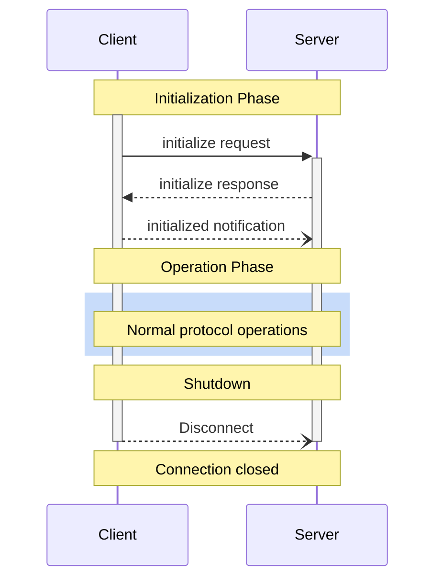

<div id="enable-section-numbers" />

模型上下文协议 (MCP) 定义了客户端 - 服务器连接的严格生命周期，以确保适当的能力协商和状态管理。

1. **初始化**：能力协商和协议版本达成一致
2. **运行**：正常的协议通信
3. **关闭**：优雅地终止连接



## 生命周期阶段

### 初始化

初始化阶段 **必须** 是客户端和服务器之间的第一次交互。在此阶段，客户端和服务器：

- 建立协议版本兼容性
- 交换和协商能力
- 共享实现细节

客户端 **必须** 通过发送包含以下内容的 `initialize` 请求来发起此阶段：

- 支持的协议版本
- 客户端能力
- 客户端实现信息

```json
{
  "jsonrpc": "2.0",
  "id": 1,
  "method": "initialize",
  "params": {
    "protocolVersion": "2025-11-25",
    "capabilities": {
      "roots": {
        "listChanged": true
      },
      "sampling": {},
      "elicitation": {
        "form": {},
        "url": {}
      },
      "tasks": {
        "requests": {
          "elicitation": {
            "create": {}
          },
          "sampling": {
            "createMessage": {}
          }
        }
      }
    },
    "clientInfo": {
      "name": "ExampleClient",
      "title": "Example Client Display Name",
      "version": "1.0.0",
      "description": "An example MCP client application",
      "icons": [
        {
          "src": "https://example.com/icon.png",
          "mimeType": "image/png",
          "sizes": ["48x48"]
        }
      ],
      "websiteUrl": "https://example.com"
    }
  }
}
```

服务器 **必须** 以其自身的能力和信息进行响应：

```json
{
  "jsonrpc": "2.0",
  "id": 1,
  "result": {
    "protocolVersion": "2025-11-25",
    "capabilities": {
      "logging": {},
      "prompts": {
        "listChanged": true
      },
      "resources": {
        "subscribe": true,
        "listChanged": true
      },
      "tools": {
        "listChanged": true
      },
      "tasks": {
        "list": {},
        "cancel": {},
        "requests": {
          "tools": {
            "call": {}
          }
        }
      }
    },
    "serverInfo": {
      "name": "ExampleServer",
      "title": "Example Server Display Name",
      "version": "1.0.0",
      "description": "An example MCP server providing tools and resources",
      "icons": [
        {
          "src": "https://example.com/server-icon.svg",
          "mimeType": "image/svg+xml",
          "sizes": ["any"]
        }
      ],
      "websiteUrl": "https://example.com/server"
    },
    "instructions": "Optional instructions for the client"
  }
}
```

成功初始化后，客户端 **必须** 发送 `initialized` 通知，表明已准备好开始正常操作：

```json
{
  "jsonrpc": "2.0",
  "method": "notifications/initialized"
}
```

- 在服务器响应 `initialize` 请求之前，客户端 **不应** 发送除 [ping 请求](/specification/2025-11-25/basic/utilities/ping) 之外的请求。
- 在收到 `initialized` 通知之前，服务器 **不应** 发送除 [ping 请求](/specification/2025-11-25/basic/utilities/ping) 和 [日志](/specification/2025-11-25/server/utilities/logging) 之外的请求。

#### 版本协商

在 `initialize` 请求中，客户端 **必须** 发送其支持的协议版本。这 **应** 是客户端支持的 _最新_ 版本。

如果服务器支持请求的协议版本，它 **必须** 响应相同的版本。否则，服务器 **必须** 响应其支持的另一个协议版本。这 **应** 是服务器支持的 _最新_ 版本。

如果客户端不支持服务器响应中的版本，它 **应** 断开连接。

<Note>
如果使用 HTTP，客户端 **必须** 在后续所有对 MCP 服务器的请求中包含 `MCP-Protocol-Version: <protocol-version>` HTTP 头。
详细信息请参阅 [传输中的协议版本头部分](/specification/2025-11-25/basic/transports#protocol-version-header)。
</Note>

#### 能力协商

客户端和服务器能力确立了会话期间哪些可选协议功能可用。

关键能力包括：

| 类别 | 能力 | 描述 |
| -------- | -------------- | --------------------------------------------------------------------------------------------- |
| 客户端 | `roots` | 能够提供文件系统 [根目录](/specification/2025-11-25/client/roots) |
| 客户端 | `sampling` | 支持 LLM [采样](/specification/2025-11-25/client/sampling) 请求 |
| 客户端 | `elicitation` | 支持服务器 [询问](/specification/2025-11-25/client/elicitation) 请求 |
| 客户端 | `tasks` | 支持 [任务增强](/specification/2025-11-25/basic/utilities/tasks) 客户端请求 |
| 客户端 | `experimental` | 描述对非标准实验性功能的支持 |
| 服务器 | `prompts` | 提供 [提示模板](/specification/2025-11-25/server/prompts) |
| 服务器 | `resources` | 提供可读的 [资源](/specification/2025-11-25/server/resources) |
| 服务器 | `tools` | 暴露可调用的 [工具](/specification/2025-11-25/server/tools) |
| 服务器 | `logging` | 发出结构化的 [日志消息](/specification/2025-11-25/server/utilities/logging) |
| 服务器 | `completions` | 支持参数 [自动补全](/specification/2025-11-25/server/utilities/completion) |
| 服务器 | `tasks` | 支持 [任务增强](/specification/2025-11-25/basic/utilities/tasks) 服务器请求 |
| 服务器 | `experimental` | 描述对非标准实验性功能的支持 |

能力对象可以描述子能力，例如：

- `listChanged`：支持列表变更通知（适用于提示、资源和工具）
- `subscribe`：支持订阅单个项目的变更（仅适用于资源）

### 运行

在运行阶段，客户端和服务器根据协商的能力交换消息。

双方 **必须**：

- 遵守协商的协议版本
- 仅使用成功协商的能力

### 关闭

在关闭阶段，一方（通常是客户端）干净地终止协议连接。没有定义特定的关闭消息——相反，应使用底层传输机制来信号连接终止：

#### stdio

对于 stdio [传输](/specification/2025-11-25/basic/transports)，客户端 **应** 通过以下方式发起关闭：

1. 首先，关闭到子进程（服务器）的输入流
2. 等待服务器退出，或者如果服务器未在合理时间内退出则发送 `SIGTERM`
3. 如果服务器在 `SIGTERM` 后的合理时间内未退出，则发送 `SIGKILL`

服务器 **可以** 通过关闭其到客户端的输出流并退出来发起关闭。

#### HTTP

对于 HTTP [传输](/specification/2025-11-25/basic/transports)，关闭通过关闭关联的 HTTP 连接来指示。

## 超时

实现 **应** 为所有发送的请求建立超时，以防止连接挂起和资源耗尽。当请求在超时期限内未收到成功或错误响应时，发送者 **应** 为该请求发出 [取消通知](/specification/2025-11-25/basic/utilities/cancellation) 并停止等待响应。

SDK 和其他中间件 **应** 允许按请求基础配置这些超时。

实现 **可以** 选择在收到对应于请求的 [进度通知](/specification/2025-11-25/basic/utilities/progress) 时重置超时时钟，因为这意味着工作实际上正在进行。但是，无论进度通知如何，实现 **应** 始终强制最大超时，以限制行为不当的客户端或服务器的影响。

## 错误处理

实现 **应** 准备好处理这些错误情况：

- 协议版本不匹配
- 无法协商所需的能力
- 请求 [超时](#超时)

初始化错误示例：

```json
{
  "jsonrpc": "2.0",
  "id": 1,
  "error": {
    "code": -32602,
    "message": "Unsupported protocol version",
    "data": {
      "supported": ["2024-11-05"],
      "requested": "1.0.0"
    }
  }
}
```
