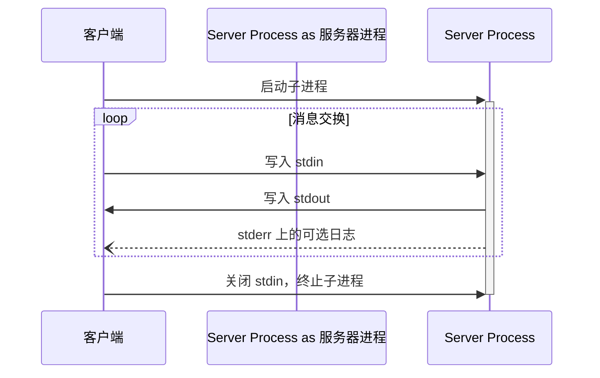
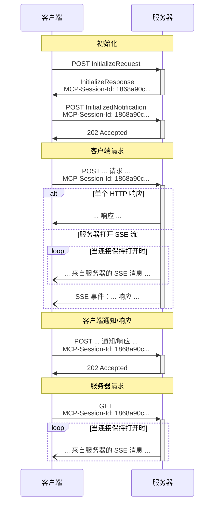

MCP 使用 JSON-RPC 编码消息。JSON-RPC 消息 **MUST** 采用 UTF-8 编码。

该协议目前定义了两种用于客户端 - 服务器通信的标准传输机制：

1. [stdio](#stdio)，通过标准输入和标准输出进行通信
2. [Streamable HTTP](#streamable-http)

客户端 **SHOULD** 在可能的情况下支持 stdio。

客户端和服务器也可以以可插拔的方式实现 [自定义传输](#custom-transports)。

## stdio

在 **stdio** 传输中：

- 客户端将 MCP 服务器启动为子进程。
- 服务器从其标准输入（`stdin`）读取 JSON-RPC 消息，并将消息发送到其标准输出（`stdout`）。
- 消息是独立的 JSON-RPC 请求、通知或响应。
- 消息由换行符分隔，且 **MUST NOT** 包含嵌入式换行符。
- 服务器 **MAY** 将其标准错误（`stderr`）写入 UTF-8 字符串，用于任何日志记录目的，包括信息、调试和错误消息。
- 客户端 **MAY** 捕获、转发或忽略服务器的 `stderr` 输出，且 **SHOULD NOT** 假设 `stderr` 输出表示错误条件。
- 服务器 **MUST NOT** 向其 `stdout` 写入任何非有效 MCP 消息的内容。
- 客户端 **MUST NOT** 向服务器的 `stdin` 写入任何非有效 MCP 消息的内容。

## Streamable HTTP

<Info>

此传输机制取代了协议版本 2024-11-05 中的 [HTTP+SSE 传输](/specification/2024-11-05/basic/transports#http-with-sse)。请参阅下方的 [向后兼容性](#backwards-compatibility) 指南。

</Info>

在 **Streamable HTTP** 传输中，服务器作为独立进程运行，可以处理多个客户端连接。此传输使用 HTTP POST 和 GET 请求。服务器可以选择使用 [服务器发送事件](https://en.wikipedia.org/wiki/Server-sent_events) (SSE) 来流式传输多个服务器消息。这允许基本的 MCP 服务器，以及支持流式传输和服务器到客户端通知及请求的更功能丰富的服务器。

服务器 **MUST** 提供单个 HTTP 端点路径（以下简称 **MCP 端点**），该路径支持 POST 和 GET 方法。例如，这可以是像 `https://example.com/mcp` 这样的 URL。

#### 安全警告

在实现 Streamable HTTP 传输时：

1. 服务器 **MUST** 验证所有传入连接上的 `Origin` 头，以防止 DNS 重绑定攻击
   - 如果 `Origin` 头存在且无效，服务器 **MUST** 响应 HTTP 403 Forbidden。HTTP 响应体 **MAY** 包含一个没有 `id` 的 JSON-RPC _错误响应_
2. 在本地运行时，服务器 **SHOULD** 仅绑定到 localhost (127.0.0.1)，而不是所有网络接口 (0.0.0.0)
3. 服务器 **SHOULD** 为所有连接实现适当的身份验证

如果没有这些保护措施，攻击者可以使用 DNS 重绑定从远程网站与本地 MCP 服务器交互。

### 向服务器发送消息

从客户端发送的每个 JSON-RPC 消息 **MUST** 是对 MCP 端点的新 HTTP POST 请求。

1. 客户端 **MUST** 使用 HTTP POST 向 MCP 端点发送 JSON-RPC 消息。
2. 客户端 **MUST** 包含 `Accept` 头，列出 `application/json` 和 `text/event-stream` 作为支持的内容类型。
3. POST 请求的主体 **MUST** 是单个 JSON-RPC _请求_、_通知_ 或 _响应_。
4. 如果输入是 JSON-RPC _响应_ 或 _通知_：
   - 如果服务器接受输入，服务器 **MUST** 返回 HTTP 状态码 202 Accepted，不带主体。
   - 如果服务器无法接受输入，它 **MUST** 返回 HTTP 错误状态码（例如，400 Bad Request）。HTTP 响应体 **MAY** 包含一个没有 `id` 的 JSON-RPC _错误响应_。
5. 如果输入是 JSON-RPC _请求_，服务器 **MUST** 要么返回 `Content-Type: text/event-stream` 以启动 SSE 流，要么返回 `Content-Type: application/json` 以返回一个 JSON 对象。客户端 **MUST** 支持这两种情况。
6. 如果服务器启动 SSE 流：
   - 服务器 **SHOULD** 立即发送一个 SSE 事件，该事件由事件 ID 和空的 `data` 字段组成，以便让客户端准备好重新连接（使用该事件 ID 作为 `Last-Event-ID`）。
   - 在服务器向客户端发送带有事件 ID 的 SSE 事件后，服务器 **MAY** 随时关闭 _连接_（而不终止 _SSE 流_），以避免保持长连接。客户端 **SHOULD** 然后通过尝试重新连接来“轮询”SSE 流。
   - 如果服务器在终止 _SSE 流_ 之前关闭了 _连接_，它 **SHOULD** 在关闭连接之前发送一个带有标准 [`retry`](https://html.spec.whatwg.org/multipage/server-sent-events.html#:~:text=field%20name%20is%20%22retry%22) 字段的 SSE 事件。客户端 **MUST** 遵守 `retry` 字段，在尝试重新连接之前等待给定的毫秒数。
   - SSE 流 **SHOULD** 最终包含针对 POST 主体中发送的 JSON-RPC _请求_ 的 JSON-RPC _响应_。
   - 服务器 **MAY** 在发送 JSON-RPC _响应_ 之前发送 JSON-RPC _请求_ 和 _通知_。这些消息 **SHOULD** 与发起的客户端 _请求_ 相关。
   - 如果 [会话](#session-management) 过期，服务器 **MAY** 终止 SSE 流。
   - 在发送 JSON-RPC _响应_ 后，服务器 **SHOULD** 终止 SSE 流。
   - 断开连接 **MAY** 随时发生（例如，由于网络状况）。因此：
     - 断开连接 **SHOULD NOT** 被解释为客户端取消其请求。
     - 为了取消，客户端 **SHOULD** 显式发送 MCP `CancelledNotification`。
     - 为了避免因断开连接而丢失消息，服务器 **MAY** 使流 [可恢复](#resumability-and-redelivery)。

### 监听来自服务器的消息

1. 客户端 **MAY** 向 MCP 端点发出 HTTP GET。这可用于打开 SSE 流，允许服务器与客户端通信，而无需客户端首先通过 HTTP POST 发送数据。
2. 客户端 **MUST** 包含 `Accept` 头，列出 `text/event-stream` 作为支持的内容类型。
3. 服务器 **MUST** 要么在此 HTTP GET 响应中返回 `Content-Type: text/event-stream`，要么返回 HTTP 405 Method Not Allowed，表明服务器在此端点不提供 SSE 流。
4. 如果服务器启动 SSE 流：
   - 服务器 **MAY** 在流上发送 JSON-RPC _请求_ 和 _通知_。
   - 这些消息 **SHOULD** 与任何并发运行的来自客户端的 JSON-RPC _请求_ 无关。
   - 除非 [恢复](#resumability-and-redelivery) 与先前客户端请求关联的流，否则服务器 **MUST NOT** 在流上发送 JSON-RPC _响应_。
   - 服务器 **MAY** 随时关闭 SSE 流。
   - 如果服务器在不终止 _流_ 的情况下关闭 _连接_，它 **SHOULD** 遵循与 POST 请求描述的相同的轮询行为：发送 `retry` 字段并允许客户端重新连接。
   - 客户端 **MAY** 随时关闭 SSE 流。

### 多连接

1. 客户端 **MAY** 同时保持连接到多个 SSE 流。
2. 服务器 **MUST** 仅在其中一个连接的流上发送其每个 JSON-RPC 消息；也就是说，它 **MUST NOT** 在多个流上广播相同的消息。
   - 消息丢失的风险 **MAY** 通过使流 [可恢复](#resumability-and-redelivery) 来减轻。

### 可恢复性与重新投递

为了支持恢复断开的连接，以及重新投递否则可能丢失的消息：

1. 服务器 **MAY** 为其 SSE 事件附加 `id` 字段，如 [SSE 标准](https://html.spec.whatwg.org/multipage/server-sent-events.html#event-stream-interpretation) 中所述。
   - 如果存在，该 ID 在该 [会话](#session-management) 内的所有流中 **MUST** 是全局唯一的——或者如果未使用会话管理，则在与该特定客户端的所有流中唯一。
   - 事件 ID **SHOULD** 编码足够的信息以识别源流，使服务器能够将 `Last-Event-ID` 关联到正确的流。
2. 如果客户端希望在断开连接后恢复（无论是由于网络故障还是服务器发起的关闭），它 **SHOULD** 向 MCP 端点发出 HTTP GET，并包含 [`Last-Event-ID`](https://html.spec.whatwg.org/multipage/server-sent-events.html#the-last-event-id-header) 头，以指示它收到的最后一个事件 ID。
   - 服务器 **MAY** 使用此头重播本应在 _断开的流_ 上的最后一个事件 ID 之后发送的消息，并从该点恢复流。
   - 服务器 **MUST NOT** 重播本应在不同流上交付的消息。
   - 此机制适用于原始流是如何启动的（通过 POST 或 GET）。恢复始终通过带有 `Last-Event-ID` 的 HTTP GET 进行。

换句话说，这些事件 ID 应由服务器在 _每个流_ 的基础上分配，以作为该特定流内的游标。

### 会话管理

MCP“会话”由客户端和服务器之间逻辑相关的交互组成，始于 [初始化阶段](/specification/2025-11-25/basic/lifecycle)。为了支持想要建立有状态会话的服务器：

1. 使用 Streamable HTTP 传输的服务器 **MAY** 在初始化时分配会话 ID，方法是在包含 `InitializeResult` 的 HTTP 响应中包含 `MCP-Session-Id` 头。
   - 会话 ID **SHOULD** 是全局唯一且加密安全的（例如，安全生成的 UUID、JWT 或加密哈希）。
   - 会话 ID **MUST** 仅包含可见的 ASCII 字符（范围从 0x21 到 0x7E）。
   - 客户端 **MUST** 以安全方式处理会话 ID，有关更多详细信息，请参阅 [会话劫持缓解措施](/specification/2025-11-25/basic/security_best_practices#session-hijacking)。
2. 如果服务器在初始化期间返回 `MCP-Session-Id`，使用 Streamable HTTP 传输的客户端 **MUST** 在其所有后续 HTTP 请求的 `MCP-Session-Id` 头中包含它。
   - 需要会话 ID 的服务器 **SHOULD** 对没有 `MCP-Session-Id` 头的请求（初始化除外）响应 HTTP 400 Bad Request。
3. 服务器 **MAY** 随时终止会话，之后它 **MUST** 对包含该会话 ID 的请求响应 HTTP 404 Not Found。
4. 当客户端收到对包含 `MCP-Session-Id` 的请求的 HTTP 404 响应时，它 **MUST** 通过发送新的 `InitializeRequest`（不附带会话 ID）来启动新会话。
5. 不再需要特定会话的客户端（例如，因为用户正在离开客户端应用程序） **SHOULD** 向 MCP 端点发送带有 `MCP-Session-Id` 头的 HTTP DELETE，以显式终止会话。
   - 服务器 **MAY** 对此请求响应 HTTP 405 Method Not Allowed，表明服务器不允许客户端终止会话。

### 序列图

### 协议版本头

如果使用 HTTP，客户端 **MUST** 在随后对 MCP 服务器的所有请求中包含 `MCP-Protocol-Version: <protocol-version>` HTTP 头，允许 MCP 服务器根据 MCP 协议版本进行响应。

例如：`MCP-Protocol-Version: 2025-11-25`

客户端发送的协议版本 **SHOULD** 是 [初始化期间协商](/specification/2025-11-25/basic/lifecycle#version-negotiation) 的版本。

为了向后兼容，如果服务器 _未_ 收到 `MCP-Protocol-Version` 头，并且没有其他方法识别版本——例如，通过依赖初始化期间协商的协议版本——服务器 **SHOULD** 假设协议版本为 `2025-03-26`。

如果服务器收到带有无效或不支持的 `MCP-Protocol-Version` 的请求，它 **MUST** 响应 `400 Bad Request`。

### 向后兼容性

客户端和服务器可以通过以下方式与已弃用的 [HTTP+SSE 传输](/specification/2024-11-05/basic/transports#http-with-sse)（来自协议版本 2024-11-05）保持向后兼容性：

**想要支持旧客户端的服务器** 应该：

- 继续托管旧传输的 SSE 和 POST 端点， alongside 为 Streamable HTTP 传输定义的新"MCP 端点”。
  - 也可以组合旧的 POST 端点和新的 MCP 端点，但这可能会引入不必要的复杂性。

**想要支持旧服务器的客户端** 应该：

1. 接受用户提供的 MCP 服务器 URL，该 URL 可能指向使用旧传输或新传输的服务器。
2. 尝试向服务器 URL POST 一个 `InitializeRequest`，带有如上定义的 `Accept` 头：
   - 如果成功，客户端可以假设这是一个支持新 Streamable HTTP 传输的服务器。
   - 如果失败并出现以下 HTTP 状态码"400 Bad Request"、"404 Not Found"或"405 Method Not Allowed"：
     - 向服务器 URL 发出 GET 请求，期望这将打开一个 SSE 流并作为第一个事件返回一个 `endpoint` 事件。
     - 当 `endpoint` 事件到达时，客户端可以假设这是一个运行旧 HTTP+SSE 传输的服务器，并应在所有后续通信中使用该传输。

## 自定义传输

客户端和服务器 **可以** 实现额外的自定义传输机制，以满足其特定需求。该协议与传输无关，可以在任何支持双向消息交换的通信通道上实现。

选择支持自定义传输的实现者 **必须** 确保其保持 MCP 定义的 JSON-RPC 消息格式和生命周期要求。自定义传输 **应该** 记录其特定的连接建立和消息交换模式，以促进互操作性。
