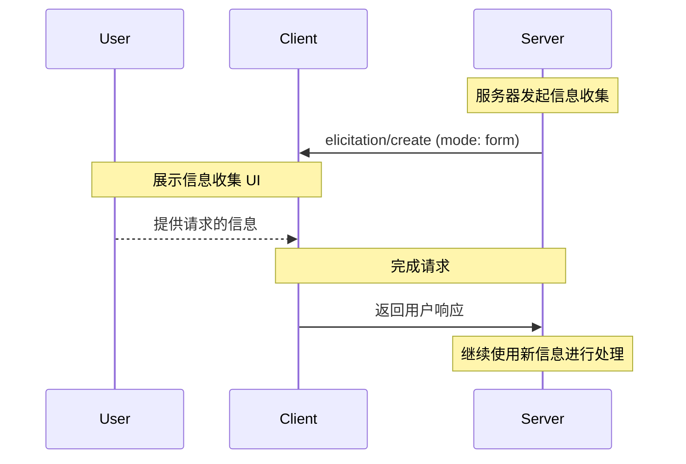
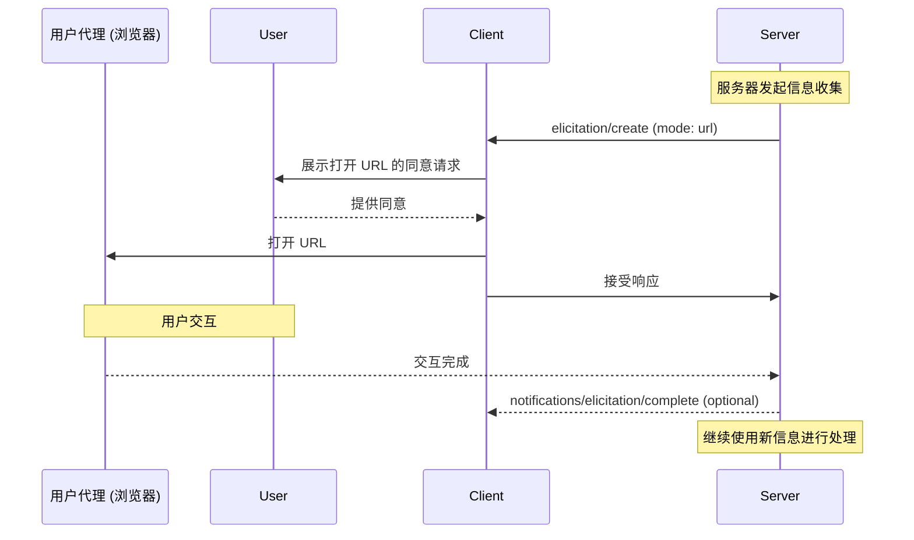
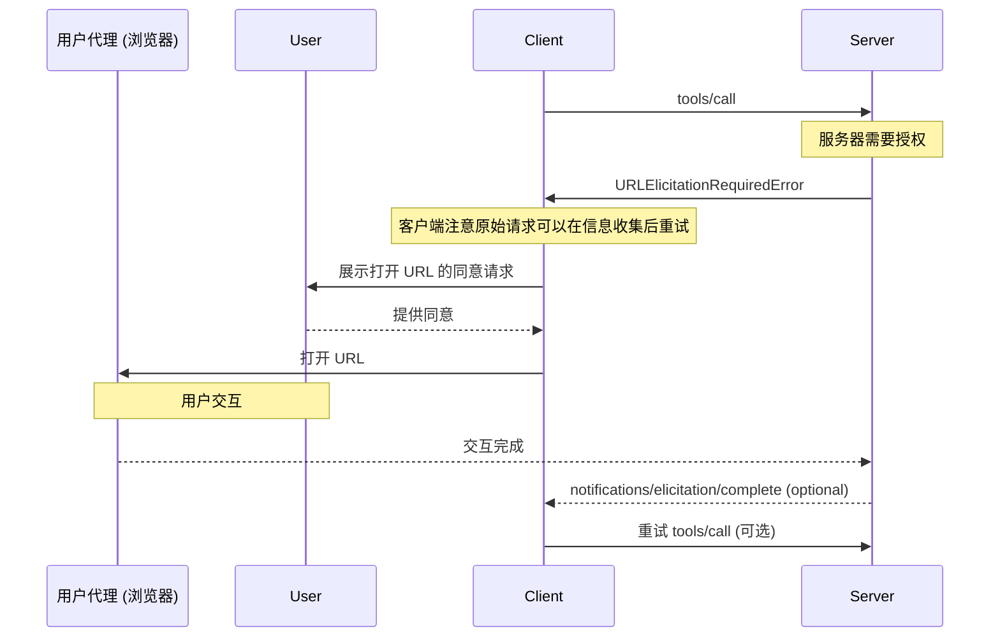
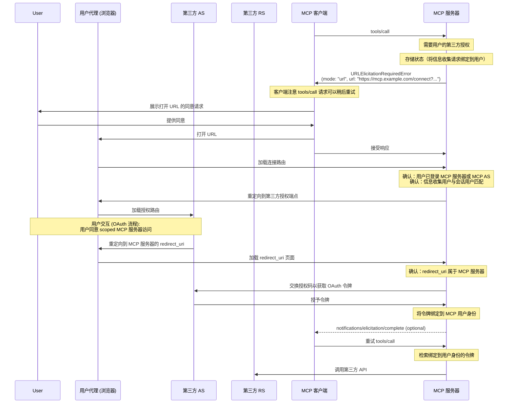

<div id="enable-section-numbers" />

模型上下文协议 (MCP) 提供了一种标准化方式，允许服务器在交互过程中通过客户端向用户请求额外信息。此流程允许客户端保持对用户交互和数据共享的控制，同时使服务器能够动态收集必要信息。

信息收集支持两种模式：

- **表单模式**：服务器可以向用户请求结构化数据，并使用可选的 JSON Schema 验证响应
- **URL 模式**：服务器可以将用户引导至外部 URL 进行敏感交互，这些交互**不得**经过 MCP 客户端

## 用户交互模型

MCP 中的信息收集允许服务器通过启用用户输入请求**嵌套**在其他 MCP 服务器功能内来实现交互式工作流。

实现者可以自由地通过任何适合其需求的界面模式来暴露信息收集功能——协议本身并不强制任何特定的用户交互模型。

<Warning>

为了信任、安全和安全性：

- 服务器**不得**使用表单模式信息收集来请求敏感信息，例如密码、API 密钥、访问令牌或支付凭证
- 服务器**必须**使用 [URL 模式](#url-mode-elicitation-requests) 进行涉及此类敏感信息的交互

此上下文中的“敏感信息”指的是授予访问权限或授权交易的秘密和凭证。一般联系或个人资料信息（例如姓名、电子邮件地址或用户名）并非绝对禁止；是否通过表单模式请求此类数据由服务器自行决定，并取决于用户审查和拒绝的能力。

MCP 客户端**必须**：

- 提供用户界面，清楚表明是哪个服务器在请求信息
- 尊重用户隐私，并提供明确的拒绝和取消选项
- 对于表单模式，允许用户在发送前审查和修改其响应
- 对于 URL 模式，清楚显示目标域名/主机，并在导航到目标 URL 之前获取用户同意

</Warning>

## 能力

支持信息收集的客户端**必须**在 [初始化](../basic/lifecycle#initialization) 期间声明 `elicitation` 能力：

```json
{
  "capabilities": {
    "elicitation": {
      "form": {},
      "url": {}
    }
  }
}
```

为了向后兼容性，空能力对象等同于仅声明支持 `form` 模式：

```jsonc
{
  "capabilities": {
    "elicitation": {}, // 等同于 { "form": {} }
  },
}
```

声明 `elicitation` 能力的客户端**必须**至少支持一种模式（`form` 或 `url`）。

服务器**不得**发送客户端不支持的模式的信息收集请求。

## 协议消息

### 信息收集请求

要向用户请求信息，服务器发送 `elicitation/create` 请求。

所有信息收集请求**必须**包含以下参数：

| 名称      | 类型   | 选项          | 描述                                                                                    |
| --------- | ------ | ------------- | --------------------------------------------------------------------------------------- |
| `mode`    | string | `form`, `url` | 信息收集的模式。对于表单模式为可选（如果省略则默认为 `"form"`）。 |
| `message` | string |               | 一条人类可读的消息，解释为何需要此交互。                     |

`mode` 参数指定信息收集的类型：

- `"form"`：带内结构化数据收集，带有可选的 Schema 验证。数据会暴露给客户端。
- `"url"`：通过 URL 导航进行带外交互。数据（URL 本身除外）**不会**暴露给客户端。

为了向后兼容性，服务器**可以**省略表单模式信息收集请求的 `mode` 字段。客户端**必须**将没有 `mode` 字段的请求视为表单模式。

### 表单模式信息收集请求

表单模式信息收集允许服务器通过 MCP 客户端直接收集结构化数据。

表单模式信息收集请求**必须**指定 `mode: "form"` 或省略 `mode` 字段，并包含以下额外参数：

| 名称              | 类型   | 描述                                                    |
| ----------------- | ------ | ------------------------------------------------------- |
| `requestedSchema` | object | 一个 JSON Schema，定义预期响应的结构。 |

#### 请求的 Schema

`requestedSchema` 参数允许服务器使用受限的 JSON Schema 子集来定义预期响应的结构。

为了简化客户端用户体验，表单模式信息收集 Schema 仅限于具有原始属性的扁平对象。

Schema 仅限于以下原始类型：

1. **字符串 Schema**

   ```json
   {
     "type": "string",
     "title": "显示名称",
     "description": "描述文本",
     "minLength": 3,
     "maxLength": 50,
     "pattern": "^[A-Za-z]+$",
     "format": "email",
     "default": "user@example.com"
   }
   ```

   支持的格式：`email`, `uri`, `date`, `date-time`

2. **数字 Schema**

   ```json
   {
     "type": "number", // 或 "integer"
     "title": "显示名称",
     "description": "描述文本",
     "minimum": 0,
     "maximum": 100,
     "default": 50
   }
   ```

3. **布尔值 Schema**

   ```json
   {
     "type": "boolean",
     "title": "显示名称",
     "description": "描述文本",
     "default": false
   }
   ```

4. **枚举 Schema**

   单选枚举（无标题）：

   ```json
   {
     "type": "string",
     "title": "颜色选择",
     "description": "选择您喜欢的颜色",
     "enum": ["Red", "Green", "Blue"],
     "default": "Red"
   }
   ```

   单选枚举（有标题）：

   ```json
   {
     "type": "string",
     "title": "颜色选择",
     "description": "选择您喜欢的颜色",
     "oneOf": [
       { "const": "#FF0000", "title": "Red" },
       { "const": "#00FF00", "title": "Green" },
       { "const": "#0000FF", "title": "Blue" }
     ],
     "default": "#FF0000"
   }
   ```

   多选枚举（无标题）：

   ```json
   {
     "type": "array",
     "title": "颜色选择",
     "description": "选择您喜欢的颜色",
     "minItems": 1,
     "maxItems": 2,
     "items": {
       "type": "string",
       "enum": ["Red", "Green", "Blue"]
     },
     "default": ["Red", "Green"]
   }
   ```

   多选枚举（有标题）：

   ```json
   {
     "type": "array",
     "title": "颜色选择",
     "description": "选择您喜欢的颜色",
     "minItems": 1,
     "maxItems": 2,
     "items": {
       "anyOf": [
         { "const": "#FF0000", "title": "Red" },
         { "const": "#00FF00", "title": "Green" },
         { "const": "#0000FF", "title": "Blue" }
       ]
     },
     "default": ["#FF0000", "#00FF00"]
   }
   ```

客户端可以使用此 Schema 来：

1. 生成适当的输入表单
2. 发送前验证用户输入
3. 为用户提供更好的指导

所有原始类型都支持可选默认值，以提供合理的起点。支持默认值的客户端 SHOULD 使用这些值预填充表单字段。

请注意，复杂嵌套结构、对象数组（枚举除外）和其他高级 JSON Schema 功能故意不支持，以简化客户端用户体验。

#### 示例：简单文本请求

**请求：**

```json
{
  "jsonrpc": "2.0",
  "id": 1,
  "method": "elicitation/create",
  "params": {
    "mode": "form",
    "message": "请提供您的 GitHub 用户名",
    "requestedSchema": {
      "type": "object",
      "properties": {
        "name": {
          "type": "string"
        }
      },
      "required": ["name"]
    }
  }
}
```

**响应：**

```json
{
  "jsonrpc": "2.0",
  "id": 1,
  "result": {
    "action": "accept",
    "content": {
      "name": "octocat"
    }
  }
}
```

#### 示例：结构化数据请求

**请求：**

```json
{
  "jsonrpc": "2.0",
  "id": 2,
  "method": "elicitation/create",
  "params": {
    "mode": "form",
    "message": "请提供您的联系信息",
    "requestedSchema": {
      "type": "object",
      "properties": {
        "name": {
          "type": "string",
          "description": "您的全名"
        },
        "email": {
          "type": "string",
          "format": "email",
          "description": "您的电子邮件地址"
        },
        "age": {
          "type": "number",
          "minimum": 18,
          "description": "您的年龄"
        }
      },
      "required": ["name", "email"]
    }
  }
}
```

**响应：**

```json
{
  "jsonrpc": "2.0",
  "id": 2,
  "result": {
    "action": "accept",
    "content": {
      "name": "Monalisa Octocat",
      "email": "octocat@github.com",
      "age": 30
    }
  }
}
```

### URL 模式信息收集请求

<Note>

**新功能：** URL 模式信息收集是在 `2025-11-25` 版本的 MCP 规范中引入的。其设计和实现可能会在未来的协议修订中更改。

</Note>

URL 模式信息收集使服务器能够将用户引导至外部 URL 进行带外交互，这些交互不得经过 MCP 客户端。这对于认证流程、支付处理和其他敏感或安全操作至关重要。

URL 模式信息收集请求**必须**指定 `mode: "url"`、`message`，并包含以下额外参数：

| 名称            | 类型   | 描述                               |
| --------------- | ------ | ---------------------------------- |
| `url`           | string | 用户应该导航到的 URL。 |
| `elicitationId` | string | 信息收集的唯一标识符。  |

`url` 参数**必须**包含一个有效的 URL。

<Note>
  **重要**：URL 模式信息收集*不是*用于授权 MCP 客户端访问
  MCP 服务器（这由 [MCP
  授权](../basic/authorization) 处理）。相反，当 MCP
  服务器需要代表用户获取敏感信息或第三方授权时使用它。MCP 客户端的 Bearer 令牌保持不变。
  客户端的唯一责任是为用户提供关于服务器希望他们打开的信息收集 URL 的上下文。
</Note>

#### 示例：请求敏感数据

此示例显示了一个 URL 模式信息收集请求，将用户引导至一个安全 URL，他们可以在那里提供敏感信息（例如 API 密钥）。
相同的请求可以将用户引导至 OAuth 授权流程或支付流程。唯一的区别是 URL 和消息。

**请求：**

```json
{
  "jsonrpc": "2.0",
  "id": 3,
  "method": "elicitation/create",
  "params": {
    "mode": "url",
    "elicitationId": "550e8400-e29b-41d4-a716-446655440000",
    "url": "https://mcp.example.com/ui/set_api_key",
    "message": "请提供您的 API 密钥以继续。"
  }
}
```

**响应：**

```json
{
  "jsonrpc": "2.0",
  "id": 3,
  "result": {
    "action": "accept"
  }
}
```

带有 `action: "accept"` 的响应表示用户已同意交互。这并不意味着交互已完成。交互发生在带外，客户端不知道结果，除非服务器发送表示完成的通知。

### URL 模式信息收集的完成通知

当由 URL 模式信息收集启动的带外交互完成时，服务器**可以**发送 `notifications/elicitation/complete` 通知。这允许客户端在适当时以编程方式反应。

发送通知的服务器：

- **必须**仅将通知发送给发起信息收集请求的客户端。
- **必须**包含在原始 `elicitation/create` 请求中建立的 `elicitationId`。

客户端：

- **必须**忽略引用未知或已完成 ID 的通知。
- **可以**等待此通知以自动重试收到 [URLElicitationRequiredError](#error-handling) 的请求，更新用户界面，或以其他方式继续交互。
- **应该**仍然提供手动控制，如果通知从未到达，允许用户重试或取消原始请求（或以其他方式恢复与客户端交互）。

#### 示例

```json
{
  "jsonrpc": "2.0",
  "method": "notifications/elicitation/complete",
  "params": {
    "elicitationId": "550e8400-e29b-41d4-a716-446655440000"
  }
}
```

### 需要 URL 信息收集错误

当请求在信息收集完成之前无法处理时，服务器**可以**返回 [`URLElicitationRequiredError`](#error-handling)（代码 `-32042`）以向客户端指示需要 URL 模式信息收集。服务器**不得**返回此错误，除非需要 URL 模式信息收集。

错误**必须**包含在完成原始请求之前必须完成的信息收集列表。

错误中返回的任何信息收集**必须**是 URL 模式信息收集，并具有 `elicitationId` 属性。

**错误响应：**

```json
{
  "jsonrpc": "2.0",
  "id": 2,
  "error": {
    "code": -32042, // URL_ELICITATION_REQUIRED
    "message": "此请求需要更多信息。",
    "data": {
      "elicitations": [
        {
          "mode": "url",
          "elicitationId": "550e8400-e29b-41d4-a716-446655440000",
          "url": "https://mcp.example.com/connect?elicitationId=550e8400-e29b-41d4-a716-446655440000",
          "message": "需要授权才能访问您的 Example Co 文件。"
        }
      ]
    }
  }
}
```

## 消息流程

### 表单模式流程



### URL 模式流程



### 带有信息收集必需错误的 URL 模式流程



## 响应操作

信息收集响应使用三操作模型来清楚地区分不同的用户操作。这些操作适用于表单和 URL 信息收集模式。

```json
{
  "jsonrpc": "2.0",
  "id": 1,
  "result": {
    "action": "accept", // 或 "decline" 或 "cancel"
    "content": {
      "propertyName": "value",
      "anotherProperty": 42
    }
  }
}
```

三个响应操作是：

1. **接受** (`action: "accept"`): 用户明确批准并提交数据
   - 对于表单模式：`content` 字段包含与请求模式匹配的提交数据
   - 对于 URL 模式：`content` 字段被省略
   - 示例：用户点击了“提交”、“确定”、“确认”等。

2. **拒绝** (`action: "decline"`): 用户明确拒绝请求
   - `content` 字段通常被省略
   - 示例：用户点击了“拒绝”、“谢绝”、“否”等。

3. **取消** (`action: "cancel"`): 用户解散而未做出明确选择
   - `content` 字段通常被省略
   - 示例：用户关闭了对话框、点击了外部、按了 Escape 键、浏览器加载失败等。

服务器应适当处理每种状态：

- **接受**：处理提交的数据
- **拒绝**：处理明确拒绝（例如，提供替代方案）
- **取消**：处理解散（例如，稍后再次提示）

## 实现注意事项

### 状态性

大多数实际的信息收集用例要求服务器维护关于用户的状态：

- 是否已收集所需信息（例如，通过表单模式信息收集获取用户的显示名称）
- 资源访问状态（例如，通过 URL 模式信息收集获取 API 密钥或支付流程）

实现信息收集的服务器 **必须** 按照 [安全最佳实践](../basic/security_best_practices) 文档中的指南，将此状态与个别用户安全地关联。具体来说：

- 状态 **不得** 仅与会话 ID 关联
- 状态存储 **必须** 防止未经授权的访问
- 对于远程 MCP 服务器，用户标识 **必须** 在可能时从通过 [MCP 授权](../basic/authorization) 获取的凭据中衍生（例如 `sub` 声明）

<Note>
  本节中的示例是非规范性的，旨在说明信息收集的潜在用途。实现者应在保持安全最佳实践的同时，根据其特定需求调整这些模式。
</Note>

### 用于敏感数据的 URL 模式信息收集

对于与需要敏感信息（例如，凭据、支付信息）的外部 API 交互的服务器，URL 模式信息收集提供了一种安全机制，让用户提供此信息而不将其暴露给 MCP 客户端。

在此模式中：

1. 服务器将用户引导至安全网页（通过 HTTPS 服务）
2. 页面在用户信任的域上展示品牌化的表单 UI
3. 用户直接将敏感凭据输入安全表单
4. 服务器安全地存储凭据，绑定到用户身份
5. 后续 MCP 请求使用这些存储的凭据进行 API 访问

这种方法确保敏感凭据永远不会通过 LLM 上下文、MCP 客户端或任何中间 MCP 服务器，减少通过客户端日志记录或其他攻击向量暴露的风险。

### 用于 OAuth 流程的 URL 模式信息收集

URL 模式信息收集启用了一种模式，其中 MCP 服务器充当第三方资源服务器的 OAuth 客户端。
通过 URL 模式信息收集启用的与外部 API 的授权不同于 [MCP 授权](../basic/authorization)。MCP 服务器 **不得** 依赖 URL 模式信息收集来为用户授权自身。

#### 理解区别

- **MCP 授权**：MCP 客户端和 MCP 服务器之间所需的 OAuth 流程（在 [授权规范](../basic/authorization) 中涵盖）
- **外部（第三方）授权**：MCP 服务器和第三方资源服务器之间的可选授权，通过 URL 模式信息收集发起

在外部授权中，服务器同时充当：

- OAuth 资源服务器（对 MCP 客户端）
- OAuth 客户端（对第三方资源服务器）

示例场景：

- MCP 客户端连接到 MCP 服务器
- MCP 服务器集成各种不同的第三方服务
- 当 MCP 客户端调用需要访问第三方服务的工具时，MCP 服务器需要该服务的凭据

关键安全要求是：

1. **第三方凭据不得通过 MCP 客户端传输**：客户端永远不应看到第三方凭据以保护安全边界
2. **MCP 服务器不得将客户端的凭据用于第三方服务**：那将是 [令牌传递](../basic/security_best_practices#token-passthrough)，这是禁止的
3. **用户必须直接授权 MCP 服务器**：交互发生在 MCP 协议之外，不涉及 MCP 客户端
4. **MCP 服务器负责令牌**：MCP 服务器负责存储和管理通过 URL 模式信息收集获得的第三方令牌（换句话说，MCP 服务器必须是有状态的）。

通过 URL 模式信息收集获得的凭据不同于 MCP 客户端使用的 MCP 服务器凭据。MCP 服务器 **不得** 将通过 URL 模式信息收集获得的凭据传输给 MCP 客户端。

<Note>
  有关更多背景信息，请参阅安全最佳实践文档中的 [令牌传递部分](../basic/security_best_practices#token-passthrough)，以了解为什么 MCP 服务器不能充当传递代理。
</Note>

#### 实现模式

当通过 URL 模式信息收集实现外部授权时：

1. MCP 服务器生成授权 URL，充当第三方服务的 OAuth 客户端
2. MCP 服务器存储内部状态，将信息收集请求与用户身份关联（绑定）。
3. MCP 服务器向客户端发送带有可以启动授权流程的 URL 的 URL 模式信息收集请求。
4. 用户直接与第三方授权服务器完成 OAuth 流程
5. 第三方授权服务器重定向回 MCP 服务器
6. MCP 服务器安全地存储第三方令牌，绑定到用户身份
7. 未来的 MCP 请求可以利用这些存储的令牌访问第三方资源服务器的 API

以下是如何实现此模式的非规范性示例：



此模式在保持清晰安全边界的同时，实现了与需要用户授权的第三方服务的丰富集成。

## 错误处理

服务器 **必须** 为常见失败情况返回标准 JSON-RPC 错误：

- 当请求在完成信息索取之前无法处理时：`-32042`（`URLElicitationRequiredError`）

客户端 **必须** 为常见失败情况返回标准 JSON-RPC 错误：

- 服务器发送的 `elicitation/create` 请求中包含未在客户端能力中声明的模式：`-32602`（无效参数）

## 安全注意事项

1. 服务器 **必须** 将信息索取请求绑定到客户端和用户身份
1. 客户端 **必须** 提供明确指示，说明是哪个服务器正在请求信息
1. 客户端 **应该** 实现用户批准控制
1. 客户端 **应该** 允许用户随时拒绝信息索取请求
1. 客户端 **应该** 实现速率限制
1. 客户端 **应该** 以清晰展示所请求信息及其原因的方式呈现信息索取请求

### 安全 URL 处理

请求信息索取的 MCP 服务器：

1. **不得** 在 URL 信息索取请求中发送给客户端的 URL 里包含关于最终用户的敏感信息，包括凭证、个人身份信息等。
2. **不得** 提供预认证即可访问受保护资源的 URL，因为恶意客户端可能利用该 URL 冒充用户。
3. **不应该** 在表单模式信息索取请求的任何字段中包含旨在可点击的 URL。
4. **应该** 在非开发环境中使用 HTTPS URL。

这些服务器要求确保客户端实现有关何时向用户展示 URL 的明确规则，以便可以一致地应用客户端侧规则（如下）。

实现 URL 模式信息索取的客户端 **必须** 小心处理 URL，以防止用户无意中点击恶意链接。

处理 URL 模式信息索取请求时，MCP 客户端：

1. **不得** 自动预取 URL 或其任何元数据。
2. **不得** 在未经用户明确同意的情况下打开 URL。
3. **必须** 在同意前向用户显示完整 URL 以供检查。
4. **必须** 以安全的方式打开服务器提供的 URL，使得客户端或 LLM 无法检查内容或用户输入。
   例如，在 iOS 上，[SFSafariViewController](https://developer.apple.com/documentation/safariservices/sfsafariviewcontroller) 是合适的，但 [WkWebView](https://developer.apple.com/documentation/webkit/wkwebview) 不合适。
5. **应该** 突出显示 URL 的域名以减轻子域名欺骗。
6. **应该** 对模糊/可疑的 URI（即包含 Punycode 的）发出警告。
7. **不应该** 在信息索取请求的任何字段中将 URL 渲染为可点击的，除了 URL 信息索取请求中的 `url` 字段（受上述限制）。

### 识别用户

服务器 **不得** 依赖客户端提供的用户身份识别而不进行服务器验证，因为这可能被伪造。
相反，服务器 **应该** 遵循 [安全最佳实践](../basic/security_best_practices)。

非规范性示例：

- 错误：将用户输入（如 "I am joe@example.com"）视为权威
- 正确：依赖 [授权](../basic/authorization) 来识别用户

### 表单模式安全

1. 服务器 **不得** 通过表单模式请求敏感信息（密码、API 密钥等）
2. 客户端 **应该** 针对提供的模式验证所有响应
3. 服务器 **应该** 验证接收到的数据是否与请求的模式匹配

#### 网络钓鱼

URL 模式信息索取返回一个攻击者可用于发送给受害者的 URL。MCP 服务器 **必须** 在接受信息之前验证打开 URL 的用户身份。

通常身份验证是通过利用 [MCP 授权服务器](../basic/authorization) 来识别用户，通过浏览器中的会话 cookie 或等效方式。

例如，URL 模式信息索取可用于执行 OAuth 流程，其中服务器充当另一个资源服务器的 OAuth 客户端。如果没有适当的缓解措施，可能发生以下网络钓鱼攻击：

1. 连接到良性服务器的恶意用户（Alice）触发信息索取请求
2. 良性服务器生成授权 URL，充当第三方授权服务器的 OAuth 客户端
3. Alice 的客户端显示 URL 并请求同意
4. Alice 没有点击链接，而是诱骗同一良性服务器的受害者用户（Bob）点击它
5. Bob 打开链接并完成授权，认为他们正在授权自己与良性服务器的连接
6. 良性服务器收到来自第三方授权服务器的回调/重定向，并假设这是 Alice 的请求
7. 第三方服务器的令牌绑定到 Alice 的会话和身份，而不是 Bob 的，导致账户接管

为了防止此攻击，服务器 **必须** 确保启动信息索取请求的用户（通过 MCP 客户端访问服务器的最终用户）与完成授权流程的用户是同一人。

实现这一点的方法有很多，最佳方式将取决于具体实现。

作为一个常见的非规范性示例，考虑 MCP 服务器可通过 Web 访问并希望执行第三方授权代码流程的情况。
为了防止网络钓鱼攻击，服务器将创建一个 URL 模式信息索取到 `https://mcp.example.com/connect?elicitationId=...` 而不是第三方授权端点。
此“连接 URL"必须确保打开页面的用户与生成信息索取的用户是同一人。
例如，它将检查用户是否有有效的会话 cookie，并且该会话 cookie 属于使用 MCP 客户端生成 URL 模式信息索取的同一用户。
这可以通过比较 MCP 服务器授权服务器中的权威主体（`sub` 声明）与会话 cookie 中的主体来完成。
一旦该页面确保是同一用户，它可以将用户发送到第三方授权服务器 `https://example.com/authorize?...`，在那里可以完成正常的 OAuth 流程。

在其他情况下，服务器可能无法通过 Web 访问，并且可能无法使用会话 cookie 来识别用户。
在这种情况下，服务器必须使用不同的机制来识别打开信息索取 URL 的用户与生成信息索取的用户是同一人。

在所有实现中，服务器 **必须** 确保确定用户身份的机制能够抵御攻击者可以修改信息索取 URL 的攻击。
