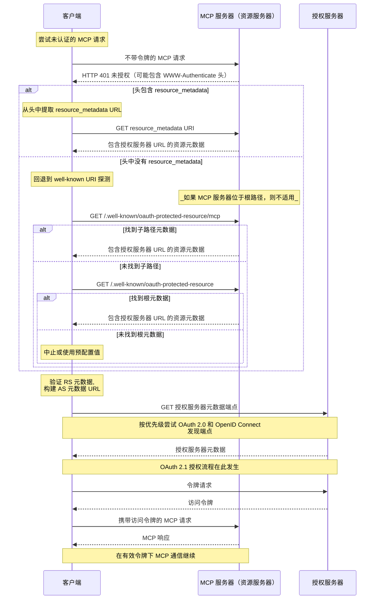

本文档描述了 MCP 服务器向 MCP 客户端公开其关联
授权服务器的机制，以及 MCP
客户端可通过该发现流程确定授权服务器端点和支持的能力。

## 授权服务器位置

MCP 服务器 **必须** 实现 OAuth 2.0 受保护资源元数据 ([RFC9728](https://datatracker.ietf.org/doc/html/rfc9728))
规范，以指示授权服务器的位置。MCP 服务器返回的受保护资源元数据文档 **必须** 包括
`authorization_servers` 字段，且该字段至少包含一个授权服务器。

`authorization_servers` 的具体用途超出了本规范的范围；实现者应查阅
OAuth 2.0 受保护资源元数据 ([RFC9728](https://datatracker.ietf.org/doc/html/rfc9728))
以获取实现细节方面的指导。

实现者应注意，受保护资源元数据文档
可以定义多个授权服务器。选择使用哪个授权服务器的责任
在于 MCP 客户端，并遵循
[RFC9728 第 7.6 节 “授权服务器”](https://datatracker.ietf.org/doc/html/rfc9728#name-authorization-servers) 中指定的指南。

当 `authorization_servers` 中列出多个授权服务器时，每个都是一个
独立的 OAuth 2.0 授权服务器。与
[RFC 6749 第 2.2 节](https://datatracker.ietf.org/doc/html/rfc6749#section-2.2) 一致，客户端标识符
对于签发它们的授权服务器是唯一的。客户端 **必须** 针对每个授权服务器维护
独立的注册状态（客户端凭据、令牌），并且 **不得** 假设某个授权服务器有效的凭据会被
另一个授权服务器接受。有关将客户端凭据与签发它们的授权服务器关联的要求，请参见
[授权服务器绑定](/specification/2026-07-28/basic/authorization/client-registration#authorization-server-binding)。

## 受保护资源元数据发现要求

MCP 服务器 **必须** 实现以下发现机制之一，以向 MCP 客户端提供授权服务器位置信息：

1. **WWW-Authenticate 标头**：在返回 `401 Unauthorized` 响应时，按照 [RFC9728 第 5.1 节](https://datatracker.ietf.org/doc/html/rfc9728#name-www-authenticate-response) 的描述，在 `WWW-Authenticate` HTTP 标头中通过 `resource_metadata` 包含资源元数据 URL。

2. **Well-Known URI**：按照 [RFC9728](https://datatracker.ietf.org/doc/html/rfc9728) 的规定，在 well-known URI 上提供元数据。这可以是以下任一位置：
   - 位于服务器 MCP 端点的路径下：`https://example.com/public/mcp` 可在 `https://example.com/.well-known/oauth-protected-resource/public/mcp` 提供元数据
   - 位于根路径：`https://example.com/.well-known/oauth-protected-resource`

MCP 客户端 **必须** 支持这两种发现机制，并在存在解析后的 `WWW-Authenticate` 标头时使用其中的资源元数据 URL；否则，它们 **必须** 按上述顺序回退到构造并请求 well-known URI。

MCP 客户端 **必须** 能够解析 `WWW-Authenticate` 标头，并对来自 MCP 服务器的 `HTTP 401 Unauthorized` 响应做出适当响应。

服务器还可以在 `WWW-Authenticate` 挑战中包含 `scope` 参数，以指示访问该资源所需的作用域；作用域语义及相关客户端行为在 [Scope Selection Strategy](/specification/2026-07-28/basic/authorization#scope-selection-strategy) 部分中定义。

## 授权服务器元数据发现

MCP 使用默认的 `oauth-authorization-server` well-known URI
后缀，该后缀定义于
[RFC 8414 第 3.1 节](https://datatracker.ietf.org/doc/html/rfc8414#section-3.1)
，用于授权服务器元数据发现。MCP 不定义
应用特定的 well-known URI 后缀。

为处理不同的发行方 URL 格式，并确保
与 OAuth 2.0 授权服务器元数据以及 OpenID Connect Discovery 1.0 规范的互操作性，
MCP 客户端在发现授权服务器元数据时
**MUST** 尝试多个 well-known 端点。

该发现方法基于
[RFC 8414 第 3.1 节“Authorization Server Metadata Request”](https://datatracker.ietf.org/doc/html/rfc8414#section-3.1)
用于 OAuth 2.0 授权服务器元数据发现，以及
[RFC 8414 第 5 节“Compatibility Notes”](https://datatracker.ietf.org/doc/html/rfc8414#section-5)
用于 OpenID Connect Discovery 1.0 互操作性。

对于带有路径组件的发行方 URL
（例如，`https://auth.example.com/tenant1`），客户端 **MUST**
按以下优先级顺序尝试端点：

1. 带路径插入的 OAuth 2.0 授权服务器元数据：
   `https://auth.example.com/.well-known/oauth-authorization-server/tenant1`
2. 带路径插入的 OpenID Connect Discovery 1.0：
   `https://auth.example.com/.well-known/openid-configuration/tenant1`
3. OpenID Connect Discovery 1.0 路径追加：
   `https://auth.example.com/tenant1/.well-known/openid-configuration`

对于不带路径组件的发行方 URL
（例如，`https://auth.example.com`），客户端 **MUST** 尝试：

1. OAuth 2.0 授权服务器元数据：
   `https://auth.example.com/.well-known/oauth-authorization-server`
2. OpenID Connect Discovery 1.0：
   `https://auth.example.com/.well-known/openid-configuration`

在检索到元数据文档后，MCP 客户端 **MUST** 按 [RFC8414 第 3.3 节](https://datatracker.ietf.org/doc/html/rfc8414#section-3.3) 或 [OpenID Connect Discovery 第 4.3 节](https://openid.net/specs/openid-connect-discovery-1_0.html#ProviderConfigurationValidation) 的要求对其进行验证：文档中的 `issuer` 值 **MUST** 与用于构造 well-known URL 的发行方标识符完全一致。如果二者不同，客户端 **MUST NOT** 使用该元数据。例如，从 `https://attacker.example/.well-known/oauth-authorization-server` 获取的、包含 `"issuer": "https://honest.example"` 的文档 **MUST** 被拒绝。

## 序列图

下图概述了一个示例流程：

