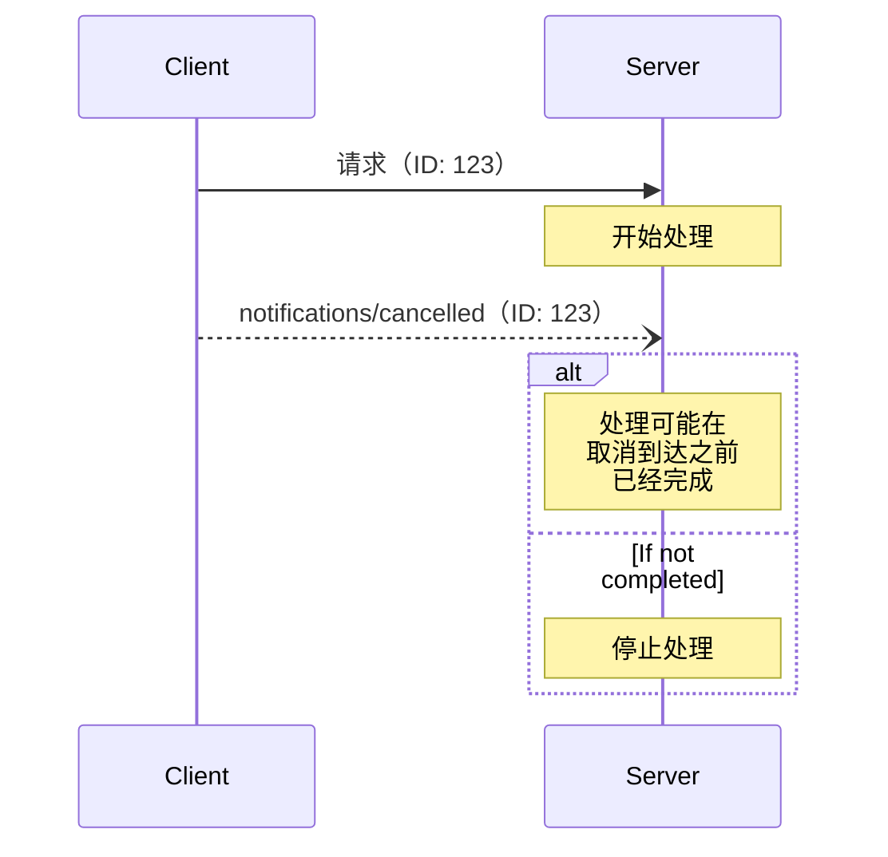

<div id="enable-section-numbers" />

模型上下文协议（MCP）支持通过通知消息对进行中的请求进行可选取消。客户端 **SHOULD** 发送取消通知，以表明应终止其先前发出的某个请求。

当服务器拆除某个订阅流时，**MUST** 发送 `notifications/cancelled`，并引用一个 `subscriptions/listen` 请求 ID（参见 [Subscriptions][subscriptions]）。服务器 **MUST NOT** 因任何其他目的发送 `notifications/cancelled`。

## 取消流程

当客户端想要取消一个进行中的请求时，它会发送一个 `notifications/cancelled`
通知，其中包含：

- 要取消的请求 ID
- 一个可选的原因字符串，可用于日志记录或显示

```json
{
  "jsonrpc": "2.0",
  "method": "notifications/cancelled",
  "params": {
    "requestId": "123",
    "reason": "用户请求取消"
  }
}
```

## 特定于传输的取消

客户端如何发出取消信号取决于传输方式：

- **Streamable HTTP**：关闭 SSE 响应流即表示取消信号。  
  服务器 **MUST** 将客户端断开连接视为对该请求的取消。不需要也不应期望收到 `notifications/cancelled` 消息。
- **stdio**：没有可关闭的按请求流。客户端 **MUST** 发送一个引用该请求 ID 的 `notifications/cancelled` 通知。

## 超时

实现**应该**为所有已发送的请求设置超时，以防止连接挂起和资源耗尽。当请求在超时时间内未收到成功或错误响应时，发送方**应该**取消该请求并停止等待响应。正如[传输特定取消](#transport-specific-cancellation)中所述，这意味着：

- **Streamable HTTP**：关闭该请求的响应流，这构成取消。
- **stdio**：发送一条引用该请求 ID 的 `notifications/cancelled` 通知。

SDK 和其他中间件**应该**允许按每个请求单独配置这些超时。

实现**可以**选择在收到与该请求对应的[进度通知](/specification/2026-07-28/basic/patterns/progress)时重置超时计时，因为这意味着工作实际上正在进行中。然而，无论是否收到进度通知，实现**应该**始终强制执行最大超时时间，以限制行为异常的客户端或服务器造成的影响。

## 行为要求

1. 取消通知 **MUST** 仅引用以下请求：
   - 之前由客户端发出的
   - 被认为仍在处理中
1. 服务器发送的取消通知 **MUST** 引用一个
   `subscriptions/listen` 请求，以终止该订阅流
1. 接收到取消通知的服务器 **SHOULD**：
   - 停止处理已取消的请求
   - 释放相关资源
   - 不要为已取消的请求发送响应
1. 如果满足以下情况，服务器 **MAY** 忽略取消通知：
   - 所引用的请求未知
   - 处理已经完成
   - 该请求无法取消
1. 客户端 **SHOULD** 忽略之后到达的任何对已取消请求的响应

## 时序考量

由于网络延迟，取消通知可能会在请求处理完成后才到达，甚至可能在响应已经发送之后才到达。

双方**必须**优雅地处理这些竞态条件：



## 实现说明

- 双方 **应当** 记录取消原因以便调试
- 应用程序界面 **应当** 指示何时请求取消

## 错误处理

无效的取消通知 **应当** 被忽略：

- 未知的请求 ID
- 已完成的请求
- 格式错误的通知

这保持了通知“发送即忘”的特性，同时允许异步通信中的竞争
条件。

[subscriptions]: /specification/2026-07-28/basic/patterns/subscriptions
