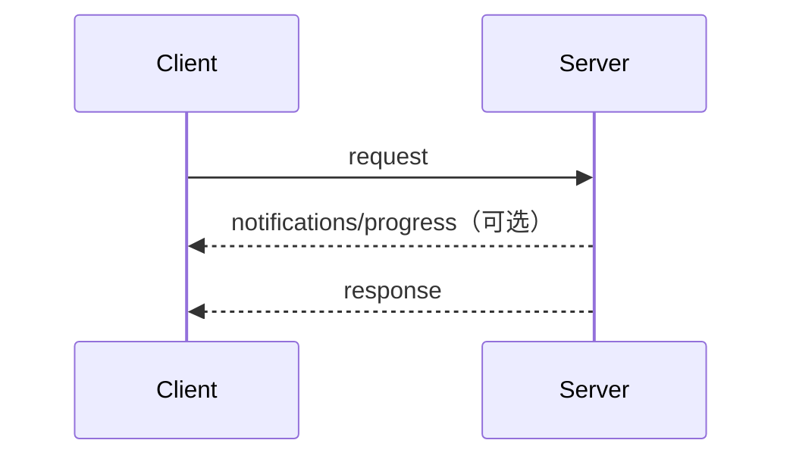
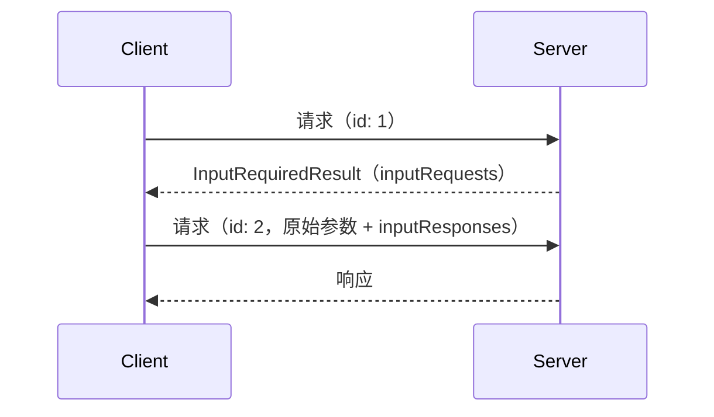
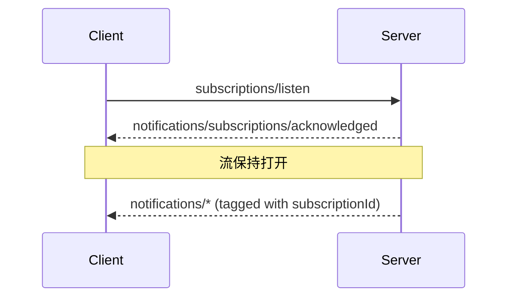

此页面定义了核心协议的消息模式：客户端和服务器将 JSON-RPC
[请求、响应和通知](/specification/2026-07-28/basic/index#messages)
组合成交互的方式。每种
[传输](/specification/2026-07-28/basic/transports)都承载这些
模式；传输方式的区别仅在于消息如何被封装和传递。

每次交互都由客户端开始：

- **客户端** 发送 JSON-RPC _请求_ 和 _通知_。
- **服务器** 用 JSON-RPC _响应_（结果或错误）来回答每个请求，必要时可先发送
  该请求范围内的 _通知_。

服务器 **MUST NOT** 发起 JSON-RPC 请求，客户端也不发送
JSON-RPC 响应。

## 请求与响应

客户端发送请求；服务器以结果或错误来响应。
当请求正在传输时，服务器 **MAY** 发送与该请求相关的通知，例如
[`notifications/progress`](/specification/2026-07-28/basic/patterns/progress)
和 [`notifications/message`](/specification/2026-07-28/server/utilities/logging)。

## 多轮往返请求

当服务器需要客户端输入（采样、征询或 roots）来完成请求时，它会返回一个
[`InputRequiredResult`](/specification/2026-07-28/basic/patterns/mrtr#inputrequiredresult)，
然后客户端使用匹配的 `inputResponses` 重新请求。参见
[多轮往返请求](/specification/2026-07-28/basic/patterns/mrtr)。

## 订阅并通知

为了接收变更通知（列表变更、资源更新），客户端发送一个
[`subscriptions/listen`](/specification/2026-07-28/basic/patterns/subscriptions)
请求；回复是所请求通知类型的长连接流。流状态以请求为作用域：如果底层通道
丢失，客户端会重新发起该请求。

## 添加模式

所有核心协议功能都由这些模式构建而成。新增模式的协议修订会在此页面上对其进行定义。传输层无需更改即可承载新模式，因为模式完全以请求、响应和通知来表示。
