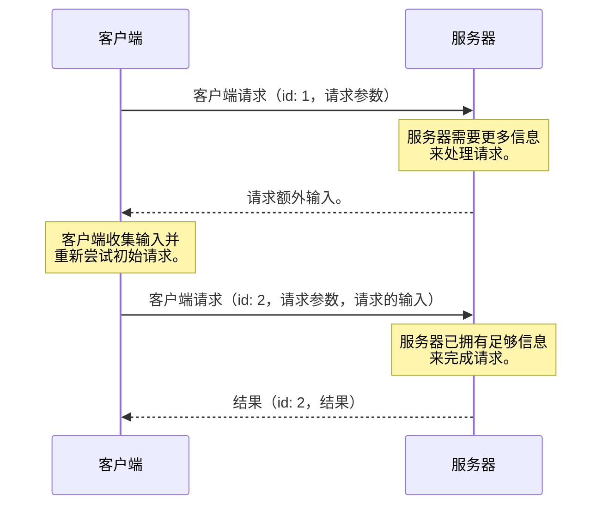
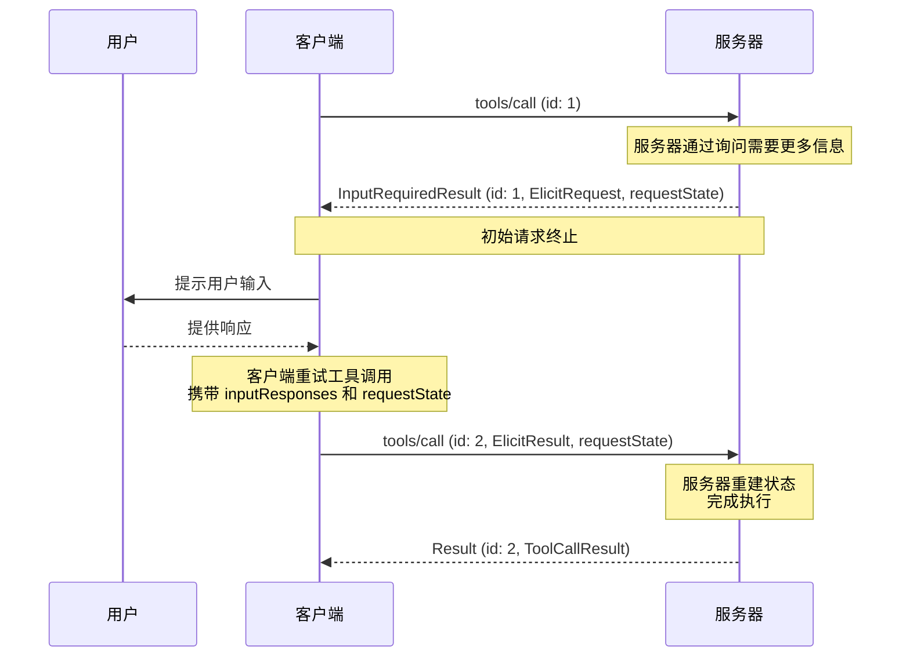

<div id="enable-section-numbers" />

<Note>
  多轮往返请求（MRTR）是在此版本的 MCP 规范中引入的。它取代了先前发送服务器发起请求的方法。服务器 **MUST** 使用 MRTR 模式发送服务器到客户端的请求（例如 `roots/list`、`sampling/createMessage` 或 `elicitation/create`）。先前的服务器发起请求模式已不再受支持。这是一个破坏性变更。
</Note>

<Note>
  为了简洁，本页中的请求示例省略了 `_meta` 请求元数据（`io.modelcontextprotocol/protocolVersion`、`io.modelcontextprotocol/clientInfo` 和 `io.modelcontextprotocol/clientCapabilities`）。每个请求 **MUST** 包含必需的 `_meta` 字段；请参见 [`_meta`](/specification/2026-07-28/basic/index#meta)。
</Note>

## 多轮往返请求

模型上下文协议（MCP）定义了几种方式，使服务器在处理客户端请求期间能够向用户请求额外信息
（例如
`roots/list`、`sampling/createMessage` 或 `elicitation/create`）。**多轮往返请求**模式
提供了一种标准化方式来处理这些服务器请求，而无需在
服务器实例之间共享存储层，或要求有状态负载均衡。

其高级流程如下：

1. 客户端向服务器发送一个初始请求，其中包含执行操作所需的参数。
1. 服务器确定完成该请求需要额外信息，并返回请求更多信息。
1. 客户端从用户或其他来源收集所请求的信息，然后重新尝试原始请求，并包含额外请求的信息。
1. 服务器确定其已有足够信息来完成该操作，并返回最终结果。



### 核心类型

此流程在 MCP 中使用以下类型实现。

#### InputRequests

一个 [`InputRequests`](/specification/2026-07-28/schema#inputrequests) 对象是服务器-客户端请求的映射。
键为服务器分配的字符串标识符；
值为请求对象（例如，[`ElicitRequest`](/specification/2026-07-28/schema#elicitrequest)、[`CreateMessageRequest`](/specification/2026-07-28/schema#createmessagerequest) 或 [`ListRootsRequest`](/specification/2026-07-28/schema#listrootsrequest)）。

```json
{
  "github_login": {
    "method": "elicitation/create",
    "params": {
      "mode": "form",
      "message": "请提供你的 GitHub 用户名",
      "requestedSchema": {
        "type": "object",
        "properties": {
          "name": { "type": "string" }
        },
        "required": ["name"]
      }
    }
  },
  "capital_of_france": {
    "method": "sampling/createMessage",
    "params": {
      "messages": [
        {
          "role": "user",
          "content": {
            "type": "text",
            "text": "法国的首都是什么？"
          }
        }
      ],
      "systemPrompt": "你是一个乐于助人的助手。",
      "maxTokens": 100
    }
  }
}
```

#### InputResponses

一个 [`InputResponses`](/specification/2026-07-28/schema#inputresponses) 对象是客户端对服务器请求的响应映射。
键与 `InputRequests` 映射中的键相对应；值为客户端针对每个请求的结果（例如，[`ElicitResult`](/specification/2026-07-28/schema#elicitresult)、[`CreateMessageResult`](/specification/2026-07-28/schema#createmessageresult) 或 [`ListRootsResult`](/specification/2026-07-28/schema#listrootsresult)）。

```json
{
  "github_login": {
    "action": "accept",
    "content": {
      "name": "octocat"
    }
  },
  "capital_of_france": {
    "role": "assistant",
    "content": {
      "type": "text",
      "text": "法国的首都是巴黎。"
    },
    "model": "claude-3-sonnet-20240307",
    "stopReason": "endTurn"
  }
}
```

#### InputRequiredResult

一个 [`InputRequiredResult`](/specification/2026-07-28/schema#inputrequiredresult) 是 [`Result`](/specification/2026-07-28/basic#responses) 的一种类型，
表示在请求完成之前还需要额外输入。

- `inputRequests` _(可选)_: 一个 [`InputRequests`](/specification/2026-07-28/schema#inputrequests) 映射，包含服务器发起、客户端必须完成的请求。
- `requestState` _(可选)_: 仅对服务器有意义的不透明字符串。客户端 **不得** 检查、解析、修改或对其内容做任何假设。

```json
{
  "jsonrpc": "2.0",
  "id": 1,
  "result": {
    "resultType": "input_required",
    "inputRequests": {
      // 询问请求。
      "github_login": {
        "method": "elicitation/create",
        "params": {
          "mode": "form",
          "message": "请提供你的 GitHub 用户名",
          "requestedSchema": {
            "type": "object",
            "properties": {
              "name": { "type": "string" }
            },
            "required": ["name"]
          }
        }
      },
      // 采样请求。
      "capital_of_france": {
        "method": "sampling/createMessage",
        "params": {
          "messages": [
            {
              "role": "user",
              "content": {
                "type": "text",
                "text": "法国的首都是什么？"
              }
            }
          ],
          "modelPreferences": {
            "hints": [{ "name": "claude-3-sonnet" }],
            "intelligencePriority": 0.8,
            "speedPriority": 0.5
          },
          "systemPrompt": "你是一个乐于助人的助手。",
          "maxTokens": 100
        }
      }
    },
    "requestState": "AEAD-protected blob"
  }
}
```

### 支持的请求

服务器 **MAY** 在以下客户端请求上发送 `InputRequiredResult` 响应：

| 客户端请求                                                                    | 是否支持 InputRequiredResult |
| ----------------------------------------------------------------------------- | --------------------------- |
| [`prompts/get`](/specification/2026-07-28/server/prompts#getting-a-prompt)    | 是                          |
| [`resources/read`](/specification/2026-07-28/server/resources#reading-resources) | 是                        |
| [`tools/call`](/specification/2026-07-28/server/tools#calling-tools)          | 是                          |

服务器 **MUST NOT** 在任何其他客户端请求上发送 `InputRequiredResult` 响应。

### 基本工作流

基本工作流描述了服务器如何作为客户端-服务器请求的一部分，向客户端请求额外输入。
在这个示例中，我们使用 `tools/call` 作为客户端请求，但同样的模式也适用于上面列出的任何受支持请求。

值得注意的是，它允许服务器在不维护任何服务器端状态的情况下请求额外信息。
服务器将所需的任何上下文编码到 `requestState` 字段中，客户端会在重试时将其原样回传。



请注意，每一步中的请求都是完全独立的：服务器处理重试时，不需要除重试请求中直接包含的信息之外的任何信息。

#### 服务器要求（基本工作流）

1. 服务器 **MAY** 对任何[受支持的客户端请求](#supported-requests)返回 `InputRequiredResult`。
1. `InputRequiredResult` **MAY** 包含 `inputRequests` 字段。
   - `inputRequests` 的键是由服务器分配的标识符，并且在该请求的作用域内 **MUST** 唯一。
   - `inputRequests` 的值是请求对象，并且 **MUST** 是 [`ElicitRequest`](/specification/2026-07-28/schema#elicitrequest)、[`CreateMessageRequest`](/specification/2026-07-28/schema#createmessagerequest) 或 [`ListRootsRequest`](/specification/2026-07-28/schema#listrootsrequest) 之一

1. `InputRequiredResult` **MAY** 包含 `requestState` 字段。如果指定，该字段是一个不透明字符串，仅对服务器有意义。服务器可以自由地以任何格式编码该状态（例如 base64 编码的 JSON、加密的 JWT、序列化的二进制）。
1. 如果客户端请求包含 `requestState` 字段，服务器 **MUST** 将 `requestState` 视为由攻击者控制的输入。如果 `requestState` 会影响授权、资源访问或业务逻辑，服务器 **MUST** 保护其完整性（例如 HMAC 或 AEAD）
   并且 **MUST** 拒绝验证失败的状态。仅当篡改造成的后果不会比请求失败更严重时，才 **MAY** 省略完整性保护。
1. 为了防止重放，服务器 **SHOULD** 在受完整性保护的 `requestState` 载荷中包含以下内容，并在收到时逐一验证：
   - 已认证的主体，拒绝由不同主体提交的状态。
   - 较短的过期时间（TTL），拒绝在其失效后提交的状态；
   - 原始请求的标识符，例如方法名及其关键参数的摘要，拒绝用于不匹配请求的状态。
     <Warning>
       请注意，这些措施限制了重放窗口并防止跨用户
       以及跨请求复用，但本身并不能保证一次性使用。
       对于某个 `requestState` 必须最多只被消费一次的服务器
       （例如一次性兑换），**MUST** 在服务器端强制执行该不变量。
     </Warning>

1. 服务器在每个 `InputRequiredResult` 响应中 **MUST** 至少包含 `inputRequests` 或 `requestState` 之一。
1. 服务器 **MUST NOT** 发送客户端未在其能力中声明支持的 `inputRequests`。例如，如果客户端未声明支持 `elicitation`，服务器 **MUST NOT** 在 `inputRequests` 字段中包含任何 `elicitation/create` 请求。
1. 服务器 **MUST NOT** 假设客户端会完成这些 `inputRequests` 或重试原始请求。如果服务器希望反复提示用户提供信息，直到获得完成请求所需的信息，服务器 **MAY** 在同一请求的多次尝试中返回 `InputRequiredResult`。

#### 客户端要求（基本工作流）

1. 如果客户端收到包含 `inputRequests` 字段的 `InputRequiredResult`，在重试原始请求之前，客户端 **MUST** 构造所请求的输入。如果 `InputRequiredResult` 不包含 `inputRequests` 字段，客户端 **MAY** 立即重试原始请求。
1. 如果 `InputRequiredResult` 包含 `requestState` 字段，客户端在重试原始请求时 **MUST** 原样回显该字段的精确值。
   客户端 **MUST NOT** 检查、解析、修改或对 `requestState` 的内容做任何假设。如果 `InputRequiredResult` 不包含 `requestState` 字段，客户端 **MUST NOT** 在重试中包含该字段。
1. JSON-RPC 的 `id` 在初始请求与重试之间 **MUST** 不同，因为它们是独立的请求。
1. `inputRequests` 和 `requestState` 字段都只影响客户端对原始请求的重试。它们 **MUST NOT** 用于客户端可能并行发送的任何其他请求。

### 错误处理

服务器 **应当** 验证客户端提供的数据是一个有效的 `InputResponses` 对象，并且其中的信息可以被正确解析。
协议错误（格式错误的 JSON、无效的 schema、内部服务器错误）**应当**返回带有适当错误代码和消息的 JSON-RPC 错误响应。

如果在 `InputResponses` 对象中提供了额外的、意料之外的参数，服务器 **应当** 忽略任何其无法识别或不需要的信息。

如果客户端未能发送先前某个 `InputRequests` 中请求的全部信息，并且缺失的信息对于服务器处理该请求是必要的，
服务器 **应当** 重新返回一个新的 `InputRequiredResult` 来请求缺失的信息，而不是返回错误。

### 安全注意事项

由于 `requestState` 会通过客户端传递，恶意或已被入侵的客户端可能会尝试修改它，以改变服务器行为、绕过授权检查或破坏服务器逻辑。服务器**必须**按照上方 [服务器要求](#server-requirements-basic-workflow) 中所述验证请求状态。
