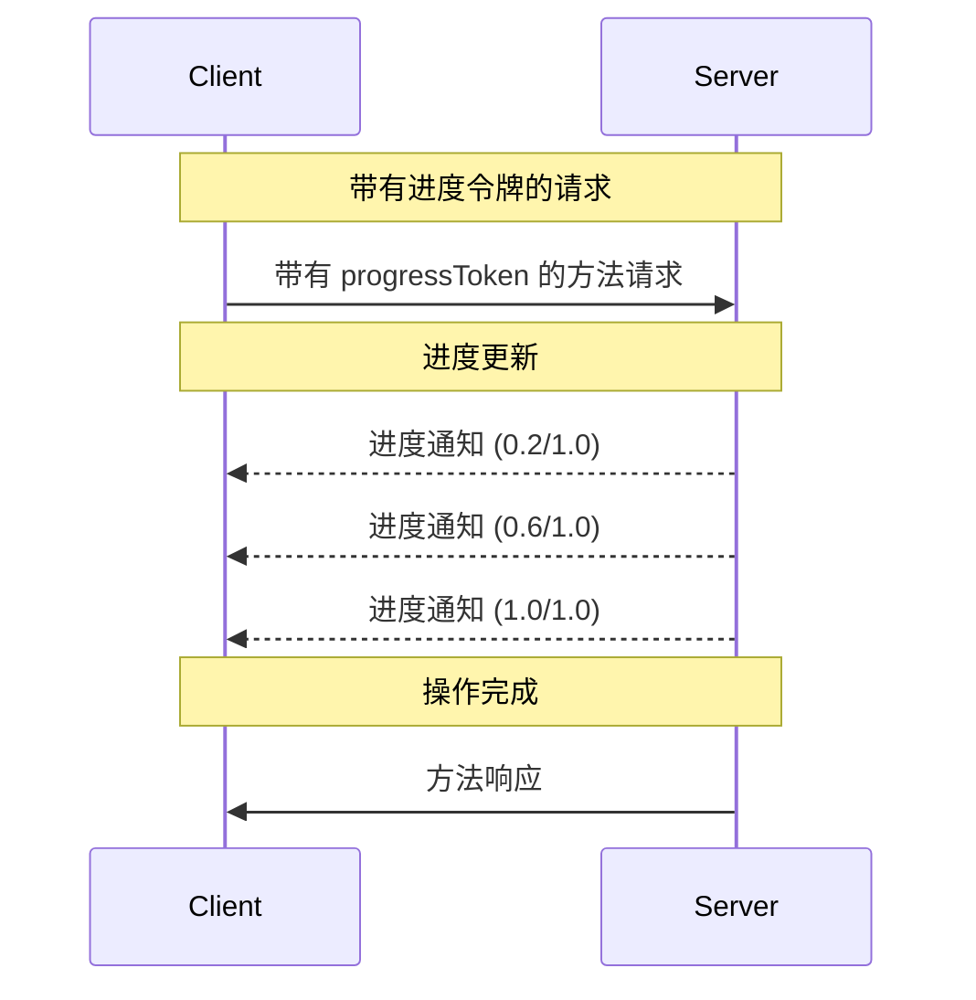

<div id="enable-section-numbers" />

模型上下文协议（MCP）支持通过通知消息对长时间运行的操作进行可选的进度跟踪。服务器**可以**发送进度通知，以报告客户端所发出请求的状态。

## 进度流程

当客户端希望为某个请求_接收_进度更新时，它会在请求元数据中包含一个
`progressToken`。

- 进度 token **MUST** 是字符串或整数值
- 客户端可以通过任何方式选择进度 token，但它们在所有活动请求中**MUST**是唯一的。

```json
{
  "jsonrpc": "2.0",
  "id": 1,
  "method": "some_method",
  "params": {
    "_meta": {
      "progressToken": "abc123"
    }
  }
}
```

然后服务器**MAY**发送包含以下内容的进度通知：

- 原始进度 token
- 到目前为止的当前进度值
- 一个可选的“总计”值
- 一个可选的“消息”值

```json
{
  "jsonrpc": "2.0",
  "method": "notifications/progress",
  "params": {
    "progressToken": "abc123",
    "progress": 50,
    "total": 100,
    "message": "Reticulating splines..."
  }
}
```

- `progress` 值**MUST**随每次通知递增，即使总量未知也是如此。
- `progress` 和 `total` 值**MAY**是浮点数。
- `message` 字段**SHOULD**提供相关、可供人类阅读的进度信息。

## 行为要求

1. 进度通知 **必须** 仅引用以下令牌：
   - 在活动请求中提供的
   - 与进行中的操作相关联的

2. 接收到带有进度令牌的请求的服务器 **可以**：
   - 选择不发送任何进度通知
   - 以其认为合适的任意频率发送通知
   - 如果总值未知，可以省略总值



## 实现说明

- 客户端和服务器 **SHOULD** 跟踪活动的进度令牌
- 双方 **SHOULD** 实现速率限制以防止泛洪
- 进度通知在完成后 **MUST** 停止
