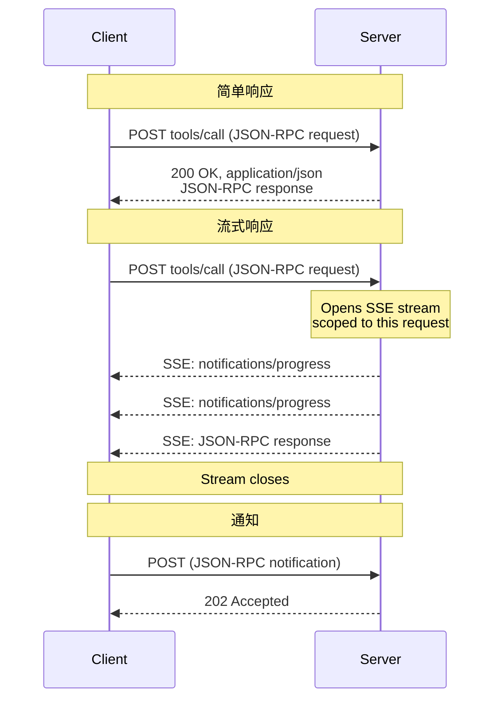
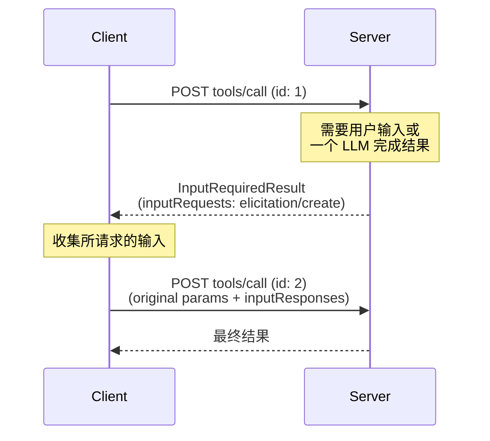
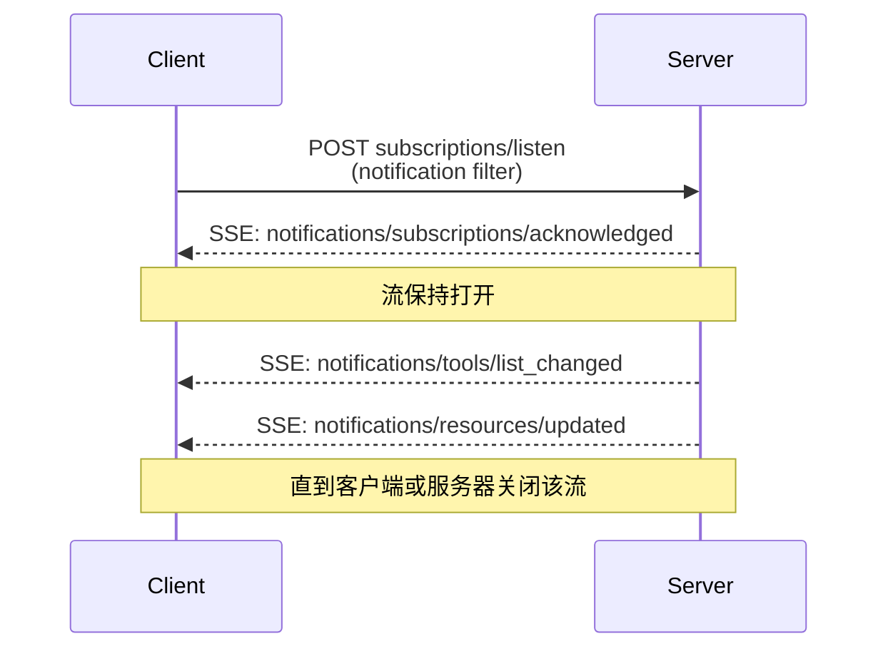

<div id="enable-section-numbers" />

<Info>

Streamable HTTP 在 2025-03-26 协议版本中引入，作为 2024-11-05 协议版本中 [HTTP+SSE 传输][http-sse] 的替代方案。

</Info>

<Info>

2026-07-28 版本修订更改了 Streamable HTTP 的行为。客户端必须确保正确处理向后兼容性。更改包括：

- 移除了 GET 流端点。
- 移除了协议级会话。

请参见下面的 [变更日志](/specification/2026-07-28/changelog) 和
[向后兼容性](#backward-compatibility)。

</Info>

在 **Streamable HTTP** 传输中，服务器作为一个独立进程运行，可以处理多个客户端连接。概览如下：

- 服务器暴露单个 HTTP 端点（**MCP 端点**），并接受 POST。
- 客户端将每个 JSON-RPC 请求或通知作为各自独立的 HTTP POST 发送。
- 服务器对每个请求的响应要么是单个 JSON 对象，要么是一个仅针对该请求范围的 [Server-Sent Events][sse]（SSE）流，其中包含与请求相关的通知，随后是最终响应。
- 服务器到客户端的交互（采样、询问、roots）会作为输入请求嵌入结果中，遵循 [多轮往返请求（MRTR）][mrtr]（[SEP-2322][sep-2322]）。
- 长生命周期的变更通知（例如列表变更和资源更新）会通过 [`subscriptions/listen`][subscriptions-listen] 请求的响应流传递。

有关这些交互的时序图，请参见 [消息流](#message-flow)。

服务器 **MUST** 提供一个支持 POST 的单一 HTTP 端点路径（下文称为 **MCP 端点**）。例如，这可以是一个类似 `https://example.com/mcp` 的 URL。

[http-sse]: /specification/2024-11-05/basic/transports#http-with-sse
[sse]: https://en.wikipedia.org/wiki/Server-sent_events

## 安全与端点

在实现 Streamable HTTP 传输时：

1. 服务器 **必须** 在所有传入连接上验证 `Origin` 标头
   以防止 DNS 重绑定攻击。
   - 如果 `Origin` 标头存在且无效，服务器 **必须** 响应
     HTTP 403 Forbidden。HTTP 响应正文 **可以** 包含一个
     不含 `id` 的 JSON-RPC _错误响应_。
2. 在本地运行时，服务器 **应当** 仅绑定到 localhost
   （127.0.0.1），而不是所有网络接口（0.0.0.0）。
3. 服务器 **应当** 为所有连接实现适当的身份验证。

如果没有这些保护，攻击者可能会利用 DNS 重绑定，
从远程网站与本地 MCP 服务器交互。

## 发送消息

客户端发送的每个 JSON-RPC 消息**必须**是一个新的 HTTP POST
请求，发送到 MCP 端点。

1. 客户端**必须**使用 HTTP POST 发送 JSON-RPC 消息。
2. 客户端**必须**包含一个 `Accept` 请求头，其中同时列出
   `application/json` 和 `text/event-stream` 作为受支持的内容类型。
3. 客户端**必须**在每个 POST 请求中包含[请求元数据头](#request-metadata)
   。
4. HTTP POST 的请求体**必须**是单个 JSON-RPC _请求_ 或
   _通知_。客户端**不得**发送 JSON-RPC _响应_。
5. 如果请求体是 JSON-RPC _通知_：
   - 如果服务器接受它，服务器**必须**返回 HTTP 状态码
     `202 Accepted`，且没有响应体。
   - 如果服务器无法接受它，**必须**返回一个 HTTP 错误状态码
     （例如，`400 Bad Request`）。HTTP 响应体**可以**包含一个没有 `id` 的 JSON-RPC _错误响应_。
6. 如果请求体是 JSON-RPC _请求_，服务器**必须**返回以下任一内容：
   `Content-Type: application/json`（单个 JSON 对象）或
   `Content-Type: text/event-stream`（SSE 响应流）。客户端
   **必须**同时支持这两种形式。

<Note>

此核心协议修订版未定义通过 Streamable HTTP 从客户端到服务器的
_notifications_。核心协议中唯一由客户端发送的通知 `notifications/cancelled`
仅用于 [stdio](/specification/2026-07-28/basic/transports/stdio) 传输；在
Streamable HTTP 上，关闭 SSE 响应流本身就是取消信号，并且不期望
`notifications/cancelled` 消息（见
[Cancellation][cancellation]）。上面的通知规则描述的是通知 POST 的传输机制；本修订版未定义通知 POST 的请求头要求。

</Note>

## 接收消息

当服务器返回 SSE 响应流时
（`Content-Type: text/event-stream`）：

- 服务器 **MAY** 发送 JSON-RPC _notifications_ — 例如，
  [`notifications/progress`][notifications-progress]
  或 [`notifications/message`][notifications-message] —
  但必须在最终响应之前发送。这些通知 **MUST** 与
  发起该通知的客户端请求相关。
- 服务器 **MUST NOT** 在此流上发送独立的 JSON-RPC _requests_。
  服务器到客户端的交互（sampling、elicitation、list-roots）会
  作为输入请求嵌入到
  [`InputRequiredResult`][input-required-result] 中，
  并遵循 [MRTR][mrtr]（[SEP-2322][sep-2322]），
  而不是作为单独请求发送到此流或任何其他流中。
  这与协议版本 `2025-03-26` 到 `2025-11-25` 中的 Streamable HTTP
  不同，在这些版本里，服务器可以在 SSE 流上发送此类请求。
- 最终的 JSON-RPC _response_ **SHOULD** 终止该流。

通过发送
[`subscriptions/listen`][subscriptions-listen]
请求可获得长生命周期的通知流。服务器的响应本身就是一个 SSE 流，
该流保持打开，并传递客户端选择接收的变更通知（例如
`notifications/tools/list_changed` 或 `notifications/resources/updated`）。
像 `notifications/progress` 和
`notifications/message` 这类按请求范围限定的通知 **不会** 在 listen 流上发送 —
它们只会出现在与其相关的请求的响应流中。

在初始化 SSE 流时，服务器 **SHOULD** 在 HTTP 响应中包含
`X-Accel-Buffering: no` 头部。这会指示反向代理（例如 nginx）禁用响应缓冲，
从而确保 SSE 事件会立即传递给客户端，而不是被保留在缓冲区中。
如果没有这个头部，代理可能会在发送给客户端之前累积消息，
从而引入不必要的延迟，并且可能破坏 SSE 通信的实时特性。

<Note>

对于长生命周期流——尤其是
[`subscriptions/listen`][subscriptions-listen] 响应流——建议服务器
定期发送一行 SSE 注释（即以冒号开头的一行，例如 `:\r\n`）作为保活信号。
这可以防止在静默期间没有通知流动时，连接被中间设备或客户端空闲超时关闭。
根据 [SSE 规范][sse]，任何以冒号开头的行都是不携带事件数据的注释；
客户端必须忽略此类行，并且不得将其视为格式错误的输入。

</Note>

不支持通过 `Last-Event-ID` 恢复的 SSE 流。

[notifications-progress]: /specification/2026-07-28/basic/patterns/progress
[notifications-message]: /specification/2026-07-28/server/utilities/logging
[input-required-result]: /specification/2026-07-28/schema#inputrequiredresult
[mrtr]: /specification/2026-07-28/basic/patterns/mrtr
[sep-2322]: /seps/2322-MRTR
[subscriptions-listen]: /specification/2026-07-28/basic/patterns/subscriptions

## 消息流

以下图示展示了单个 MCP 端点上的消息流。

**请求与响应。** 每个请求都是独立的 POST；服务器会针对每个请求选择返回单个 JSON 对象还是 SSE 流：



**服务器到客户端交互（MRTR）。** 当服务器需要来自客户端的输入——采样、征询或根信息时，它不会发送自己的 JSON-RPC 请求。它会返回一个包含 `inputRequests` 的 [`InputRequiredResult`][input-required-result]，然后客户端使用匹配的 `inputResponses` 重试原始请求（参见 [多轮往返请求][mrtr]）：



**变更通知。** 想要接收服务器发起的变更通知的客户端，会使用 [`subscriptions/listen`][subscriptions-listen] 打开一个长连接流；响应流会保持打开状态，并且只承载客户端选择订阅的通知类型：



## 取消

关闭 SSE 响应流**必须**被服务器视为该请求的取消。由于每个请求都有其自己的响应流，因此传输层级的断开连接是明确无歧义的。服务器**应该**尽快停止对已取消请求的工作，并且**不得**再为其发送任何进一步的消息。完整规则请参见
[取消][cancellation]。

[cancellation]: /specification/2026-07-28/basic/patterns/cancellation

## 请求元数据

Streamable HTTP 传输会将选定的 JSON-RPC 正文字段镜像到 HTTP
头中，以便中间件（负载均衡器、网关、可观测性
工具）无需解析正文即可路由和检查请求。

### 协议版本头

每个发送到 MCP 端点的 POST 请求**必须**包含一个
`MCP-Protocol-Version` 头。

例如：`MCP-Protocol-Version: 2026-07-28`

该头的值**必须**与请求体 `_meta` 中携带的
`io.modelcontextprotocol/protocolVersion` 字段匹配。如果这些值不匹配，服务器**必须**拒绝该请求，
返回 `400 Bad Request` 和一个 `HeaderMismatch` JSON-RPC 错误
（参见 [服务器验证](#server-validation)）。

如果服务器未实现请求的协议版本（无论该版本对服务器来说是未知版本，还是服务器已知但选择不支持的版本），它**必须**返回 `400 Bad Request`，并返回一个
[`UnsupportedProtocolVersionError`][unsupported-version]，其中列出其支持的版本。有关协商流程，请参见
[版本控制：协议版本协商][lifecycle-version]。

如果服务器未实现请求的 RPC 方法，它**必须**返回
`404 Not Found` 和一个代码为 `-32601`
（`Method not found`）的 JSON-RPC 错误。该 JSON-RPC 错误主体将此情况与由不承载现代 MCP 端点的旧版 [HTTP+SSE][http-sse] 服务器返回的 `404` 区分开来（参见 [向后兼容性](#backward-compatibility)）。

支持实现早于 `2025-06-18` 协议版本客户端的服务器（这些版本未定义 `MCP-Protocol-Version` 头）**可以**
将省略该头的请求视为协议版本 `2025-03-26`。不支持此类客户端的服务器**必须**根据 [服务器验证](#server-validation) 拒绝不带该头的请求。

[unsupported-version]: /specification/2026-07-28/schema#unsupportedprotocolversionerror
[lifecycle-version]: /specification/2026-07-28/basic/versioning#protocol-version-negotiation

### 标准请求头

| 标头名称      | 源字段                       | 适用于                                                |
| ------------ | ----------------------------- | ------------------------------------------------------ |
| `Mcp-Method` | `method`                      | 所有请求                                               |
| `Mcp-Name`   | `params.name` or `params.uri` | `tools/call`、`resources/read`、`prompts/get` 请求 |

这些标头对于符合规范是**必需的**。

如果 `Mcp-Name` 的源值无法安全地表示为普通 ASCII
标头值，客户端**必须**使用 [值编码](#value-encoding) 中描述的 Base64 哨兵格式对其进行编码。

**`tools/call` 请求：**

```http
POST /mcp HTTP/1.1
Content-Type: application/json
MCP-Protocol-Version: 2026-07-28
Mcp-Method: tools/call
Mcp-Name: get_weather

{
  "jsonrpc": "2.0",
  "id": 1,
  "method": "tools/call",
  "params": {
    "name": "get_weather",
    "arguments": {
      "location": "Seattle, WA"
    },
    "_meta": {
      "io.modelcontextprotocol/protocolVersion": "2026-07-28",
      "io.modelcontextprotocol/clientInfo": {
        "name": "ExampleClient",
        "version": "1.0.0"
      },
      "io.modelcontextprotocol/clientCapabilities": {}
    }
  }
}
```

**`resources/read` 请求：**

```http
POST /mcp HTTP/1.1
Content-Type: application/json
MCP-Protocol-Version: 2026-07-28
Mcp-Method: resources/read
Mcp-Name: file:///projects/myapp/config.json

{
  "jsonrpc": "2.0",
  "id": 2,
  "method": "resources/read",
  "params": {
    "uri": "file:///projects/myapp/config.json",
    "_meta": {
      "io.modelcontextprotocol/protocolVersion": "2026-07-28",
      "io.modelcontextprotocol/clientInfo": {
        "name": "ExampleClient",
        "version": "1.0.0"
      },
      "io.modelcontextprotocol/clientCapabilities": {}
    }
  }
}
```

### 来自工具参数的自定义头

MCP 服务器 **MAY** 指定特定的工具参数，通过在工具 `inputSchema` 中该参数的 schema 里使用 `x-mcp-header` 扩展属性，将其映射到
HTTP 头中。有关如何为工具参数添加注解的详细信息，请参见
[工具定义][tool-definitions]。

虽然服务器使用 `x-mcp-header` 是可选的，但客户端 **MUST**
支持此功能。当服务器的工具定义包含 `x-mcp-header` 注解时，符合规范的客户端 **MUST** 将
指定的参数值映射到 HTTP 头中。

[tool-definitions]: /specification/2026-07-28/server/tools#x-mcp-header

#### Schema 扩展

`x-mcp-header` 属性指定用于构造头名称 `Mcp-Param-{name}` 的名称部分。

**`x-mcp-header` 值的约束**：

- **MUST NOT** 为空
- **MUST** 匹配 HTTP field-name token 语法（`1*tchar`，[RFC 9110 第 5.1 节](https://datatracker.ietf.org/doc/html/rfc9110#section-5.1)）
- **MUST NOT** 包含控制字符，包括回车符（CR，`\r`）
  或换行符（LF，`\n`）
- 在 `inputSchema` 中所有 `x-mcp-header` 值之间，**MUST** 以不区分大小写的方式保持唯一
- **MUST** 仅应用于原始类型（integer、string、boolean）的参数。不允许 type 为 `number`。整数值 **MUST** 位于 JavaScript 的安全范围内
  （−2<sup>53</sup>+1 到 2<sup>53</sup>−1）
- **MUST** 仅应用于从 schema 根节点 _静态可达_ 的属性：只能通过仅由
  `properties` 键组成的链路到达。该链路 **MUST NOT** 穿过 `items`（或任何
  其他数组关键字）、组合关键字（`oneOf`、`anyOf`、`allOf`、`not`）、条件关键字（`if`/`then`/`else`）或 `$ref`。只要链路中的每一步都是 `properties` 键，就允许嵌套对象属性。任何其他位置出现的 `x-mcp-header` 注解都会使该
  注解——从而使工具定义——无效。

头部提取的定义是：读取被注解属性的精确
属性路径（即通向该属性的 `properties` 键链）上的实例值。如果调用参数中该路径上没有值，
则省略该头。

使用 Streamable HTTP 传输的客户端 **MUST** 拒绝任何存在
违反这些约束的 `x-mcp-header` 值的工具定义。拒绝意味着客户端 **MUST** 将无效工具从 `tools/list` 的结果中排除。客户端 **SHOULD** 在拒绝工具定义时记录警告，包括
工具名称和拒绝原因。这可确保单个格式错误的工具定义不会阻止其他有效工具被使用。
使用其他传输方式（例如 stdio）的客户端 **MAY** 完全忽略 `x-mcp-header`
注解。

**工具定义示例：**

```json
{
  "name": "execute_sql",
  "description": "在 Google Cloud Spanner 上执行 SQL",
  "inputSchema": {
    "type": "object",
    "properties": {
      "region": {
        "type": "string",
        "description": "执行查询的区域",
        "x-mcp-header": "Region"
      },
      "query": {
        "type": "string",
        "description": "要执行的 SQL 查询"
      }
    },
    "required": ["region", "query"]
  }
}
```

**生成的 HTTP 请求：**

```http
POST /mcp HTTP/1.1
Content-Type: application/json
MCP-Protocol-Version: 2026-07-28
Mcp-Method: tools/call
Mcp-Name: execute_sql
Mcp-Param-Region: us-west1

{
  "jsonrpc": "2.0",
  "id": 1,
  "method": "tools/call",
  "params": {
    "_meta": {
      "io.modelcontextprotocol/protocolVersion": "2026-07-28",
      "io.modelcontextprotocol/clientInfo": {
        "name": "ExampleClient",
        "version": "1.0.0"
      },
      "io.modelcontextprotocol/clientCapabilities": {}
    },
    "name": "execute_sql",
    "arguments": {
      "region": "us-west1",
      "query": "SELECT * FROM users"
    }
  }
}
```

#### 值编码

客户端 **MUST** 在将参数值包含到 HTTP
头之前对其进行编码，以确保安全传输并防止注入攻击。

**类型转换**：将参数值转换为其字符串表示形式：

- `string`：按原样使用该值
- `integer`：转换为十进制字符串表示形式（例如，`42`、`-7`）
- `boolean`：转换为小写 `"true"` 或 `"false"`

根据 [RFC 9110][rfc9110-values]，
HTTP 头字段值必须由可见 ASCII 字符
（0x21-0x7E）、空格（0x20）和水平制表符（0x09）组成。当某个值不能
安全地表示为普通 ASCII 头值时（例如，它包含
非 ASCII 字符、控制字符，或存在首尾空白），客户端 **MUST** 使用 UTF-8
表示的 Base64 编码，格式如下：

```text
Mcp-Param-{Name}: =?base64?{Base64EncodedValue}?=
```

相同的编码规则也适用于 `Mcp-Name` 头值。工具和
prompt 名称仅在头安全字符上受到 **SHOULD** 级约束，因此超出安全集的名称（或资源 URI）应按如下方式携带：

```text
Mcp-Name: =?base64?{Base64EncodedValue}?=
```

前缀 `=?base64?` 和后缀 `?=` 表示该值已进行
Base64 编码。这些标记区分大小写，且 **MUST** 按所示
形式精确出现（小写）。需要检查这些值的服务器和中间件 **MUST**
相应地对其解码。特别是，在
[服务器验证](#server-validation)期间，服务器 **MUST**
在将编码后的 `Mcp-Name` 或 `Mcp-Param-{Name}` 值与相应请求体值进行比较之前对其解码。

为避免歧义，客户端 **MUST** 还要对任何匹配哨兵模式（即以 `=?base64?`
开头并以 `?=` 结尾）的纯 ASCII 值进行 Base64 编码。

**编码示例：**

| 原始值                 | 原因                     | 编码后的头值                                         |
| ---------------------- | ------------------------ | ----------------------------------------------------- |
| `"us-west1"`           | 纯 ASCII                 | `Mcp-Param-Region: us-west1`                          |
| `"Hello, 世界"`        | 包含非 ASCII             | `Mcp-Param-Greeting: =?base64?SGVsbG8sIOS4lueVjA==?=` |
| `" padded "`           | 首尾有空格               | `Mcp-Param-Text: =?base64?IHBhZGRlZCA=?=`             |
| `"line1\nline2"`       | 包含换行符               | `Mcp-Param-Text: =?base64?bGluZTEKbGluZTI=?=`         |
| `"=?base64?literal?="` | 匹配哨兵模式             | `Mcp-Param-Val: =?base64?PT9iYXNlNjQ/bGl0ZXJhbD89?=`  |

[rfc9110-values]: https://datatracker.ietf.org/doc/html/rfc9110#name-field-values

#### 客户端行为

当通过 HTTP 传输构建 `tools/call` 请求时，客户端
**MUST**：

1. 从请求体中提取任何标准头的值（例如，
   `method`、`params.name`、`params.uri`）。
2. 将 `Mcp-Method` 头以及（如适用）`Mcp-Name` 头附加到
   请求中。
3. 检查工具的 `inputSchema` 中带有
   `x-mcp-header` 标记的属性，并提取每个已注解属性精确
   属性路径上的值；如果没有值，则省略该头（见
   [Schema 扩展](#schema-extension)）。
4. 按照 [值编码](#value-encoding) 规则对这些值进行编码。
5. 将 `Mcp-Param-{Name}: {Value}` 头附加到请求中。

如果服务器因必需的 `Mcp-Param-*` 头缺失或与请求体不匹配而返回
[`HeaderMismatch`](#server-validation) 错误，客户端
**SHOULD** 调用 `tools/list` 以检查工具
`inputSchema` 是否有变更，然后使用相应的头重试原始请求。

#### 自定义头的服务器行为

不识别 `Mcp-Param-{Name}` 头的中间服务器
**MUST** 按照 [HTTP 语义 RFC][http-semantics] 的要求转发该头并忽略其内容。

服务器 **MUST** 拒绝包含无效字符的、被识别的 `Mcp-Param-{Name}` 头（见
[值编码](#value-encoding)）。

任何处理消息体的服务器 **MUST** 验证已编码
的头值（若为 Base64 编码，则在解码后）与请求体中的相应值一致。若任何验证失败，服务器 **MUST** 以
`400 Bad Request` HTTP 状态和 JSON-RPC 错误码
`-32020`（`HeaderMismatch`）拒绝请求。

| 场景                             | 客户端行为                  | 服务器行为                              |
| -------------------------------- | --------------------------- | --------------------------------------- |
| 提供了参数值                   | 客户端 MUST 包含该头        | 服务器 MUST 验证头与请求体一致          |
| 参数值为 `null`                | 客户端 MUST 省略该头        | 服务器 MUST NOT 期待该头                |
| 参数不在参数列表中             | 客户端 MUST 省略该头        | 服务器 MUST NOT 期待该头                |
| 客户端省略了头但值存在于请求体中 | 不符合规范的客户端          | 服务器 MUST 拒绝该请求                  |

[http-semantics]: https://www.rfc-editor.org/rfc/rfc9110.html#name-field-names

### 大小写敏感性

标头名称（在
[RFC 9110][rfc9110-names] 中称为“字段名称”）
是不区分大小写的。客户端和服务器 **MUST** 对标头名称使用不区分大小写的
比较。标头 _值_（例如方法名称）
是区分大小写的。

[rfc9110-names]: https://datatracker.ietf.org/doc/html/rfc9110#name-field-names

### 服务器验证

处理请求体的服务器**必须**拒绝那些头部中指定的值与请求体中对应值不匹配的请求。这可以防止网络中不同组件依赖不同“事实来源”时产生潜在的安全漏洞（例如，负载均衡器根据头部值进行路由，而 MCP 服务器根据请求体值执行）。

<Note>

在验证整数参数值时，服务器**应当**以数值而不是字符串来比较头部值和请求体值（例如，`42.0` 和 `42` 被视为相等）。

</Note>

当由于头部验证失败而拒绝请求时，服务器**必须**返回 HTTP 状态 `400 Bad Request`，并且**必须**使用以下错误代码包含一个 JSON-RPC 错误响应：

| Code     | Name                                                                     | Description                                                                                                            |
| -------- | ------------------------------------------------------------------------ | ---------------------------------------------------------------------------------------------------------------------- |
| `-32020` | [`HeaderMismatch`](/specification/2026-07-28/schema#headermismatcherror) | HTTP 头部与请求体中的对应值不匹配，或者必需的头部缺失/格式错误。 |

此错误代码分配自 MCP 规范为协议定义错误保留的子范围。参见
[错误代码](/specification/2026-07-28/basic/index#error-codes)。

**错误响应示例：**

```json
{
  "jsonrpc": "2.0",
  "id": 1,
  "error": {
    "code": -32020,
    "message": "Header mismatch: Mcp-Name header value 'foo' does not match body value 'bar'"
  }
}
```

验证失败条件包括：

- 缺少必需的标准头部（`MCP-Protocol-Version`、`Mcp-Method`、
  `Mcp-Name`）。
- 头部值与对应的请求体值不匹配。对于允许 Base64 哨兵编码的头部（`Mcp-Name` 和
  `Mcp-Param-{Name}`），服务器**必须**在将编码值与请求体值进行比较之前先对其进行解码（参见
  [值编码](#value-encoding)）。
- 头部值包含无效字符。

<Note>

中介层**必须**在验证失败时返回适当的 HTTP 错误状态（例如，
`400 Bad Request`），但不要求返回 JSON-RPC 错误响应。

</Note>

<Note>

基于镜像头部执行策略的中介层（例如，按租户进行路由
或速率限制）**应当**验证 `MCP-Protocol-Version`
头部所指示的版本是否要求进行头部—请求体验证。如果版本较旧或头部缺失，中介层**应当**拒绝该请求，而不是信任未经验证的头部值。

</Note>

## 向后兼容性

同时支持现代（按请求元数据）MCP 版本和需要 `initialize` 握手的旧版的客户端，**MAY** 通过先尝试一次现代请求来检测服务器实现的是哪个时代。遇到 `400 Bad Request` 时，客户端在回退之前 **SHOULD** 检查响应体：现代服务器对于
[`UnsupportedProtocolVersionError`][unsupported-version]、`MissingRequiredClientCapabilityError` 以及头部校验失败也会使用 `400`。

- 如果响应体包含可识别的现代 JSON-RPC 错误，则说明服务器使用的是现代版本的 MCP —— 应使用所声明的 `supported` 版本重试，或修正请求，而不是回退。
- 如果响应体为空，或者不属于可识别的现代 JSON-RPC 错误，则回退到 `initialize`，并在后续请求中继续使用旧版。

有关时代模型和实现者兼容性矩阵，请参见 [版本管理：向后兼容性][lifecycle-compat]。

### 更早的 Streamable HTTP 修订版

协议版本 `2025-03-26` 到 [`2025-11-25`](/specification/2025-11-25/basic/transports) 也使用了 Streamable HTTP 传输，但形式不同：服务器可以通过 `Mcp-Session-Id` 头部分配会话（通过 HTTP DELETE 终止），客户端可以通过 HTTP GET 打开独立的 SSE 流来接收服务器发起的消息，服务器可以在 SSE 流上发送 JSON-RPC _请求_，并且流可以通过 `Last-Event-ID` 恢复。这些机制都不属于本修订版。

仅支持本修订版并收到来自旧客户端此类流量的服务器 **SHOULD** 如下响应：

- 对 MCP 端点发出的 HTTP GET 或 DELETE：返回 `405 Method Not Allowed`。
- 请求中的 `Mcp-Session-Id` 头部：忽略它，不要生成或回显会话 ID。
- `Last-Event-ID` 头部：忽略它；流不可恢复。

需要与支持这些协议版本的对端互操作的服务器和客户端，除上述版本协商回退之外，还应实现相应修订版中描述的行为（例如，
[2025-11-25: Streamable HTTP](/specification/2025-11-25/basic/transports#streamable-http)）。

### HTTP+SSE 传输（2024-11-05）

<Warning>
  **已弃用**：协议版本 2024-11-05 的 [HTTP+SSE 传输][http-sse] 自协议版本
  `2025-03-26` 起已被弃用，并在 [功能生命周期
  政策](/community/feature-lifecycle#deprecating-a-feature)
  （[SEP-2596](https://github.com/modelcontextprotocol/modelcontextprotocol/pull/2596)）中被归类为已弃用。
  新实现 **SHOULD NOT** 采用它；现有实现 **SHOULD** 迁移到 [Streamable
  HTTP](/specification/2026-07-28/basic/transports/streamable-http)。它可能会在未来的修订版中被移除；请参见 [已弃用功能登记册](/specification/2026-07-28/deprecated)。
</Warning>

客户端和服务器可以按如下方式与已弃用的 [HTTP+SSE 传输][http-sse]（来自
协议版本 2024-11-05）保持向后兼容：

**服务器** 若想支持旧客户端，应：

- 继续同时托管旧传输的 SSE 端点和 POST 端点，以及为 Streamable HTTP 传输定义的新“MCP 端点”。
  - 也可以将旧的 POST 端点与新的 MCP 端点合并，但这可能会引入不必要的复杂性。

**客户端** 若想支持旧服务器，应：

1. 接受用户提供的 MCP 服务器 URL，该 URL 可能指向使用旧传输或新传输的服务器。
2. 尝试向服务器 URL 发送 POST 请求，并带上上文定义的 `Accept` 头部：
   - 如果成功，客户端可以假定这是支持新 Streamable HTTP 传输的服务器。
   - 如果请求以 HTTP 状态码 `400 Bad Request`、`404 Not Found` 或 `405 Method Not Allowed` 失败，**并且**响应体不是可识别的现代 JSON-RPC 错误（现代服务器会针对不支持的版本、未知方法或头部校验失败返回此类错误）：
     - 向服务器 URL 发出 GET 请求，预期这会打开一个 SSE 流，并将 `endpoint` 事件作为第一个事件返回。
     - 当 `endpoint` 事件到达时，客户端可以假定这是运行旧 HTTP+SSE 传输的服务器，并应在后续所有通信中使用该传输。

[lifecycle-compat]: /specification/2026-07-28/basic/versioning#backward-compatibility-with-initialization-based-versions
