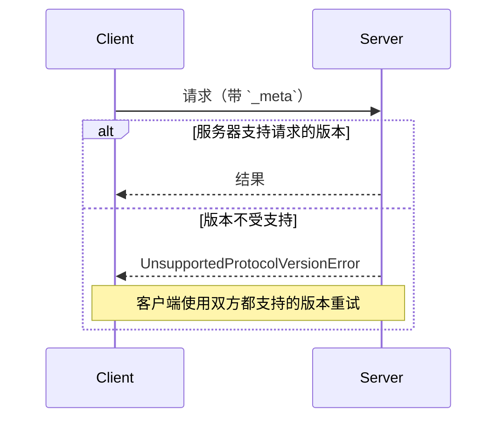

<div id="enable-section-numbers" />

本页定义了客户端和服务器如何就它们所使用的内容达成一致：
协议版本，在每个请求中声明；可选扩展，
通过能力进行协商；以及与早期、
基于握手的协议修订版本的互操作性。

没有协商握手。每个请求都携带其协议
版本，服务器会独立地接受或拒绝每个请求：



## 术语

本页使用以下术语，以便在不同协议修订版之间实现互操作性：

- **现代**：按每次请求的元数据传递版本、身份和能力的协议版本（修订版 `2026-07-28` 及之后）。
- **传统**：通过 `initialize` 握手建立会话的协议版本（`2025-11-25` 及之前）。
- **双时代**：同时支持现代和传统版本的实现。

## 协议版本协商

每个请求都会在其
[`_meta`](/specification/2026-07-28/basic/index#meta) 字段中声明它正在使用的协议版本。在 HTTP 上，这一版本也会通过
[`MCP-Protocol-Version` header](/specification/2026-07-28/basic/transports/streamable-http#protocol-version-header)
传递。

如果服务器不实现所请求的版本（无论该版本对服务器来说是未知的，还是服务器已知但选择不支持的版本），它 **MUST** 返回一个
[`UnsupportedProtocolVersionError`](/specification/2026-07-28/schema#unsupportedprotocolversionerror)
，并列出它所支持的版本：

```json
{
  "jsonrpc": "2.0",
  "id": 1,
  "error": {
    "code": -32022,
    "message": "不支持的协议版本",
    "data": {
      "supported": ["2026-07-28", "2025-11-25"],
      "requested": "1900-01-01"
    }
  }
}
```

客户端 **SHOULD** 从 `supported` 列表中选择一个双方都支持的版本并重试该请求；如果不存在兼容版本，则应向用户显示错误。

服务器 **MUST** 实现
[`server/discover`](/specification/2026-07-28/server/discover)。客户端
**MAY** 在发送任何其他请求之前调用它，以便提前了解服务器支持的版本，但这不是必需的：客户端可以直接发起任何 RPC，并在其首选版本不受支持时处理 `UnsupportedProtocolVersionError`。

## 扩展协商

客户端和服务器可以就超出核心协议之外的可选[扩展](/docs/extensions/overview)支持进行协商。扩展在能力的 `extensions` 字段中进行声明，该字段是一个从扩展标识符到各扩展设置对象的映射。扩展标识符**必须**遵循[`_meta` 键命名规则](/specification/2026-07-28/basic/index#meta)，并带有强制前缀。

以下是一个客户端的示例，它声明支持标识为 `io.modelcontextprotocol/ui` 的[MCP Apps 扩展](/extensions/apps/overview)：

```json
{
  "capabilities": {
    "roots": {},
    "extensions": {
      "io.modelcontextprotocol/ui": {
        "mimeTypes": ["text/html;profile=mcp-app"]
      }
    }
  }
}
```

以下是一个标识为 `io.modelcontextprotocol/tasks` 的[Tasks 扩展](/extensions/tasks/overview)示例：

```json
{
  "capabilities": {
    "tools": {},
    "extensions": {
      "io.modelcontextprotocol/tasks": {}
    }
  }
}
```

每个扩展都指定其设置对象的 schema；空对象表示支持该扩展，但不包含任何额外设置。

如果一方支持某个扩展而另一方不支持，则支持该扩展的一方**必须**回退到核心协议行为，或使用适当的错误拒绝该请求。扩展**应该**文档化其预期的回退行为。

## 向后兼容基于初始化的版本

希望同时支持 [旧版](#terminology) 客户端（期望 `initialize` 握手）和 [现代](#terminology) 客户端（使用按请求元数据）的服务器 **MAY** 实现这两种行为。

需要与这两类服务器互操作的客户端，会通过绑定页面中指定的、与传输相关的机制来检测服务器所属的时代：

- [stdio](/specification/2026-07-28/basic/transports/stdio#backward-compatibility)：
  使用 `server/discover` 探测，并在任何未被识别为现代错误的错误上回退。
- [Streamable HTTP](/specification/2026-07-28/basic/transports/streamable-http#backward-compatibility)：
  尝试一次现代请求，并在回退前检查 `400 Bad Request` 的响应体。

在这两种情况下，被识别的现代 JSON-RPC 错误（例如
[`UnsupportedProtocolVersionError`](/specification/2026-07-28/schema#unsupportedprotocolversionerror)）
表明服务器是现代的：客户端会改用受支持的版本重试，而不是回退。其他任何情况都表明服务器是旧版的。

时代判定是服务器的属性，而不是某个单独请求的属性。客户端 **SHOULD** 在服务器进程生命周期内（stdio）或来源（HTTP）缓存该结果，并且 **MAY** 在同一服务器配置重启后继续持久化该结果；如果后续缓存假设失效，则应重新探测。

只支持 [现代](#terminology) 版本的服务器，在对任何传输上的 `initialize` 请求返回的任何错误中，**SHOULD** 指明其支持的协议版本：旧版客户端没有前向回退机制，而这条消息可能是它们能够向用户展示的唯一诊断信息。

### 兼容性矩阵

下表总结了客户端和服务器时代每种组合的预期结果：

| 客户端   | 服务器   | 结果                                                                                                                                                                                                                                                                                                                                                                                                                                                                                                                                     |
| -------- | -------- | ------------------------------------------------------------------------------------------------------------------------------------------------------------------------------------------------------------------------------------------------------------------------------------------------------------------------------------------------------------------------------------------------------------------------------------------------------------------------------------------------------------------------------------------- |
| 现代     | 现代     | 正常工作。`server/discover` 是可选的；版本不匹配会表现为 `UnsupportedProtocolVersionError`，客户端会重试一个双方都支持的版本。                                                                                                                                                                                                                                                                                                                                                                             |
| 现代     | 旧版     | 失败。服务器可能以实现定义的错误拒绝请求、保持静默，甚至按照旧版语义处理一个时代不明确的方法。在 stdio 上，客户端 **SHOULD** 先发送 `server/discover` 以确定性地失败；随后客户端向用户展示一个可操作的错误。                                                                                                                                                                                                                                                                                                  |
| 双时代   | 现代     | 正常工作。stdio 探测返回 `DiscoverResult`（或 `UnsupportedProtocolVersionError`）；在 HTTP 上，第一次现代请求成功或返回现代错误。客户端保持现代模式。                                                                                                                                                                                                                                                                                                                                                    |
| 双时代   | 旧版     | 正常工作。stdio：探测返回一个非现代错误或超时，客户端回退到 `initialize`。HTTP：现代请求返回一个不带被识别现代错误体的 `4xx`，客户端回退到 `initialize`（并且可能进一步回退到已弃用的 HTTP+SSE 传输）。                                                                                                                                                                                                                                         |
| 旧版     | 现代     | 失败。stdio：服务器以 JSON-RPC 错误拒绝 `initialize`；具体错误码由实现定义（`initialize` 是未知方法，而且该请求还缺少必需的 `_meta` 字段）。HTTP：请求缺少必需的请求头，并依据 [server validation](/specification/2026-07-28/basic/transports/streamable-http#server-validation) 被拒绝，返回 `400 Bad Request`（位于已弃用 HTTP+SSE 传输上的客户端则会在其打开的 `GET` 处失败）。旧版客户端没有前向回退机制。 |
| 旧版     | 双时代   | 正常工作。服务器响应 `initialize`，并按照协商得到的旧版修订版本为客户端提供服务。                                                                                                                                                                                                                                                                                                                                                                                                                                   |
| 旧版     | 旧版     | 按旧版修订版本正常工作；超出本文档范围。                                                                                                                                                                                                                                                                                                                                                                                                                                                                     |

双时代 **服务器** 会根据客户端的打开方式来选择行为：

- 携带现代按请求 `_meta` 的请求会以无状态方式按本修订版本提供服务。
- `initialize` 请求会选择旧版语义，其作用域限定为 stdio 进程（stdio）或会话（HTTP），具体取决于协商得到的旧版协议版本。

双时代服务器 **MAY** 在同一端点或进程上同时提供这两个时代的服务。
