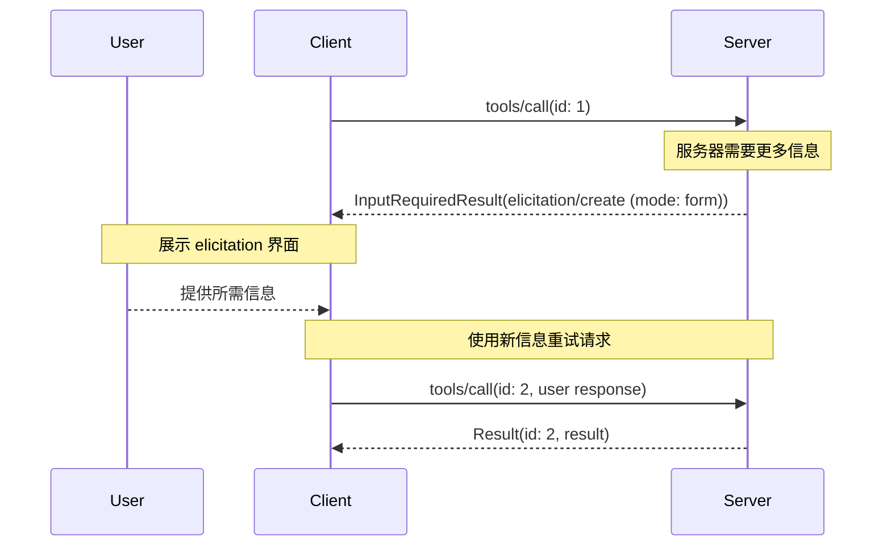
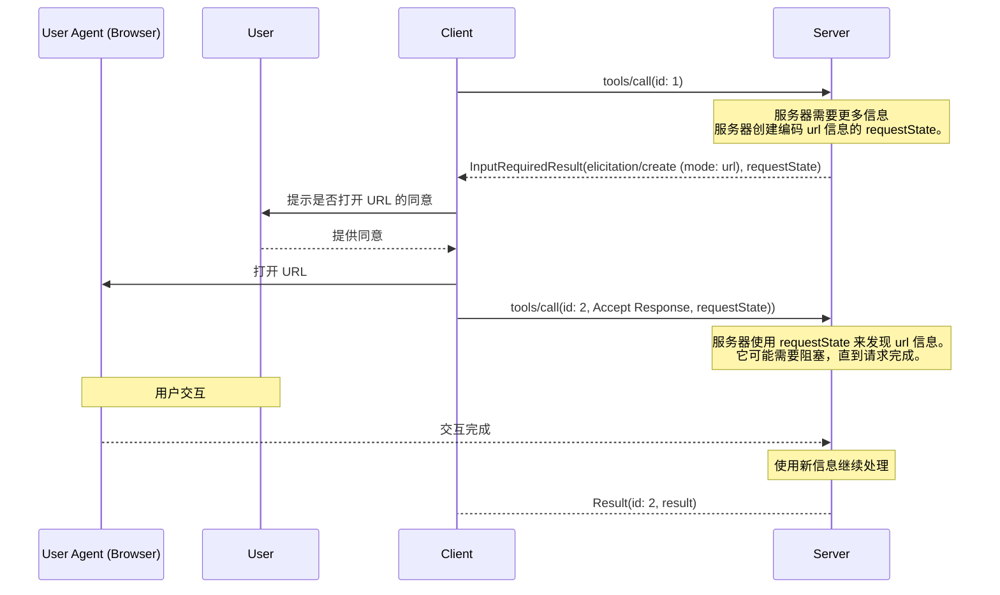
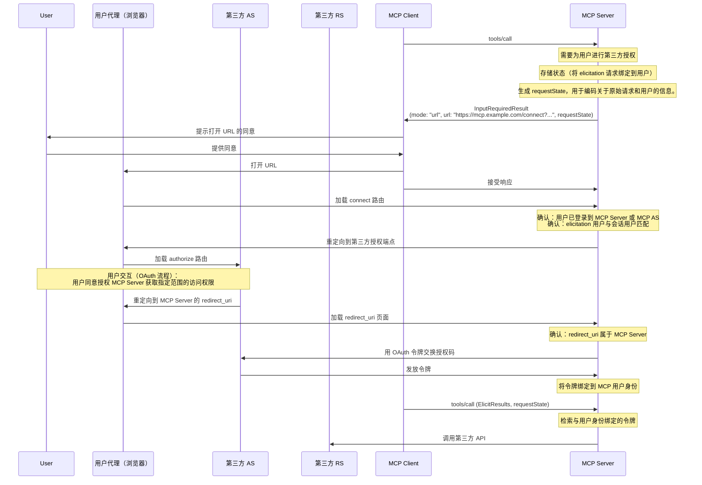

<div id="enable-section-numbers" />

模型上下文协议（MCP）为服务器提供了一种标准化方式，可在交互过程中通过客户端向用户请求额外信息。此流程使客户端能够在保持对用户交互和数据共享控制的同时，让服务器动态收集所需信息。

引导获取支持两种模式：

- **表单模式**：服务器可以向用户请求结构化数据，并可选使用 JSON schema 来验证响应
- **URL 模式**：服务器可以将用户引导至外部 URL 进行敏感交互，此类交互必须 _不能_ 通过 MCP 客户端传递

## 用户交互模型

MCP 中的询问功能允许服务器通过使用户输入请求嵌套在其他 MCP 服务器功能中，来实现交互式工作流。

实现可以自由通过任何适合其需求的接口模式来暴露询问功能——协议本身并不强制规定任何特定的用户交互模型。

<Warning>

出于信任与安全以及安全性考虑：

- 服务器 **不得** 使用表单模式询问来请求敏感信息，例如
  密码、API 密钥、访问令牌或支付凭证
- 服务器 **必须** 对涉及此类敏感信息的交互使用 [URL 模式](#url-mode-elicitation-requests)

此处的“敏感信息”是指会授予访问权限或授权交易的机密和凭证。一般的联系信息或个人资料信息（例如姓名、电子邮件地址或用户名）并非一概禁止；是否通过表单模式请求此类数据由服务器自行决定，并且受限于用户查看和拒绝的能力。

MCP 客户端 **必须**：

- 提供清晰表明是哪个服务器正在请求信息的界面
- 尊重用户隐私，并提供清晰的拒绝和取消选项
- 对于表单模式，允许用户在发送前审查并修改其响应
- 对于 URL 模式，在导航到目标 URL 之前，清楚显示目标域名/主机并获取用户同意

</Warning>

## 能力

支持引导获取（elicitation）的客户端 **必须** 在每个请求中的 `_meta.io.modelcontextprotocol/clientCapabilities` 里声明 `elicitation` 能力：

```json
{
  "_meta": {
    "io.modelcontextprotocol/clientCapabilities": {
      "elicitation": {
        "form": {},
        "url": {}
      }
    }
  }
}
```

为保持向后兼容，空的能力对象等同于仅声明支持 `form` 模式：

```jsonc
{
  "_meta": {
    "io.modelcontextprotocol/clientCapabilities": {
      "elicitation": {}, // 等同于 { "form": {} }
    },
  },
}
```

声明了 `elicitation` 能力的客户端 **必须** 至少支持一种模式（`form` 或 `url`）。

服务器 **不得** 发送使用客户端不支持的模式的引导获取请求。

## 协议消息

### 询问请求

服务器在处理客户端请求期间，**可以**通过发送一个包含 `elicitation/create` 请求的 [`InputRequiredResult`](/specification/2026-07-28/basic/patterns/mrtr#inputrequiredresult) 来向用户请求信息。

所有询问请求**必须**包含以下参数：

| 名称      | 类型   | 选项          | 描述                                                                                 |
| --------- | ------ | ------------- | ------------------------------------------------------------------------------------ |
| `mode`    | string | `form`, `url` | 询问模式。对于表单模式为可选（若省略，默认为 `"form"`）。                              |
| `message` | string |               | 一条人类可读的消息，用于解释为何需要进行交互。                                         |

`mode` 参数指定询问的类型：

- `"form"`：通过带内的结构化数据收集，并可选进行模式校验。数据会暴露给客户端。
- `"url"`：通过 URL 导航进行带外交互。数据（URL 本身除外）**不会**暴露给客户端。

为了向后兼容，服务器**可以**在表单模式询问请求中省略 `mode` 字段。客户端**必须**将没有 `mode` 字段的请求视为表单模式。

### 表单模式询问请求

表单模式询问允许服务器通过 MCP 客户端直接收集结构化数据。

表单模式询问请求**必须**指定 `mode: "form"` 或省略 `mode` 字段，并包含以下附加参数：

| 名称              | 类型   | 描述                                                         |
| ----------------- | ------ | ------------------------------------------------------------ |
| `requestedSchema` | object | 一个定义预期响应结构的 JSON Schema。                           |

#### 请求的 Schema

`requestedSchema` 参数允许服务器使用 JSON Schema 的受限子集来定义预期响应的结构。

为简化客户端用户体验，表单模式询问的 schema 限制为仅包含原始属性的扁平对象。

该 schema 仅支持以下原始类型：

1. **字符串 Schema**

   ```json
   {
     "type": "string",
     "title": "显示名称",
     "description": "描述文本",
     "minLength": 3,
     "maxLength": 50,
     "format": "email",
     "default": "user@example.com"
   }
   ```

   支持的格式：`email`、`uri`、`date`、`date-time`

2. **数值 Schema**

   ```json
   {
     "type": "number", // 或 "integer"
     "title": "显示名称",
     "description": "描述文本",
     "minimum": 0,
     "maximum": 100,
     "default": 50
   }
   ```

3. **布尔 Schema**

   ```json
   {
     "type": "boolean",
     "title": "显示名称",
     "description": "描述文本",
     "default": false
   }
   ```

4. **枚举 Schema**

   单选枚举（无标题）：

   ```json
   {
     "type": "string",
     "title": "颜色选择",
     "description": "选择你最喜欢的颜色",
     "enum": ["Red", "Green", "Blue"],
     "default": "Red"
   }
   ```

   单选枚举（带标题）：

   ```json
   {
     "type": "string",
     "title": "颜色选择",
     "description": "选择你最喜欢的颜色",
     "oneOf": [
       { "const": "#FF0000", "title": "红色" },
       { "const": "#00FF00", "title": "绿色" },
       { "const": "#0000FF", "title": "蓝色" }
     ],
     "default": "#FF0000"
   }
   ```

   多选枚举（无标题）：

   ```json
   {
     "type": "array",
     "title": "颜色选择",
     "description": "选择你最喜欢的颜色",
     "minItems": 1,
     "maxItems": 2,
     "items": {
       "type": "string",
       "enum": ["Red", "Green", "Blue"]
     },
     "default": ["Red", "Green"]
   }
   ```

   多选枚举（带标题）：

   ```json
   {
     "type": "array",
     "title": "颜色选择",
     "description": "选择你最喜欢的颜色",
     "minItems": 1,
     "maxItems": 2,
     "items": {
       "anyOf": [
         { "const": "#FF0000", "title": "红色" },
         { "const": "#00FF00", "title": "绿色" },
         { "const": "#0000FF", "title": "蓝色" }
       ]
     },
     "default": ["#FF0000", "#00FF00"]
   }
   ```

客户端可以使用此 schema 来：

1. 生成合适的输入表单
2. 在发送前校验用户输入
3. 为用户提供更好的引导

所有原始类型都支持可选的默认值，以提供合理的初始值。支持默认值的客户端**应当**预填充表单字段。

请注意，复杂的嵌套结构、对象数组（超出枚举的范围）以及其他高级 JSON Schema 特性都被有意不支持，以简化客户端用户体验。

#### 示例：简单文本请求

**输入请求（在 [`InputRequiredResult.inputRequests`](/specification/2026-07-28/basic/patterns/mrtr#inputrequests) 中传递）：**

```json
{
  "method": "elicitation/create",
  "params": {
    "mode": "form",
    "message": "请提供你的 GitHub 用户名",
    "requestedSchema": {
      "type": "object",
      "properties": {
        "name": {
          "type": "string"
        }
      },
      "required": ["name"]
    }
  }
}
```

**客户端结果（在重试请求时返回于 `inputResponses` 中）：**

```json
{
  "action": "accept",
  "content": {
    "name": "octocat"
  }
}
```

#### 示例：结构化数据请求

**输入请求（在 `InputRequiredResult.inputRequests` 中传递）：**

```json
{
  "method": "elicitation/create",
  "params": {
    "mode": "form",
    "message": "请提供你的联系信息",
    "requestedSchema": {
      "type": "object",
      "properties": {
        "name": {
          "type": "string",
          "description": "你的全名"
        },
        "email": {
          "type": "string",
          "format": "email",
          "description": "你的电子邮件地址"
        },
        "age": {
          "type": "number",
          "minimum": 18,
          "description": "你的年龄"
        }
      },
      "required": ["name", "email"]
    }
  }
}
```

**客户端结果（在重试请求时返回于 `inputResponses` 中）：**

```json
{
  "action": "accept",
  "content": {
    "name": "Monalisa Octocat",
    "email": "octocat@github.com",
    "age": 30
  }
}
```

### URL 模式询问请求

<Note>

**新功能：** URL 模式询问在 MCP 规范的 `2025-11-25` 版本中引入。其设计和实现可能会在未来的协议修订中发生变化。

</Note>

URL 模式询问使服务器能够将用户引导到外部 URL，以进行不得通过 MCP 客户端传递的带外交互。这对于身份验证流程、支付处理以及其他敏感或安全操作至关重要。

URL 模式询问请求**必须**指定 `mode: "url"`、`message`，并包含以下附加参数：

| 名称  | 类型   | 描述                         |
| ----- | ------ | ---------------------------- |
| `url` | string | 用户应导航到的 URL。          |

`url` 参数**必须**包含一个有效的 URL。

<Note>
  **重要**：URL 模式询问并不是用于授权 MCP 客户端访问 MCP 服务器（这由 [MCP
  authorization](../basic/authorization) 负责）。相反，它用于当 MCP 服务器需要代表用户获取敏感信息或第三方授权时。MCP 客户端的 bearer token 保持不变。客户端唯一的职责是向用户提供关于服务器希望其打开的询问 URL 的上下文说明。
</Note>

#### 示例：请求敏感数据

此示例展示了一个 URL 模式询问请求，它将用户引导至一个安全 URL，以便用户提供敏感信息（例如 API 密钥）。
同一个请求也可以将用户引导至 OAuth 授权流程或支付流程。唯一的区别是 URL 和消息。

**输入请求（在 `InputRequiredResult.inputRequests` 中传递）：**

```json
{
  "method": "elicitation/create",
  "params": {
    "mode": "url",
    "url": "https://mcp.example.com/ui/set_api_key",
    "message": "请提供你的 API 密钥以继续。"
  }
}
```

**客户端结果（在重试请求时返回于 `inputResponses` 中）：**

```json
{
  "action": "accept"
}
```

`action: "accept"` 的响应表示用户已同意进行交互。这并不意味着交互已经完成。交互发生在带外，客户端不会直接获知其结果。当客户端重试原始请求时，服务器会根据回显的 `requestState`（或其自身保存的状态）确定带外交互是否已完成，并返回最终结果或再次响应一个 `InputRequiredResult`。客户端**应当**提供手动控制，让用户重试或取消原始请求（或以其他方式恢复与客户端的交互）。

## 消息流

### 表单模式流程



### URL 模式流程



## 响应动作

诱导响应使用三动作模型，以清晰区分不同的用户操作。这些动作同时适用于表单和 URL 诱导模式。

```json
{
  "action": "accept", // 或 "decline" 或 "cancel"
  "content": {
    "propertyName": "value",
    "anotherProperty": 42
  }
}
```

三种响应动作如下：

1. **接受**（`action: "accept"`）：用户明确批准并提交了数据
   - 对于表单模式：`content` 字段包含与所请求 schema 匹配的已提交数据
   - 对于 URL 模式：省略 `content` 字段
   - 示例：用户点击“提交”、“确定”、“确认”等

2. **拒绝**（`action: "decline"`）：用户明确拒绝了请求
   - 通常省略 `content` 字段
   - 示例：用户点击“拒绝”、“否”等

3. **取消**（`action: "cancel"`）：用户未作出明确选择就关闭了
   - 通常省略 `content` 字段
   - 示例：用户关闭对话框、点击外部区域、按下 Escape、浏览器加载失败等

服务器应当适当地处理每种状态：

- **接受**：处理已提交的数据
- **拒绝**：处理明确拒绝（例如，提供替代方案）
- **取消**：处理关闭（例如，稍后再次提示）

## 实现考虑事项

### 状态性

通过 [多轮往返请求](/specification/2026-07-28/basic/patterns/mrtr#multi-round-trip-requests) 机制，Elicitation 不要求服务器维护关于用户的状态。

然而，如果存储了状态，实现 elicitation 的服务器 **MUST** 按照 [安全最佳实践](/docs/2026-07-28/tutorials/security/security_best_practices) 文档中的指南，将该状态与单个用户安全地关联。具体来说：

- 状态存储 **MUST** 受到防止未授权访问的保护
- 对于远程 MCP 服务器，在可能的情况下，用户标识 **MUST** 从通过 [MCP 授权](../basic/authorization) 获取的凭据中派生（例如 `sub` 声明）

<Note>
  本节中的示例不具规范性，仅用于说明 elicitation 的潜在用途。
  实现者应根据其具体需求调整这些模式，同时保持安全最佳实践。
</Note>

### 敏感数据的 URL 模式 Elicitation

对于需要敏感信息（例如凭据、支付信息）并与外部 API 交互的服务器，URL 模式 elicitation 为用户提供此类信息提供了一种安全机制，而不会将其暴露给 MCP 客户端。

在这种模式下：

1. 服务器将用户引导到一个安全网页（通过 HTTPS 提供）
2. 该页面在用户信任的域名上呈现一个品牌化表单 UI
3. 用户直接在安全表单中输入敏感凭据
4. 服务器安全地存储凭据，并与用户身份绑定
5. 后续的 MCP 请求使用这些已存储的凭据进行 API 访问

这种方法确保敏感凭据不会经过 LLM 上下文、MCP 客户端或任何中间 MCP 服务器，从而降低因客户端日志记录或其他攻击向量导致泄露的风险。

### OAuth 流程的 URL 模式 Elicitation

URL 模式 elicitation 支持一种模式，其中 MCP 服务器作为 OAuth 客户端与第三方资源服务器交互。
通过 URL 模式 elicitation 启用的外部 API 授权，与 [MCP 授权](../basic/authorization) 是分开的。MCP 服务器 **MUST NOT** 依赖 URL 模式 elicitation 来为其自身授权用户。

#### 理解这种区别

- **MCP 授权**：MCP 客户端与 MCP 服务器之间所需的 OAuth 流程（见 [授权规范](../basic/authorization)）
- **外部（第三方）授权**：MCP 服务器与第三方资源服务器之间的可选授权，通过 URL 模式 elicitation 发起

在外部授权中，服务器同时扮演两种角色：

- OAuth 资源服务器（面向 MCP 客户端）
- OAuth 客户端（面向第三方资源服务器）

示例场景：

- 一个 MCP 客户端连接到一个 MCP 服务器
- 该 MCP 服务器集成了各种不同的第三方服务
- 当 MCP 客户端调用一个需要访问第三方服务的工具时，MCP 服务器需要该服务的凭据

关键的安全要求是：

1. **第三方凭据 MUST NOT 经过 MCP 客户端传输**：客户端绝不能看到第三方凭据，以保护安全边界
2. **MCP 服务器 MUST NOT 将客户端的凭据用于第三方服务**：那将属于 [token 透传](/docs/2026-07-28/tutorials/security/security_best_practices#token-passthrough)，这是被禁止的
3. **用户 MUST 直接授权 MCP 服务器**：交互发生在 MCP 协议之外，不涉及 MCP 客户端
4. **MCP 服务器负责令牌**：MCP 服务器负责存储和管理通过 URL 模式 elicitation 获取的第三方令牌（换句话说，MCP 服务器必须具有状态性）。

通过 URL 模式 elicitation 获取的凭据，与 MCP 客户端使用的 MCP 服务器凭据是不同的。MCP 服务器 **MUST NOT** 将通过 URL 模式 elicitation 获取的凭据传输给 MCP 客户端。

<Note>
  有关更多背景，请参阅安全最佳实践文档中的 [token 透传
  部分](/docs/2026-07-28/tutorials/security/security_best_practices#token-passthrough)，以了解为什么 MCP 服务器不能
  充当透传代理。
</Note>

#### 实现模式

通过 URL 模式 elicitation 实现外部授权时：

1. MCP 服务器生成一个授权 URL，作为第三方服务的 OAuth 客户端
2. MCP 服务器存储内部状态，将 elicitation 请求与用户身份关联（绑定）
3. MCP 服务器向客户端发送一个 URL 模式 elicitation 请求，其中包含可启动授权流程的 URL，以及可选的 `requestState`，用于编码关于 elicitation 请求和用户的信息（如需要）
4. 用户直接与第三方授权服务器完成 OAuth 流程
5. 第三方授权服务器重定向回 MCP 服务器
6. MCP 服务器安全地存储第三方令牌，并与用户身份绑定
7. 未来的 MCP 请求可以利用这些已存储的令牌访问第三方资源服务器的 API

以下是不具规范性的示例，说明该模式如何实现：



这种模式在保持清晰安全边界的同时，使得与需要用户授权的第三方服务进行丰富集成成为可能。

## 错误处理

服务器**不应**假定征询请求总是会成功，并且**必须**处理用户拒绝或取消征询，或客户端未能处理请求的情况。

## 安全注意事项

1. 服务器 **MUST** 将询问请求绑定到客户端和用户身份
1. 客户端 **MUST** 清楚指示是哪台服务器正在请求信息
1. 客户端 **SHOULD** 实现用户批准控制
1. 客户端 **SHOULD** 允许用户随时拒绝询问请求
1. 客户端 **SHOULD** 以清楚显示所请求信息及其原因的方式呈现询问请求

### 安全的 URL 处理

请求询问的 MCP 服务器：

1. **MUST NOT** 在发送给客户端的 URL 询问请求中的 URL 里包含关于最终用户的敏感信息，包括凭据、个人可识别信息等。
2. **MUST NOT** 提供一个预先认证、可用于访问受保护资源的 URL，因为恶意客户端可能会利用该 URL 冒充用户。
3. **SHOULD NOT** 在表单模式询问请求的任何字段中包含意图可点击的 URL。
4. **SHOULD** 在非开发环境中使用 HTTPS URL。

这些服务器要求可确保客户端实现对于何时向用户展示 URL 有清晰规则，从而可以一致地应用下面的客户端侧规则。

实现 URL 模式询问的客户端 **MUST** 谨慎处理 URL，以防止用户在不知情的情况下点击恶意链接。

在处理 URL 模式询问请求时，MCP 客户端：

1. **MUST NOT** 自动预取 URL 或其任何元数据。
2. **MUST NOT** 未经用户明确同意就打开 URL。
3. **MUST** 在同意之前向用户完整展示 URL 以供检查。
4. **MUST** 以安全方式打开服务器提供的 URL，且不能让客户端或 LLM 检查内容或用户输入。
   例如，在 iOS 上，[SFSafariViewController](https://developer.apple.com/documentation/safariservices/sfsafariviewcontroller) 是合适的，但 [WkWebView](https://developer.apple.com/documentation/webkit/wkwebview) 不是。
5. **SHOULD** 高亮显示 URL 的域名，以减轻子域名欺骗。
6. **SHOULD** 对模糊/可疑的 URI（即包含 Punycode 的 URI）发出警告。
7. **SHOULD NOT** 将询问请求中的任何字段渲染为可点击链接，URL 询问请求中的 `url` 字段除外（并受上述限制约束）。

### 用户身份识别

服务器 **MUST NOT** 在未经服务器验证的情况下依赖客户端提供的用户身份信息，因为这可以被伪造。
相反，服务器 **SHOULD** 遵循 [安全最佳实践](/docs/2026-07-28/tutorials/security/security_best_practices)。

非规范性示例：

- 错误：将“I am joe@example.com”这样的用户输入视为权威信息
- 正确：依赖 [授权](../basic/authorization) 来识别用户

### 表单模式安全

1. 服务器 **MUST NOT** 通过表单模式请求敏感信息（密码、API 密钥等）
2. 客户端 **SHOULD** 根据提供的 schema 验证所有响应
3. 服务器 **SHOULD** 验证接收的数据是否与请求的 schema 匹配

#### 网络钓鱼

URL 模式询问会返回一个攻击者可用于发送给受害者的 URL。MCP 服务器 **MUST** 在接受信息之前验证打开该 URL 的用户身份。

通常，身份验证是通过利用 [MCP 授权服务器](../basic/authorization) 来识别用户，并在浏览器中通过会话 cookie 或等效机制完成的。

例如，URL 模式询问可用于执行 OAuth 流程，其中服务器充当另一个资源服务器的 OAuth 客户端。若无适当缓解，可能发生如下钓鱼攻击：

1. 连接到良性服务器的恶意用户（Alice）触发了一次询问请求
2. 良性服务器生成一个授权 URL，作为第三方授权服务器的 OAuth 客户端
3. Alice 的客户端显示该 URL 并请求同意
4. Alice 没有点击链接，而是诱使同一良性服务器上的受害用户（Bob）点击该链接
5. Bob 打开链接并完成授权，认为自己是在为与良性服务器的连接授权
6. 良性服务器收到来自第三方授权服务器的回调/重定向，并将其视为 Alice 的请求
7. 第三方服务器的令牌被绑定到 Alice 的会话和身份，而不是 Bob 的，从而导致账户接管

为防止此攻击，服务器 **MUST** 确保发起询问请求的用户（通过 MCP 客户端访问服务器的最终用户）与完成授权流程的用户是同一人。

实现这一点有许多方法，最佳方式取决于具体实现。

作为一个常见的、非规范性示例，设想 MCP 服务器可通过 Web 访问，并希望执行第三方授权码流程。
为防止钓鱼攻击，服务器会创建一个 URL 模式询问到 `https://mcp.example.com/connect?...`，而不是第三方授权端点。
这个“connect URL”必须确保打开页面的用户与生成该询问的用户是同一人。
例如，它会检查用户是否拥有有效的会话 cookie，以及该会话 cookie 是否属于用于生成 URL 模式询问的同一用户。
这可以通过将 MCP 服务器授权服务器中的权威主体（`sub` claim）与会话 cookie 中的主体进行比较来完成。
一旦该页面确认是同一用户，它就可以将用户发送到第三方授权服务器 `https://example.com/authorize?...`，在那里完成正常的 OAuth 流程。

在其他情况下，服务器可能无法通过 Web 访问，也可能无法使用会话 cookie 来识别用户。
在这种情况下，服务器必须使用不同的机制来识别打开询问 URL 的用户与生成该询问时的用户是同一人。

在所有实现中，服务器 **MUST** 确保用于确定用户身份的机制能够抵御攻击者修改询问 URL 的攻击。
