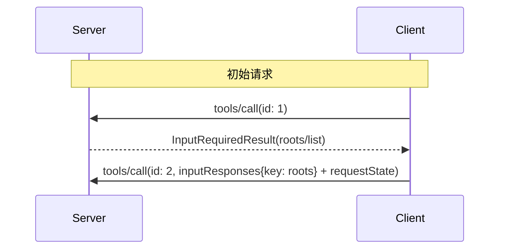

<div id="enable-section-numbers" />

<Warning>
  **已弃用**：Roots 功能自协议版本
  `2026-07-28`
  ([SEP-2577](https://github.com/modelcontextprotocol/modelcontextprotocol/pull/2577)) 起已弃用。
  根据[功能生命周期政策](/community/feature-lifecycle)，在本次修订发布后，它将在规范中至少保留十二个月，之后才有资格被移除。新的实现**不应**采用它；现有实现**应**迁移为通过工具参数、资源 URI 或服务器配置传递目录或文件。请参见
  [已弃用功能注册表](/specification/2026-07-28/deprecated)。
</Warning>

模型上下文协议（MCP）为客户端向服务器暴露文件系统“根目录”提供了一种标准化方式。Roots 会告知服务器客户端认为相关的目录和文件，以便服务器相应地专注其操作。它们是信息性指引，而不是访问控制机制。该协议不会强制服务器停留在 roots 范围内。服务器可以向支持的客户端请求 roots 列表。

## 用户交互模型

MCP 中的根通常通过工作区或项目配置界面进行暴露。

例如，某些实现可以提供工作区/项目选择器，允许用户选择服务器应有权访问的目录和文件。这可以与从版本控制系统或项目文件中自动检测工作区相结合。

不过，实现方可以通过任何适合其需求的界面模式来暴露根&mdash;协议本身并不强制要求任何特定的用户交互模型。

## 能力

支持 roots 的客户端**必须**在每个请求中的 `_meta.io.modelcontextprotocol/clientCapabilities` 里声明 `roots` 能力：

```json
{
  "_meta": {
    "io.modelcontextprotocol/clientCapabilities": {
      "roots": {}
    }
  }
}
```

## 协议消息

### 列出根目录

在处理客户端请求期间，为了检索根目录，服务器会发送一个包含 `roots/list` 请求的 `InputRequiredResult`：

**输入请求（作为 [`InputRequiredResult.inputRequests`](/specification/2026-07-28/basic/patterns/mrtr#inputrequests) 内部传递）：**

```json
{
  "method": "roots/list"
}
```

**客户端结果（在重试请求的 `inputResponses` 中返回）：**

```json
{
  "roots": [
    {
      "uri": "file:///home/user/projects/myproject",
      "name": "我的项目"
    }
  ]
}
```

## 消息流



## 数据类型

### 根

根定义包括：

- `uri`：根的唯一标识符。在当前规范中，这 **MUST** 是一个 `file://` URI。
- `name`：用于显示的可选人类可读名称。

不同使用场景的根示例：

#### 项目目录

```json
{
  "uri": "file:///home/user/projects/myproject",
  "name": "我的项目"
}
```

#### 多个仓库

```json
[
  {
    "uri": "file:///home/user/repos/frontend",
    "name": "前端仓库"
  },
  {
    "uri": "file:///home/user/repos/backend",
    "name": "后端仓库"
  }
]
```

## 错误处理

如果发生错误，客户端不需要使用错误消息重新发送初始调用，
因为服务器并不在等待采用 `InputRequiredResult` 模式的响应。

## 安全注意事项

1. 客户端 **MUST**：
   - 仅公开具有适当权限的根目录
   - 验证所有根 URI 以防止路径遍历
   - 实施适当的访问控制
   - 监控根目录可访问性

2. 服务器 **SHOULD**：
   - 处理根目录变为不可用的情况
   - 在操作期间遵守根目录边界
   - 根据提供的根目录验证所有路径

## 实现指南

1. 客户端 **SHOULD**：
   - 在向服务器公开根之前提示用户同意
   - 为根管理提供清晰的用户界面
   - 在公开之前验证根的可访问性
   - 监控根的变化

2. 服务器 **SHOULD**：
   - 在使用前检查 roots 能力
   - 在操作中尊重根边界
   - 适当地缓存根信息
