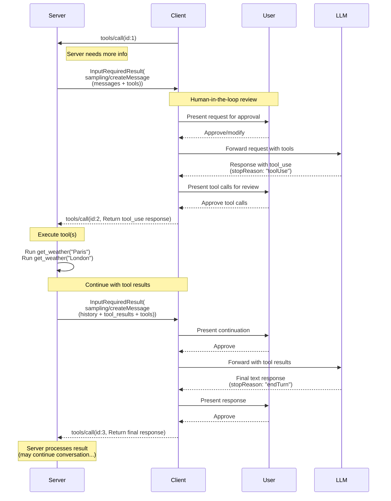
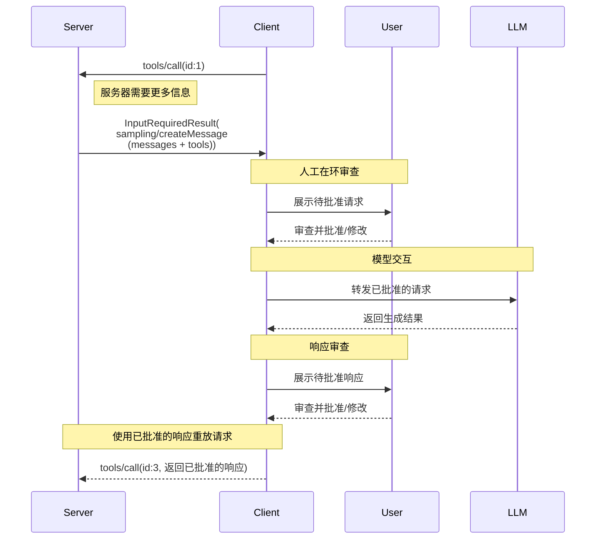

<div id="enable-section-numbers" />

<Warning>
  **已弃用**：采样功能自协议版本
  `2026-07-28`
  ([SEP-2577](https://github.com/modelcontextprotocol/modelcontextprotocol/pull/2577)) 起已弃用。
  根据[功能生命周期政策](/community/feature-lifecycle)，在本次修订发布后，它仍会在规范中保留至少十二个月，之后才有资格移除。新的实现**不应**采用它；现有实现**应**迁移为直接集成到 LLM 提供商的 API。请参阅[已弃用功能注册表](/specification/2026-07-28/deprecated)。
</Warning>

模型上下文协议（MCP）为服务器提供了一种标准化方式，使其能够通过客户端向语言模型请求 LLM 采样（“补全”或“生成”）。这一流程使客户端能够在控制模型访问、选择和权限的同时，让服务器利用 AI 能力——而无需服务器 API 密钥。服务器可以请求基于文本、音频或图像的交互，并可选择在提示中包含来自 MCP 服务器的上下文。

## 用户交互模型

MCP 中的采样允许服务器通过使 LLM 调用在其他 MCP 服务器功能内部以 _嵌套_ 的方式发生，从而实现代理式行为。

实现可以自由地通过任何适合其需求的接口模式来暴露采样——协议本身并不强制要求任何特定的用户交互模型。

<Warning>

出于信任与安全以及安全性考虑，**SHOULD** 始终应当有人参与其中，并且能够拒绝采样请求。

应用程序 **SHOULD**：

- 提供易于且直观地审查采样请求的 UI
- 允许用户在发送前查看并编辑提示
- 在交付前展示生成的响应供审查

</Warning>

## 采样中的工具

服务器可以在其采样请求中提供一个 `tools` 数组和可选的 `toolChoice` 配置，来请求客户端的 LLM 在采样期间使用工具。`tools` 数组中的工具定义仅作用于该采样请求——它们不需要与已注册的工具对应。这使服务器能够实现代理式行为，其中 LLM 可以调用特别指定的工具，接收结果，并继续对话——所有这些都在单个采样请求流程内完成。

客户端**必须**通过 `sampling.tools` 能力声明对工具使用的支持，才能接收启用工具的采样请求。服务器**不得**向尚未通过 `sampling.tools` 能力声明支持工具使用的客户端发送启用工具的采样请求。

## 能力

支持采样的客户端**必须**在每个请求中于 `_meta.io.modelcontextprotocol/clientCapabilities` 声明 `sampling` 能力：

**基础采样：**

```json
{
  "_meta": {
    "io.modelcontextprotocol/clientCapabilities": {
      "sampling": {}
    }
  }
}
```

**支持工具使用：**

```json
{
  "_meta": {
    "io.modelcontextprotocol/clientCapabilities": {
      "sampling": {
        "tools": {}
      }
    }
  }
}
```

**支持上下文包含（已弃用）：**

```json
{
  "_meta": {
    "io.modelcontextprotocol/clientCapabilities": {
      "sampling": {
        "context": {}
      }
    }
  }
}
```

<Note>
  `includeContext` 参数值 `"thisServer"` 和 `"allServers"` 已根据[功能生命周期
  政策](/community/feature-lifecycle#deprecating-a-feature)
  ([SEP-2596](https://github.com/modelcontextprotocol/modelcontextprotocol/pull/2596))弃用；
  它们最晚将在 Sampling 功能本身移除时一并移除。服务器
  **应该**避免使用这些值（例如可以直接省略 `includeContext`，因为其默认值为
  `"none"`），并且**不应**在客户端未声明 `sampling.context` 能力时使用它们。参见[已弃用功能
  注册表](/specification/2026-07-28/deprecated)。
</Note>

## 协议消息

### 创建消息

要在处理客户端请求期间请求语言模型生成，服务器会发送一个包含 `sampling/createMessage` 请求的 `InputRequiredResult`：

**输入请求（在 [`InputRequiredResult.inputRequests`](/specification/2026-07-28/basic/patterns/mrtr#inputrequests) 中传递）：**

```json
{
  "method": "sampling/createMessage",
  "params": {
    "messages": [
      {
        "role": "user",
        "content": {
          "type": "text",
          "text": "法国的首都是哪里？"
        }
      }
    ],
    "modelPreferences": {
      "hints": [
        {
          "name": "claude-3-sonnet"
        }
      ],
      "costPriority": 0.3,
      "intelligencePriority": 0.8,
      "speedPriority": 0.5
    },
    "temperature": 0.1,
    "systemPrompt": "你是一个乐于助人的助手。",
    "includeContext": "thisServer",
    "maxTokens": 100
  }
}
```

**客户端结果（在重试请求的 `inputResponses` 中返回）：**

```json
{
  "role": "assistant",
  "content": {
    "type": "text",
    "text": "法国的首都是巴黎。"
  },
  "model": "claude-3-sonnet-20240307",
  "stopReason": "endTurn"
}
```

### 使用工具进行采样

下图展示了使用工具进行采样的完整流程，包括多轮工具循环：



要请求具备工具使用能力的 LLM 生成，服务器会在请求中包含 `tools`，并可选地包含 `toolChoice`：

**输入请求（Server -> Client，在 `InputRequiredResult.inputRequests` 中传递）：**

```json
{
  "method": "sampling/createMessage",
  "params": {
    "messages": [
      {
        "role": "user",
        "content": {
          "type": "text",
          "text": "巴黎和伦敦的天气怎么样？"
        }
      }
    ],
    "tools": [
      {
        "name": "get_weather",
        "description": "获取某个城市的当前天气",
        "inputSchema": {
          "type": "object",
          "properties": {
            "city": {
              "type": "string",
              "description": "城市名称"
            }
          },
          "required": ["city"]
        }
      }
    ],
    "toolChoice": {
      "mode": "auto"
    },
    "maxTokens": 1000
  }
}
```

**客户端结果（Client -> Server，在重试请求的 `inputResponses` 中返回）：**

```json
{
  "role": "assistant",
  "content": [
    {
      "type": "tool_use",
      "id": "call_abc123",
      "name": "get_weather",
      "input": {
        "city": "巴黎"
      }
    },
    {
      "type": "tool_use",
      "id": "call_def456",
      "name": "get_weather",
      "input": {
        "city": "伦敦"
      }
    }
  ],
  "model": "claude-3-sonnet-20240307",
  "stopReason": "toolUse"
}
```

### 多轮工具循环

在收到 LLM 的工具使用请求后，服务器通常会：

1. 执行所请求的工具调用。
2. 发送一个附加了工具结果的新采样请求
3. 接收 LLM 的响应（其中可能包含新的工具调用）
4. 根据需要重复多次（服务器可能会限制最大迭代次数，例如在最后一轮传入 `toolChoice: {mode: "none"}` 以强制返回最终结果）

**后续输入请求（Server -> Client，在 `InputRequiredResult.inputRequests` 中传递），包含工具结果：**

```json
{
  "method": "sampling/createMessage",
  "params": {
    "messages": [
      {
        "role": "user",
        "content": {
          "type": "text",
          "text": "巴黎和伦敦的天气怎么样？"
        }
      },
      {
        "role": "assistant",
        "content": [
          {
            "type": "tool_use",
            "id": "call_abc123",
            "name": "get_weather",
            "input": { "city": "Paris" }
          },
          {
            "type": "tool_use",
            "id": "call_def456",
            "name": "get_weather",
            "input": { "city": "London" }
          }
        ]
      },
      {
        "role": "user",
        "content": [
          {
            "type": "tool_result",
            "toolUseId": "call_abc123",
            "content": [
              {
                "type": "text",
                "text": "巴黎的天气：18°C，局部多云"
              }
            ]
          },
          {
            "type": "tool_result",
            "toolUseId": "call_def456",
            "content": [
              {
                "type": "text",
                "text": "伦敦的天气：15°C，雨天"
              }
            ]
          }
        ]
      }
    ],
    "tools": [
      {
        "name": "get_weather",
        "description": "获取某个城市的当前天气",
        "inputSchema": {
          "type": "object",
          "properties": {
            "city": { "type": "string" }
          },
          "required": ["city"]
        }
      }
    ],
    "maxTokens": 1000
  }
}
```

**最终客户端结果（Client -> Server，在重试请求的 `inputResponses` 中返回）：**

```json
{
  "role": "assistant",
  "content": {
    "type": "text",
    "text": "根据当前天气数据：\n\n- **巴黎**：18°C，局部多云——相当宜人！\n- **伦敦**：15°C，有雨——你会需要一把伞。\n\n今天巴黎的天气稍微更温暖，也更干燥一些。"
  },
  "model": "claude-3-sonnet-20240307",
  "stopReason": "endTurn"
}
```

## 消息内容约束

### 工具结果消息

当用户消息包含工具结果（类型："tool_result"）时，它**必须**只包含工具结果。禁止在同一消息中将工具结果与其他内容类型（文本、图片、音频）混合。

此约束确保与使用专用角色处理工具结果的提供方 API 兼容（例如 OpenAI 的 "tool" 角色、Gemini 的 "function" 角色）。

**有效 - 单个工具结果：**

```json
{
  "role": "user",
  "content": {
    "type": "tool_result",
    "toolUseId": "call_123",
    "content": [{ "type": "text", "text": "结果数据" }]
  }
}
```

**有效 - 多个工具结果：**

```json
{
  "role": "user",
  "content": [
    {
      "type": "tool_result",
      "toolUseId": "call_123",
      "content": [{ "type": "text", "text": "结果 1" }]
    },
    {
      "type": "tool_result",
      "toolUseId": "call_456",
      "content": [{ "type": "text", "text": "结果 2" }]
    }
  ]
}
```

**无效 - 混合内容：**

```json
{
  "role": "user",
  "content": [
    {
      "type": "text",
      "text": "这里是结果："
    },
    {
      "type": "tool_result",
      "toolUseId": "call_123",
      "content": [{ "type": "text", "text": "结果数据" }]
    }
  ]
}
```

### 工具使用与结果平衡

在采样中使用工具时，任何包含 `ToolUseContent` 块的助手消息**必须**后跟一条用户消息，该消息必须完全由 `ToolResultContent` 块组成，并且在任何其他消息之前，每次工具使用（例如 `id: $id`）都必须由对应的工具结果（`toolUseId: $id`）匹配。

此要求可确保：

- 在对话继续之前，工具调用始终先被解析
- 提供方 API 可以并发处理多个工具调用并并行获取其结果
- 对话保持一致的请求-响应模式

**有效示例序列：**

1. 用户消息："巴黎和伦敦的天气怎么样？"
2. 助手消息：`ToolUseContent`（`id: "call_abc123", name: "get_weather", input: {city: "Paris"}`）+ `ToolUseContent`（`id: "call_def456", name: "get_weather", input: {city: "London"}`）
3. 用户消息：`ToolResultContent`（`toolUseId: "call_abc123", content: "18°C，局部多云"`）+ `ToolResultContent`（`toolUseId: "call_def456", content: "15°C，雨"`）
4. 助手消息：比较两个城市天气的文本回复

**无效序列 - 缺少工具结果：**

1. 用户消息："巴黎和伦敦的天气怎么样？"
2. 助手消息：`ToolUseContent`（`id: "call_abc123", name: "get_weather", input: {city: "Paris"}`）+ `ToolUseContent`（`id: "call_def456", name: "get_weather", input: {city: "London"}`）
3. 用户消息：`ToolResultContent`（`toolUseId: "call_abc123", content: "18°C，局部多云"`）← 缺少 call_def456 的结果
4. 助手消息：文本回复（无效 - 并非所有工具调用都已解析）

## 跨 API 兼容性

采样规范旨在适用于多个 LLM 提供商 API（Claude、OpenAI、Gemini 等）。为确保兼容性，关键设计决策如下：

### 消息角色

MCP 使用两个角色：“user”和“assistant”。

工具使用请求会以“assistant”角色发送在 CreateMessageResult 中。
工具结果会以“user”角色的消息返回。
包含工具结果的消息不能包含其他类型的内容。

### 工具选择模式

`CreateMessageRequest.params.toolChoice` 控制模型使用工具的能力：

- `{mode: "auto"}`：模型决定是否使用工具（默认）
- `{mode: "required"}`：模型在完成之前必须至少使用一个工具
- `{mode: "none"}`：模型绝不能使用任何工具

### 并行工具使用

MCP 允许模型并行发起多个工具使用请求（返回一个 `ToolUseContent` 数组）。所有主要提供商 API 都支持这一点：

- **Claude**：原生支持并行工具使用
- **OpenAI**：支持并行工具调用（可通过 `parallel_tool_calls: false` 禁用）
- **Gemini**：原生支持并行函数调用

对支持禁用并行工具使用的提供商进行封装的实现，可以将其作为扩展暴露，但这不是核心 MCP 规范的一部分。

## 消息流



## 数据类型

### 消息

采样消息 **MUST** 包含一个 `role` 字段，值为 `"user"` 或 `"assistant"`；并且
包含一个 `content` 字段，用于表示消息数据。

采样请求中的消息列表 **SHOULD NOT** 在
单独的请求之间保留。

`content` 字段可以包含：

#### 文本内容

```json
{
  "type": "text",
  "text": "消息内容"
}
```

#### 图像内容

```json
{
  "type": "image",
  "data": "base64-encoded-image-data",
  "mimeType": "image/jpeg"
}
```

#### 音频内容

```json
{
  "type": "audio",
  "data": "base64-encoded-audio-data",
  "mimeType": "audio/wav"
}
```

### 模型偏好

MCP 中的模型选择需要仔细抽象，因为服务器和客户端可能使用
不同的 AI 提供方，并且各自提供不同的模型。服务器不能仅仅通过名称请求
某个特定模型，因为客户端可能无法访问那个完全相同的模型，或者可能更
倾向于使用其他提供方的等效模型。

为了解决这个问题，MCP 实现了一套偏好系统，将抽象的能力
优先级与可选的模型提示相结合：

#### 能力优先级

服务器通过三个归一化的优先级值（0-1）来表达需求：

- `costPriority`：最小化成本有多重要？数值越高，越倾向于更便宜的模型。
- `speedPriority`：低延迟有多重要？数值越高，越倾向于更快的模型。
- `intelligencePriority`：高级能力有多重要？数值越高，越倾向于
  更强大的模型。

#### 模型提示

虽然优先级有助于根据特征选择模型，但 `hints` 允许服务器
建议特定模型或模型家族：

- 提示会被视为子字符串，从而可以灵活匹配模型名称
- 多个提示会按偏好顺序进行评估
- 客户端 **MAY** 将提示映射为来自不同提供方的等效模型
- 提示仅供参考&mdash;客户端最终决定模型选择

例如：

```json
{
  "hints": [
    { "name": "claude-3-sonnet" }, // 优先选择 Sonnet 级别模型
    { "name": "claude" } // 退而求其次，使用任意 Claude 模型
  ],
  "costPriority": 0.3, // 成本不那么重要
  "speedPriority": 0.8, // 速度非常重要
  "intelligencePriority": 0.5 // 中等能力需求
}
```

客户端会处理这些偏好，并从其可用
选项中选择合适的模型。例如，如果客户端无法访问 Claude 模型但有 Gemini，
则可能根据相近的能力将 sonnet 提示映射到 `gemini-1.5-pro`。

### 系统提示词

可选的 `systemPrompt` 字段允许服务器请求一个特定的系统提示词。
客户端 **MAY** 修改或忽略该字段，而无需向服务器说明。

### 上下文包含

`includeContext` 参数指定客户端在其响应中预期包含哪些上下文信息：

- `"none"`：不包含额外上下文。
- `"thisServer"`：包含来自请求服务器的上下文。
- `"allServers"`：包含来自所有已连接 MCP 服务器的上下文。

`"thisServer"` 和 `"allServers"` 的值已弃用；参见
[Capabilities](#capabilities)。

客户端 **MAY** 修改或忽略该字段，而无需向服务器说明。
例如，客户端可能会判断，在某个特定请求中尊重该字段
需要与服务器共享敏感信息，因此会相应地限制其响应。

### 采样参数

LLM 采样可以通过以下参数进行微调：

- `temperature`：控制模型响应中的随机性。数值越高，随机性越强；数值越低，输出越稳定。有效范围取决于模型提供方。
- `maxTokens`：要生成的最大 token 数；必需。
- `stopSequences`：用于停止生成的序列数组。
- `metadata`：额外的、提供方特定的参数。

客户端 **MUST** 遵守 `maxTokens` 参数。

客户端 **MAY** 修改或忽略 `temperature`、`stopSequences` 和 `metadata`。例如，客户端可能使用一个不支持其中一个或多个参数的模型，因此无法利用这些参数。

### 结果字段

采样结果将包含以下字段：

- `role`：消息角色；参见 [消息](#消息)。
- `content`：消息内容。可以是以下任一种：
  - 当响应只包含一个内容块时，为单个内容块，例如单条文本响应。
  - 当响应包含一个或多个内容块时，为内容块数组，例如多个工具调用或混合内容。

  有关内容块类型，参见 [消息](#消息)。

- `model`：生成该消息的模型名称。
- `stopReason`：采样停止的原因，如果已知。该规范定义了以下（非穷尽）停止原因，不过实现 **MAY** 提供其自定义的任意值：
  - `"endTurn"`：参与方将会话交给对方。
  - `"stopSequence"`：消息生成时遇到了请求的 `stopSequences` 之一。
  - `"maxTokens"`：已达到 token 限制。
  - `"toolUse"`：模型希望使用一个或多个工具。

## 错误处理

如果发生错误，或者用户拒绝了采样请求，客户端不需要重新发送初始调用并附带错误消息，因为服务器并不在等待符合 `InputRequiredResult` 模式的响应。

## 安全注意事项

1. 客户端**应当**实现用户批准控制
2. 双方**应当**验证消息内容
3. 客户端**应当**尊重模型偏好提示
4. 客户端**应当**实现速率限制
5. 双方**必须**适当地处理敏感数据

在采样中使用工具时，还适用其他安全注意事项：

6. 服务器**必须**确保在回复 `stopReason: "toolUse"` 时，每个 `ToolUseContent` 项都要使用具有匹配 `toolUseId` 的 `ToolResultContent` 项进行响应，并且用户消息仅包含工具结果（不包含其他内容类型）
7. 双方**应当**为工具循环实现迭代限制
