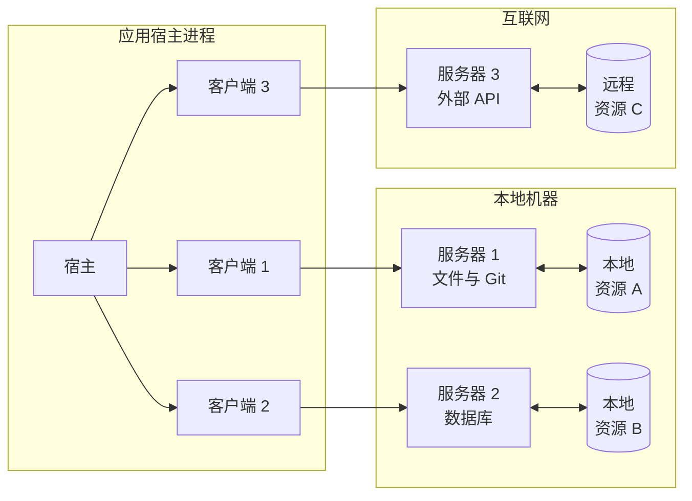
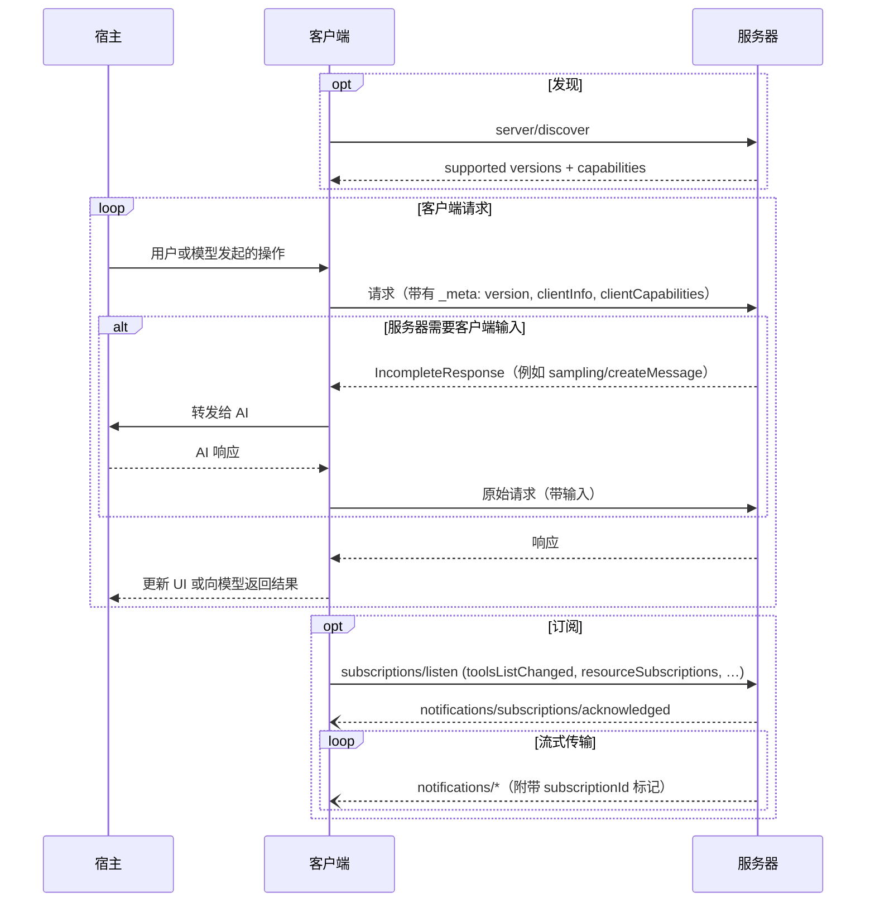

模型上下文协议（MCP）采用客户端-宿主-服务器架构，其中每个宿主可以运行多个客户端实例。MCP 是一种无状态协议：每个请求都是自包含的，并携带其自身的协议版本、客户端身份和能力。该架构使用户能够在各类应用程序中集成 AI 能力，同时保持清晰的安全边界并隔离关注点。MCP 构建于 JSON-RPC 之上，提供了一个专注于上下文交换和采样协调的协议，用于客户端与服务器之间的交互。

## 核心组件

### 宿主

宿主进程充当容器和协调者：

- 创建和管理多个客户端实例
- 控制客户端连接权限和生命周期
- 执行安全策略和同意要求
- 处理用户授权决策
- 协调 AI/LLM 集成和采样
- 管理跨客户端的上下文聚合

### 客户端

每个客户端由宿主创建，并且只与一个服务器通信：

- 与且仅与一个服务器通信
- 在每个请求中附加协议版本和能力
- 双向路由协议消息
- 管理订阅和通知
- 维护服务器之间的安全边界

宿主应用程序创建和管理多个客户端，每个客户端与特定服务器保持 1:1 关系。

### 服务器

服务器提供专用的上下文和能力：

- 通过 MCP 原语公开资源、工具和提示词
- 独立运行，职责聚焦
- 通过 `IncompleteResponse` 在回复中请求客户端输入（采样、询问、根）
- 必须遵守安全约束
- 可以是本地进程或远程服务

## 设计原则

MCP 建立在几个关键设计原则之上，这些原则指导其架构和实现：

1. **服务器应该极其易于构建**
   - 宿主应用程序处理复杂的编排职责
   - 服务器专注于特定的、定义明确的能力
   - 简单的接口最小化实现开销
   - 清晰的分离实现可维护的代码

2. **服务器应该高度可组合**
   - 每个服务器在隔离中提供专注的功能
   - 多个服务器可以无缝组合
   - 共享协议实现互操作性
   - 模块化设计支持可扩展性

3. **服务器不应能够读取整个对话，也不应“窥视”其他服务器**
   - 服务器仅接收必要的上下文信息
   - 完整的对话历史保留在宿主中
   - 每个服务器都保持隔离
   - 跨服务器交互由宿主控制
   - 宿主进程强制执行安全边界

4. **功能可以渐进式地添加到服务器和客户端**
   - 核心协议提供最小的必需功能
   - 额外能力可以根据需要进行协商
   - 服务器和客户端独立演进
   - 协议设计为未来可扩展
   - 保持向后兼容性

## 能力协商

模型上下文协议使用一种基于能力的协商系统，客户端和服务器会在每个请求中声明其支持的功能。客户端会在每个请求的 `_meta.io.modelcontextprotocol/clientCapabilities` 中包含其能力。服务器会在
[`server/discover`](/specification/draft/server/discover) 的响应中公布其能力，客户端可以在任何其他请求之前调用它，以便提前发现能力。

- 服务器声明诸如工具支持、资源订阅和提示模板之类的能力
- 客户端声明诸如采样支持和询问处理之类的能力
- 双方必须在整个交互过程中遵守已声明的能力
- 可以通过对协议的扩展来协商额外能力

每项能力都会在每个请求的基础上解锁特定的协议功能。例如：

- 已实现的 [服务器功能](/specification/draft/server) 必须在服务器的能力中声明
- 接收资源更新通知需要打开一个带有所需资源 URI 的
  [`subscriptions/listen`](/specification/draft/basic/utilities/subscriptions) 流
- 调用工具要求服务器声明工具能力
- [采样](/specification/draft/client) 要求客户端在其能力中声明支持

这种能力协商确保客户端和服务器对支持的功能有清晰的理解，同时保持协议的可扩展性。
