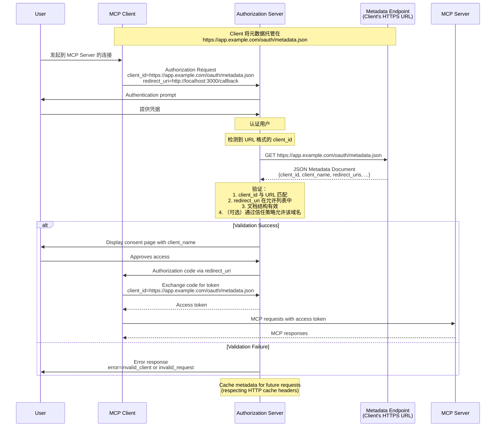

<div id="enable-section-numbers" />

MCP 支持三种客户端注册机制。请根据你的场景进行选择：

- **[客户端 ID 元数据文档](#client-id-metadata-documents)**：当客户端和服务器之间没有既有关系时（最常见）
- **[预注册](#pre-registration)**：当客户端和服务器之间已有既有关系时
- **[动态客户端注册](#dynamic-client-registration)**：用于向后兼容或特定需求

支持所有选项的客户端 **SHOULD** 按以下优先级顺序使用：

1. 如果客户端可用，使用服务器的预注册客户端信息
2. 如果授权服务器表示支持（通过 OAuth Authorization Server Metadata 中的 `client_id_metadata_document_supported`），则使用客户端 ID 元数据文档
3. 如果授权服务器支持（通过 OAuth Authorization Server Metadata 中的 `registration_endpoint`），则将动态客户端注册作为回退方案
4. 如果没有其他可用选项，则提示用户输入客户端信息

## 客户端 ID 元数据文档

MCP 客户端和授权服务器 **SHOULD** 支持 OAuth 客户端 ID 元数据文档，如
[OAuth Client ID Metadata Document](https://datatracker.ietf.org/doc/html/draft-ietf-oauth-client-id-metadata-document-00)
所定义，用于客户端注册。

这种方式允许客户端使用 HTTPS URL 作为客户端标识符，其中该 URL 指向一个包含客户端元数据的 JSON 文档。
这解决了 MCP 的常见场景：服务器和客户端之间没有预先存在的关系。

### 实现要求

支持客户端 ID 元数据文档的 MCP 实现 **MUST** 遵循
[OAuth Client ID Metadata Document](https://datatracker.ietf.org/doc/html/draft-ietf-oauth-client-id-metadata-document-00) 中规定的要求。
关键要求包括：

**对于 MCP 客户端：**

- 客户端 **MUST** 将其元数据文档托管在符合 RFC 要求的 HTTPS URL 上
- `client_id` URL **MUST** 使用 `"https"` 方案并包含路径组件，例如 `https://example.com/client.json`
- 元数据文档 **MUST** 至少包含以下属性：`client_id`、`client_name`、`redirect_uris`
- 客户端 **MUST** 确保元数据中的 `client_id` 值与文档 URL 完全一致
- 客户端 **MAY** 在客户端认证中使用 `private_key_jwt`（例如用于 token endpoint 请求），并按照 [Client ID Metadata Document 第 6.2 节](https://www.ietf.org/archive/id/draft-ietf-oauth-client-id-metadata-document-00.html#section-6.2) 所述进行适当的 JWKS 配置

**对于授权服务器：**

- 在遇到 URL 格式的 `client_id` 时，**SHOULD** 获取元数据文档
- **MUST** 验证获取到的文档中的 `client_id` 与 URL 完全匹配
- **SHOULD** 按照 HTTP 缓存头缓存元数据
- **MUST** 根据元数据文档验证授权请求中提供的重定向 URI
- **MUST** 验证文档结构是否为有效 JSON 且包含必需字段
- **SHOULD** 遵循 [Client ID Metadata Document 第 6 节](https://www.ietf.org/archive/id/draft-ietf-oauth-client-id-metadata-document-00.html#section-6) 和 [Client ID Metadata Document 安全注意事项](/specification/draft/basic/authorization/security-considerations#client-id-metadata-document-security) 中的安全考虑

### 元数据文档示例

```json
{
  "client_id": "https://app.example.com/oauth/client-metadata.json",
  "client_name": "示例 MCP 客户端",
  "client_uri": "https://app.example.com",
  "logo_uri": "https://app.example.com/logo.png",
  "redirect_uris": [
    "http://127.0.0.1:3000/callback",
    "http://localhost:3000/callback"
  ],
  "grant_types": ["authorization_code"],
  "response_types": ["code"],
  "token_endpoint_auth_method": "none"
}
```

### 客户端 ID 元数据文档流程

下图展示了使用客户端 ID 元数据文档时的完整流程：



### 宣告 CIMD 支持

授权服务器通过在其 OAuth Authorization Server metadata 中包含以下属性，来表明它们支持使用客户端 ID 元数据文档的客户端：

```json
{
  "client_id_metadata_document_supported": true
}
```

MCP 客户端 **SHOULD** 检查此能力，并在不可用时 **MAY** 回退到
[动态客户端注册](#dynamic-client-registration)
或 [预注册](#pre-registration)。

## 预注册

MCP 客户端 **SHOULD** 支持静态客户端凭据选项，例如由预注册流程提供的凭据。这可以是：

1. 为 MCP 客户端硬编码一个客户端 ID（以及在适用时的客户端凭据），专门用于与该授权服务器交互，或
2. 向用户提供一个 UI，让他们在自行注册 OAuth 客户端后输入这些详细信息（例如，通过服务器托管的配置界面）。

## 动态客户端注册

<Warning>
  动态客户端注册已弃用。新实现应改用
  [客户端 ID 元数据文档](#client-id-metadata-documents)。此
  选项仍保留用于与不支持客户端 ID 元数据文档的授权
  服务器向后兼容。
</Warning>

MCP 客户端和授权服务器 **MAY** 支持
OAuth 2.0 动态客户端注册协议 [RFC7591](https://datatracker.ietf.org/doc/html/rfc7591)
，以便 MCP 客户端在无需用户交互的情况下获取 OAuth 客户端 ID。
此选项包含在内是为了与早期版本的 MCP 授权规范向后兼容。

### 应用类型与重定向 URI 限制

当授权服务器支持 OpenID Connect（OIDC）和
动态客户端注册时，它们可能会根据
[OpenID Connect Dynamic Client Registration 1.0](https://openid.net/specs/openid-connect-registration-1_0.html) 中定义的 `application_type`
参数，对重定向 URI 施加额外限制。

MCP 客户端 **MUST** 在动态客户端注册期间指定适当的 `application_type`。
省略该参数在 OIDC 下默认值为
`"web"`，这可能与原生风格的重定向
URI 冲突；非 OIDC 服务器会安全地忽略该参数。

- **原生应用**（桌面应用、移动应用、
  CLI 工具，以及通过
  `localhost` 访问的本地托管 Web 应用）**SHOULD** 使用 `application_type: "native"`
- **Web 应用**（从非本地主机提供服务的远程基于浏览器的应用）
  **SHOULD** 使用
  `application_type: "web"`

当授权服务器实现 OIDC 时，MCP 客户端 **MUST** 准备好处理因重定向 URI 限制而导致的注册
失败。当注册请求被拒绝时，
客户端 **SHOULD** 向用户或开发者显示有意义的错误。客户端 **MAY**
使用调整后的 `application_type` 或符合特定应用类型的授权服务器要求的重定向 URI 重新尝试注册。

## 授权服务器绑定

使用预注册凭据，或持久化通过动态客户端
注册获得的客户端凭据的客户端，**MUST** 将这些
凭据与签发它们的特定授权服务器关联，并以授权服务器的 `issuer` 标识符作为键。当
授权服务器发生变化时（通过更新后的
[受保护资源元数据](/specification/draft/basic/authorization/authorization-server-discovery#authorization-server-location) 发现），
客户端 **MUST NOT** 重用来自不同授权服务器的客户端凭据，
并且 **MUST** 使用新的授权服务器重新注册。

预注册凭据本质上特定于某个
授权服务器。如果受保护资源元数据指示的授权服务器
不再与这些凭据注册时使用的服务器匹配，客户端 **SHOULD** 显示
错误，而不是静默地尝试使用不匹配的凭据。

基于客户端 ID 元数据文档的客户端 ID
在不同授权服务器之间是可移植的，因为它们是由授权服务器按需解析的自托管 HTTPS URL。
当授权服务器发生变化时，无需重新注册。
