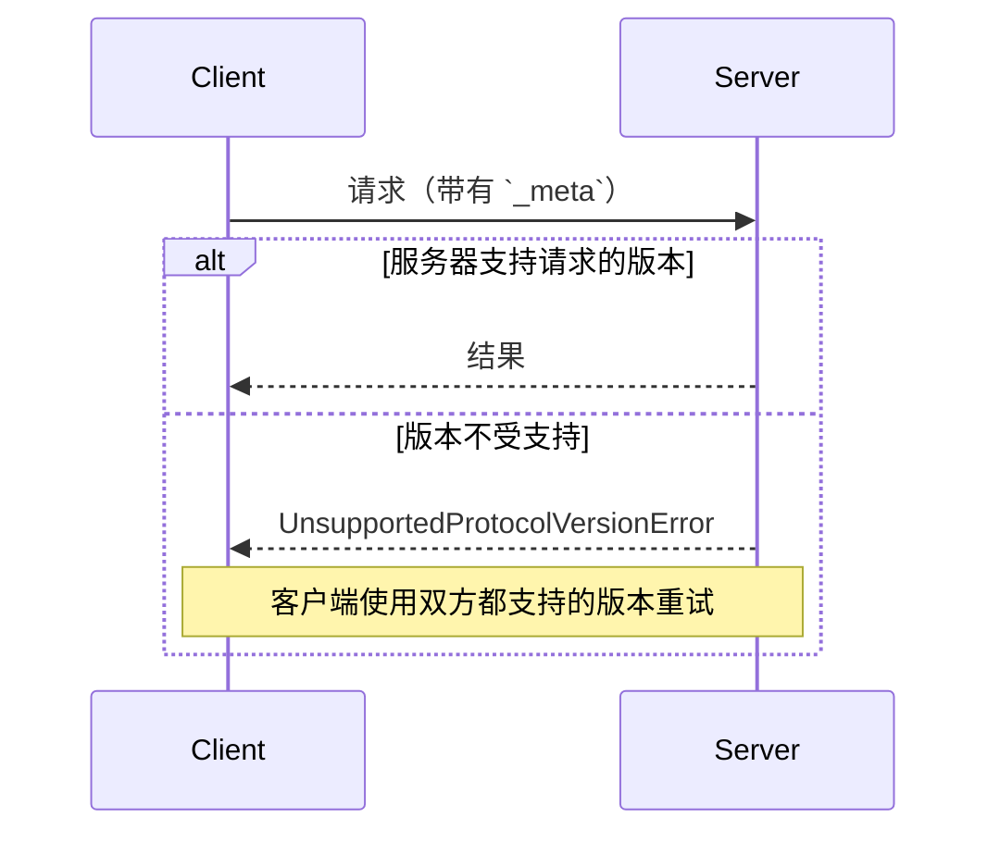

<div id="enable-section-numbers" />

模型上下文协议（MCP）是一种**无状态协议**：处理请求所需的所有信息都包含在请求本身中。服务器独立处理每个请求；不应从先前请求中推断任何状态，即使这些请求来自同一连接或流。

尤其是，打开的连接或 STDIO 进程不是对话或会话：客户端可以在同一传输上交错发送无关请求，而服务器**不得**将连接或进程身份视为对话或会话连续性的代理。

具体而言：

- 服务器**不得**依赖同一连接上的先前请求来建立上下文（例如，能力、协议版本、客户端身份）。每个请求都在其 [`_meta`](/specification/draft/basic/index#meta) 字段中提供这些元数据。
- 服务器**不得**要求客户端复用同一连接来执行相关操作。
- 需要跨多个请求保存的状态（例如，长时间运行的任务、应用层句柄）**必须**通过客户端在每个请求中传递的显式标识符来引用。

像 [`subscriptions/listen`](/specification/draft/basic/utilities/subscriptions) 这样的长生命周期请求仍然是请求/响应模式——响应只是一个打开的通知流。它们的状态作用域属于请求本身，而不是底层连接。



<Info>
  关于按请求模型如何映射到 SDK 代码的演练，请参见
  [架构指南](/docs/learn/architecture#example)。
</Info>

## 协议版本协商

每个请求都会在其 [`_meta`](/specification/draft/basic/index#meta) 字段中声明它所使用的协议版本。在 HTTP 中，这一信息也会通过
[`MCP-Protocol-Version` header](/specification/draft/basic/transports#protocol-version-header) 传递。

如果服务器未实现请求的版本（无论是服务器未知该版本，还是服务器已知但选择不支持该版本），它**必须**返回一个
[`UnsupportedProtocolVersionError`](/specification/draft/schema#unsupportedprotocolversionerror)，并列出其支持的版本：

```json
{
  "jsonrpc": "2.0",
  "id": 1,
  "error": {
    "code": -32004,
    "message": "不支持的协议版本",
    "data": {
      "supported": ["DRAFT-2026-v1", "2025-11-25"],
      "requested": "1900-01-01"
    }
  }
}
```

客户端**应当**从 `supported` 列表中选择一个双方都支持的版本并重试请求；如果不存在兼容版本，则向用户展示错误。

服务器**必须**实现 [`server/discover`](/specification/draft/server/discover)。客户端**可以**在发送任何其他请求之前先调用它，以便提前了解服务器支持的版本，但这不是强制要求——客户端也可以直接发起任意 RPC，并在其首选版本不受支持时处理 `UnsupportedProtocolVersionError`。

### 与基于初始化的版本保持向后兼容

希望同时支持旧版客户端（它们期望 `initialize` 握手）和现代客户端（它们使用按请求元数据）的服务器**可以**同时实现这两种行为。需要与这两类服务器互操作的客户端可以检测当前是哪一种：

- **HTTP.** 直接尝试发送现代请求。在收到 `400 Bad Request` 时，在决定回退之前检查响应体：`400` 也会被现代服务器用于 `UnsupportedProtocolVersionError`、`MissingRequiredClientCapabilityError` 和 header 验证失败，因此仅凭状态码无法判断是否为旧版服务器。
  - 如果响应体包含可识别的现代 JSON-RPC 错误，例如
    [`UnsupportedProtocolVersionError`](/specification/draft/schema#unsupportedprotocolversionerror)，
    则服务器使用的是现代版本的 MCP——请改用其公布的 `supported` 版本之一重试，或修正请求。不要回退到 `initialize`。
  - 如果响应体为空，或不包含可识别的现代 JSON-RPC 错误，则回退到 `initialize`，并在后续请求中继续使用旧版协议。
- **STDIO.** 由于没有可用于驱动回退的逐请求状态码，
  同时支持两个时代的客户端**应当**先通过
  [`server/discover`](/specification/draft/server/discover) 探测，
  并在 `_meta` 中设置其首选的现代版本。如果服务器返回
  `Method not found`（`-32601`），则回退到旧版 `initialize`
  握手。如果服务器返回 `UnsupportedProtocolVersionError`，则
  服务器使用的是一种不带 `initialize` 的 MCP 版本——请使用其公布的
  `supported` 列表中的某个版本，而不是回退到
  `initialize`。

只支持现代（按请求元数据）版本的客户端不需要探测——它只需发送自己首选的版本，并正常处理 `UnsupportedProtocolVersionError` 即可。

## 扩展协商

客户端和服务器可以就核心协议之外的可选[扩展](/docs/extensions/overview)进行协商。扩展会在能力的 `extensions` 字段中声明，该字段是一个从扩展标识符到各扩展设置对象的映射。

带扩展的客户端能力示例：

```json
{
  "capabilities": {
    "roots": {},
    "extensions": {
      "io.modelcontextprotocol/apps": {
        "mimeTypes": ["text/html;profile=mcp-app"]
      }
    }
  }
}
```

带扩展的服务器能力示例：

```json
{
  "capabilities": {
    "tools": {},
    "extensions": {
      "io.modelcontextprotocol/apps": {}
    }
  }
}
```

每个扩展都会指定其设置对象的模式；空对象表示支持该扩展，但不需要额外设置。

如果一方支持某个扩展而另一方不支持，支持该扩展的一方**必须**退回到核心协议行为，或以适当的错误拒绝该请求。扩展**应当**文档化其预期的回退行为。
