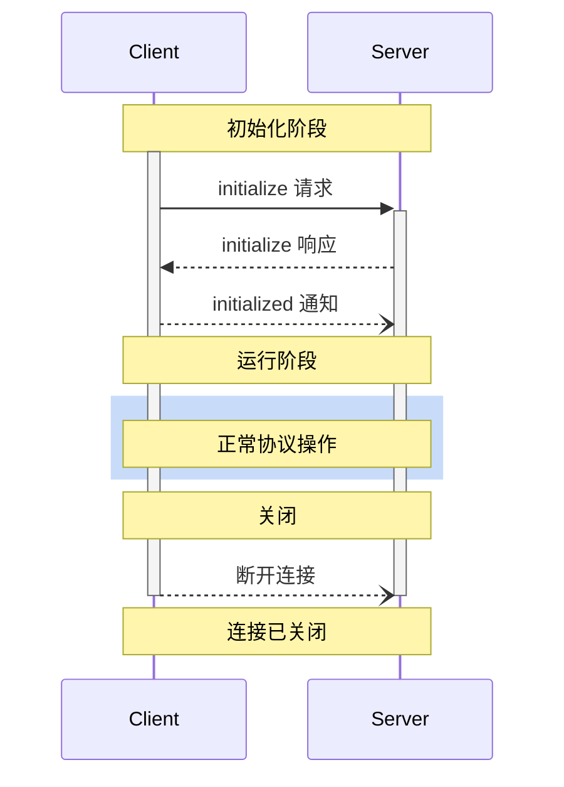

<div id="enable-section-numbers" />

模型上下文协议 (MCP) 定义了客户端 - 服务器连接的严格生命周期，以确保正确的能力协商和状态管理。

1. **初始化**：能力协商和协议版本达成一致
2. **运行**：正常协议通信
3. **关闭**：优雅地终止连接



<Info>
  有关这些生命周期阶段如何映射到 SDK 代码的演练，请参阅
  [架构指南](/docs/learn/architecture#example)。
</Info>

## 生命周期阶段

### 初始化

初始化阶段 **必须** 是客户端和服务器之间的第一次交互。
在此阶段，客户端和服务器：

- 建立协议版本兼容性
- 交换并协商能力
- 共享实现细节

客户端 **必须** 通过发送包含以下内容的 `initialize` 请求来启动此阶段：

- 支持的协议版本
- 客户端能力
- 客户端实现信息

```json
{
  "jsonrpc": "2.0",
  "id": 1,
  "method": "initialize",
  "params": {
    "protocolVersion": "2025-11-25",
    "capabilities": {
      "roots": {
        "listChanged": true
      },
      "sampling": {},
      "elicitation": {
        "form": {},
        "url": {}
      },
      "tasks": {
        "requests": {
          "elicitation": {
            "create": {}
          },
          "sampling": {
            "createMessage": {}
          }
        }
      }
    },
    "clientInfo": {
      "name": "ExampleClient",
      "title": "示例客户端显示名称",
      "version": "1.0.0",
      "description": "一个示例 MCP 客户端应用程序",
      "icons": [
        {
          "src": "https://example.com/icon.png",
          "mimeType": "image/png",
          "sizes": ["48x48"]
        }
      ],
      "websiteUrl": "https://example.com"
    }
  }
}
```

服务器 **必须** 以其自身的能力和信息进行响应：

```json
{
  "jsonrpc": "2.0",
  "id": 1,
  "result": {
    "protocolVersion": "2025-11-25",
    "capabilities": {
      "logging": {},
      "prompts": {
        "listChanged": true
      },
      "resources": {
        "subscribe": true,
        "listChanged": true
      },
      "tools": {
        "listChanged": true
      },
      "tasks": {
        "list": {},
        "cancel": {},
        "requests": {
          "tools": {
            "call": {}
          }
        }
      }
    },
    "serverInfo": {
      "name": "ExampleServer",
      "title": "示例服务器显示名称",
      "version": "1.0.0",
      "description": "一个提供工具和资源的示例 MCP 服务器",
      "icons": [
        {
          "src": "https://example.com/server-icon.svg",
          "mimeType": "image/svg+xml",
          "sizes": ["any"]
        }
      ],
      "websiteUrl": "https://example.com/server"
    },
    "instructions": "给客户端的可选指令"
  }
}
```

成功初始化后，客户端 **必须** 发送 `initialized` 通知
以表明它已准备好开始正常操作：

```json
{
  "jsonrpc": "2.0",
  "method": "notifications/initialized"
}
```

- 在服务器响应 `initialize` 请求之前，客户端 **不应** 发送除
  [ping](/specification/draft/basic/utilities/ping) 之外的请求。
- 在收到 `initialized` 通知之前，服务器 **不应** 发送除
  [ping](/specification/draft/basic/utilities/ping) 和
  [日志](/specification/draft/server/utilities/logging) 之外的请求。

#### 版本协商

在 `initialize` 请求中，客户端 **必须** 发送其支持的协议版本。
这 **应当** 是客户端支持的 _最新_ 版本。

如果服务器支持请求的协议版本，它 **必须** 响应相同的
版本。否则，服务器 **必须** 响应其支持的另一个协议版本。这 **应当** 是服务器支持的 _最新_ 版本。

如果客户端不支持服务器响应中的版本，它 **应当**
断开连接。

<Note>
如果使用 HTTP，客户端 **必须** 在所有后续请求中包含 `MCP-Protocol-Version:
<protocol-version>` HTTP 头到 MCP
服务器。
详细信息，请参阅 [传输中的协议版本头部分](/specification/draft/basic/transports#protocol-version-header)。
</Note>

#### 能力协商

客户端和服务器能力建立会话期间可用的可选协议功能。

关键能力包括：

| 类别 | 能力 | 描述 |
| -------- | -------------- | ---------------------------------------------------------------------------------------- |
| 客户端 | `roots` | 提供文件系统 [roots](/specification/draft/client/roots) 的能力 |
| 客户端 | `sampling` | 支持 LLM [sampling](/specification/draft/client/sampling) 请求 |
| 客户端 | `elicitation` | 支持服务器 [elicitation](/specification/draft/client/elicitation) 请求 |
| 客户端 | `tasks` | 支持 [任务增强](/specification/draft/basic/utilities/tasks) 客户端请求 |
| 客户端 | `extensions` | 支持核心协议之外的可选 [扩展](/docs/extensions/overview) |
| 客户端 | `experimental` | 描述对非标准实验性功能的支持 |
| 服务器 | `prompts` | 提供 [提示模板](/specification/draft/server/prompts) |
| 服务器 | `resources` | 提供可读的 [资源](/specification/draft/server/resources) |
| 服务器 | `tools` | 暴露可调用的 [工具](/specification/draft/server/tools) |
| 服务器 | `logging` | 发出结构化的 [日志消息](/specification/draft/server/utilities/logging) |
| 服务器 | `completions` | 支持参数 [自动完成](/specification/draft/server/utilities/completion) |
| 服务器 | `tasks` | 支持 [任务增强](/specification/draft/basic/utilities/tasks) 服务器请求 |
| 服务器 | `extensions` | 支持核心协议之外的可选 [扩展](/docs/extensions/overview) |
| 服务器 | `experimental` | 描述对非标准实验性功能的支持 |

能力对象可以描述子能力，例如：

- `listChanged`：支持列表变更通知（适用于提示、资源和
  工具）
- `subscribe`：支持订阅单个项目的变更（仅适用于资源）

#### 扩展协商

客户端和服务器还可以协商对核心协议之外的可选 [扩展](/docs/extensions/overview) 的支持。扩展在能力的 `extensions` 字段中公布，该字段是扩展标识符到每个扩展设置对象的映射。

带扩展的客户端能力示例：

```json
{
  "capabilities": {
    "roots": {},
    "extensions": {
      "io.modelcontextprotocol/apps": {
        "mimeTypes": ["text/html;profile=mcp-app"]
      }
    }
  }
}
```

带扩展的服务器能力示例：

```json
{
  "capabilities": {
    "tools": {},
    "extensions": {
      "io.modelcontextprotocol/apps": {}
    }
  }
}
```

每个扩展指定其设置对象的模式；空对象表示支持 without 额外设置。

如果一方支持扩展而另一方不支持，支持方 **必须** 要么恢复为核心协议行为，要么用适当的错误拒绝请求。扩展 **应当** 记录其预期的回退行为。

### 运行

在运行阶段，客户端和服务器根据协商的能力交换消息。

双方 **必须**：

- 遵守协商的协议版本
- 仅使用成功协商的能力

### 关闭

在关闭阶段，一方（通常是客户端）干净地终止协议
连接。没有定义特定的关闭消息——相反，应使用底层传输
机制来信号连接终止：

#### stdio

对于 stdio [传输](/specification/draft/basic/transports)，客户端 **应当** 通过以下方式启动
关闭：

1. 首先，关闭到子进程（服务器）的输入流
2. 等待服务器退出
3. 如果服务器未在合理时间内退出，使用适用于操作系统的机制强制终止
   进程

在 POSIX 系统上，强制终止通常从
[`SIGTERM`](https://pubs.opengroup.org/onlinepubs/9699919799/basedefs/signal.h.html) 升级到
`SIGKILL`。在 Windows 上，由于 POSIX 信号不可用，客户端可以使用
[`TerminateProcess`](https://learn.microsoft.com/windows/win32/api/processthreadsapi/nf-processthreadsapi-terminateprocess)
或
[Job Objects](https://learn.microsoft.com/windows/win32/procthread/job-objects)。

当标准输入关闭或读取返回文件结尾时，服务器 **应当**  promptly 退出。这是主要的优雅关闭信号，也是唯一可移植的信号，因此遵守它可以减少强制终止的需要。

服务器 **可以** 通过关闭其到客户端的输出流并
退出来启动关闭。

#### HTTP

对于 HTTP [传输](/specification/draft/basic/transports)，关闭通过关闭关联的
HTTP 连接来指示。

## 超时

实现 **应该** 为所有发送的请求建立超时机制，以防止连接挂起和资源耗尽。当请求在超时期限内未收到成功或错误响应时，发送方 **应该** 为该请求发出 [取消通知](/specification/draft/basic/utilities/cancellation) 并停止等待响应。

SDK 和其他中间件 **应该** 允许针对每个请求配置这些超时。

实现 **可以** 选择在收到对应请求的 [进度通知](/specification/draft/basic/utilities/progress) 时重置超时时钟，因为这意味着实际工作正在进行。然而，实现 **应该** 始终强制实行最大超时，无论是否有进度通知，以限制行为不当的客户端或服务器的影响。

## 错误处理

实现 **应该** 准备好处理这些错误情况：

- 协议版本不匹配
- 协商所需能力失败
- 请求 [超时](#timeouts)

初始化错误示例：

```json
{
  "jsonrpc": "2.0",
  "id": 1,
  "error": {
    "code": -32602,
    "message": "Unsupported protocol version",
    "data": {
      "supported": ["2024-11-05"],
      "requested": "1.0.0"
    }
  }
}
```
