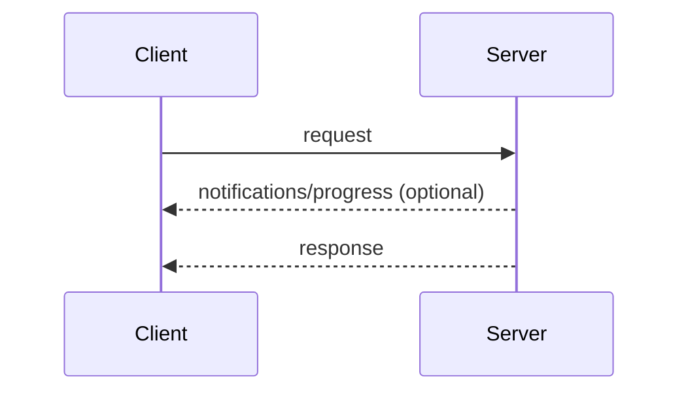
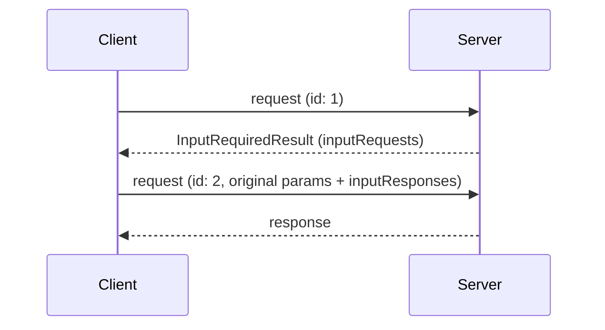
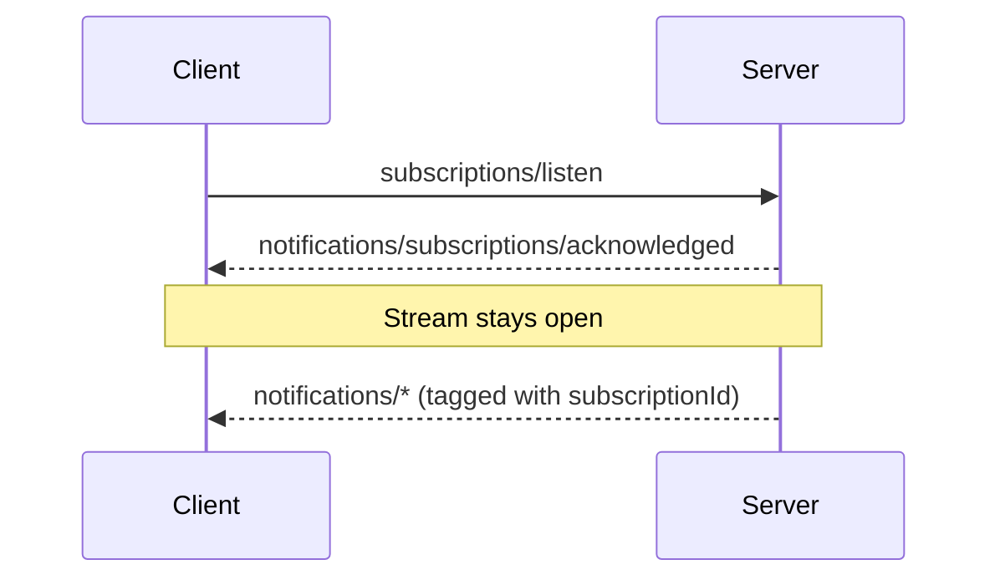

本页定义了核心协议的消息模式：客户端和服务器如何将 JSON-RPC
[请求、响应和通知](/specification/draft/basic/index#messages)
组合成交互。每种
[传输](/specification/draft/basic/transports) 都承载所有这些
模式；传输之间的区别仅在于消息如何被封装和传递。

每次交互都始于客户端：

- **客户端**发送 JSON-RPC _请求_ 和 _通知_。
- **服务器**对每个请求返回一个 JSON-RPC _响应_（结果
  或错误），并可在此前附带与该请求作用域相关的 _通知_。

服务器**不得**发起 JSON-RPC 请求，客户端也不会发送 JSON-RPC 响应。

## 请求与响应

客户端发送一个请求；服务器返回结果或错误。
在请求进行期间，服务器**可以**发送与其作用域相关的通知，例如
[`notifications/progress`](/specification/draft/basic/patterns/progress)
和 [`notifications/message`](/specification/draft/server/utilities/logging)。

## 多轮往返请求

当服务器需要客户端输入（采样、征询或 roots）来
完成一个请求时，它会返回一个
[`InputRequiredResult`](/specification/draft/basic/patterns/mrtr#inputrequiredresult)
，客户端随后使用匹配的 `inputResponses` 重新尝试该请求。参见
[多轮往返请求](/specification/draft/basic/patterns/mrtr)。

## 订阅与通知

为了接收变更通知（列表变更、资源更新），客户端
发送一个
[`subscriptions/listen`](/specification/draft/basic/patterns/subscriptions)
请求；回复是所请求通知
类型的长连接流。流状态以请求为作用域：如果底层通道
丢失，客户端会重新发起该请求。

## 添加模式

所有核心协议特性都由这些模式构建而成。协议
版本若新增一种模式，就会在本页对其进行定义。由于这些模式完全以
请求、响应和通知来表达，传输层无需修改即可承载新的
模式。
